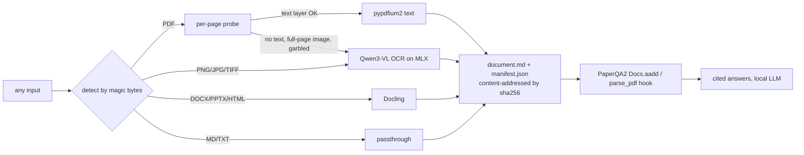

# docingest: a document normalization layer for the PaperQA2 research agent

`docingest` sits in front of PaperQA2. It accepts any research document (a born-digital PDF, a scanned PDF, an image, or an office/HTML file) and turns it into one canonical form: Markdown plus a provenance manifest. Scanned pages are transcribed locally by a Qwen vision-language model running on Apple Silicon through MLX. No cloud services and no CUDA are needed.



## Why a normalization layer

* **One contract downstream.** PaperQA2, a vector DB, or any agent reads `document.md` and never has to deal with format quirks.
* **Per-page routing, not per-file.** Real PDFs are often mixed: digital pages alongside scanned appendices. Each page is probed and routed on its own, and the manifest records the reason (`"only 0 embedded chars; image covers 100% of page"`).
* **OCR only where it is needed.** Text-layer pages take about 1 ms. VLM OCR takes about 10 s per page, so it is reserved for pages that fail the probe. If the model hits its token limit (usually a repetition loop), the page is retried with a little temperature and a stronger repetition penalty, following olmOCR's retry ladder.
* **Provenance and reproducibility.** Every output records the input sha256, pipeline version, config hash, OCR model repo, and the exact Hugging Face commit. Cached outputs are reused only when the config hash matches.
* **Text layers are cleaned, not trusted blindly.** pdfium marks a line-end hyphen with a control character (U+0002). The cleaner joins the two halves only when the joined word appears elsewhere in the document (`transduc-tion` becomes `transduction`) and otherwise keeps the hyphen (`sequence-aligned`, `2019-2020`, `Qwen-2.5-VL-7B`).

### OCR routing heuristics (`config/pipeline.toml`)

| signal | threshold | source of idea |
|---|---|---|
| embedded chars on page | < 50 | Marker / olmOCR |
| image objects cover page and text is sparse | ≥ 60% and < 400 chars | Marker (`image_threshold` 0.65) |
| broken glyphs (`U+FFFD`, `(cid:N)`, private-use) | > 10% | Marker `detect_bad_ocr` |
| alphabetic ratio of text layer | < 50% | olmOCR filter |

## Quick start

```bash
uv sync --locked --all-extras       # Python 3.12, pinned by uv.lock (extras: qa=PaperQA2, office=Docling)
./scripts/fetch_samples.sh           # 3 arXiv papers + a 1948 scanned paper, sha256-verified
uv run docingest ingest data/raw/    # normalize everything (add --max-pages N for a quick demo)
```

The first OCR call downloads the pinned model, `mlx-community/Qwen3-VL-4B-Instruct-4bit` (3.1 GB).

### Demo script

```bash
# 1. Born-digital papers: every page takes the text-layer path in under 1 s
uv run docingest ingest data/raw/attention_1706.03762.pdf data/raw/paperqa2_2409.13740.pdf

# 2. A real scan (Shannon 1948, image-only): every page routes to Qwen3-VL OCR
uv run docingest ingest data/raw/shannon1948_bstj_scanned.pdf --max-pages 3

# 3. A raw image as input
pdfimages -f 3 -l 3 -png data/raw/shannon1948_bstj_scanned.pdf data/samples/shannon_page
uv run docingest ingest data/samples/shannon_page-000.png

# 4. Measure OCR quality: degrade digital pages into a fake scan, score against the true text
uv run docingest make-scan data/raw/attention_1706.03762.pdf data/samples/attention_scanned.pdf --pages 2,3
uv run docingest eval-ocr data/samples/attention_scanned.pdf

# 5. Ask PaperQA2 about the scanned paper (local LLM, local embeddings)
./scripts/serve_llm.sh &             # mlx_vlm.server on :8080, same Qwen3-VL model
uv run --all-extras docingest ask "According to Shannon, what is an ensemble of functions?"

# 6. Office / HTML inputs through Docling
curl -fsSL -o data/samples/paperqa2_arxiv.html https://arxiv.org/html/2409.13740v2
uv run --all-extras docingest ingest data/samples/paperqa2_arxiv.html
```

### Results on an M4 Pro with 24 GB (2026-09-24, pipeline 0.2.1)

| test | result |
|---|---|
| 3 born-digital arXiv papers, 73 pages | 73 of 73 pages took the text layer, about 0.1 s per document |
| full Shannon 1948 BSTJ scan, 34 pages, image-only | Markdown with LaTeX equations; 320–346 s across runs on an idle machine (9.4–10 s per page), up to 426 s when other GPU work runs alongside |
| synthetic scan (blur, noise, rotation, JPEG) of *Attention* pp. 3–4 | CER 1.6% / 4.0%, WER 6.2% / 17.1%, word-F1 0.96 / 0.89 |
| mixed PDF (digital, scanned, digital) | routed text layer / OCR / text layer |
| 37 OCR'd pages across all tests | every one finished normally (no repetition loops) |
| arXiv HTML page / DOCX with a table (Docling) | Markdown with headings and a Markdown table; 1.3 s / 1.9 s |
| PaperQA2 question answered from the scanned PDF and the PNG | correct answer with page-level citations ("pages 4-5"), 30 s end to end with `HF_HUB_OFFLINE=1` |

The CER metric strips Markdown and ignores hyphenation on both sides. Part of the remaining error is LaTeX (`$d_{\text{model}}$`) where the reference text has plain `dmodel`, so these numbers understate the actual quality.

### Code review

The code went through an adversarial review: three reviewers (pipeline, PaperQA2 integration, evaluation and reproducibility), with a skeptic agent trying to refute each finding. 18 defects were confirmed and fixed. A second pass then reviewed the fixes themselves and found 8 more issues, 3 of them regressions introduced by the first round; all are fixed, with regression tests where feasible. Examples:

* pdfium's line-end hyphen marker (U+0002) was leaking into the Markdown (139 occurrences across 3 papers), and a naive `-\n` join corrupted a DOI and `Qwen-2.5-VL-7B`.
* One unreadable file aborted a whole batch.
* A `--max-pages` preview overwrote the complete OCR result.
* 5000-character chunks were being embedded by a 256-token model, so most of each chunk was invisible to retrieval.
* The QA LLM and embedder were not pinned to revisions.
* Scans wrapped in nested Form XObjects, or on rotated or offset page boxes, were misrouted to the text layer.
* Second pass: the relaxed PDF sniffing turned Markdown that *mentions* `%PDF-1.7` into a "PDF"; chunks fused words across page boundaries; outputs were written with owner-only permissions.
* The simulated scan was not byte-reproducible.

## Plugging into PaperQA2

1. **Corpus mode** (any input type): `docingest.qa.ask_corpus` builds page-aware chunks in memory (`chunk_pdf`) from each normalized document and adds them with `Docs.aadd_texts`, so citations point to page ranges. The explicit citation means PaperQA2 does not call the LLM or the network for metadata. The local embedder (all-MiniLM-L6-v2) only reads 256 tokens, so chunks target 900 characters, and any chunk still over that window is re-split by tokens. No text goes unembedded. If a document only has a partial (`--max-pages`) run, `ask` uses it, labels the citation "pages 1-N of M", and prints a warning.
2. **Native reader hook** (PDFs): set `settings.parsing.parse_pdf = docingest.qa.parse_pdf_to_pages`. PaperQA2's own `aadd("paper.pdf")` then sends every page through the router, and the content-addressed cache still applies. It follows PaperQA2's reader contract: unreadable PDFs and oversized pages raise `ImpossibleParsingError`.

```python
from paperqa import Docs
from docingest.qa import local_settings, parse_pdf_to_pages
s = local_settings()
s.parsing.parse_pdf = parse_pdf_to_pages
await Docs().aadd("scan.pdf", citation="Shannon 1948", settings=s)
```

## Output layout

```
data/normalized/<sha256[:16]>/     # canonical: complete, default-option runs only
  document.md      # "# title" then "<!-- page N | method=vlm_ocr -->" + page Markdown
  manifest.json    # DocumentManifest: probes, methods, timings, model + revision, config_hash
  ocr_eval.json    # only when eval-ocr ran
data/normalized/_variants/<id>-<config>-p<N>/   # --max-pages / --ocr-all runs
data/normalized/index.json         # catalog of canonical documents
```

A partial run (`--max-pages`) or a forced-OCR run (`--ocr-all`) is written to `_variants/` and never replaces a complete result. A complete result also answers any later `--max-pages` request from cache. Files are written atomically, and an unreadable manifest counts as a cache miss.

## Reproducibility

* `uv.lock` and `.python-version` (3.12). Use `uv sync --locked` for byte-identical environments.
* All three models are pinned by Hugging Face commit in `config/pipeline.toml`: the OCR model, the QA LLM, and the embedder. They are loaded offline-first from the HF cache. `scripts/serve_llm.sh` serves the pinned local snapshot path (`docingest model-path llm`) with `HF_HUB_OFFLINE=1`, so the server never pulls `main`.
* Inputs are pinned by sha256 in `scripts/samples.sha256`, and outputs are content-addressed. The simulated scan is byte-identical on every run (no PDF timestamps), and its sha256 is recorded in `attention_scanned.truth.json`.
* Changing a threshold or a model changes `config_hash`, so stale outputs are never silently reused.
* Git holds only code and config. For data versioning add DVC (`dvc add data/raw data/normalized`).

## Swapping the OCR model

Edit `[ocr]` in `config/pipeline.toml`, and always change `repo_id` and `revision` together. A missing revision is an error, never a silent fallback to `main`. All of these exist as MLX conversions supported by mlx-vlm 0.7.3 (revisions checked 2026-09-24):

| model | revision | size | notes |
|---|---|---|---|
| `mlx-community/Qwen3-VL-4B-Instruct-4bit` (default) | `2fd8dacb…` | 3.1 GB | general Qwen VLM, good Markdown and LaTeX |
| `mlx-community/olmOCR-2-7B-1025-mlx-4bit` | `c0eaffb7…` | 5.6 GB | Qwen2.5-VL-7B fine-tuned for OCR (AllenAI) |
| `mlx-community/Nanonets-OCR2-3B-4bit` | `fe1396cb…` | 3.1 GB | Qwen2.5-VL-3B OCR fine-tune, HTML tables |
| `mlx-community/Qwen3.5-4B-MLX-4bit` | `32f3e8ec…` | 3.1 GB | newer natively multimodal Qwen |
| `mlx-community/GLM-OCR-4bit` | `97f58750…` | 1.3 GB | fastest, specialised OCR prompts |
| `mlx-community/PaddleOCR-VL-1.6-4bit` | `c8987b27…` | 0.7 GB | smallest, specialised OCR prompts |

Full revision hashes are in `config/pipeline.toml`.

## Office / HTML inputs

DOCX, PPTX, XLSX, and HTML files go through Docling, which is in the `office` extra (`uv sync --extra office`). Docling pins `typer<0.27`, so the project allows `typer>=0.19`.

## Tests

```bash
uv run pytest    # 26 tests, no model needed: detection, routing (Form XObject, rotated and
                 # offset page boxes), pdfium hyphens, cache/variants, CLI batch errors, file
                 # permissions, token-window chunking, metrics, scan determinism
```

## Roadmap

* Region-level OCR for mixed pages (digital text plus embedded scanned figures).
* Batch or parallel OCR, and a Docling layout pass for tables in born-digital PDFs.
* A larger OCR benchmark: several degradation levels and several models from the table above.
