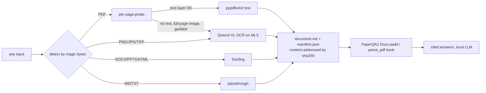

# docingest: a document normalization layer for the PaperQA2 research agent

`docingest` sits in front of PaperQA2. It accepts any research document (a born-digital PDF, a scanned PDF, an image, or an office/HTML file) and turns it into one canonical form: Markdown plus a provenance manifest. Scanned pages are transcribed locally by a Qwen vision-language model running on Apple Silicon through MLX. No cloud services and no CUDA are needed.



## Why a normalization layer

* **One contract downstream.** PaperQA2, a vector DB, or any agent reads `document.md` and never has to deal with format quirks.
* **Per-page routing, not per-file.** Real PDFs are often mixed: digital pages alongside scanned appendices. Each page is probed and routed on its own, and the manifest records the reason (`"only 0 embedded chars; image covers 100% of page"`).
* **OCR only where it is needed.** Text-layer pages take about 1 ms. VLM OCR takes about 10 s per page, so it is reserved for pages that fail the probe.
* **Provenance and reproducibility.** Every output records the input sha256, pipeline version, config hash, OCR model repo, and the exact Hugging Face commit. Cached outputs are reused only when the config hash matches.

### OCR routing heuristics (`config/pipeline.toml`)

| signal | threshold | source of idea |
|---|---|---|
| embedded chars on page | < 50 | Marker / olmOCR |
| image objects cover page and text is sparse | ≥ 60% and < 400 chars | Marker (`image_threshold` 0.65) |
| broken glyphs (`U+FFFD`, `(cid:N)`, private-use) | > 10% | Marker `detect_bad_ocr` |
| alphabetic ratio of text layer | < 50% | olmOCR filter |

## Quick start

```bash
uv sync --locked --extra qa          # Python 3.12, pinned by uv.lock
./scripts/fetch_samples.sh           # 3 arXiv papers + a 1948 scanned paper, sha256-verified
uv run docingest ingest data/raw/    # normalize everything (add --max-pages N for a quick demo)
```

The first OCR call downloads the pinned model, `mlx-community/Qwen3-VL-4B-Instruct-4bit` (3.1 GB).

### Demo script

```bash
# 1. Born-digital papers: every page takes the text-layer path in under 1 s
uv run docingest ingest data/raw/attention_1706.03762.pdf data/raw/paperqa2_2409.13740.pdf

# 2. A real scan (Shannon 1948, image-only): every page routes to Qwen3-VL OCR
uv run docingest ingest data/raw/shannon1948_bstj_scanned.pdf --max-pages 3

# 3. A raw image as input
pdfimages -f 3 -l 3 -png data/raw/shannon1948_bstj_scanned.pdf data/samples/shannon_page
uv run docingest ingest data/samples/shannon_page-000.png

# 4. Measure OCR quality: degrade digital pages into a fake scan, score against the true text
uv run docingest make-scan data/raw/attention_1706.03762.pdf data/samples/attention_scanned.pdf --pages 2,3
uv run docingest eval-ocr data/samples/attention_scanned.pdf

# 5. Ask PaperQA2 about the scanned paper (local LLM, local embeddings)
./scripts/serve_llm.sh &             # mlx_vlm.server on :8080, same Qwen3-VL model
uv run --extra qa docingest ask "According to Shannon, what is an ensemble of functions?"
```

### Results on an M4 Pro with 24 GB (2026-09-24)

| test | result |
|---|---|
| 3 born-digital arXiv papers, 73 pages | 73 of 73 pages took the text layer, about 0.1 s per document |
| Shannon 1948 BSTJ scan, image-only | clean Markdown with LaTeX equations, 7–9 s per page |
| synthetic scan (blur, noise, rotation, JPEG) of *Attention* pp. 3–4 | CER 1.7% / 3.9%, word-F1 0.96 / 0.89, 10–12 s per page |
| PaperQA2 question answered from the scanned PDF and the PNG | correct answer with citations to the OCR'd chunks, 52 s end to end |

CER is measured after stripping Markdown. Part of the remaining error comes from LaTeX formatting (`$d_{\text{model}}$`) where the reference text has plain `dmodel`, so these numbers understate the actual quality.

## Plugging into PaperQA2

1. **Corpus mode** (any input type): `docingest.qa.ask_corpus` adds each normalized document with `Docs.aadd(..., citation=..., docname=...)`. Passing an explicit citation means PaperQA2 does not call the LLM or the network for metadata.
2. **Native reader hook** (PDFs): set `settings.parsing.parse_pdf = docingest.qa.parse_pdf_to_pages`. PaperQA2's own `aadd("paper.pdf")` then sends every page through the router, and the content-addressed cache still applies.

```python
from paperqa import Docs
from docingest.qa import local_settings, parse_pdf_to_pages
s = local_settings()
s.parsing.parse_pdf = parse_pdf_to_pages
await Docs().aadd("scan.pdf", citation="Shannon 1948", settings=s)
```

## Output layout

```
data/normalized/<sha256[:16]>/
  document.md      # "# title" then "<!-- page N | method=vlm_ocr -->" + page Markdown
  manifest.json    # DocumentManifest: probes, methods, timings, model + revision, config_hash
  ocr_eval.json    # only when eval-ocr ran
data/normalized/index.json   # catalog of every ingested document
```

## Reproducibility

* `uv.lock` and `.python-version` (3.12). Use `uv sync --locked` for byte-identical environments.
* Models are pinned by Hugging Face commit in `config/pipeline.toml` and loaded offline-first from the HF cache.
* Inputs are pinned by sha256 in `scripts/samples.sha256`, and outputs are content-addressed.
* Changing a threshold or a model changes `config_hash`, so stale outputs are never silently reused.
* Git holds only code and config. For data versioning add DVC (`dvc add data/raw data/normalized`).

## Swapping the OCR model

Edit `[ocr]` in `config/pipeline.toml`. All of these are verified to exist as MLX conversions and to be supported by mlx-vlm 0.7.3:

| model | size | notes |
|---|---|---|
| `mlx-community/Qwen3-VL-4B-Instruct-4bit` (default) | 3.1 GB | general Qwen VLM, good Markdown and LaTeX |
| `mlx-community/olmOCR-2-7B-1025-mlx-4bit` | 5.6 GB | Qwen2.5-VL-7B fine-tuned for OCR (AllenAI) |
| `mlx-community/Nanonets-OCR2-3B-4bit` | 3.1 GB | Qwen2.5-VL-3B OCR fine-tune, HTML tables |
| `mlx-community/Qwen3.5-4B-MLX-4bit` | 3.1 GB | newer natively multimodal Qwen |
| `mlx-community/GLM-OCR-4bit` / `PaddleOCR-VL-1.6-4bit` | 1.3 / 0.7 GB | fastest, specialised OCR prompts |

## Office / HTML inputs

DOCX, PPTX, XLSX, and HTML files go through Docling (`uv sync --extra office`, plus `uv add --optional office docling` the first time).

## Tests

```bash
uv run pytest    # routing heuristics, magic-byte detection, caching, metrics; no model needed
```

## Roadmap

* Retry and fallback on OCR `finish_reason == "length"` (repetition loops), following olmOCR's temperature ladder.
* Region-level OCR for mixed pages (digital text plus embedded scanned figures).
* Batch or parallel OCR, and a Docling layout pass for tables in born-digital PDFs.
* A larger OCR benchmark: several degradation levels and several models from the table above.
