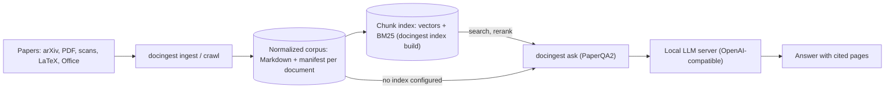

# research-engine

A local research engine for scientific papers. It turns papers into clean Markdown with page provenance, keeps them in a corpus, and answers questions over that corpus with cited sources. Everything runs on your own machines (an Apple Silicon Mac or a Linux server with GPUs); no document text is sent to a hosted service.

## What is in this repository

| Path | What it is | Status |
|---|---|---|
| [`packages/docingest/`](packages/docingest/README.md) | Document normalization: PDF, scanned PDF, LaTeX source, Office files and images become Markdown plus a provenance manifest. Also crawls arXiv and answers questions with PaperQA2. Command: `docingest`. | Available (0.3.1) |
| [`packages/docingest-index/`](packages/docingest-index/README.md) | Embedding and reranker clients (OpenAI-compatible `/v1/embeddings`, vLLM `/rerank`) and a persistent chunk index (dense vectors plus BM25), plugged into docingest as adapters. Command: `docingest index build`. | Available (0.1.0); `docingest ask` retrieves from it when configured |
| [`serving/`](serving/README.md) | Start and stop script for the local model servers (answering model, embedder, reranker), pinned model list, reranker templates, the vLLM install recipe and GPU requirements. | Available |
| `experiments/` | Benchmark runners, a timing harness and retrieval and question-answering evaluations. | Planned |

## How the pieces fit



## Quick start

To run the whole engine on a GPU machine (install vLLM, start the three model servers, crawl or ingest, build the index, ask), follow the [run guide](docs/run-guide.md). The steps below install the workspace and show the commands.

Requirements: [uv](https://docs.astral.sh/uv/getting-started/installation/). uv installs Python 3.12 from `.python-version` if needed. The lock file resolves for Apple Silicon macOS and Linux.

```bash
git clone https://github.com/etxsA/research-engine.git
cd research-engine
uv sync --locked --all-extras        # every package, with all extras and the dev tools
cd packages/docingest
uv run docingest --help
```

Each package documents its own setup and commands; start with the [docingest README](packages/docingest/README.md).

### Ask with the chunk index

With the model servers of [`serving/`](serving/README.md) running (an answering model, an embedder and a reranker, all on 127.0.0.1), the example configuration [`lab-server.toml`](packages/docingest/config/examples/lab-server.toml) turns the index on. Build it once, then ask:

```bash
cd packages/docingest
uv run docingest ingest data/raw --index -c config/examples/lab-server.toml    # ingest, and index the new papers
uv run docingest index build -c config/examples/lab-server.toml                # embed what is not in the index yet
uv run docingest ask "What limits T1 in transmons?" -c config/examples/lab-server.toml
```

`ask` embeds the question, takes the 50 best chunks from the index (dense vectors plus BM25), reranks them and gives the best 10 to PaperQA2, which writes the cited answer. Without `index` in `[adapters]` (the default) `ask` works as before, and `ask --no-index` skips a configured index for one question. The keys are in the [configuration reference](packages/docingest/config/README.md#index-embedder-and-reranker-docingest-index) and the design in [ADR 0004](packages/docingest/docs/adr/0004-chunk-index-and-two-stage-retrieval.md).

## Documentation map

| To | Read |
|---|---|
| Run the engine end to end on a GPU machine | [docs/run-guide.md](docs/run-guide.md) |
| Install vLLM, see GPU and disk needs, start and stop the model servers | [serving/README.md](serving/README.md) |
| Learn what docingest does, its commands and the architecture | [packages/docingest/README.md](packages/docingest/README.md) |
| Set a configuration key or pick an example file | [packages/docingest/config/README.md](packages/docingest/config/README.md) |
| Understand the chunk index, the embedder and the reranker | [packages/docingest-index/README.md](packages/docingest-index/README.md) and [ADR 0004](packages/docingest/docs/adr/0004-chunk-index-and-two-stage-retrieval.md) |
| Change the code and open a pull request | [packages/docingest/CONTRIBUTING.md](packages/docingest/CONTRIBUTING.md) |
| Find any other document of docingest | [packages/docingest/docs/README.md](packages/docingest/docs/README.md) |

## Development

- **One uv workspace.** The root [`pyproject.toml`](pyproject.toml) lists the packages (`packages/*`) and the supported platforms. All packages share one [`uv.lock`](uv.lock) and one environment (`.venv` at the root).
- **Quality gates.** `./scripts/check.sh` checks the lock file and the documentation links, then runs every package's own `scripts/check.sh` (ruff, ruff format, import-linter contracts, pyright, pytest with a coverage floor of 85%).
- **CI.** [`.github/workflows/ci.yml`](.github/workflows/ci.yml) runs the same gates for each package in two jobs: Linux with core and dev dependencies, macOS with every extra.
- **Contributing.** Conventions, the architecture rules and the pull-request checklist are in [packages/docingest/CONTRIBUTING.md](packages/docingest/CONTRIBUTING.md).

## License

Apache License 2.0. See [LICENSE](LICENSE). Model weights, datasets and papers used by the packages keep their own licenses.
