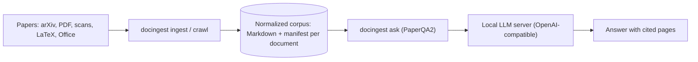

# research-engine

A local research engine for scientific papers. It turns papers into clean Markdown with page provenance, keeps them in a corpus, and answers questions over that corpus with cited sources. Everything runs on your own machines (an Apple Silicon Mac or a Linux server with GPUs); no document text is sent to a hosted service.

## What is in this repository

| Path | What it is | Status |
|---|---|---|
| [`packages/docingest/`](packages/docingest/README.md) | Document normalization: PDF, scanned PDF, LaTeX source, Office files and images become Markdown plus a provenance manifest. Also crawls arXiv and answers questions with PaperQA2. Command: `docingest`. | Available (0.3.1) |
| `packages/` (more) | Embedding clients and a persistent chunk index, plugged into docingest as adapters, so questions stay fast on large corpora. | Planned |
| `serving/` | Start and stop scripts and configuration templates for the local model servers. | Planned |
| `experiments/` | Benchmark runners, a timing harness and retrieval and question-answering evaluations. | Planned |

## How the pieces fit



## Quick start

Requirements: [uv](https://docs.astral.sh/uv/getting-started/installation/). uv installs Python 3.12 from `.python-version` if needed. The lock file resolves for Apple Silicon macOS and Linux.

```bash
git clone https://github.com/etxsA/research-engine.git
cd research-engine
uv sync --locked --all-extras        # every package, with all extras and the dev tools
cd packages/docingest
uv run docingest --help
```

Each package documents its own setup and commands; start with the [docingest README](packages/docingest/README.md).

## Development

- **One uv workspace.** The root [`pyproject.toml`](pyproject.toml) lists the packages (`packages/*`) and the supported platforms. All packages share one [`uv.lock`](uv.lock) and one environment (`.venv` at the root).
- **Quality gates.** `./scripts/check.sh` checks the lock file and the documentation links, then runs every package's own `scripts/check.sh` (ruff, ruff format, import-linter contracts, pyright, pytest with a coverage floor of 85%).
- **CI.** [`.github/workflows/ci.yml`](.github/workflows/ci.yml) runs the same gates for each package in two jobs: Linux with core and dev dependencies, macOS with every extra.
- **Contributing.** Conventions, the architecture rules and the pull-request checklist are in [packages/docingest/CONTRIBUTING.md](packages/docingest/CONTRIBUTING.md).

## License

Apache License 2.0. See [LICENSE](LICENSE). Model weights, datasets and papers used by the packages keep their own licenses.
