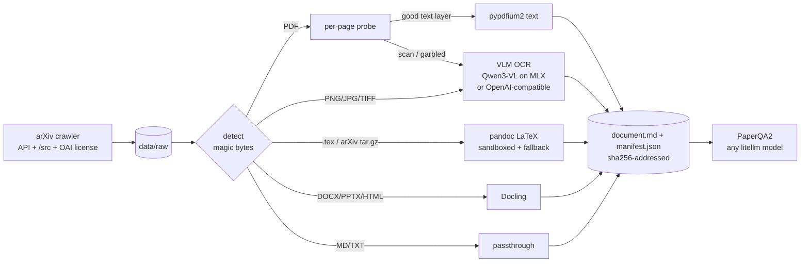

# docingest: a document normalization layer for a research agent (PaperQA2)

docingest takes **any research document** and turns it into the same canonical form: Markdown plus a provenance manifest. Supported inputs are born-digital PDFs, scanned PDFs, page images, arXiv LaTeX sources, DOCX, PPTX, HTML and Markdown. The output is what PaperQA2 (or any RAG agent) consumes.
- Scanned pages are transcribed locally by a Qwen vision-language model on Apple Silicon (MLX), or by any OpenAI-compatible vision endpoint.
- arXiv papers are fetched as **LaTeX source**, so math, tables and structure arrive intact.

Everything runs locally and reproducibly: `uv.lock`, pinned model commits, content-addressed outputs.



## Quick start

```bash
uv sync --locked --all-extras        # Python 3.12; extras: mlx (Apple Silicon OCR), qa (PaperQA2), office (Docling)
./scripts/fetch_samples.sh           # sample corpus, sha256-verified
uv run docingest ingest data/raw     # normalize everything (cached; --max-pages N for a quick look)
uv run docingest crawl 'cat:cs.CL AND ti:"retrieval augmented"' --limit 5   # arXiv -> LaTeX -> Markdown
./scripts/serve_llm.sh &             # local OpenAI-compatible LLM (pinned Qwen3-VL snapshot)
uv run docingest ask "What are the main failure modes of retrieval-augmented generation?"
uv run docingest adapters            # which implementation plugs into each port
```

## Inputs and how each is handled

| Input | Detected by | Adapter (port) | Page / segment method |
|---|---|---|---|
| Born-digital PDF | `%PDF-` | pypdfium2 (`pdf`) | `text_layer`, with document-level de-hyphenation |
| Scanned or garbled PDF page | routing policy on page signals | mlx-vlm or HTTP (`ocr`) | `vlm_ocr` |
| Mixed PDF | per page | both of the above | chosen per page, with the reason recorded |
| PNG / JPG / TIFF (multi-frame) / WebP / BMP | magic bytes | Pillow (`images`) + `ocr` | `vlm_ocr` |
| LaTeX `.tex`, arXiv `.tar.gz`, single gzipped `.tex` | gzip/tar sniffing | pandoc (`latex`) | `latex` (one segment per section), or `latex_plaintext` fallback |
| DOCX / PPTX / XLSX / HTML | suffix | Docling (`office`) | `docling` |
| Markdown / text | suffix | passthrough (`text`) | `passthrough` |

A PDF page goes to OCR when:
- it has fewer than 50 embedded characters;
- images cover at least 60% of it and it has fewer than 400 characters;
- more than 10% of its glyphs are broken; or
- fewer than 50% of its characters are letters.

These thresholds come from Marker and olmOCR. Image coverage is measured in page space, including nested Form XObjects and rotated or offset page boxes.

## arXiv crawler

```bash
uv run docingest crawl 'cat:cs.CL AND ti:retrieval' --limit 10            # search + download + ingest
uv run docingest crawl 'ids:1706.03762,2409.13740'                         # specific papers
uv run docingest crawl 'au:Shannon' --no-ingest                            # download only
```

- **Polite.** One shared rate limiter (one request per 3 s, a single connection, as the arXiv API terms require), retries with backoff that honour `Retry-After`, and a User-Agent with an optional contact address (`[arxiv].contact`).
- **LaTeX first.** It fetches `/src/<id>`, detects the format from the bytes (tar.gz, single gzipped `.tex`, or PDF-only submission) and falls back to the PDF according to `[arxiv].prefer`. Downloads are atomic and reused if already present.
- **Metadata and license.** Title, authors, year, abstract, categories and DOI come from the Atom API. The license comes from OAI-PMH (`oaipmh.arxiv.org`). They are written to a `<file>.meta.json` sidecar and to the manifest, and they become the PaperQA2 citation (`Vaswani et al. (2017). Attention Is All You Need. arXiv:1706.03762v7`).
- arXiv metadata is CC0, but e-prints may not be redistributed without the copyright holder's permission. `data/raw/` is git-ignored and every paper's license is recorded.

## LaTeX ingestion

1. **Safe extraction.** tar with `filter='data'`, size caps, and no links or devices.
2. **Main-file detection.** `00README.json` or `00README.XXX` first, then `\documentclass` together with `\begin{document}`, then name heuristics.
3. **Python flattener.** It resolves `\input`, `\include` and `\subfile` with cycle protection. Each file is decoded as UTF-8, then cp1252, then latin-1, because pandoc silently drops latin-1 includes. Comments are stripped, self-referential macros (which hang pandoc) are dropped, and the `.bbl` is inlined as a References section.
4. **pandoc 3.9** runs under `--sandbox`, with a wall-clock timeout and a heap cap. Its Markdown profile keeps `$…$` and `$$…$$` math, tables and `[@cite]` keys.
5. **Sections become segments.** The abstract is the first segment, and title and authors go into the metadata.
6. **Fallback.** If pandoc fails, pylatexenc produces plain text with the math kept verbatim, so ingestion never stops at a bad source.

Measured on real arXiv sources:

| Source | Segments | Characters | Time |
|---|---|---|---|
| Transformer paper | 22 | 43k | 0.24 s |
| PaperQA2 paper | 13 | 92k | 0.22 s |
| GPT-4 report | 28 | 101k | 0.40 s |
| Perelman, math/0211159 | 15 | 99k | 0.15 s |

## Architecture: hexagonal, with every part replaceable

`domain` (pure) ← `ports` (Protocols) ← `application` (use cases) ← `adapters` ← `bootstrap` (composition root) ← `entrypoints` (CLI, PaperQA2 hook).

Five **import-linter contracts** enforce these layers in CI (`uv run lint-imports`). See [docs/architecture.md](docs/architecture.md) and the ADRs in [docs/adr/](docs/adr/).

| Port | Built-in adapters | Selected in `[adapters]` |
|---|---|---|
| `TypeDetector` | `magic` | `detector` |
| `PdfReader` | `pdfium` | `pdf` |
| `OcrEngine` | `mlx-vlm`, `openai-compatible` | `ocr` |
| `ImageSource` | `pillow` | `images` |
| `DocumentConverter` | `pandoc` (LaTeX), `docling` (office), `passthrough` (text) | `latex`, `office`, `text` |
| `DocumentStore` | `filesystem` | `store` |
| `SourceCrawler` | `arxiv` | `crawler` |
| `QuestionAnswerer` | `paperqa` (any litellm model) | `qa` |
| `BenchmarkSuite` | `synthetic`, `olmocr-bench` | `config/benchmark.toml` |

- **Swap by config.** For example, `ocr = "openai-compatible"` sends OCR to vLLM, LM Studio or Ollama (see `config/examples/remote-ocr.toml`). `config/examples/ollama-qa.toml` runs QA on `ollama/llama3.1` with `mxbai-embed-large`.
- **Swap by plugin.** Register a factory under the entry-point group `docingest.<port>`, with no change to this repo.
- **Cache follows replacement.** Every adapter has a `fingerprint` that feeds the cache key, so changing a model, prompt or converter version re-processes exactly the affected documents.

## OCR models and benchmark

The OCR model is one config line. Every model below is pinned by commit in `config/benchmark.toml`, uses a **per-model profile** (prompt, image size, clean-up and generation defaults, all taken from the model cards) and has been benchmarked on this machine:

| Candidate | Profile | Size |
|---|---|---|
| Qwen3-VL-2B / 4B / 8B Instruct | `markdown` | 1.8 / 3.1 / 5.8 GB |
| Qwen3.5-4B / 9B | `markdown` | 3.1 / 6.0 GB |
| olmOCR-2-7B (AllenAI) | `olmocr` | 5.6 GB; run twice, see below |
| Nanonets-OCR2-3B | `nanonets` | 3.1 GB |
| GLM-OCR | `glm-ocr` | 1.3 GB |
| PaddleOCR-VL-1.6 | `paddleocr-vl` | 0.7 GB |
| Qwen3-VL-30B-A3B Instruct | `markdown` | 18.3 GB (mixture-of-experts, about 3B active); needs the GPU wired-memory limit raised to about 20 GB |

olmOCR-2 appears twice with the same weights. `olmocr-2-7b` is our first adapter (image before the prompt, retried only on the token cap). `olmocr-2-7b-v2` is closer to its authors' pipeline: prompt before the image and the authors' temperature ladder, retrying until the output has olmOCR front matter followed by page text. The authors' pipeline (olmocr 0.4.27) also uses the prompt-first order and that ladder, but it parses the front matter strictly, accepts a header-only answer as a blank page, retries rotated pages, and falls back to the PDF's text layer when every attempt fails; v2 does none of those. The two runs are compared in the benchmark doc.

```bash
./scripts/setup_bench_scorer.sh                  # official olmOCR-Bench scorer in .bench-venv (+ headless Chromium)
uv run docingest bench prepare                   # pinned dataset subset + synthetic scans
uv run docingest bench run --run-id full         # resumable; per-page telemetry
uv run docingest bench report --run-id full      # summary.json + report.md, paired comparisons
```

There are two suites:
- **Synthetic degraded scans.** Born-digital pages at three degradation levels, scored against the true text layer with CER, WER, word-F1 and char-3-gram F1, each with bootstrap 95% CIs.
- **olmOCR-Bench subset.** Real old scans, math, tables, multi-column pages, headers and footers, and tiny text. It is scored by the **official scorer**, so the numbers can be compared with published results.

Results and model-by-model comparisons (quality, speed, memory, failure modes) are in [docs/benchmark.md](docs/benchmark.md). The benchmark compares the models; it does not pick one. The default in `config/pipeline.toml` is simply the first model that was integrated.

## PaperQA2 integration

- **Corpus mode:** `uv run docingest ask "…"`. Every normalized document is chunked page-aware in memory (citations cite page ranges). Any chunk longer than the embedder's 256-token window is re-split by tokens, and the documents are added with `Docs.aadd_texts`.
- **Native hook:** `settings.parsing.parse_pdf = docingest.entrypoints.paperqa_hook.parse_pdf_to_pages`. PaperQA2's own `aadd("x.pdf")` then routes pages through the OCR router. The hook follows PaperQA2's reader contract (`ImpossibleParsingError`).
- **LLM:** any litellm model. The default is the pinned local Qwen3-VL served by `scripts/serve_llm.sh`, which works with `HF_HUB_OFFLINE=1`. `config/examples/ollama-qa.toml` reproduces the Ollama llama3.1 setup.

## Output layout

```
data/normalized/<sha256[:16]>/              canonical: complete, default-option runs
  document.md      "# title" + "<!-- page N | method=… -->" per page / section
  manifest.json    probes + routing reasons, engine fingerprints, model + revision, timings, metadata
data/normalized/_variants/<id>-<cfg>-p<N>/  --max-pages / --ocr-all runs (never replace a full result)
data/normalized/index.json                  catalog with citations
```

## Reproducibility
- The environment is locked by `uv.lock`, `.python-version` (3.12) and `uv sync --locked`. `mlx-vlm` is a platform-marked extra, so Linux installs cleanly.
- The OCR model, the QA LLM, the embedder and the benchmark dataset are all pinned by commit sha. Models load offline-first.
- Inputs are pinned by sha256, and outputs are content-addressed and written atomically. The simulated scans are byte-identical on every run.
- A benchmark run records the suite fingerprints, the candidate specs and machine info, and it refuses to resume with different settings.

## Development

```bash
./scripts/check.sh      # ruff + format + import-linter + pyright + pytest --cov (the CI gates)
DOCINGEST_MODEL_TESTS=1 uv run pytest -m model         # opt-in: loads Qwen3-VL-2B
DOCINGEST_NETWORK_TESTS=1 uv run pytest -m network     # opt-in: live arXiv / Hugging Face
DOCINGEST_LATEX_SAMPLES=<dir of raw arXiv /src files> uv run pytest tests/integration/test_pandoc_latex.py
```

The test suite has 396 tests (plus 11 opt-in model, network and sample tests) and about 90% branch coverage without loading any model. It is organised as:
- **unit:** the domain, plus the use cases running against in-memory fakes of every port;
- **contract:** the same behavioural tests run against the fake and the real implementation of a port;
- **integration:** real adapters, a fake HTTP server, and recorded arXiv responses;
- **opt-in:** tests marked `model` or `network`.

## History
- **v0.1:** first prototype (PDF text layer plus Qwen3-VL OCR, with PaperQA2 integration).
- **v0.2:** 26 defects found by adversarial review and fixed (pdfium hyphen markers, cache variants, token windows, pinning, and more).
- **v0.3:** hexagonal architecture, LaTeX and arXiv, the OpenAI-compatible OCR adapter, the benchmark harness, and quality gates.
