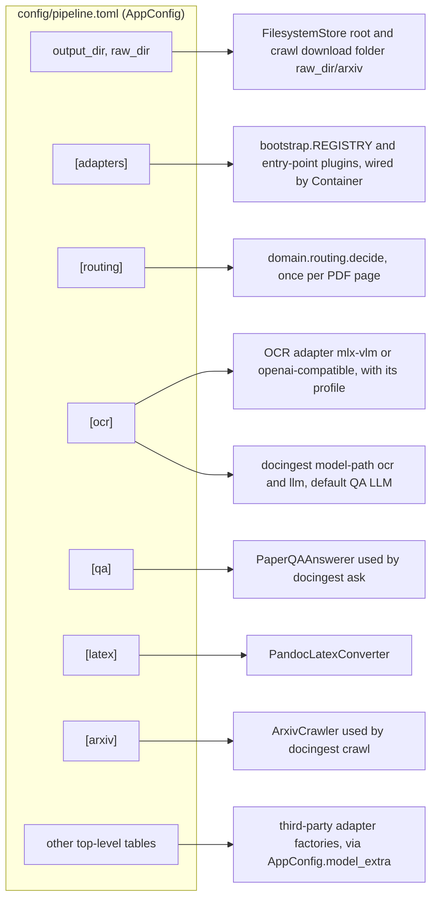
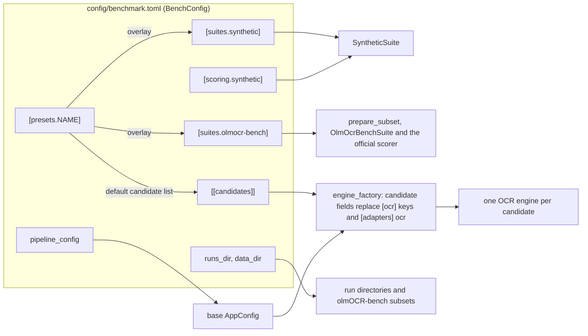
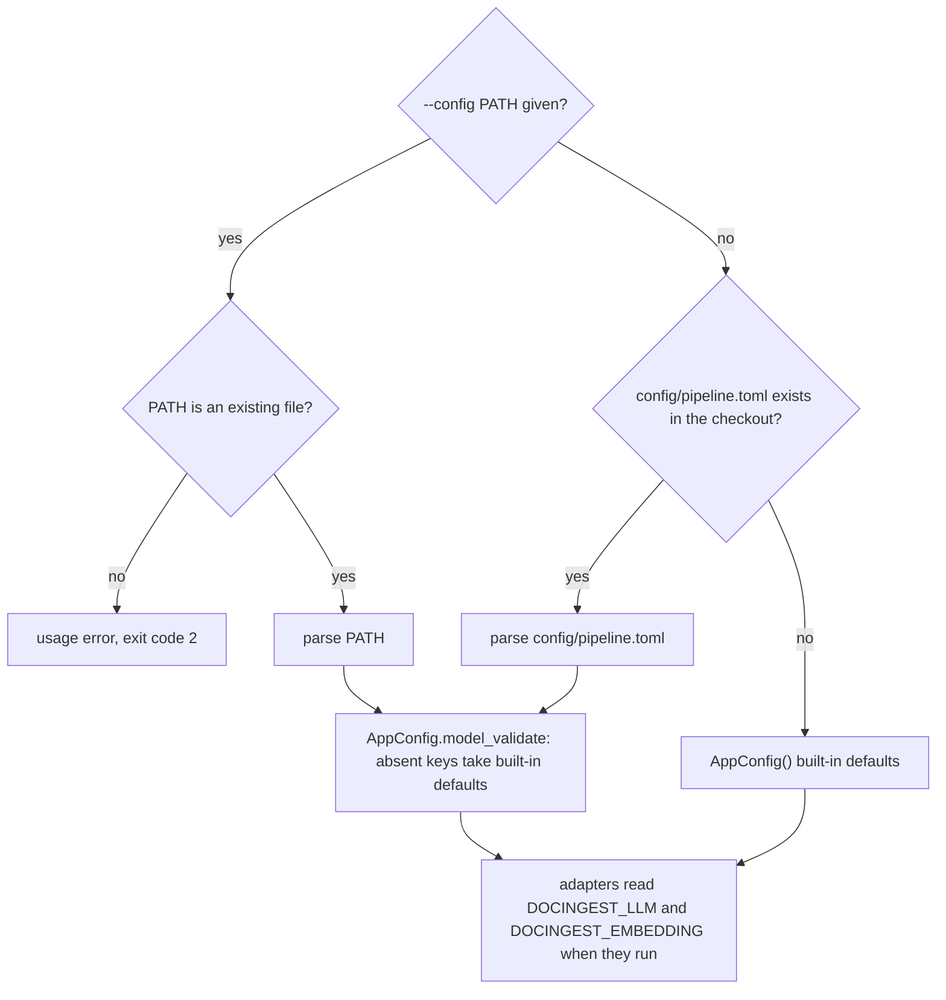
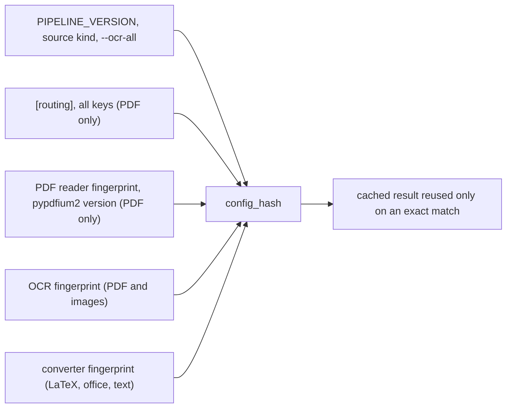

# Configuration

docingest is configured with TOML files in this directory. There are two schemas:

| File | Schema (source of truth) | Read by | Purpose |
|---|---|---|---|
| `pipeline.toml` | `AppConfig` in [`src/docingest/config.py`](../src/docingest/config.py) | `docingest ingest`, `crawl`, `eval-ocr`, `ask`, `adapters`, `model-path`; the PaperQA2 hook; `docingest bench run` as the base OCR configuration of every candidate (through `pipeline_config`) | Which adapter plugs into each port, and the settings of those adapters. |
| `benchmark.toml` | `BenchConfig` in [`src/docingest/entrypoints/bench_cli.py`](../src/docingest/entrypoints/bench_cli.py) | `docingest bench prepare`, `run`, `score`, `report`, `candidates` | OCR benchmark: suites, candidates, presets, scoring options. |
| `examples/remote-ocr.toml` | `AppConfig` | any pipeline command, with `--config` | OCR through an OpenAI-compatible vision endpoint instead of in-process MLX. |
| `examples/ollama-qa.toml` | `AppConfig` | any pipeline command, with `--config` | PaperQA2 answers with Ollama models. |

Every key, type and default below is taken from those models: the Pydantic models in `config.py` (plus `RoutingPolicy` in `src/docingest/domain/routing.py` for `[routing]`), the Pydantic settings classes in `bench_cli.py`, and the `CandidateSpec` dataclass in `src/docingest/ports/benchmark.py` for `[[candidates]]`. When a table says "Default", it is the model's default, which applies when the key is absent from the file. The values written in `pipeline.toml` are currently identical to the built-in defaults of `AppConfig`.

Contents:

- [How configuration reaches the code](#how-configuration-reaches-the-code)
- [Selecting and overriding a configuration](#selecting-and-overriding-a-configuration)
- [Validation](#validation)
- [`config/pipeline.toml` reference](#configpipelinetoml-reference): [top level](#top-level-keys), [`[adapters]`](#adapters), [`[routing]`](#routing), [`[ocr]`](#ocr), [`[qa]`](#qa), [`[latex]`](#latex), [`[arxiv]`](#arxiv), [plugin sections](#plugin-sections)
- [Pinning models by revision](#pinning-models-by-revision)
- [What invalidates cached outputs](#what-invalidates-cached-outputs)
- [Example configurations](#example-configurations)
- [`config/benchmark.toml`](#configbenchmarktoml): [top level](#top-level-keys-1), [suites](#suitessynthetic), [candidates](#candidates), [presets](#presetsname), [scoring](#scoring)
- [Environment variables](#environment-variables)
- [Recipes](#recipes)

## How configuration reaches the code

Each section of `pipeline.toml` configures one part of the system. `[adapters]` chooses the implementations; the other sections are handed to those implementations by the composition root, `docingest.bootstrap`.



The benchmark file is read only by `docingest bench`. Its `pipeline_config` key points back to a pipeline file, whose `[ocr]` model and generation keys and `[adapters] ocr` each candidate then overrides (its other settings, such as `[ocr] base_url`, are kept).



## Selecting and overriding a configuration

For the pipeline commands (`ingest`, `crawl`, `eval-ocr`, `ask`, `adapters`, `model-path`) the file is chosen as follows. The logic is `config.load_config` plus the CLI's `--config` option.



Rules to keep in mind:

1. **One file, no merging.** A file given with `--config` replaces `pipeline.toml`; it is not layered on top of it. Keys it leaves out take the defaults in `config.py`, not the values in `pipeline.toml` (today those are the same values). This is why `examples/ollama-qa.toml` can set only `output_dir`, `raw_dir` and `[qa]`.
2. **The default file is found from the package location.** `DEFAULT_CONFIG` is `<repository>/config/pipeline.toml`, computed from `src/docingest/config.py`, so it is found from any working directory in a source checkout (the project installs the package in editable mode). If the package runs from a location where that file does not exist, the built-in defaults are used.
3. **An explicit path must exist.** `load_config(path)` raises `FileNotFoundError` for a missing file, and the CLI rejects it before that with exit code 2. A typo never silently switches to another pipeline.
4. **Relative paths resolve against the working directory.** `output_dir`, `raw_dir` and every path in `benchmark.toml` are used as given, so run commands from the repository root.
5. **There are no per-key command-line overrides.** To change a setting for one run, copy the file, edit the copy and pass it with `--config`. The command-line options that affect processing are listed in [../src/docingest/entrypoints/README.md](../src/docingest/entrypoints/README.md) (`--force`, `--ocr-all`, `--max-pages`, and the `bench` options).
6. **Only two pipeline settings have environment overrides**, both for question answering: `DOCINGEST_LLM` and `DOCINGEST_EMBEDDING` (see [Environment variables](#environment-variables)).
7. **The PaperQA2 hook** (`docingest.entrypoints.paperqa_hook`) has no configuration parameter. It always uses the default file (rule 2).
8. **One canonical result per document and `output_dir`.** The store keeps the canonical result of a document in `<output_dir>/<sha256[:16]>/`. Ingesting the same file with a configuration that changes its cache key re-processes it and replaces that result. To keep the results of two configurations side by side, give them different `output_dir` values.

The benchmark commands choose their file with their own `--config` option (default: `<repository>/config/benchmark.toml`, found from the package location). `bench run` then loads the pipeline file named by `pipeline_config` with the same `load_config` function, so the rules above apply to it too.

From Python:

```python
from pathlib import Path

from docingest.config import load_config

cfg = load_config()                                           # config/pipeline.toml, or defaults
remote = load_config(Path("config/examples/remote-ocr.toml"))  # must exist
print(remote.adapters.ocr, remote.ocr.repo_id, remote.ocr.revision)
```

## Validation

`load_config` parses the file with `tomllib` and validates it with Pydantic. A failure raises `pydantic.ValidationError` (the CLI shows a traceback and exits with code 1).

| Situation | Result |
|---|---|
| TOML syntax error | Error (`tomllib.TOMLDecodeError`). |
| Unknown key inside `[adapters]`, `[ocr]`, `[qa]`, `[latex]` or `[arxiv]` | Error (`extra_forbidden`). |
| Unknown key inside `[routing]` | **Silently ignored** (`RoutingPolicy` does not forbid extra keys). Check the spelling of routing keys. |
| Unknown top-level table or key | Kept in `AppConfig.model_extra` for plugins; no error. |
| Value that cannot be converted to the declared type (for example `dpi = "high"`) | Error. |
| `[ocr] repo_id` other than the default without `revision` | Error: `[ocr] revision is required for '<repo>': pin a commit sha of that repo`. |
| Unknown adapter name in `[adapters]` | Not checked at load. Fails when that adapter is built: `unknown <port> adapter '<name>'; available: [...]`. `docingest adapters` shows it as `(unknown)`. |
| Unknown `[ocr] profile` | Fails when the OCR adapter is built: `unknown OCR profile ...; choose from [...]`. |
| `[arxiv] prefer` empty or with values other than `latex`, `pdf` | Fails when the crawler is built. |
| `[ocr] base_url` not starting with `http://` or `https://` | Fails when the `openai-compatible` adapter is built. |

## `config/pipeline.toml` reference

### Top-level keys

| Key | Type | Default | Meaning |
|---|---|---|---|
| `output_dir` | string (path) | `"data/normalized"` | Root of the document store (`FilesystemStore`): canonical results, `_variants/`, `_degraded/`, `index.json`. Read by `ingest`, `crawl`, `eval-ocr`, `ask` and the hook. |
| `raw_dir` | string (path) | `"data/raw"` | `docingest crawl` downloads into `<raw_dir>/arxiv/`. `ingest` does not read it; pass input paths explicitly. |

### `[adapters]`

Selects the implementation plugged into each port. A value is either a built-in name from `bootstrap.REGISTRY` or the name of an installed entry point in the group `docingest.<port>` (a built-in wins a name clash). `docingest adapters` lists what is available. Writing a new adapter is covered in [../src/docingest/adapters/README.md](../src/docingest/adapters/README.md) and the port contracts in [../src/docingest/ports/README.md](../src/docingest/ports/README.md).

| Key (port) | Type | Default | Built-in names | Port protocol | Built when |
|---|---|---|---|---|---|
| `detector` | string | `"magic"` | `magic` | `TypeDetector` | the ingestion service is first used |
| `pdf` | string | `"pdfium"` | `pdfium` | `PdfReader` | the ingestion service is first used |
| `ocr` | string | `"mlx-vlm"` | `mlx-vlm`, `openai-compatible` | `OcrEngine` | the ingestion service is first used (the model itself loads on the first page that needs OCR) |
| `images` | string | `"pillow"` | `pillow` | `ImageSource` | the ingestion service is first used |
| `office` | string | `"docling"` | `docling` | `DocumentConverter` | the first DOCX, PPTX, XLSX or HTML input |
| `latex` | string | `"pandoc"` | `pandoc` | `DocumentConverter` | the first LaTeX input |
| `text` | string | `"passthrough"` | `passthrough` | `DocumentConverter` | the first Markdown or text input |
| `store` | string | `"filesystem"` | `filesystem` | `DocumentStore` | the ingestion service or `ask` is first used |
| `qa` | string | `"paperqa"` | `paperqa` | `QuestionAnswerer` | `docingest ask` |
| `crawler` | string | `"arxiv"` | `arxiv` | `SourceCrawler` | `docingest crawl` |

### `[routing]`

Thresholds of the pure routing policy `domain.routing.RoutingPolicy`, applied to every PDF page by `decide()`. The PDF adapter measures the page signals; a page is sent to OCR when **any** rule below matches, and the reasons are written into the page's probe in `manifest.json`. With `docingest ingest --ocr-all`, a page that matches no rule is sent to OCR with the reason `forced (--ocr-all)`. Images always go to OCR; converters never do. The rationale is in [../docs/adr/0002-per-page-routing-and-content-addressed-cache.md](../docs/adr/0002-per-page-routing-and-content-addressed-cache.md).

| Key | Type | Default | Rule |
|---|---|---|---|
| `min_chars` | int | `50` | OCR when the page has fewer embedded characters than this. |
| `image_coverage` | float (fraction) | `0.6` | OCR when image objects cover at least this fraction of the page area... |
| `image_coverage_max_chars` | int | `400` | ...and the page has fewer embedded characters than this. |
| `max_garbage_ratio` | float (fraction) | `0.10` | OCR when more than this share of the non-space characters are replacement, control, private-use or `(cid:N)` glyphs (broken font encoding). |
| `min_alpha_ratio` | float (fraction) | `0.5` | OCR when the page has at least `min_chars` characters but less than this share of its non-space characters are letters (olmOCR heuristic for a bad text layer). |

Unknown keys in this table are ignored without an error (see [Validation](#validation)).

### `[ocr]`

The vision-language model and generation settings for scanned pages and images. With `[adapters] ocr = "mlx-vlm"` the model runs in-process with MLX (Apple Silicon, `mlx` extra). With `ocr = "openai-compatible"` the page is sent as an image to `POST {base_url}/chat/completions` of a server (vLLM, SGLang, LM Studio, Ollama's `/v1`, `mlx_vlm.server`). The adapters are documented in [../src/docingest/adapters/ocr/README.md](../src/docingest/adapters/ocr/README.md).

| Key | Type | Default | Meaning |
|---|---|---|---|
| `repo_id` | string | `"mlx-community/Qwen3-VL-4B-Instruct-4bit"` | Hugging Face repository of the model. `mlx-vlm` loads it; `openai-compatible` records it in manifests for provenance and uses it as the served model name unless `served_model` is set. |
| `revision` | string (commit sha) | `null`, filled with `"2fd8dacbdb8f1e54b8c005f081ec5bf79c56376b"` only when `repo_id` is the default | Commit of `repo_id`. Required for any other repository (see [Pinning models by revision](#pinning-models-by-revision)). |
| `profile` | string | `"markdown"` | OCR profile: prompt, image size, clean-up and model-card generation defaults. One of `markdown`, `olmocr`, `nanonets`, `glm-ocr`, `paddleocr-vl` (see the next table). |
| `prompt` | string | `null` | Replaces the profile's prompt. |
| `max_side` | int (pixels) | `null` | Replaces the profile's image size: an image whose longest side is larger is scaled down to it before it is sent to the model. |
| `dpi` | int | `150` | Resolution at which a PDF page is rendered before OCR. Not used for image inputs, which are sent as they are (scaled down to `max_side` if larger). |
| `max_tokens` | int | `null` | Generation limit per page. `null` means the profile's value. |
| `temperature` | float | `0.0` | Temperature of the first generation attempt (not used by the `olmocr` profile, see below). |
| `repetition_penalty` | float | `null` | Repetition penalty of the first attempt. `null` means the profile's value (not used by the `olmocr` profile). |
| `base_url` | string (URL) | `"http://127.0.0.1:8080/v1"` | `openai-compatible` only. Server base URL; must start with `http://` or `https://`. |
| `served_model` | string | `null` | `openai-compatible` only. Model id the server expects; `null` means `repo_id`. `mlx_vlm.server` expects the local snapshot path printed by `docingest model-path ocr`. |
| `api_key_env` | string | `null` | `openai-compatible` only. **Name** of the environment variable that holds the API key, never the key itself. It is read on every request and sent as `Authorization: Bearer`; if the variable is not set, the request fails. |
| `timeout_s` | float (seconds) | `600.0` | `openai-compatible` only. Per-request HTTP timeout. A request that timed out is not resent (the generation may still be running on the server). |
| `retries` | int | `3` | `openai-compatible` only. Retries on HTTP 408, 429 and 5xx answers and on connection errors (not on timeouts), with exponential backoff that honours `Retry-After`. |

**Retries inside one page.** Both adapters make up to several generation attempts per page and stop at the first acceptable output (not truncated by `max_tokens`, some text left after clean-up, and valid for the profile). Without a profile-specific ladder, the attempts are `(temperature, repetition_penalty)`, then `(0.2, at least 1.15)`, then `(0.5, at least 1.25)`. The `olmocr` profile replaces the whole ladder with its own (temperatures 0.1 to 1.0, repetition penalty 1.05), so `temperature` and `repetition_penalty` do not change its generation; they still enter the cache key.

**Profiles** (`adapters/ocr/profiles.py`, `PROFILES`). The values below are the defaults that `max_side`, `max_tokens` and `repetition_penalty` fall back to.

| Profile | Prompt | `max_side` | `max_tokens` | `repetition_penalty` | Other behaviour |
|---|---|---|---|---|---|
| `markdown` | This project's Markdown prompt (reading order, headings, Markdown tables, LaTeX math, omit page headers and footers) | 1600 | 4096 | 1.05 | |
| `olmocr` | olmOCR-2 training prompt (front matter, HTML tables, LaTeX) | 1288 | 8000 | 1.05 | Prompt before the image; olmOCR temperature ladder; an output without front matter in its first lines is retried; the clean-up removes the front matter. |
| `nanonets` | Nanonets-OCR2 model-card prompt | 1600 | 8000 | 1.05 | The clean-up removes `<page_number>`, `<watermark>`, `<header>` and `<footer>` elements with their content, and `<signature>` tags. |
| `glm-ocr` | `Text Recognition:` | 1600 | 8192 | 1.1 | Sends `enable_thinking=True` to the chat template. |
| `paddleocr-vl` | `OCR:` | 1600 | 4096 | 1.05 | |

Every profile's clean-up also removes `<think>...</think>` blocks and a code fence wrapped around the whole output.

`pipeline.toml` lists, in comments, other MLX models with their pinned revisions. They are alternatives, not recommendations; comparisons are in [../docs/benchmark.md](../docs/benchmark.md). When changing the model, change `repo_id`, `revision` and usually `profile` together.

### `[qa]`

Settings of the PaperQA2 step (`docingest ask`, adapter `paperqa`). None of them is part of any cache key: they never cause re-ingestion.

| Key | Type | Default | Meaning |
|---|---|---|---|
| `llm` | string | `null` | Any litellm model string, for example `"ollama/llama3.1"`. `null` means the pinned `[ocr]` model served by `scripts/serve_llm.sh` (`mlx_vlm.server`, OpenAI-compatible), addressed as `openai/<local snapshot path>`. |
| `llm_base` | string (URL) | `null` | API base for the LLM. `null` means `http://127.0.0.1:8080/v1` for the default local model, and the provider's own endpoint for any other model. |
| `llm_revision` | string (commit sha) | `null` | Revision of the `[ocr]` repository to use as the default QA LLM when it should differ from `[ocr] revision`. Used by the default LLM (when neither `llm` nor `DOCINGEST_LLM` is set) and always by `docingest model-path llm`. |
| `embedding_repo_id` | string | `"sentence-transformers/all-MiniLM-L6-v2"` | Pinned sentence-transformers model used for embeddings (as `st-<local snapshot path>`). |
| `embedding_revision` | string (commit sha) | `"1110a243fdf4706b3f48f1d95db1a4f5529b4d41"` | Commit of `embedding_repo_id`. |
| `embedding` | string | `null` | Any PaperQA2 embedding string, for example `"ollama/mxbai-embed-large"`. Replaces the pinned model. |
| `chunk_chars` | int | `900` | Target chunk size in characters (page-aware chunks). With the pinned embedder, a chunk longer than the model's token window is re-split by tokens. With a custom `embedding`, it is not. |
| `overlap` | int | `100` | Chunk overlap in characters. |
| `evidence_k` | int | `10` | PaperQA2 `answer.evidence_k`: number of evidence chunks retrieved. |
| `answer_max_sources` | int | `3` | PaperQA2 `answer.answer_max_sources`. |
| `max_concurrent_requests` | int | `2` | PaperQA2 `answer.max_concurrent_requests`. |

The LLM answer is limited to 1024 tokens. The default local model is always called with the placeholder key `sk-local`. A custom `openai/...` model gets the same placeholder only when `OPENAI_API_KEY` is not set, which keyless local servers accept; a real key is never overridden.

### `[latex]`

Settings of the `pandoc` LaTeX converter (arXiv sources, `.tex` files). The pipeline is described in [../src/docingest/adapters/converters/README.md](../src/docingest/adapters/converters/README.md) and [../docs/adr/0003-latex-first-for-arxiv.md](../docs/adr/0003-latex-first-for-arxiv.md).

| Key | Type | Default | Meaning |
|---|---|---|---|
| `timeout_s` | int (seconds) | `120` | Wall-clock limit for pandoc per document. |
| `max_archive_mb` | int (MiB) | `200` | Extracted sources larger than this are refused (zip-bomb guard). |
| `split_level` | int | `2` | Section depth that becomes one segment (one "page" in the output). Part of the converter fingerprint. |
| `pandoc_path` | string (path) | `null` | pandoc binary. `null` means the binary bundled by `pypandoc-binary` (pinned by `uv.lock`). |
| `fallback` | bool | `true` | When pandoc fails or times out, produce plain text with pylatexenc (math kept verbatim) instead of failing. Part of the converter fingerprint. |

### `[arxiv]`

Settings of the `arxiv` crawler (`docingest crawl`). `pipeline.toml` sets only `delay_s`, `retries` and `prefer`; the other keys use their defaults.

| Key | Type | Default | Meaning |
|---|---|---|---|
| `api_url` | string (URL) | `"https://export.arxiv.org/api/query"` | Atom search API. |
| `src_url` | string (URL template) | `"https://arxiv.org/src/{id}"` | Source download (`{id}` is replaced by the arXiv id). |
| `eprint_url` | string (URL template) | `"https://arxiv.org/e-print/{id}"` | Used for the source download only when `src_url` is empty. |
| `pdf_url` | string (URL template) | `"https://arxiv.org/pdf/{id}"` | PDF download. |
| `oai_url` | string (URL) | `"https://oaipmh.arxiv.org/oai"` | OAI-PMH endpoint used for license lookup. |
| `fetch_license` | bool | `true` | One extra OAI-PMH request per paper to record its license. |
| `delay_s` | float (seconds) | `3.0` | Minimum interval between requests (arXiv API terms: one request every 3 seconds). |
| `timeout_s` | float (seconds) | `60.0` | HTTP timeout per request. |
| `retries` | int | `3` | Extra attempts per request on HTTP 406, 429, 500, 502, 503 and 504 answers, network errors and truncated bodies, with exponential backoff or the server's `Retry-After`. |
| `contact` | string | `null` | Optional contact address added to the User-Agent, as arXiv asks. |
| `prefer` | list of strings | `["latex", "pdf"]` | Formats to try, in order. Allowed values: `latex`, `pdf`. With `["latex"]` only, PDF-only submissions are not downloaded. |

### Plugin sections

`AppConfig` accepts unknown top-level tables and keeps them in `AppConfig.model_extra`, so a third-party adapter can read its own settings from the same file. An adapter factory receives the whole `AppConfig`:

```toml
[adapters]
ocr = "my-ocr"        # entry point "my-ocr" in the group "docingest.ocr"

[my_ocr]
endpoint = "http://gpu-box:9000"
```

```python
def make_my_ocr(cfg):                     # registered under [project.entry-points."docingest.ocr"]
    settings = (cfg.model_extra or {}).get("my_ocr", {})
    return MyOcr(endpoint=settings["endpoint"])
```

`MyOcr` stands for your class implementing the `OcrEngine` port. See [../src/docingest/adapters/README.md](../src/docingest/adapters/README.md) for the full plugin procedure.

## Pinning models by revision

Every model and dataset is pinned to an exact Hugging Face commit, so a run is reproducible and nothing is pulled from a moving branch.

| Where | Keys | Rule |
|---|---|---|
| `pipeline.toml [ocr]` | `repo_id`, `revision` | `revision` must be a commit of `repo_id`; change them together. Only the default `repo_id` gets its revision filled in automatically; a revision is never carried over to another repository. |
| `pipeline.toml [qa]` | `embedding_repo_id`, `embedding_revision`, `llm_revision` | The embedder is pinned the same way. `llm_revision` is a commit of the `[ocr]` repository. |
| `benchmark.toml [[candidates]]` | `repo_id`, `revision` | `revision` is required for every candidate. |
| `benchmark.toml [suites.olmocr-bench]` | `repo_id`, `revision` | Dataset commit; `revision` is required. |

How a pinned model is resolved (`adapters/models/huggingface.resolve`): the snapshot at that revision is looked up in the local Hugging Face cache first, without network access; only if it is missing is it downloaded. `docingest model-path` prints the resulting local path.

To find a commit sha, open the repository's commit history on huggingface.co, or ask the Hub API (network access):

```bash
uv run python -c "from huggingface_hub import HfApi; print(HfApi().model_info('mlx-community/Qwen3-VL-4B-Instruct-4bit').sha)"
```

With `openai-compatible` OCR, the server decides which weights answer. `repo_id` and `revision` are still required: they are recorded in the manifests and in the OCR fingerprint, so point the server at the same snapshot (for `mlx_vlm.server`, the path from `docingest model-path ocr`).

## What invalidates cached outputs

Each stored document carries a `config_hash` built from exactly the settings that can change that kind of output. A cached result is reused only when the hash matches; otherwise the document is processed again.



| Setting | Changes the cache key of |
|---|---|
| `[routing]` (any key) | PDFs |
| `[ocr] repo_id`, `revision`, `profile`, `prompt`, `max_side`, `dpi`, `max_tokens`, `temperature`, `repetition_penalty` (after profile defaults are applied), and the profile's own settings; with `mlx-vlm`, also the installed mlx-vlm version | PDFs (even pages that end up on the text layer) and images |
| `[ocr] base_url`, `served_model` (with `openai-compatible`) | PDFs and images |
| `[ocr] timeout_s`, `retries`, `api_key_env` | nothing (transport only) |
| `[adapters] ocr` | PDFs and images (the fingerprint names the adapter) |
| `[adapters] pdf`, `office`, `latex`, `text` | the kind that adapter handles, through its fingerprint |
| `[adapters] detector`, `images`, `store`, `qa`, `crawler` | nothing (these adapters carry no fingerprint) |
| `[latex] split_level`, `fallback`, the pandoc version (which `pandoc_path` can change) and, when `fallback` is on, the pylatexenc version | LaTeX |
| `[latex] timeout_s`, `max_archive_mb` | nothing |
| Docling version | office documents |
| `[qa]`, `[arxiv]`, `output_dir`, `raw_dir` | nothing |

Changing only a `<file>.meta.json` sidecar updates the stored manifest and title without re-processing. `docingest ingest --force` re-processes regardless of the cache.

## Example configurations

### `examples/remote-ocr.toml`

OCR through any OpenAI-compatible vision endpoint instead of in-process MLX. It sets `output_dir`, `[adapters] ocr = "openai-compatible"` and an `[ocr]` table with `repo_id = "mlx-community/Qwen3-VL-8B-Instruct-4bit"`, its `revision`, `profile = "markdown"` and `base_url = "http://127.0.0.1:8080/v1"`. `served_model` and `api_key_env` are shown commented out. Everything else takes the built-in defaults.

```bash
uv run docingest ingest data/raw --config config/examples/remote-ocr.toml
```

A server must be listening at `base_url` and serve the model under the name in `served_model` (or `repo_id`). Because the OCR fingerprint changes, PDFs and images already ingested with the default configuration are processed again and, with the same `output_dir`, replace the earlier results.

### `examples/ollama-qa.toml`

Same ingestion as `pipeline.toml`, but PaperQA2 answers with Ollama models. It sets `output_dir`, `raw_dir` and `[qa]`: `llm = "ollama/llama3.1"`, `llm_base = "http://localhost:11434"`, `embedding = "ollama/mxbai-embed-large"`, `evidence_k = 3`, `answer_max_sources = 2`, `max_concurrent_requests = 1`.

```bash
ollama pull llama3.1 && ollama pull mxbai-embed-large
uv run --all-extras docingest ask "What is multi-head attention?" --config config/examples/ollama-qa.toml
```

## `config/benchmark.toml`

The benchmark configuration declares **suites** (what is transcribed and how it is scored) and **candidates** (the OCR configurations compared), plus presets and scoring options. It is loaded by `bench_cli.load_bench_config`. How to run it is in [../src/docingest/entrypoints/README.md](../src/docingest/entrypoints/README.md#benchmark-workflow); results are in [../docs/benchmark.md](../docs/benchmark.md). The benchmark compares candidates; the configuration does not express a preference.

### Top-level keys

| Key | Type | Default | Meaning |
|---|---|---|---|
| `runs_dir` | string (path) | `"data/bench/runs"` | Parent of run directories: `docingest bench run --run-id ID` writes to `<runs_dir>/<ID>/`. |
| `data_dir` | string (path) | `"data/bench"` | olmOCR-bench subsets are built in `<data_dir>/olmocr-bench/<subset-id>/`. |
| `pipeline_config` | string (path) | `null` (the default pipeline file) | Pipeline configuration used as the base for every candidate's OCR adapter, for example the `base_url` of an `openai-compatible` server. The file must exist. |
| `suites` | table | none configured | `[suites.synthetic]` and `[suites.olmocr-bench]`; no other suite names are accepted. `bench prepare` or `bench run` on a suite that is not configured (including `--suite all` when one is missing) fails with `suite '<name>' is not configured` (exit code 2). |
| `scoring` | table | empty | Scoring-time options, see [`[scoring]`](#scoring). |
| `candidates` | array of tables | empty | `[[candidates]]`, see [candidates](#candidates). |
| `presets` | table | empty | `[presets.<name>]`, see [presets](#presetsname). |

Unknown top-level keys, unknown suite names and unknown keys inside a suite table are errors.

### `[suites.synthetic]`

Born-digital PDF pages rasterized at `dpi` and degraded at each level; the reference text is the page's cleaned text layer. Each page with all its levels forms one cluster for the confidence intervals.

| Key | Type | Default | Meaning |
|---|---|---|---|
| `documents` | array of `{ path, pages }` | required | Source PDFs (`path`, relative to the working directory) and their 0-based page indices. Written as `[[suites.synthetic.documents]]` tables or an inline array. |
| `levels` | list of strings | `["clean", "light", "heavy"]` | Degradation levels; only these three names are accepted. `clean`: the raster only. `light`: rotation, blur, noise, lower contrast. `heavy`: stronger versions of those, then JPEG quality 35. |
| `dpi` | int | `200` | Render resolution of the source pages. |
| `seed` | int | `0` | Seed of the deterministic degradation. |
| `min_ref_chars` | int | `200` | Pages with fewer non-whitespace reference characters are skipped (figures, reference lists); `bench prepare` lists them. |
| `primary_metric` | string | `"cer"` | Metric used to order candidates: `cer`, `wer`, `word_f1` or `char3_f1`. |

The suite fingerprint covers the source files (name, SHA-256, pages), `levels`, `dpi`, `seed`, `min_ref_chars`, the degradation code version and the versions of pypdfium2, Pillow and NumPy. `primary_metric` is not part of it.

### `[suites.olmocr-bench]`

A seeded sample of the olmOCR-bench dataset (single-page PDFs with pass/fail tests), scored by the official scorer, which runs in its own virtual environment made by `scripts/setup_bench_scorer.sh` (see [../scripts/README.md](../scripts/README.md)).

Settings that **define the subset** (stored in the run manifest and covered by the suite fingerprint):

| Key | Type | Default | Meaning |
|---|---|---|---|
| `repo_id` | string | `"allenai/olmOCR-bench"` | Dataset repository. |
| `revision` | string (commit sha) | required | Dataset commit. |
| `per_category` | int | `20` | PDFs sampled per category; `0` means every PDF. The sample is a seeded shuffle, so a smaller `per_category` gives a subset of a larger one. |
| `seed` | int | `0` | Seed of that shuffle. |
| `long_side` | int (pixels) | `2048` | Render size of the long side; each OCR profile then resizes to its own `max_side`. |
| `categories` | list of strings | all seven | Any of `arxiv_math`, `old_scans_math`, `table_tests`, `old_scans`, `headers_footers`, `multi_column`, `long_tiny_text`; another name is an error when the subset is prepared. |

Settings of the **scorer** (read from the current configuration, and from the environment, each time a run is scored; not part of the fingerprint):

| Key | Type | Default | Meaning | Environment override |
|---|---|---|---|---|
| `scorer_python` | string (path) | `".bench-venv/bin/python"` | Interpreter of the scorer environment. | `DOCINGEST_BENCH_SCORER_PYTHON` |
| `playwright_browsers` | string (path) or null | `".bench-venv/pw"` | `PLAYWRIGHT_BROWSERS_PATH` for the math tests. | `DOCINGEST_BENCH_PLAYWRIGHT_BROWSERS` |
| `scorer_home` | string (path) or null | `".bench-venv/home"` | `HOME` for the scorer, so its equation cache stays in the repository. | `DOCINGEST_BENCH_SCORER_HOME` |
| `scorer_timeout_s` | float (seconds) | `3600` | Timeout of one scorer invocation (one candidate). | |
| `bootstrap_samples` | int | `1000` | Passed to the scorer's `--bootstrap_samples`. | |
| `confidence_level` | float | `0.95` | Passed to the scorer's `--confidence_level`. | |
| `skip_baseline` | bool | `false` | Passes `--skip_baseline` and drops the baseline tests from the scored units. | |

Paths from the file or the environment are made absolute against the working directory.

### `[[candidates]]`

One candidate is one OCR configuration: model, profile and generation settings. The fields are those of `ports.benchmark.CandidateSpec`.

| Key | Type | Default | Meaning |
|---|---|---|---|
| `name` | string | required | Unique name; used as a directory name and as the scorer's candidate id. Must match `[A-Za-z0-9][A-Za-z0-9._-]*` and must not be `pdfs`. |
| `repo_id` | string | required | Hugging Face repository of the model. |
| `revision` | string (commit sha) | required | Commit of `repo_id`. |
| `profile` | string | `"markdown"` | OCR profile (see [`[ocr]`](#ocr)). |
| `ocr` | string | `"mlx-vlm"` | OCR adapter name, as in `[adapters] ocr` (built-in or plugin). |
| `max_side` | int | `null` | Overrides the profile's image size. |
| `max_tokens` | int | `null` | Overrides the profile's token limit. |
| `dpi` | int | `null` (the base `[ocr] dpi`) | Stored in the engine settings. Benchmark samples arrive already rendered by the suite, so it does not change what the model sees. |
| `prompt` | string | `null` | Overrides the profile's prompt. |
| `temperature` | float | `0.0` | First-attempt temperature. The base configuration's value is not inherited. |
| `repetition_penalty` | float | `null` | Overrides the profile's repetition penalty. |

How a candidate becomes an engine (`bench_cli.engine_factory`): the base pipeline configuration (`pipeline_config`) is copied; its `[ocr]` keys `repo_id`, `revision`, `profile`, `prompt`, `max_side`, `max_tokens`, `dpi`, `temperature` and `repetition_penalty` are replaced by the candidate's; `served_model` is cleared (the base's served name belongs to the base's model); `[adapters] ocr` is set to the candidate's `ocr`; then `bootstrap.build("ocr", ...)` builds it exactly as the pipeline would. `base_url`, `api_key_env`, `timeout_s` and `retries` come from the base configuration.

An unknown key in a candidate, a missing required key or a duplicate name makes `bench run` and `bench candidates` fail with `invalid candidate ...` or `duplicate candidate name ...` (exit code 2). A run records each candidate's full spec; changing a candidate's fields under the same name and reusing the run id is refused, so rename the candidate or use a new run id. `benchmark.toml` has explanatory comments above some candidates (for example the memory needed by the mixture-of-experts model and the difference between the two olmOCR-2 entries).

### `[presets.<name>]`

A preset is a partial copy of the configuration that `--preset NAME` overlays on the file before it is validated (`bench prepare` and `bench run` only).

- Tables are merged key by key, recursively. Lists and single values replace the original: `documents = [...]` in a preset replaces the whole document list.
- A `candidates` list inside the preset is not merged. It becomes the default for `bench run --candidates` (an explicit `--candidates` still wins; without either, all candidates run).
- `--per-category N` is applied after the preset.
- A preset that does not exist is an error: `no [presets.NAME] in <file>`.
- `bench score` and `bench report` do not take `--preset`: they rebuild each suite from the settings stored in the run's `manifest.json`.

A preset usually changes a suite's settings and therefore its fingerprint, so give a preset run its own run id.

Presets in the repository:

| Preset | Overlay |
|---|---|
| `smoke` | Candidates `qwen3-vl-2b` and `paddleocr-vl`; synthetic: one document (`data/raw/attention_1706.03762.pdf`, pages 0 and 9) at levels `clean` and `heavy`; olmOCR-bench: `per_category = 1`. |
| `screen` | olmOCR-bench `per_category = 6`, all candidates. |
| `deep` | olmOCR-bench `per_category = 12`, all candidates. |

```toml
[presets.quick]
candidates = ["qwen3-vl-4b"]

[presets.quick.suites.olmocr-bench]
per_category = 2
```

```bash
uv run docingest bench run --preset quick --run-id quick
```

### `[scoring]`

Scoring-time options. They are applied when a run is scored and are never part of a suite fingerprint, so changing them never requires a new transcription. Only one option is read today:

```toml
[[scoring.synthetic.report_separately]]
cluster = "olmocr_2502.18443.pdf#p001"
reason = """Why this page's reference text is not a fair reference."""
```

| Key | Type | Meaning |
|---|---|---|
| `scoring.synthetic.report_separately` | array of `{ cluster, reason }`, both keys required | Synthetic pages whose text layer is known not to be a fair reference. `cluster` is `<pdf file name>#p<NNN>` with a 1-based, three-digit page number. These pages are still scored, at every level, but reported under `reported_separately` in the score details with their `reason`, and left out of the headline metrics, the per-level metrics and the paired comparisons. |

Every entry under `[scoring]` must be a table (such as `[scoring.synthetic]`); only `synthetic.report_separately` is read, and other keys are accepted and ignored. The repository file lists one such page, with the reason found by the failure analysis in [../docs/benchmark/synthetic_failure_analysis.md](../docs/benchmark/synthetic_failure_analysis.md). A saved score is not marked stale when this list changes: after editing it, re-score with `docingest bench score --run-id ID --suite synthetic` or `docingest bench report --run-id ID --rescore`.

### Fingerprints and run compatibility

| Change | Effect on an existing run |
|---|---|
| A suite's defining settings (synthetic sources, levels, `dpi`, `seed`, `min_ref_chars`; olmOCR-bench `repo_id`, `revision`, `per_category`, `seed`, `long_side`, `categories`) or the relevant library versions | `bench run` refuses the run id (exit code 2). Use a new run id. |
| A candidate's spec under the same name | `bench run` refuses the run id (exit code 2). |
| Adding a candidate | Allowed: the run is extended. |
| Scorer settings, `[scoring]`, `primary_metric` | No new transcription. Scorer settings and `[scoring]` apply the next time the run is scored. `primary_metric` is read from the synthetic settings stored in the run's manifest, which the latest `bench run` of that run id wrote; editing the file alone does not change it for `bench score` or `bench report`. |
| The suites' scoring rules in code (scoring version) | `bench report` re-scores automatically. |

## Environment variables

| Variable | Read by | Effect |
|---|---|---|
| `DOCINGEST_LLM` | `paperqa` adapter; `scripts/serve_llm.sh` | In the adapter, a litellm model string that replaces `[qa] llm`. In `serve_llm.sh`, the model passed to `mlx_vlm.server` instead of the output of `docingest model-path llm`. |
| `DOCINGEST_EMBEDDING` | `paperqa` adapter | PaperQA2 embedding string that replaces `[qa] embedding` and the pinned embedder (chunks are then not re-split by tokens). |
| `OPENAI_API_KEY` | `paperqa` adapter (through litellm) | For a custom `openai/...` LLM (`[qa] llm` or `DOCINGEST_LLM`), used when set; otherwise the placeholder `sk-local` is sent. The default local model always uses `sk-local`. |
| `PORT` | `scripts/serve_llm.sh` | Port of the local LLM server (default `8080`). If you change it, set `[qa] llm_base` to match. |
| the variable named by `[ocr] api_key_env` | `openai-compatible` OCR adapter | Bearer token for the OCR server. |
| `DOCINGEST_BENCH_SCORER_PYTHON`, `DOCINGEST_BENCH_PLAYWRIGHT_BROWSERS`, `DOCINGEST_BENCH_SCORER_HOME` | `docingest bench score` / `report` | Override `scorer_python`, `playwright_browsers`, `scorer_home`. |
| `DOCINGEST_BENCH_VENV` | `scripts/setup_bench_scorer.sh` | Where the scorer environment is created (default `.bench-venv`). |

No environment variable selects the configuration file itself. Variables that only switch on optional tests (`DOCINGEST_MODEL_TESTS`, `DOCINGEST_NETWORK_TESTS`) are described in [../tests/README.md](../tests/README.md).

## Recipes

**Use a different OCR model in the pipeline.**

1. Pick the repository and a commit sha (see [Pinning models by revision](#pinning-models-by-revision)); benchmark comparisons are in [../docs/benchmark.md](../docs/benchmark.md).
2. In a copy of `pipeline.toml` (or in `pipeline.toml` itself), set `[ocr] repo_id`, `revision` and the matching `profile`.
3. Check the file: `uv run docingest adapters --config <file>` and `uv run docingest model-path ocr --config <file>` (the latter downloads the snapshot if it is not cached).
4. Ingest with `--config <file>`. PDFs and images are re-processed because the OCR fingerprint changed.

**Send OCR to a server.** Start from `examples/remote-ocr.toml`: set `[adapters] ocr = "openai-compatible"`, `[ocr] base_url`, the pinned `repo_id` and `revision` of the model the server runs, and `served_model` if the server uses another name. Put a key in an environment variable and name that variable in `api_key_env`.

**Add a benchmark candidate.**

1. Append a `[[candidates]]` table with a new `name`, `repo_id`, `revision` and `profile` (and any overrides).
2. `uv run docingest bench candidates` to check that it parses.
3. `uv run docingest bench run --run-id <existing or new id> --candidates <name>`; an existing run is extended with the new candidate. Pass the same `--preset` and `--per-category` the run was started with, otherwise the suite fingerprint differs and the run id is refused.
4. `uv run docingest bench report --run-id <id>`.

A new OCR profile or adapter needs code; see [../src/docingest/adapters/ocr/README.md](../src/docingest/adapters/ocr/README.md).

**Benchmark against a remote server.** Create a pipeline file with the server's `[ocr] base_url` (and `api_key_env`), point `pipeline_config` at it, and set `ocr = "openai-compatible"` on the candidates that should use it. `served_model` is cleared for every candidate, so each request names the candidate's `repo_id` as the model: the server must serve the model under that name.

See also: [../README.md](../README.md), [../docs/architecture.md](../docs/architecture.md), [../src/docingest/README.md](../src/docingest/README.md).
