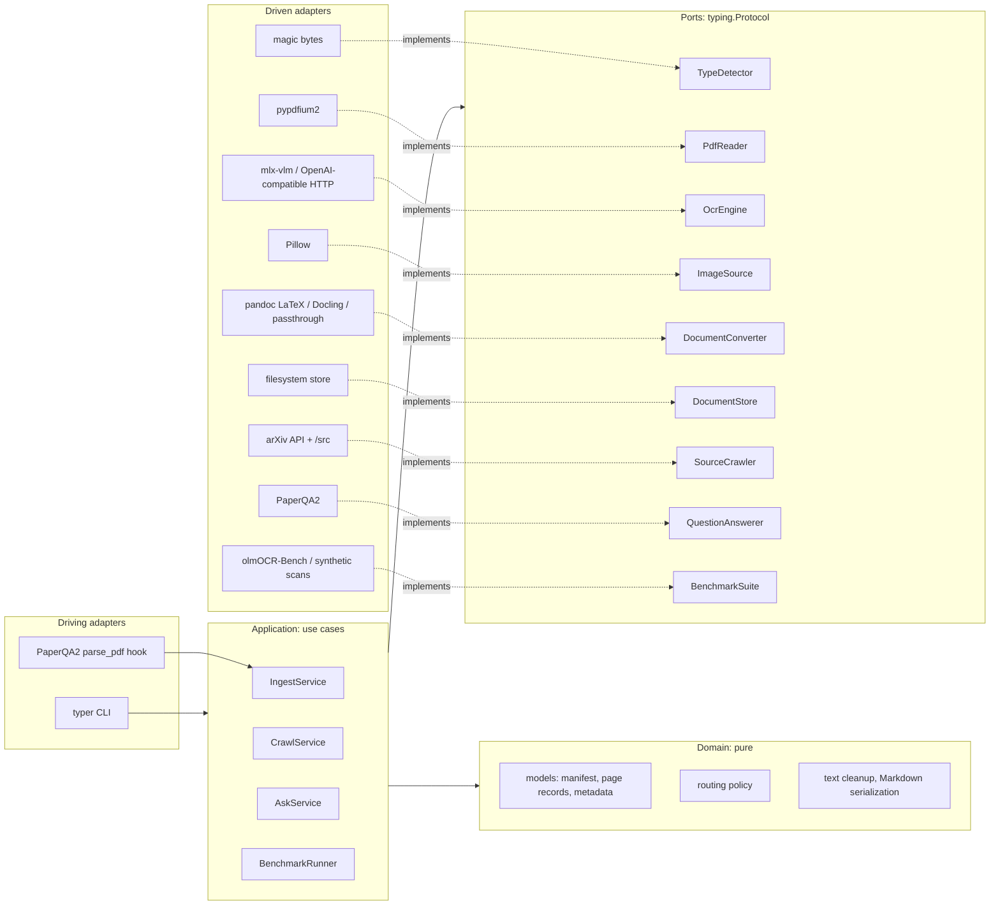

# Architecture

docingest uses a **hexagonal architecture** (ports and adapters). The core has no knowledge of PDFs, MLX, PaperQA2 or arXiv. It works only through small interfaces, and any concrete technology can be replaced by changing configuration.



## Layers and the rule between them

| Layer | Package | May import | Contains |
|---|---|---|---|
| Domain | `docingest.domain` | stdlib and pydantic only | `DocumentManifest`, `PageRecord`, `SourceMetadata`, `RoutingPolicy.decide`, text cleanup, errors |
| Ports | `docingest.ports` | domain; PIL for the image type only | `Protocol` interfaces, all `@runtime_checkable` |
| Application | `docingest.application` | domain, ports | use cases, metrics and statistics |
| Config | `docingest.config` | domain | pydantic settings loaded from `config/pipeline.toml` |
| Adapters | `docingest.adapters.*` | everything inner | one subpackage per port; adapters do not import each other |
| Composition root | `docingest.bootstrap` | everything | adapter registry, entry-point plugins, `Container` |
| Entrypoints | `docingest.entrypoints` | everything | CLI, PaperQA2 hook, benchmark CLI |

These rules are **enforced mechanically** by five import-linter contracts in `pyproject.toml`. `uv run lint-imports` fails the build if any of them breaks:

1. The layers above may be imported only inward, never outward.
2. Adapter subpackages are independent of each other. The shared Hugging Face resolver is the one exception.
3. The domain is pure. It may not import pypdfium2, PIL, numpy, mlx, paperqa, docling, pypandoc, huggingface_hub, httpx, urllib, typer, rich or jiwer.
4. The application layer and the ports may not import any concrete library.
5. Only `bootstrap` and `entrypoints` import concrete adapters (the `protected` contract).

## Replacing a component

Every port has a named slot in `[adapters]` in `config/pipeline.toml`:

```toml
[adapters]
ocr = "mlx-vlm"          # or "openai-compatible" -> vLLM, LM Studio, Ollama, mlx_vlm.server, cloud
latex = "pandoc"
store = "filesystem"
```

- `uv run docingest adapters` lists what is available for each port.
- A third-party package can add an adapter without touching this repo. It registers a factory `(AppConfig) -> adapter` under the entry-point group `docingest.<port>`:

  ```toml
  # in the plugin's pyproject.toml
  [project.entry-points."docingest.ocr"]
  my-ocr = "my_pkg.ocr:factory"
  ```

  After that, setting `ocr = "my-ocr"` is enough. Unknown top-level config sections are kept, so a plugin can read its own settings from the same file.
- Tests and notebooks can bypass configuration entirely with `Container(cfg, overrides={"ocr": FakeOcr()})`.

### Cache invalidation follows replacement automatically
Each adapter exposes a `fingerprint`: its name, version and output-relevant settings. The cache key of a document is `sha256(pipeline version, source kind, run options, fingerprints of the adapters that produce that kind)`. Swapping the OCR model, changing a prompt or upgrading pandoc re-processes exactly the documents affected, and nothing else.

## Data flow of one ingestion

1. `TypeDetector` sniffs magic bytes and returns a `SourceKind`: PDF, image, office, LaTeX or text.
2. `DocumentStore.lookup` checks the content-addressed cache.
3. The source is converted according to its kind:
   - **PDF:** for each page, `PdfPage.signals()` feeds the pure `RoutingPolicy.decide()`. Good pages use the text layer, cleaned with document-level de-hyphenation. Scans, garbled or symbol-only pages are rendered and sent to `OcrEngine.transcribe()`.
   - **Image:** every frame goes to `OcrEngine`.
   - **LaTeX, office, text:** a `DocumentConverter` returns segments. For LaTeX, a segment is a section.
4. The Markdown with page or segment markers and the `DocumentManifest` (provenance: method per page with reasons, engine fingerprint, model and revision, timings, bibliographic metadata) are saved through `DocumentStore.save`.

## Testing strategy

| Level | Location | What it proves | Speed |
|---|---|---|---|
| Unit | `tests/unit` | domain rules and use cases, with in-memory fakes of every port (`tests/fakes.py`) | milliseconds |
| Contract | `tests/contract` | every implementation of a port, fake or real, satisfies the same behavioural tests | fast; the model variant is opt-in |
| Integration | `tests/integration` | real adapters against real files, a fake HTTP server, and recorded arXiv responses | seconds |
| Opt-in | `@pytest.mark.model`, `@pytest.mark.network` | multi-GB models and live arXiv | minutes |

Opt-in tests are skipped unless `DOCINGEST_MODEL_TESTS=1` or `DOCINGEST_NETWORK_TESTS=1` is set. `--strict-markers` is on.

The quality gates are in `scripts/check.sh`: ruff, the import-linter contracts, pyright and pytest with coverage.

## Decisions
See `docs/adr/`.
