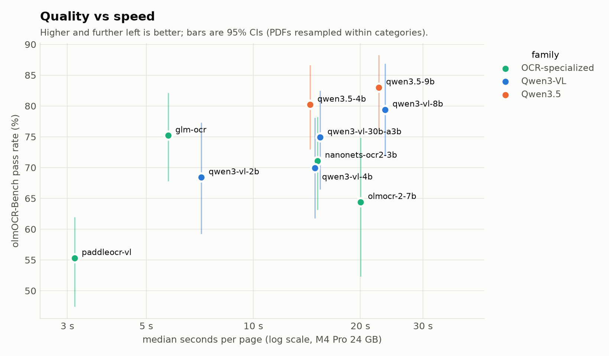
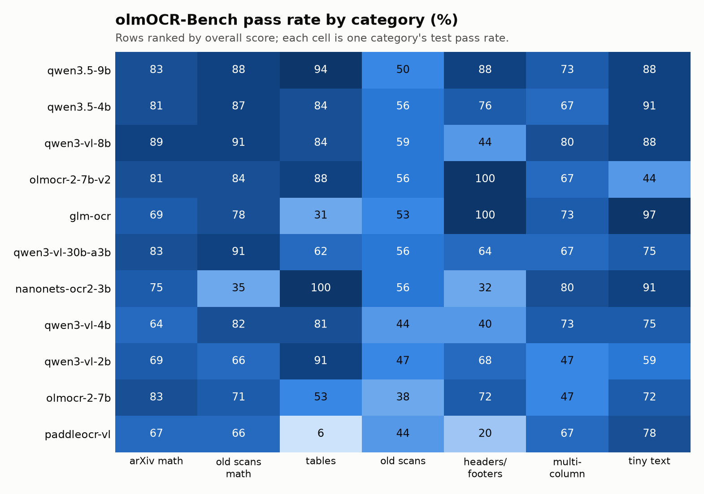
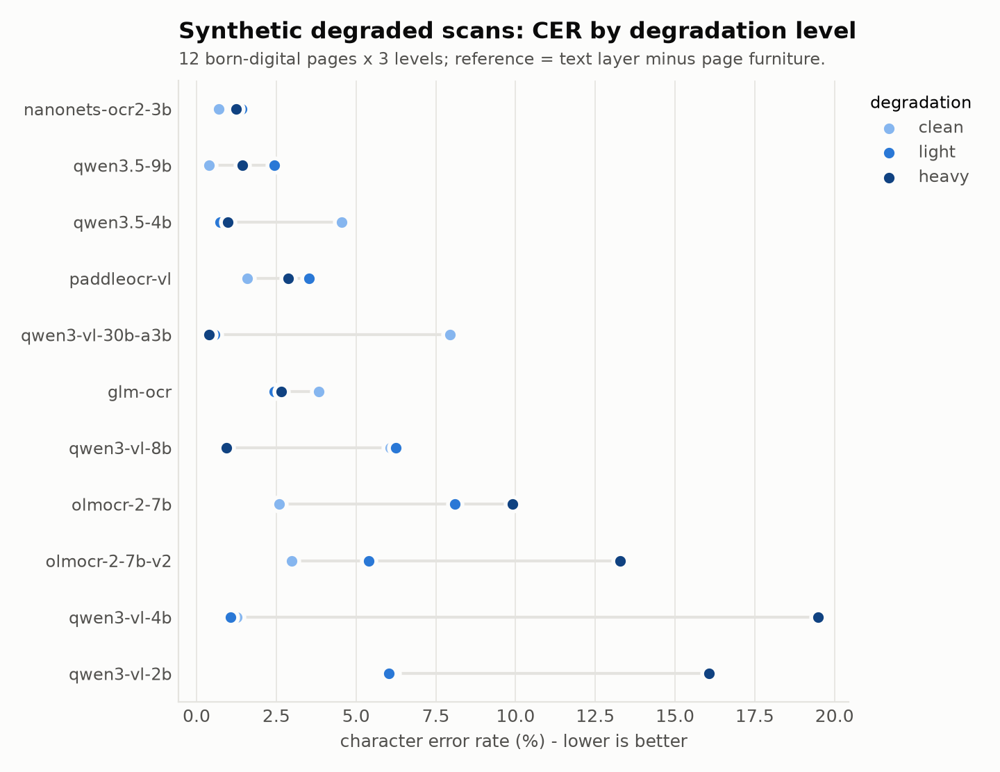

# OCR model benchmark

This benchmark compares local vision-language models for transcribing scanned research pages. It covers accuracy (overall and per document type), speed, memory, and failure modes such as truncation, repetition loops and empty output. It **presents comparisons only and does not choose a model**. The right choice depends on the corpus mix, the latency budget and the hardware, and it is left to the reader. Every number here comes from runs on one Apple M4 Pro with 24 GB. The runs are reproducible with `docingest bench` (see the end of this document).

<!-- RESULTS -->

## Results

Machine: Apple M4 Pro, 24 GB; mlx-vlm 0.7.3, mlx 0.32.2. Full generated reports: [screening](benchmark/screen_report.md), [deep](benchmark/deep_report.md). Failure analyses: [synthetic](benchmark/synthetic_failure_analysis.md), [olmOCR-Bench](benchmark/olmocr_bench_failure_analysis.md).



### olmOCR-Bench (real scans, math, tables, layout)

#### Screening: all candidates, 6 PDFs per category

| model | pass rate % [95% CI] | official ± | vs top mean (paired) | median s/page | peak GB | empty | truncated (1st try) |
|---|---|---|---|---|---|---|---|
| qwen3.5-9b | 83.0 [76.1, 88.2] | 4.5 | top mean | 22.5 | 7.8 | 0% | ≥0% |
| qwen3.5-4b | 80.2 [73.0, 86.5] | 5.2 | -2.9 pts, p = 0.393: not distinguishable | 14.5 | 5.0 | 0% | ≥0% |
| qwen3-vl-8b | 79.4 [72.0, 86.8] | 4.6 | -3.6 pts, p = 0.494: not distinguishable | 23.5 | 7.1 | 0% | ≥2% |
| glm-ocr | 75.2 [67.9, 82.0] | 4.5 | -7.8 pts, p = 0.116: not distinguishable | 5.8 | 2.6 | 0% | ≥0% |
| qwen3-vl-30b-a3b | 74.9 [66.6, 82.4] | 5.4 | -8.2 pts, p = 0.075: not distinguishable | 15.4 | 19.5 | 0% | 2% |
| nanonets-ocr2-3b | 71.1 [63.2, 78.1] | 4.9 | -11.9 pts, p = 0.043: lower (p < 0.05) | 15.2 | 4.1 | 0% | ≥2% |
| qwen3-vl-4b | 69.9 [61.8, 78.0] | 5.5 | -13.1 pts, p = 0.001: lower (p < 0.05) | 14.9 | 4.5 | 0% | ≥0% |
| qwen3-vl-2b | 68.4 [59.3, 77.2] | 5.5 | -14.6 pts, p = 0.001: lower (p < 0.05) | 7.1 | 3.1 | 0% | ≥0% |
| olmocr-2-7b | 64.4 [52.4, 74.8] | 5.9 | -18.6 pts, p = 0.001: lower (p < 0.05) | 20.0 | 6.6 | 0% | ≥0% |
| paddleocr-vl | 55.3 [47.5, 61.9] | 5.4 | -27.7 pts, p = 0.000: lower (p < 0.05) | 3.1 | 1.7 | 0% | ≥0% |

42 PDFs (42 clusters). *official ±* is the scorer's own interval (tests resampled independently, narrower); the bracketed CI resamples whole PDFs within categories. *vs top mean*: paired cluster bootstrap / sign-flip test against the candidate with the highest mean.

#### Deep sample: candidates the screening could not separate from the top mean, 12 PDFs per category

| model | pass rate % [95% CI] | official ± | vs top mean (paired) | median s/page | peak GB | empty | truncated (1st try) |
|---|---|---|---|---|---|---|---|
| qwen3.5-4b | 79.4 [74.2, 83.9] | 3.3 | top mean | 14.6 | 5.0 | 0% | 2% |
| qwen3.5-9b | 79.3 [74.3, 83.5] | 3.2 | -0.1 pts, p = 0.971: not distinguishable | 22.7 | 7.8 | 0% | 0% |
| nanonets-ocr2-3b | 67.6 [61.0, 74.2] | 3.6 | -11.7 pts, p = 0.005: lower (p < 0.05) | 14.8 | 4.2 | 0% | 2% |

84 PDFs (84 clusters). *official ±* is the scorer's own interval (tests resampled independently, narrower); the bracketed CI resamples whole PDFs within categories. *vs top mean*: paired cluster bootstrap / sign-flip test against the candidate with the highest mean.

#### Pass rate by category (screening, %)



| model | arXiv math | old scans math | tables | old scans | headers/footers | multi-column | tiny text |
|---|---|---|---|---|---|---|---|
| qwen3.5-9b | 83 | 88 | 94 | 50 | 88 | 73 | 88 |
| qwen3.5-4b | 81 | 87 | 84 | 56 | 76 | 67 | 91 |
| qwen3-vl-8b | 89 | 91 | 84 | 59 | 44 | 80 | 88 |
| glm-ocr | 69 | 78 | 31 | 53 | 100 | 73 | 97 |
| qwen3-vl-30b-a3b | 83 | 91 | 62 | 56 | 64 | 67 | 75 |
| nanonets-ocr2-3b | 75 | 35 | 100 | 56 | 32 | 80 | 91 |
| qwen3-vl-4b | 64 | 82 | 81 | 44 | 40 | 73 | 75 |
| qwen3-vl-2b | 69 | 66 | 91 | 47 | 68 | 47 | 59 |
| olmocr-2-7b | 83 | 71 | 53 | 38 | 72 | 47 | 72 |
| paddleocr-vl | 67 | 66 | 6 | 44 | 20 | 67 | 78 |

### Synthetic degraded scans (exact ground truth)

| model | CER % [95% CI] | median CER % | word-F1 | clean | light | heavy | median s/page | peak GB |
|---|---|---|---|---|---|---|---|---|
| nanonets-ocr2-3b | 1.1 [0.4, 2.0] | 0.4 | 0.968 | 0.7 | 1.4 | 1.2 | 19.3 | 4.1 |
| qwen3.5-9b | 1.4 [0.4, 3.0] | 0.4 | 0.975 | 0.4 | 2.4 | 1.4 | 30.5 | 7.7 |
| qwen3.5-4b | 2.1 [0.7, 4.2] | 0.4 | 0.971 | 4.6 | 0.8 | 1.0 | 19.8 | 4.9 |
| paddleocr-vl | 2.7 [0.9, 5.0] | 0.8 | 0.965 | 1.6 | 3.5 | 2.9 | 3.6 | 1.7 |
| qwen3-vl-30b-a3b | 3.0 [0.4, 7.1] | 0.4 | 0.974 | 8.0 | 0.6 | 0.4 | 21.5 | 19.3 |
| glm-ocr | 3.0 [0.9, 5.4] | 0.3 | 0.970 | 3.8 | 2.4 | 2.7 | 7.9 | 2.4 |
| qwen3-vl-8b | 4.4 [0.3, 11.6] | 0.4 | 0.976 | 6.1 | 6.2 | 0.9 | 32.1 | 6.9 |
| olmocr-2-7b | 6.9 [1.1, 13.7] | 0.3 | 0.946 | 2.6 | 8.1 | 9.9 | 30.2 | 6.6 |
| qwen3-vl-4b | 7.3 [1.1, 15.7] | 0.7 | 0.940 | 1.3 | 1.1 | 19.5 | 20.3 | 4.5 |
| qwen3-vl-2b | 9.4 [3.0, 17.9] | 2.7 | 0.940 | 6.1 | 6.0 | 16.1 | 11.1 | 3.0 |

**Reported separately: `olmocr_2502.18443.pdf#p001`.** Figure 1's internal vector text (1,103 of 3,225 reference characters) is in the text layer, panel-interleaved and with its spaces lost; a flawless transcription of the visible non-figure text scores CER 0.342 against it (found by the failure analysis). Per model on this page: nanonets-ocr2-3b 36.8%, qwen3.5-9b 46.7%, qwen3.5-4b 33.7%, paddleocr-vl 34.9%, qwen3-vl-30b-a3b 34.6%, glm-ocr 46.1%, qwen3-vl-8b 34.6%, olmocr-2-7b 36.7%, qwen3-vl-4b 35.6%, qwen3-vl-2b 56.9%.



<!-- /RESULTS -->

## Methodology

### Candidates
There are 10 models, each pinned to an exact Hugging Face commit in `config/benchmark.toml` and run in-process with mlx-vlm 0.7.3 (4-bit MLX conversions). Each model uses its **own profile**: the prompt, image size, output clean-up and generation limits from its model card or official repository. A model is never judged on a prompt it was not built for.

| Candidate | Profile | Notes |
|---|---|---|
| Qwen3-VL-2B / 4B / 8B Instruct | `markdown` | general VLMs; our Markdown + LaTeX prompt |
| Qwen3.5-4B / 9B | `markdown` | natively multimodal; thinking disabled by the chat template |
| olmOCR-2-7B-1025 (AllenAI) | `olmocr` | official v4 prompt, 1288 px, YAML front matter stripped |
| Nanonets-OCR2-3B | `nanonets` | official prompt; `<page_number>`/`` tags handled |
| GLM-OCR | `glm-ocr` | `Text Recognition:` with the official (thinking-enabled) template |
| PaddleOCR-VL-1.6 | `paddleocr-vl` | `OCR:`; its processor caps the input at about 1 MP |
| Qwen3-VL-30B-A3B Instruct | `markdown` | mixture-of-experts: 30B parameters, about 3B active per token; 18.3 GB, needs the GPU wired-memory limit raised to about 20 GB |

All candidates use greedy decoding (temperature 0) and the same retry ladder. If a page hits its token limit, which usually means a repetition loop, it is retried with a little temperature and a stronger repetition penalty, seeded by the page image. Telemetry records whether the first attempt was truncated, the number of attempts and the decode speed.

### Suite 1: synthetic degraded scans (ground truth known exactly)
- **Pages:** 12 pages from 3 born-digital arXiv papers (Transformer, PaperQA2, olmOCR). They cover a title page, math, tables, dense author lists and body text.
- **Rendering:** each page is rasterized at 200 dpi and degraded at three deterministic levels:
  - **clean:** raster only;
  - **light:** blur, noise and a ±1.2° rotation;
  - **heavy:** stronger blur and noise plus JPEG at quality 35.
- **Reference:** the page's own text layer.
- **Fairness normalisation**, applied at scoring time to both the reference and the model output:
  - Page furniture is stripped: running headers, bare page numbers and the arXiv margin stamp. The `markdown` prompt tells models to omit them, so leaving them in would penalise obedience.
  - Markdown and HTML markup are stripped, including `` descriptions and figure placeholders.
  - Hyphenation is ignored.
  - A small LaTeX-to-Unicode normaliser runs, so `$\alpha$` and `α` score the same.
- **Metrics:**
  - **CER** (primary) and **WER**, both capped at 1.0 so a runaway loop cannot dominate a mean;
  - **word-F1** (order-insensitive);
  - **char-3-gram F1** (order-insensitive but still sensitive to spelling).

### Suite 2: olmOCR-Bench subset (industry benchmark, real scans)
- **Dataset:** `allenai/olmOCR-bench`, pinned to dataset commit `54a96a6f`.
- **Categories:** arXiv math, old scans, old scans with math, tables, headers and footers, multi-column, and long tiny text.
- **Sample:** a seeded sample of PDFs per category. Samples are nested, so the 6-per-category screening sample is contained in the 12-per-category deep sample.
- **Deep sample:** the leading candidates are re-run on the larger sample. This is only to narrow their confidence intervals, not to select a model.
- **Scoring:** the **official scorer** (`olmocr==0.4.27`, in an isolated venv with headless Chromium for the math-rendering tests). Scores are therefore comparable in kind with the published leaderboard, although a subset has wider uncertainty than the full benchmark (about 1,400 PDFs).
- **Test types:** unit tests on the Markdown output. They check that specific text is present, that headers and footers are absent, that reading order is correct, that table cells are placed correctly, and that math renders to the same result as the reference. There are also baseline sanity tests.

### Statistics
- **Clustered bootstrap.** Every confidence interval resamples **clusters**, never single observations. On the synthetic suite, one page with all three of its degradation levels is one cluster. On olmOCR-Bench, one PDF with all its tests is one cluster, resampled within its category. Treating those as independent made intervals falsely narrow. In a null simulation the false-positive rate went from 26.5% down to the nominal 5.2%.
- **Paired comparisons** against the best candidate use a paired cluster bootstrap for the interval and an exact sign-flip test over cluster means for the p-value.
- With few clusters, p-values are shown but "significant" is suppressed. With k clusters the smallest possible p is 2/2^k.
- The official scorer's own interval, which resamples tests and is narrower, is reported separately for comparison with published numbers.

### Throughput
Throughput is wall-clock seconds per page (median and p90), decode tokens per second, peak GPU memory per page (MLX, reset before each page), truncation and retry rates, and empty-output rate. Every model runs in the same process, one after another, with unloading and cache clearing in between, on AC power with the Mac kept awake.

### Reproduce

```bash
./scripts/setup_bench_scorer.sh
uv run docingest bench prepare --preset screen
uv run docingest bench run --preset screen --run-id screen     # resumable
uv run docingest bench report --run-id screen                  # summary.json + report.md
uv run python scripts/bench_charts.py data/bench/runs/screen docs/benchmark
```

Each run directory records the suite fingerprints, candidate specs, package versions and machine info, and it refuses to resume with different settings.
