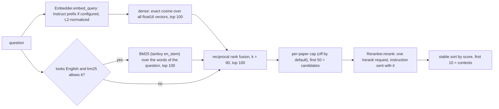

# docingest-index

Embedding and reranker clients and a persistent chunk index for [docingest](../docingest/README.md). It plugs into docingest as three adapters, found by entry point, so docingest's core does not depend on numpy search code or tantivy.

| Adapter | `[adapters]` entry | Port | What it is |
|---|---|---|---|
| `OpenAICompatibleEmbedder` | `embedder = "openai-compatible"` | `Embedder` | HTTP client for `/v1/embeddings` (vLLM serving Qwen3-Embedding). Batches, retries, L2-normalized float32 vectors, Qwen3 query instruction. |
| `LocalIndex` | `index = "local"` | `ChunkIndex` | Vectors and chunks on disk (float16 numpy shards), exact cosine search, a tantivy BM25 index, reciprocal rank fusion, an optional per-paper cap. |
| `VllmReranker` | `reranker = "vllm"` | `Reranker` | HTTP client for vLLM's `/rerank` (Qwen3-Reranker): one request, one score per chunk. |

The design and its measurements are in [ADR 0004](../docingest/docs/adr/0004-chunk-index-and-two-stage-retrieval.md). The ports and their contracts are in [docingest's ports README](../docingest/src/docingest/ports/README.md).

## Contents

- [Use it](#use-it)
- [How a question is answered](#how-a-question-is-answered)
- [The index on disk](#the-index-on-disk)
- [Keeping the index in step with the corpus](#keeping-the-index-in-step-with-the-corpus)
- [Configuration](#configuration)
- [Code map](#code-map)
- [Tests and checks](#tests-and-checks)
- [Limits](#limits)

## Use it

The embedder and the reranker run as model servers; [`serving/`](../../serving/README.md) starts them (`qwen-embed` on port 8002, `qwen-rerank` on port 8003). Select the adapters and point the tables at the servers (all keys: [config/README.md](../docingest/config/README.md#index-embedder-and-reranker-docingest-index)):

```toml
[adapters]
embedder = "openai-compatible"
index = "local"
reranker = "vllm"

[embedder]
base_url = "http://127.0.0.1:8002/v1"

[reranker]
base_url = "http://127.0.0.1:8003"
```

Then, from `packages/docingest` with the corpus already ingested:

```bash
uv run docingest index build      # embed the new and changed papers, commit
uv run docingest index status     # what is indexed, what is searchable, what a build would do
uv run docingest index remove 3fa9c2d1
```

`index build` is incremental: a second run over an unchanged corpus makes no embedding request. Using the index to answer questions with `docingest ask` is the next change.

In Python, through the container (the adapters are the ones above):

```python
from docingest.bootstrap import Container
from docingest.config import load_config

c = Container(load_config("config/pipeline.toml"))
c.index_service.build()
question = "What limits T1 in transmons?"
vector = c.adapter("embedder").embed_query(question)
hits = c.adapter("index").search(question, vector, 50)           # first stage
scores = c.adapter("reranker").rerank(question, [h.chunk for h in hits])
```

## How a question is answered



`LocalIndex.search` is the part up to the candidates. The reranker call and the final sort are done by the caller (the ask integration); scores come back in input order and ties keep the first-stage order. These are the formulas of the measured end-to-end retrieval, and `tests/test_retrieval_oracle.py` compares them with a literal copy of that script:

- Dense: vectors are unit length, so the score is a dot product; computed in float32 over float16 storage, in blocks of 16,384 rows. Ranking by `argpartition` and a stable sort.
- BM25: the question reduced to lowercased ASCII letters and digits, parsed by tantivy as an OR query over a field tokenized with `en_stem`. A question with none of those characters has no keyword part.
- Fusion: an item scores the sum of `1 / (60 + rank)` over the rankings that contain it (rank from 1); ties keep the order of first appearance, dense first.
- Whether a question is English is decided from its function words (`language.py`); `bm25 = "always"` skips the test.

## The index on disk

```text
<index.dir>/<model-slug>-<fingerprint8>/
  fingerprint.json    corpus, model, revision, vector length (seen at the first commit), dtype,
                      query instruction, chunker version and settings, format
  shards/<doc_id[:16]>-<key[:16]>.npz     float16 unit vectors of one paper
  shards/<doc_id[:16]>-<key[:16]>.jsonl   header line, then one line per chunk:
                                          name, pages, character span, is_reference, text
  search/dense.npy, chunks.jsonl, chunks.offsets.npy, ids.json, bm25/
                      everything search() reads, rebuilt from the shards by commit(); never embeds
  state.json          documents, chunks and time of the last commit
  .lock               held by the process that writes
```

- **One folder per corpus and setting.** The folder name is the model slug and the first 8 hex digits of a SHA-256 over the index fingerprint: the corpus (the resolved `output_dir` of the config), the embedder's identity (model, revision, normalization), the vector dtype, the chunker version, `[qa] chunk_chars` and `overlap`, and the format version. Change any of them and a new, empty folder is used. Several corpora can share one `[index] dir`: each gets its own folder, so building one never prunes another; a corpus folder that moves is a new index (the old folder can be deleted). Indexes of two models never mix. The `query_instruction` is written to `fingerprint.json` but is not part of the hash: it changes only the vector of a question. The vector length is not a setting: it is recorded in `fingerprint.json` at the first commit, and vectors of another length are refused.
- **Shards are the source of truth for what is stored.** `upsert` writes the `.npz` and then the `.jsonl` (the `.jsonl` marks the shard valid) through temporary files and renames, under a name no other shard uses (`-1`, `-2` are appended when the name is taken, for example when the same key is stored again), and deletes the paper's older shard only after that. A crash leaves the old shard or the new one, never a mixture; the leftovers are cleaned up by the next writer.
- **`search/` is what questions are answered from.** `commit` copies the vectors and the chunk records of every shard into a new `search/` (with the BM25 index) next to the old one and swaps the folders. `search` reads nothing outside `search/`, so it answers from the last commit even while shards are being replaced or removed, by this process or another. After `commit`, `search` reflects exactly what `keys()` reports. `stats().pending` is true when the shards differ from what `search/` was built from, in any document.
- **Readers and writers.** Reading (`keys`, `stats`, `search`, so `docingest index status`) never creates, changes or deletes a file. A reader opens one commit whole (vectors, chunk records and the BM25 index) at its first search and keeps that commit while it stays open, however many commits other processes make; `close()` or a new object sees the latest. `ids.json` carries a generation id per commit, so an open that a commit interrupts starts over. The first write takes an exclusive `flock` on `.lock` and holds it until `commit` returns or `close()` is called; a second writer fails at once with `IndexBusyError`, naming the folder. Under the lock the first write removes temporary files, vectors without chunks and the older of two shards of one paper (the one with the smaller write counter `seq` in its header; every `upsert` writes a counter larger than any shard on disk).
- Ids that are not filename-safe are hashed in the shard name.

## Keeping the index in step with the corpus

`IndexService` (in docingest) calls the port; this package only stores. A paper's key is the SHA-256 of its page numbers and texts, so a paper is embedded again only when its text changed. Vectors are never recomputed by `commit`. `index build` also removes papers that left the corpus (`--no-prune` keeps them) and refuses to run when the index records another embedder fingerprint than the configured one (`IndexMismatchError`).

## Configuration

`[index]`, `[embedder]` and `[reranker]` are described key by key in [docingest's config README](../docingest/config/README.md#index-embedder-and-reranker-docingest-index). The factories read them from `AppConfig.model_extra` and validate them with the models in `settings.py`; unknown keys are errors. `[index] max_chunks_per_paper` has one default, `DEFAULT_MAX_CHUNKS_PER_PAPER` in `settings.py`.

## Code map

| Module | Contains |
|---|---|
| `settings.py` | `IndexSettings`, `EmbedderSettings`, `RerankerSettings`, `load`: the three tables, their defaults and the pinned default models |
| `http.py` | `JsonClient` (one POST with retries, bearer key from an environment variable, no redirects) and `RemoteServiceError` |
| `embedder.py` | `OpenAICompatibleEmbedder`, `embedder_fingerprint`, `format_query`, `normalize` |
| `reranker.py` | `VllmReranker` |
| `local.py` | `LocalIndex`: shards, `commit`, `search`, the on-disk format |
| `fusion.py` | `rrf` |
| `language.py` | `looks_english` |
| `factories.py` | The three `(AppConfig) -> adapter` functions that the entry points name |

The import-linter contract in `pyproject.toml` lets this package import only `docingest.ports`, `docingest.domain` and `docingest.config`.

## Tests and checks

```bash
./scripts/check.sh      # ruff, ruff format, import-linter, pyright, pytest with an 85% coverage floor
```

No test needs a GPU or the network: the clients run over `httpx.MockTransport` (`tests/servers.py`) and the index over real numpy and tantivy on temporary folders.

| Module | Covers |
|---|---|
| `test_contract.py` | docingest's retrieval contract (`tests/contract/test_retrieval_contract.py` of the docingest package, imported through `tests/conftest.py`) against the real embedder, index and reranker |
| `test_embedder.py`, `test_reranker.py` | request bodies equal to the ones of the measured scripts, batching and order, normalization, retries, errors, keys |
| `test_local_index.py` | layout, round trip, incremental add, change and remove, commit visibility, recovery after a crash, folder separation by fingerprint, RRF on a hand-checked example, English-only BM25, the per-paper cap, blocks and depths |
| `test_retrieval_oracle.py` | the fused top 50 equals a literal copy of the measured retrieval script |
| `test_fusion.py`, `test_language.py`, `test_settings.py`, `test_factories.py` | the helpers, the config tables and the entry points |
| `test_cli_end_to_end.py` | `docingest index build`, `status` and `remove` through the real CLI, store, entry points, client and index |

CI runs the same gates on Linux (core and dev dependencies) and macOS (everything installed); see [`.github/workflows/ci.yml`](../../.github/workflows/ci.yml).

## Limits

- Exact search holds the dense matrix on disk and scores it in blocks: fine to roughly 10,000 papers (about 100,000 chunks of 2,560 dimensions, 0.5 GB). Beyond that, approximate search is a separate decision.
- One process writes to an index folder at a time (enforced by the lock); readers can run alongside because `search` reads only the committed `search/` folder. The lock is an `flock` on a local file: use a local disk, not a network share.
- The English test is a function-word count, not a language identifier.
- BM25 ties are broken by tantivy's document order; the index is written with one thread so that order is the same in every build.
