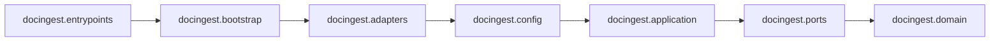
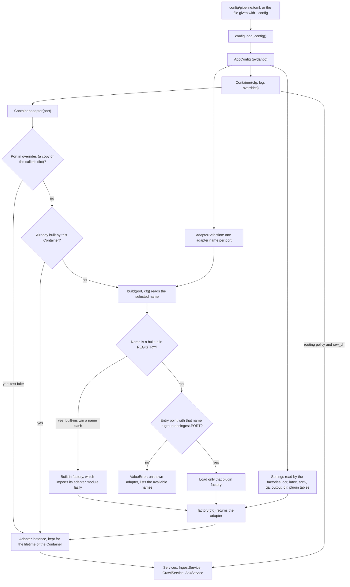
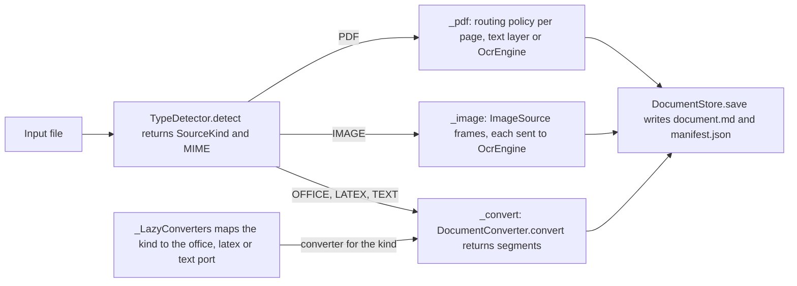
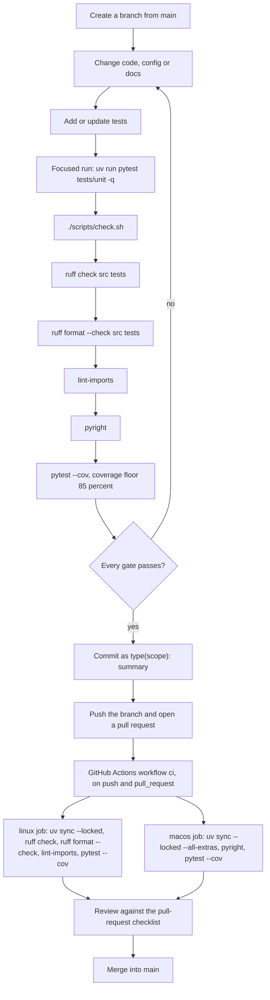

# Contributing to docingest

This guide is for developers who change the code in this repository. It covers:

- how to set up the environment;
- the architectural rules that the build enforces;
- the conventions for typing, style, errors and logging;
- step-by-step recipes for the most common extensions.

For what the tool does and how to run it, start with the [README](README.md). For the design, read [docs/architecture.md](docs/architecture.md) and the decision records in [docs/adr/](docs/adr/).

Each part of the repository also has its own reference:

| Area | Reference |
|---|---|
| Package overview | [src/docingest/README.md](src/docingest/README.md) |
| Domain (models, routing policy, text, errors) | [src/docingest/domain/README.md](src/docingest/domain/README.md) |
| Ports (Protocols and value types) | [src/docingest/ports/README.md](src/docingest/ports/README.md) |
| Application (use cases) | [src/docingest/application/README.md](src/docingest/application/README.md) |
| Adapters | [src/docingest/adapters/README.md](src/docingest/adapters/README.md), [ocr](src/docingest/adapters/ocr/README.md), [converters](src/docingest/adapters/converters/README.md) |
| Entrypoints (CLI, PaperQA2 hook) | [src/docingest/entrypoints/README.md](src/docingest/entrypoints/README.md) |
| Configuration files | [config/README.md](config/README.md) |
| Scripts | [scripts/README.md](scripts/README.md) |
| Tests | [tests/README.md](tests/README.md) |
| Documentation index | [docs/README.md](docs/README.md) |

## Contents

1. [Environment setup](#1-environment-setup)
2. [Repository layout and conventions](#2-repository-layout-and-conventions)
3. [Hexagonal rules and the import-linter contracts](#3-hexagonal-rules-and-the-import-linter-contracts)
4. [Typing and style](#4-typing-and-style)
5. [Error handling](#5-error-handling)
6. [Logging, provenance and telemetry](#6-logging-provenance-and-telemetry)
7. [How configuration selects and wires an adapter](#7-how-configuration-selects-and-wires-an-adapter)
8. [Guide: add an adapter for an existing port](#8-guide-add-an-adapter-for-an-existing-port)
9. [Guide: add a new port](#9-guide-add-a-new-port)
10. [Guide: support a new input type](#10-guide-support-a-new-input-type)
11. [Guide: add or change an OCR model or profile](#11-guide-add-or-change-an-ocr-model-or-profile)
12. [Guide: add a benchmark candidate or suite](#12-guide-add-a-benchmark-candidate-or-suite)
13. [Guide: add a CLI command](#13-guide-add-a-cli-command)
14. [Testing expectations](#14-testing-expectations)
15. [Quality gates and CI](#15-quality-gates-and-ci)
16. [Commit messages](#16-commit-messages)
17. [Pull-request checklist](#17-pull-request-checklist)

---

## 1. Environment setup

### Requirements

| Requirement | Where it is defined | Value |
|---|---|---|
| Python | `.python-version`, `requires-python` in `pyproject.toml` | 3.12 (`>=3.12`) |
| Package manager | `uv.lock`, `[build-system]` | [uv](https://docs.astral.sh/uv/). The build backend is `uv_build>=0.12.2,<0.13.0`. |
| Platforms | `[tool.uv] environments` in the workspace root's `pyproject.toml` (uv reads `[tool.uv]` only there) | macOS on Apple Silicon (`sys_platform == 'darwin' and platform_machine == 'arm64'`) and Linux (`sys_platform == 'linux'`). The lockfile is resolved for these two environments only. |

### Install

Run these from `packages/docingest`. uv finds the workspace root one level up, with the one `uv.lock` and the shared `.venv`; `uv sync` at the repository root installs every package of the workspace.

```bash
uv sync --locked                    # core dependencies + the "dev" group (installed by default)
uv sync --locked --all-extras       # everything; this is what the macOS CI lane installs
uv sync --locked --extra office     # a single extra: mlx, qa or office
uv run docingest --help             # the console script (docingest.entrypoints.cli:app)
uv run docingest adapters           # every port, its built-in adapters, installed plugins, the selection
```

- `--locked` makes uv stop with an error when `pyproject.toml` and `uv.lock` disagree, instead of re-locking silently.
- CI runs `uv sync --locked`, then every tool with `uv run --frozen`, which uses the lockfile as it is.
- If you change dependencies, update `uv.lock` in the same commit (for example with `uv lock`). Otherwise `uv sync --locked` fails in CI.

### Optional extras

| Extra | Installs | Needed for |
|---|---|---|
| `mlx` | `mlx-vlm>=0.7.3`, with the marker `sys_platform == 'darwin' and platform_machine == 'arm64'` | the in-process OCR adapter `mlx-vlm`, which is the default `[adapters] ocr` |
| `qa` | `paper-qa[local]>=2026.8.12` | `docingest ask`, the `paperqa` QA adapter and the PaperQA2 hook in `entrypoints/paperqa_hook.py` |
| `office` | `docling>=2.130` | the `docling` converter (DOCX, PPTX, XLSX, HTML) |

Notes:

- Without the `mlx` extra (for example on Linux), select `ocr = "openai-compatible"` and point `[ocr] base_url` at a server. [`config/examples/remote-ocr.toml`](config/examples/remote-ocr.toml) shows the settings.
- pandoc needs no extra. `pypandoc-binary`, a core dependency, bundles it. `[latex] pandoc_path` can point at another binary.
- `docingest model-path <llm|embedding|ocr>` resolves a pinned Hugging Face snapshot. It uses the local cache first and downloads the snapshot when it is not cached.

### Development tools (the `dev` group)

`hypothesis`, `import-linter`, `matplotlib` (used by `scripts/bench_charts.py`), `pyright`, `pytest`, `pytest-cov`, `rapidfuzz`, `ruff`. They are installed by every `uv sync` because `dev` is a default group.

### Benchmark scorer (optional)

The official olmOCR-Bench scorer runs in a separate virtual environment, `.bench-venv/`, which is created by `./scripts/setup_bench_scorer.sh` and ignored by git. You only need it to score the `olmocr-bench` suite. See [scripts/README.md](scripts/README.md).

---

## 2. Repository layout and conventions

### Where things live

Paths are relative to the package folder, `packages/docingest`. The repository root holds the uv workspace (`pyproject.toml`, `uv.lock`, `.python-version`), CI (`.github/`) and the top-level README.

| Path | Contents |
|---|---|
| `src/docingest/domain/` | `models.py` (`DocumentManifest`, `PageRecord`, `SourceKind`, `PageMethod`, ...), `routing.py` (`RoutingPolicy`, `decide`), `text.py` (text-layer clean-up, Markdown page markers), `chunking.py` (page-aware chunks), `errors.py` |
| `src/docingest/ports/` | one `typing.Protocol` per port, plus the frozen dataclasses that cross it |
| `src/docingest/application/` | use cases: `IngestService`, `CrawlService`, `AskService`, `BenchmarkRunner`; `metrics.py` and `stats.py` |
| `src/docingest/config.py` | `AppConfig` and its sections, loaded from `config/pipeline.toml` |
| `src/docingest/adapters/<area>/` | implementations, one subpackage per area: `detection`, `pdf`, `ocr`, `images`, `converters`, `store`, `sources`, `qa`, `retrieval`, `datasets`, plus `models` (the shared Hugging Face resolver) |
| `src/docingest/bootstrap.py` | the composition root: `REGISTRY`, entry-point plugins, `Container` |
| `src/docingest/entrypoints/` | `cli.py` (typer), `bench_cli.py` (`docingest bench ...`), `paperqa_hook.py` |
| `config/` | `pipeline.toml`, `benchmark.toml`, `examples/` |
| `scripts/` | `check.sh` (the quality gates) and the data, server and benchmark helpers |
| `tests/` | `unit/`, `contract/`, `integration/`, `fixtures/`, `fakes.py`, `builders.py`, `conftest.py` |
| `docs/` | architecture, ADRs, benchmark methodology and results |
| `data/` | local inputs and outputs. `data/raw/`, `data/normalized/`, `data/bench/` and the downloaded samples are ignored by git. |

### Code conventions observed in the source

- **Module docstrings name the role.** The first line says which layer or port the module belongs to, for example `"""Port: transcribe a page image to Markdown."""`, `"""OcrEngine adapter: ..."""`, `"""Use case: ..."""`, `"""Driving adapter: ..."""`.
- **Postponed annotations.** Every module except the package `__init__.py` files and `domain/errors.py` puts `from __future__ import annotations` right after the module docstring. Do the same in new modules.
- **Relative imports inside the package** (`from ...domain.models import PageMethod`). Tests import `docingest.*` absolutely. They import the helpers as `from fakes import ...` and `from builders import ...`, because `tests/conftest.py` puts `tests/` on `sys.path`.
- **Heavy optional libraries are imported lazily**, inside the function that needs them. Examples: `mlx_vlm` in `MlxVlmOcr._ensure_loaded`, `docling` in `DoclingConverter.convert`, and every adapter module inside its factory in `bootstrap.py`. Ruff's `PLC0415` is disabled for this reason.
- **Value objects.** Types that cross a port are frozen dataclasses (`OcrResult`, `Conversion`, `Segment`, `StoredDocument`, `SourceRecord`, `FetchedSource`, `Sample`, `CandidateSpec`, `Estimate`). The one exception is `SuiteScore`, a plain dataclass, because `score_run` sets its `stamp` after scoring. Domain entities and configuration are pydantic models. The section models in `config.py` (`AdapterSelection`, `OcrConfig`, `QaConfig`, `LatexConfig`, `ArxivConfig`) use `ConfigDict(extra="forbid")`, so a mistyped key is a validation error. So does `[routing]`, the domain's `RoutingPolicy`. The one exception is `AppConfig` itself, which keeps unknown top-level tables for plugins (`extra="allow"`).
- **Services take their ports as keyword-only constructor arguments**: `IngestService(*, detector, pdf, ocr, images, converters, store, policy, log)`, `CrawlService(*, crawler, ingest, raw_dir, log)` and `AskService(*, store, qa)`. `BenchmarkRunner` is the exception: its first argument is a positional engine factory, `(CandidateSpec) -> OcrEngine`.
- **Everything is pinned.** Model repositories carry a commit sha (`revision`), benchmark datasets carry a revision, and sample inputs are checked against `scripts/samples.sha256`.
- **Settings that change output are part of a fingerprint** (section 8.3). The header of `config/pipeline.toml` states this rule for users.
- **Comments explain why**, and often cite the source of a number: a model card, an official repository, an API's terms of use.
- **Secrets never appear in config or code.** `[ocr] api_key_env` holds the *name* of an environment variable, and the adapter reads the key per request.

### Decision records

Architectural decisions go into `docs/adr/NNNN-short-title.md` with the heading `# ADR NNNN: Title`, a `**Status:**` line and the sections Context, Decision and Consequences. See [ADR 0001](docs/adr/0001-hexagonal-architecture.md) for an example.

---

## 3. Hexagonal rules and the import-linter contracts

The package follows a hexagonal (ports and adapters) architecture ([ADR 0001](docs/adr/0001-hexagonal-architecture.md)):

- dependencies point inward, towards the domain;
- the application depends on ports, which are `typing.Protocol` classes;
- adapters satisfy the Protocols by shape. They do not subclass them and import only the value types (such as `OcrResult` or `Conversion`) from `docingest.ports`;
- exactly one place, `bootstrap.py`, chooses concrete adapters.

The following diagram shows the layer order of the first contract. An arrow means "may import"; a layer may also import every layer further to the right.



These rules are enforced by five import-linter contracts in `pyproject.toml` (`[tool.importlinter]`). `uv run lint-imports` checks them, and it is a gate in `scripts/check.sh` and in the Linux CI lane. Two global options apply to all contracts:

- `include_external_packages = true` puts third-party packages in the import graph, so that contracts can name them.
- `exclude_type_checking_imports = true` ignores imports under `if TYPE_CHECKING:`. For example, `adapters/ocr/openai_compat.py` imports `OcrConfig` only for type checking.

| # | Contract name in `pyproject.toml` | Type | What it forbids | Why |
|---|---|---|---|---|
| 1 | Hexagonal layers: outer layers may import inner ones, never the reverse | `layers` | An inner layer importing an outer one. The order from outer to inner is `entrypoints`, `bootstrap`, `adapters`, `config`, `application`, `ports`, `domain`. For example, `application` may not import `config`, and `adapters` may not import `bootstrap`. | The core stays independent of the technology and of the way it is wired. Use cases can be tested with fakes and no configuration. |
| 2 | Adapters are independent of each other (shared HF resolver excepted) | `independence` | Any import, in either direction, even indirect, between `adapters.detection`, `pdf`, `ocr`, `images`, `converters`, `store`, `sources`, `qa`, `retrieval` and `datasets`. `adapters.models` is not in the list, so every adapter may use the Hugging Face resolver. | Replacing one adapter cannot break another, and one adapter's optional dependency never loads with another adapter. |
| 3 | Domain is pure: no I/O or framework libraries | `forbidden` | `docingest.domain` importing, directly or through a chain, any of `pypdfium2`, `PIL`, `numpy`, `mlx`, `mlx_vlm`, `paperqa`, `docling`, `pypandoc`, `huggingface_hub`, `httpx`, `urllib`, `typer`, `rich`, `jiwer`. | The domain holds the canonical representation and the pure policies. It may use the standard library and pydantic only. |
| 4 | Application depends on ports, not on concrete libraries | `forbidden` | `docingest.application` or `docingest.ports` importing any of `pypdfium2`, `mlx`, `mlx_vlm`, `paperqa`, `docling`, `pypandoc`, `huggingface_hub`, `httpx`, `typer`, `rich`. | Use cases talk to ports only. `PIL` (the image type that crosses the ports, an exception accepted in ADR 0001), `numpy` (`application/stats.py`) and `jiwer` (`application/metrics.py`) are deliberately not in this list. |
| 5 | Only the composition root and entrypoints wire concrete adapters | `protected` | A direct import of `docingest.adapters` from any module except `docingest.bootstrap`, `docingest.entrypoints` and `docingest.adapters` itself. | The choice of implementation is made in one place, from configuration. It also keeps `config`, `application`, `ports` and `domain` free of adapter imports. |

When a contract fails, fix the import, do not relax the contract. A legitimate change to `pyproject.toml` is adding a new adapter subpackage to the `independence` list (sections 9 and 10). Explain such a change in the pull request.

---

## 4. Typing and style

### Ruff (lint and format)

| Setting | Value |
|---|---|
| `line-length` | 100 |
| `target-version` | `py312` |
| Rule sets (`select`) | `E`, `F`, `W`, `I` (import sorting), `UP` (pyupgrade), `B` (bugbear), `SIM`, `RUF`, `PT` (pytest style), `PL` (pylint), `C4` (comprehensions) |
| Ignored everywhere | `PLR0913` (use cases take several ports by design), `PLR2004` (magic values in tests and thresholds), `PLC0415` (lazy imports keep optional dependencies optional), `RUF001`, `RUF002`, `RUF003` (ambiguous unicode such as `×` and math in docstrings) |
| Ignored in `tests/**` | `PLR0913`, `PT018`, `E501` |

- The formatter is `ruff format`, and the gates run it in check mode (`ruff format --check src tests`).
- The gates lint and format-check `src` and `tests` only.
- A lint suppression names the exact rule, as in `# noqa: PLR0911` on `MagicBytesDetector.detect`, and gives the reason when it is not obvious, as in `# noqa: RUF012 - replaced per instance` in `adapters/datasets/synthetic.py`. `# fmt: skip` keeps hand-aligned literals out of the formatter, for example the pandoc argument tuple in `adapters/converters/pandoc_latex.py`.

```bash
uv run ruff check src tests              # add --fix for the safe autofixes
uv run ruff format src tests
```

### Pyright

| Setting | Value |
|---|---|
| `include` | `["src"]` (tests are not type-checked) |
| `typeCheckingMode` | `standard` |
| `pythonVersion` | `3.12` |
| `venvPath`, `venv` | `.`, `.venv` |
| `reportMissingTypeStubs` | `false` |

- In CI, pyright runs only in the macOS lane, which installs every extra. Run it locally after `uv sync --locked --all-extras`, so that it sees the same packages.
- Where a third-party type hint is narrower than what the library accepts, the code uses a targeted ignore that names the rule, with a comment. See `# pyright: ignore[reportArgumentType]  # pypdfium2 accepts float scale` in `adapters/pdf/pdfium.py`. The lazy `mlx_vlm` imports in `adapters/ocr/mlx_vlm.py` use `# pyright: ignore[reportPrivateImportUsage]` in the same way. The code contains no bare `# type: ignore`; keep it that way.
- Annotate public functions and methods. Use `collections.abc` for `Callable`, `Mapping` and `Sequence`, and use `X | None` rather than `Optional[X]`. The `UP` rules enforce the modern syntax.

---

## 5. Error handling

### Domain errors

Expected, reportable failures are domain exceptions from `src/docingest/domain/errors.py`. Adapters translate library exceptions into them at the boundary, so the application and the CLI never depend on a library's exception types.

| Exception | Base classes | Meaning | Raised by (examples) |
|---|---|---|---|
| `DocingestError` | `Exception` | Base class for expected, reportable failures | (base only) |
| `UnsupportedInputError` | `DocingestError`, `ValueError` | The input type is not recognized | `MagicBytesDetector.detect`; `IngestService` when no converter is configured for a kind |
| `InvalidQueryError` | `DocingestError`, `ValueError` | A crawler query that cannot be sent (empty, or `ids:` without ids) | `SourceCrawler.search` (`ArxivCrawler`) |
| `DocumentOpenError` | `DocingestError` | The file exists but cannot be opened (corrupt, encrypted, truncated) | `PdfReader.open`, `ImageSource.frames` |
| `ConversionError` | `DocingestError` | A converter could not produce text | `DoclingConverter.convert`, `PandocLatexConverter.convert` |
| `SourceUnavailableError` | `DocingestError` | A remote source has no downloadable content for a record | `SourceCrawler.fetch`. The subclasses `HttpStatusError` and `RetriesExhaustedError` live in `adapters/sources/http.py`. |
| `OcrError` | `DocingestError` | The OCR engine could not transcribe a page | `OcrServerError` in `adapters/ocr/openai_compat.py` (with `.status`) |
| `NotConfiguredError` | `DocingestError` | A port was used whose `[adapters]` entry is `"none"`. | `NoEmbedder`, `NoIndex`, `NoReranker` in `adapters/retrieval/none.py`. |
| `RateLimitedError` | `SourceUnavailableError` | The source asked for a pause (429 or `Retry-After`) that the crawler will not wait out. It carries `retry_after_s`. | `PoliteClient` in `adapters/sources/http.py`, the HTTP client of `ArxivCrawler`. `CrawlService` stops the crawl on it. |

When a port has a specific error, the Protocol method's docstring names it. For example, `DocumentConverter.convert` says "Raise ``ConversionError`` when the document cannot be converted". `TypeDetector.detect`, `PdfReader.open`, `ImageSource.frames`, `SourceCrawler.search` and `SourceCrawler.fetch` do the same. `OcrEngine`, `DocumentStore`, `QuestionAnswerer` and `BenchmarkSuite` name no error.

### Rules

1. **Translate at the boundary and chain the cause.** `PillowImageSource.frames` catches `UnidentifiedImageError` and `OSError` and raises `DocumentOpenError(...) from e`. Use `from None` when the original exception adds nothing, as `IngestService._converter` does when it turns a `KeyError` into `UnsupportedInputError`.
2. **Say what failed and where.** Messages name the file, URL or setting. For example, `OcrServerError` says `... (check [ocr] api_key_env)` on HTTP 401 and 403. Messages never contain the secret itself.
3. **Configuration and programming errors are `ValueError`, raised early.** Examples: pydantic validation (such as `[ocr] revision is required ...`), `profile_for` with an unknown profile, `bootstrap.factory` with an unknown adapter name, and `OpenAICompatibleOcr` with a non-HTTP `base_url`. `RunMismatchError` (in `application/benchmark.py`) is also a `ValueError`.
4. **Catch `Exception` only where the code can say what happens next.** Every `except Exception` in `src` falls into one of four cases:
   - **Batch boundaries**, where one failure must not stop the rest and the failure is reported: the CLI `ingest` loop (one file), `CrawlService.run` (one record) and `BenchmarkRunner._transcribe` (one page).
   - **Translation**, where the exception is re-raised as a domain error or re-raised with a note: `DoclingConverter.convert` (`ConversionError`), the download step of `adapters/datasets/olmocr_bench.py` (`SourceUnavailableError`) and `bootstrap.factory` (rule 6).
   - **Documented fallbacks**: the offline-first Hugging Face lookups (`adapters/models/huggingface.py:resolve` and the olmOCR-Bench file lookup) fall back to a download; in `adapters/converters/pandoc_latex.py`, a pylatexenc failure either falls back to a cruder text conversion of that fragment or is appended to the conversion's warning or `ConversionError` message; `_selected_status` in `entrypoints/cli.py` shows a broken plugin in the `adapters` listing instead of crashing.
   - **Best-effort clean-up**, where the exception is swallowed: freeing MLX memory in `MlxVlmOcr.unload`, resetting the MLX peak-memory counter in `bench_cli._reset_mlx_peak_memory`, and reading an HTTP error body in `adapters/ocr/openai_compat.py:_error_detail`.

   A new broad catch should fit one of these cases. Everywhere else, catch the specific exception.
5. **Separate environment failures from document failures.** When a converter falls back because of the machine (a timeout, a crash, a missing tool) rather than the document, it returns a `Conversion` with `degraded=True`. The store then keeps the result under `_degraded/`, never serves it from `lookup`, and the next run retries the conversion.
6. **Plugin import errors keep their type.** `bootstrap.factory` adds a note naming the plugin (`e.add_note(...)`) and re-raises the original exception.

### What the user sees

- `docingest ingest` and `docingest crawl` print a "Failed inputs" table and exit with status 1 if any input failed. The table shows `ExceptionType: message` for each failure.
- typer reports usage errors with exit status 2: an option out of range (such as `--max-pages 0`), a `typer.BadParameter` raised by a command, or a `--config` path that does not exist, for the pipeline commands and the `bench` sub-commands alike (`tests/integration/test_cli.py` checks the last case).
- `docingest bench run` exits with status 2 when a run directory was created with different settings (`RunMismatchError`).

---

## 6. Logging, provenance and telemetry

### Logging

- **No global logging setup.** Services receive a log callback: `Log = Callable[[str], None]` in `application/ingest.py` and `application/benchmark.py`. The default is `print`. `Container(cfg, log=...)` passes it on to `IngestService` and `CrawlService`.
- **Who passes what.** The CLI passes `_log`, which prints through a rich `Console` with `markup=False, highlight=False`, so file names with brackets print literally. The PaperQA2 hook passes a no-op (`log=lambda _: None`). Tests pass `log=lambda _: None`.
- **In a service, log through `self.log`**, not with `print`. Keep one line per event and indent sub-steps with two spaces, as `IngestService` does for pages (`"  p3/12: OCR (...)"`).
- **The source adapters use the standard library.** `adapters/sources/arxiv.py` and `adapters/sources/http.py` use `logging.getLogger(__name__)`. `ArxivCrawler` logs through `logger.info` and `logger.warning` unless it is given its own `log` callback. The PaperQA2 adapter lowers the level of the `LiteLLM` logger.

### Provenance

Every ingested document gets a `manifest.json` (`DocumentManifest`) that records how it was produced:

- per page (`PageRecord`): the method, the routing probe and its reasons (PDF pages), the engine (the `PdfReader` or `OcrEngine` fingerprint, or the converter's `Conversion.engine` string such as `pandoc 3.8`), the section title of a converted segment, the OCR model and revision, the generated tokens, the finish reason and the seconds taken;
- per document (`DocumentManifest`): the source identity (`doc_id`, name, kind, MIME, size), the run options (`max_pages`, `ocr_all`), `n_pages` and `source_pages`, the pipeline version, the `config_hash`, the OCR model when OCR ran, and the bibliographic metadata.

If you add a field that describes how output was produced, it belongs in the manifest.

### Benchmark telemetry

- "Telemetry" in this repository means local files only. docingest has no usage reporting of its own.
- `BenchmarkRunner` writes one JSON line per transcription to `<run>/telemetry/<suite>/<candidate>.jsonl`. The fields are `sample_id`, `category`, `seconds`, `wall_seconds`, `gen_tokens`, `finish_reason`, `attempts`, `first_finish_reason`, `total_gen_tokens`, `gen_seconds`, `peak_memory_gb`, `chars`, `empty`, `error` and `ts`.
- Most of these fields come from `OcrResult`. A new OCR adapter should fill them honestly (section 8.5).

---

## 7. How configuration selects and wires an adapter

`[adapters]` in `config/pipeline.toml` names one implementation per port. `bootstrap.Container` turns that name into an object the first time a service needs it. The flowchart below follows one port from the TOML file to the service that uses it.



Details that matter when you extend this:

- **`REGISTRY`** maps port keys to built-in adapter names and factories. The port keys are `detector`, `pdf`, `ocr`, `images`, `office`, `latex`, `text`, `store`, `qa` and `crawler`. They are also the fields of `AdapterSelection`. Each factory has the signature `(AppConfig) -> adapter`.
- **Plugins** are discovered with `importlib.metadata.entry_points(group=f"docingest.{port}")`. `plugins(port)` lists them without importing them. Only the selected plugin is loaded, so a broken plugin cannot break a port that uses another adapter.
- **Not every section configures an adapter.** `Container.ingest` passes `[routing]` to `IngestService` as its `policy`, and `Container.crawl` passes `raw_dir` (plus `/arxiv`) to `CrawlService`.
- **Converters are built on demand.** `IngestService` receives `_LazyConverters`, which builds the `office`, `latex` or `text` adapter only when the first document of that kind arrives.
- **Overrides** (`Container(cfg, overrides={"ocr": FakeOcr()})`) replace any port without touching configuration. Tests and notebooks use them.
- **The benchmark reuses the same path.** `entrypoints/bench_cli.py:engine_factory` copies the base `AppConfig` for each candidate, sets `[ocr]` and `adapters.ocr` from the candidate, and calls `bootstrap.build("ocr", cfg)`.
- **Inspect the result** with `uv run docingest adapters [--config FILE]`. It marks plugins, plugins shadowed by a built-in, unknown selections and plugins that fail to load.

---

## 8. Guide: add an adapter for an existing port

This guide adds a working example, a `text` converter that splits Markdown into one segment per level-2 heading. The same steps apply to any port.

### 8.1 Pick the port and read its Protocol

| `[adapters]` key | Protocol (in `src/docingest/ports/`) | Members to implement | `fingerprint` in the cache key | Error to raise |
|---|---|---|---|---|
| `detector` | `TypeDetector` (`detection.py`) | `detect(path) -> tuple[SourceKind, str]` (kind, MIME) | no | `UnsupportedInputError` |
| `pdf` | `PdfReader`, `PdfDocument`, `PdfPage` (`pdf.py`) | `fingerprint`; `open(path) -> PdfDocument`; the document has `title`, `__len__`, `page(i)`, `close()`; the page has `signals() -> (PageSignals, str)` and `render(dpi) -> Image` | yes, PDF | `DocumentOpenError` |
| `ocr` | `OcrEngine` (`ocr.py`) | `fingerprint`, `model: ModelRef`, `dpi: int`, `transcribe(image) -> OcrResult` | yes, PDF and image | `OcrError` (convention) |
| `images` | `ImageSource` (`images.py`) | `fingerprint`, `frames(path) -> list[Image]` | yes, image | `DocumentOpenError` |
| `office`, `latex`, `text` | `DocumentConverter` (`converters.py`) | `fingerprint`, `convert(path) -> Conversion` | yes, for its kind | `ConversionError` |
| `store` | `DocumentStore` (`store.py`) | `lookup(doc_id, config_hash, *, max_pages, ocr_all)`, `save(manifest, markdown, *, degraded=False)`, `markdown(doc)`, `corpus()` | no | (none named) |
| `qa` | `QuestionAnswerer` (`qa.py`) | `async ask(question, documents, warn, contexts=None) -> str` | no, QA never changes ingestion output | (none named) |
| `embedder` | `Embedder` (`embedding.py`) | `fingerprint`, `query_instruction`, `embed_documents(texts) -> list[Vector]`, `embed_query(text) -> Vector` | no, it keys a chunk index instead | (none named) |
| `index` | `ChunkIndex` (`index.py`) | `fingerprint`, `embedder_fingerprint`, `keys()`, `upsert(doc_id, key, chunks, vectors)`, `remove(doc_id)`, `commit()`, `stats() -> IndexStats`, `search(question, vector, k) -> list[Hit]` | no, it keys a chunk index instead | (none named) |
| `reranker` | `Reranker` (`reranking.py`) | `rerank(question, chunks) -> list[float]` | no | (none named) |
| `crawler` | `SourceCrawler` (`sources.py`) | `search(query, limit)`, `fetch(record, dest_dir) -> FetchedSource` | no | `SourceUnavailableError`; `RateLimitedError` stops the crawl |
| (`config/benchmark.toml`) | `BenchmarkSuite` (`benchmark.py`) | see [section 12](#12-guide-add-a-benchmark-candidate-or-suite) | the suite fingerprint | |

All the Protocols are `@runtime_checkable`, so a test can assert `isinstance(adapter, DocumentConverter)`. Note that this check only looks at member names, not at signatures.

### 8.2 Write the adapter module

Place it in the subpackage of its port. A converter goes in `src/docingest/adapters/converters/`. Inside that subpackage it may import sibling modules, `docingest.adapters.models` (the Hugging Face resolver), `docingest.domain`, `docingest.ports`, `docingest.config` and `docingest.application`. It must not import another adapter subpackage (contract 2) or `docingest.bootstrap` (contract 1).

```python
# src/docingest/adapters/converters/markdown_sections.py
"""DocumentConverter adapter for Markdown: one segment per level-2 heading."""

from __future__ import annotations

import re
from pathlib import Path

from ...domain.models import PageMethod
from ...ports import Conversion, Segment

_H2 = re.compile(r"^## +(.+)$", re.MULTILINE)
REVISION = 1  # bump when the output changes for the same input


class MarkdownSectionsConverter:
    fingerprint = f"markdown-sections r{REVISION}"

    def convert(self, path: Path) -> Conversion:
        text = path.read_text(errors="replace")
        cuts = sorted({0, *(m.start() for m in _H2.finditer(text))})
        chunks = [text[a:b].strip() for a, b in zip(cuts, [*cuts[1:], len(text)], strict=True)]
        segments = [
            Segment(chunk, title=m.group(1) if (m := _H2.match(chunk)) else None)
            for chunk in chunks
            if chunk
        ]
        return Conversion(
            segments=segments or [Segment(text)],
            method=PageMethod.PASSTHROUGH,
            engine=self.fingerprint,
        )
```

Guidelines:

- **Construction is cheap.** Load models, open connections and import heavy libraries on first use. `Container.ingest` builds the OCR adapter eagerly and relies on models loading at the first `transcribe()`.
- **Keep state out of the fingerprint.** It must not change while the adapter runs.
- **Return domain types only:** `Conversion`, `OcrResult`, `PageSignals`, `SourceKind` and so on. Never return a library's own objects.

### 8.3 Get the fingerprint right

The cache key of a document is computed in `IngestService.config_hash`:

```text
sha256(json([PIPELINE_VERSION, kind, ocr_all, *parts]))[:12]
  PDF:          parts = [RoutingPolicy as JSON, PdfReader.fingerprint, OcrEngine.fingerprint]
  IMAGE:        parts = [ImageSource.fingerprint, OcrEngine.fingerprint]
  other kinds:  parts = [the converter's fingerprint]
```

Rules for a `fingerprint` string:

- **Include everything that can change the output:** the adapter name, the library version (`importlib.metadata.version(...)`), a `REVISION` constant for your own logic, and every output-relevant setting. `MlxVlmOcr` and `OpenAICompatibleOcr` serialize a sorted JSON dict for this purpose.
- **Exclude what cannot change the text.** `OpenAICompatibleOcr` leaves out its timeout, retries and API key.
- **Keep it deterministic.** Two instances built with the same settings must have equal fingerprints. The OCR contract test `test_fingerprint_is_stable` checks this.
- **Detectors and stores have no fingerprint** and are not in the key: the detector's only output that matters is the kind, which is in the key, and the store does not change what is written. If you change what they produce, bump `PIPELINE_VERSION` in `src/docingest/application/ingest.py`. That constant is part of every key, and it is also `docingest.__version__`. The package version in `pyproject.toml` (and the `docingest` entry of `uv.lock`, rewritten by `uv lock`) must equal it: `test_pipeline_version_is_the_package_and_lockfile_version` fails otherwise.

### 8.4 Register it

**Option A: built-in adapter (in this repository).** Add a factory and a `REGISTRY` entry in `src/docingest/bootstrap.py`. Import the adapter module inside the factory:

```python
def _markdown_sections(cfg: AppConfig):
    from .adapters.converters.markdown_sections import MarkdownSectionsConverter

    return MarkdownSectionsConverter()


REGISTRY: dict[str, dict[str, Factory]] = {
    # ...
    "text": {"passthrough": _passthrough, "markdown-sections": _markdown_sections},
    # ...
}
```

If the adapter needs settings, add fields to the matching section model in `src/docingest/config.py`, or add a new section model with `ConfigDict(extra="forbid")` and a field on `AppConfig`. Give every field a default. Document the fields in `config/pipeline.toml` comments and in [config/README.md](config/README.md). `_pandoc` (`PandocLatexConverter(cfg.latex)`) and `_arxiv` (`ArxivCrawler(cfg.arxiv)`) are the models to follow.

**Option B: plugin package (no change to this repository).** Publish a distribution that declares an entry point in the group `docingest.<port>`. The object is a factory `(AppConfig) -> adapter`:

```toml
# pyproject.toml of the plugin distribution
[project.entry-points."docingest.text"]
markdown-sections = "docingest_markdown_sections:factory"
```

```python
# docingest_markdown_sections/__init__.py
from docingest.config import AppConfig

from .converter import MarkdownSectionsConverter  # uses docingest.ports / docingest.domain


def factory(cfg: AppConfig) -> MarkdownSectionsConverter:
    return MarkdownSectionsConverter()
```

- A plugin reads its own settings from an unknown top-level table, because `AppConfig` keeps them (`extra="allow"`). For example, a `[markdown_sections]` table in `pipeline.toml` is available as `(cfg.model_extra or {}).get("markdown_sections", {})`.
- A plugin cannot add a new port key. `AdapterSelection` forbids unknown keys, and `REGISTRY` defines which ports exist.
- A built-in with the same name always wins, and the plugin is never imported.

### 8.5 Port-specific requirements

- **`ocr`.** Record the model as a `ModelRef(repo_id=..., revision=...)`; manifests store it. Set `dpi`, which `IngestService` uses to rasterize PDF pages. Accept images of any mode: the contract tests send `"L"` and `"RGBA"` images. Reuse the per-model profiles through `profile_for` (bootstrap's `_ocr_profile(cfg)` applies the `[ocr] profile`, `prompt` and `max_side` overrides). If you retry, fill the ladder fields of `OcrResult` (`attempts`, `first_finish_reason`, `total_gen_tokens`, `gen_seconds`); `raw_text` keeps the model's output before clean-up for audits. An optional `unload()` method is called by `BenchmarkRunner` after each candidate. An in-repo OCR factory follows `_mlx_vlm` and passes every output-relevant `[ocr]` setting on (`my_ocr` and `MyOcr` are placeholder names):

  ```python
  def _my_ocr(cfg: AppConfig):
      from .adapters.ocr.my_ocr import MyOcr

      o = cfg.ocr
      assert o.revision is not None
      return MyOcr(
          ModelRef(repo_id=o.repo_id, revision=o.revision),
          _ocr_profile(cfg),
          dpi=o.dpi,
          max_tokens=o.max_tokens,
          temperature=o.temperature,
          repetition_penalty=o.repetition_penalty,
      )
  ```

- **`store`.** Follow the semantics of the `DocumentStore` docstrings:
  - `lookup` never returns a degraded result;
  - a partial (`--max-pages`), forced-OCR (`--ocr-all`) or degraded run never replaces a complete canonical one;
  - saving the same run again replaces it in place.

  `InMemoryStore` in `tests/fakes.py` is the reference implementation.
- **`crawler`.** Raise `RateLimitedError` (with `retry_after_s` when known) when the source asks for a pause. Raise another `SourceUnavailableError` for a single record without content. From `search()`, raise only `DocingestError`s for expected failures (`InvalidQueryError` for a query that cannot be sent): `CrawlService` reports those, and anything else escapes as a traceback.
- **Converters.** Set `degraded=True` on a `Conversion` only when a fallback ran because of the environment, and put a human-readable explanation in `warnings`.

### 8.6 Select it

```toml
# config/pipeline.toml (or any file passed with --config)
[adapters]
text = "markdown-sections"
```

`uv run docingest adapters` should now list `markdown-sections` under `text` and show it as selected.

### 8.7 Test it

Put the adapter test next to the tests of its siblings: real adapters on real files go in `tests/integration/`, pure logic goes in `tests/unit/`.

```python
from docingest.adapters.converters.markdown_sections import MarkdownSectionsConverter
from docingest.bootstrap import build
from docingest.ports import DocumentConverter


def test_one_segment_per_level_two_heading(tmp_path):
    doc = tmp_path / "notes.md"
    doc.write_text("# Notes\nintro\n\n## Setup\none\n\n## Results\ntwo\n")
    converter = MarkdownSectionsConverter()
    assert isinstance(converter, DocumentConverter)
    conversion = converter.convert(doc)
    assert [s.title for s in conversion.segments] == [None, "Setup", "Results"]
    assert conversion.segments[1].text == "## Setup\none"


def test_it_is_selectable_by_name(cfg):  # the cfg fixture is in tests/conftest.py
    cfg.adapters.text = "markdown-sections"
    assert isinstance(build("text", cfg), MarkdownSectionsConverter)
```

- **OCR adapters:** add a parameter to the `make_engine` fixture in `tests/contract/test_ocr_contract.py`. The fake, the HTTP adapter (against a local stub server) and the MLX adapter (opt-in) already pass through it.
- **Store adapters:** add a parameter to the `store` fixture in `tests/contract/test_store_contract.py`.
- **Plugin discovery:** `tests/unit/test_bootstrap.py` shows how to fake `entry_points` with `monkeypatch`.
- **Use-case tests:** to exercise the adapter inside a use case without the others, build `Container(cfg, log=lambda _: None, overrides={"text": MarkdownSectionsConverter()})`, or build `IngestService` directly with the fakes from `tests/fakes.py`.

Finally, update the adapter tables in [src/docingest/adapters/README.md](src/docingest/adapters/README.md), the subpackage README (for example [converters](src/docingest/adapters/converters/README.md)) and the port table in [README.md](README.md).

---

## 9. Guide: add a new port

Add a port when the application needs a capability that no existing Protocol describes. The names below (`MetadataEnricher`, `enricher`) are illustrative only; they do not exist in the code.

1. **Define the Protocol** in `src/docingest/ports/<name>.py`. Use only domain types, the port's own frozen dataclasses and, for images, `PIL.Image.Image`. Name the domain error to raise in the method docstring.

   ```python
   """Port: add bibliographic metadata from an external index."""

   from __future__ import annotations

   from typing import Protocol, runtime_checkable

   from ..domain.models import SourceMetadata


   @runtime_checkable
   class MetadataEnricher(Protocol):
       def enrich(self, metadata: SourceMetadata) -> SourceMetadata:
           """Raise ``SourceUnavailableError`` when the index has no record."""
           ...
   ```

   If the port's output ends up in a document's Markdown, give it a `fingerprint: str` and add it to `IngestService.config_hash` for the kinds it affects.
2. **Export it** from `src/docingest/ports/__init__.py` (the import and `__all__`).
3. **Add the selection key.** Add a field with a default adapter name to `AdapterSelection` in `src/docingest/config.py`, for example `enricher: str = "crossref"`. Add a settings section if the adapters need one. `AdapterSelection` forbids unknown keys, so `[adapters]` rejects the new key until the field exists.
4. **Create the adapter subpackage** `src/docingest/adapters/<area>/` with an `__init__.py` whose docstring says which port it serves. Then add `docingest.adapters.<area>` to the `independence` contract's `modules` in `pyproject.toml`; otherwise the new subpackage is not covered. If the adapter uses a heavy library that the application must never import, add it to the `forbidden_modules` of contracts 3 and 4.
5. **Register it.** Add a factory and a `REGISTRY["enricher"]` entry in `src/docingest/bootstrap.py`. The entry-point group `docingest.enricher` and the listing in `docingest adapters` then work without further changes, because both are driven by `REGISTRY`.
6. **Wire it.** Pass `self.adapter("enricher")` to the service that needs it, inside a `Container` `cached_property`. The service constructor takes the Protocol type, keyword-only.
7. **Add a fake** to `tests/fakes.py` that implements the contract in memory, and add a contract test in `tests/contract/` parametrized over the fake and the real adapter. `tests/unit/test_bootstrap.py::test_every_port_has_its_selected_default_registered` fails if a `REGISTRY` port has no `AdapterSelection` field or its default name is not registered.
8. **Document it.** Add the port to [src/docingest/ports/README.md](src/docingest/ports/README.md), the adapters README, the port table in [README.md](README.md), `config/pipeline.toml` (with a comment) and [config/README.md](config/README.md). A new port is an architectural change, so consider an ADR.

---

## 10. Guide: support a new input type

Every input goes through one decision, `TypeDetector.detect`, and then through one of three paths in `IngestService.ingest`. The diagram shows the dispatch that a new input type has to fit into.



`MagicBytesDetector` (`src/docingest/adapters/detection/magic.py`) checks, in this order:

1. a `%PDF-` header, unless the suffix is a text or LaTeX suffix and the bytes are valid text;
2. the image signatures in `_MAGIC`, then WebP and BMP;
3. gzip (a LaTeX archive or a single gzipped `.tex`);
4. a tar header (a LaTeX archive);
5. a `%PDF-x.y` header anywhere in the first 1024 bytes, only when the suffix is in none of the four suffix sets (for example `.pdf` or no suffix);
6. the suffix sets, in the order `LATEX_SUFFIXES`, `OFFICE_SUFFIXES` (with its MIME type from `_OFFICE_MIME`) and `TEXT_SUFFIXES`.

Images are recognized by their bytes only. `IMAGE_SUFFIXES` is not a detection rule: it only belongs to the `known` set that disables step 5.

Anything else raises `UnsupportedInputError`.

### Case 1: the format belongs to an existing kind

Examples: a new image format for `IMAGE`, a new text suffix for `TEXT`, or an office format that Docling reads for `OFFICE`.

1. Teach the detector:
   - an image format needs a byte signature: an entry in `_MAGIC`, or a dedicated check like the WebP and BMP ones. Also add its suffix to `IMAGE_SUFFIXES`, so that the late PDF-header check (step 5) does not apply to it;
   - a text, LaTeX or office format can be recognized by suffix: add it to `TEXT_SUFFIXES`, `LATEX_SUFFIXES` or `OFFICE_SUFFIXES`. Every office suffix also needs an entry in `_OFFICE_MIME`, and a new text suffix gets `text/markdown` unless it is `.txt`.

   Prefer a signature whenever the format has one (the detector's rule is "extensions lie").
2. Make sure the selected adapter for that kind can read the format: Pillow for images, the converter for the other kinds.
3. Add detector cases to `tests/integration/test_magic_detector.py`, and an ingestion test if the format needs special handling.
4. Update the inputs table in [README.md](README.md).

### Case 2: the format needs its own kind

Example: EPUB with its own converter.

1. `src/docingest/domain/models.py`: add a `SourceKind` member. If none of the existing `PageMethod` values describes the conversion, add one too.
2. `src/docingest/adapters/converters/<name>.py`: write a `DocumentConverter` (section 8) that returns one `Segment` per logical unit, such as a chapter.
3. `src/docingest/config.py`: add a field for the new port to `AdapterSelection` with the default adapter name.
4. `src/docingest/bootstrap.py`: add the factory, a `REGISTRY` entry for the new port key, and the mapping `SourceKind.<NEW>: "<port>"` in `_LazyConverters._PORT`. Without the mapping, ingestion fails with `UnsupportedInputError: no converter configured for <kind> inputs`.
5. `src/docingest/adapters/detection/magic.py`: return the new kind and its MIME type.
6. `IngestService` needs no change. Every kind other than PDF and IMAGE goes through `_convert`, and `config_hash` uses the converter's fingerprint for it.
7. Tests:
   - add the suffix to `FakeDetector.KINDS` in `tests/fakes.py`;
   - add a use-case test with `FakeConverter`;
   - add detector tests;
   - add an integration test for the converter on a small file in `tests/fixtures/`.
8. Docs: the inputs table in [README.md](README.md), `config/pipeline.toml` and [config/README.md](config/README.md), and [src/docingest/adapters/converters/README.md](src/docingest/adapters/converters/README.md).

`docingest ingest` walks directories and skips hidden files and the `.meta.json` and `.truth.json` sidecars (`iter_inputs` in `entrypoints/cli.py`). A new kind needs no change there.

---

## 11. Guide: add or change an OCR model or profile

An OCR configuration is a model (a Hugging Face `repo_id` pinned to a `revision`) plus a profile. The profile holds the prompt, the input size, the generation defaults and the clean-up. Both OCR adapters use the same profiles, so a model behaves the same in process (`mlx-vlm`) and over HTTP (`openai-compatible`).

### Use a different model with an existing profile

1. Edit `[ocr]` in `config/pipeline.toml` or in your own config file. Change `repo_id` and `revision` together: the revision must be a commit of that repository. `OcrConfig` refuses a non-default `repo_id` without a `revision`.
2. Pick the matching `profile`: `markdown`, `olmocr`, `nanonets`, `glm-ocr` or `paddleocr-vl`.
3. For `openai-compatible`, set `base_url` and, if the server expects another model id, `served_model`. For `mlx_vlm.server`, that id is the local snapshot path printed by `docingest model-path ocr`.
4. Nothing else is needed for the cache. The model is part of the OCR fingerprint, which is part of the cache key of every PDF and image. Those documents are therefore processed again on the next run, and their pages that need OCR are transcribed with the new model.

### Add a profile

Profiles live in `PROFILES` in `src/docingest/adapters/ocr/profiles.py`:

```python
PROFILES: dict[str, OcrProfile] = {
    # ...
    "my-model": OcrProfile(
        "my-model",
        "Convert this page to Markdown.",  # the model card's prompt, verbatim
        1600,  # longest image side in pixels
        max_tokens=8000,
    ),
}
```

| `OcrProfile` field | Default | Meaning | `[ocr]` override |
|---|---|---|---|
| `name` | (required) | the profile key | `profile` selects it |
| `prompt` | (required) | the user prompt | `prompt` |
| `max_side` | (required) | longest image side given to the model, in pixels | `max_side` |
| `postprocess` | `_strip_common` (drops `<think>` blocks and a wrapping code fence) | clean-up applied to the raw output | |
| `chat_kwargs` | `{}` | extra chat-template arguments, such as GLM-OCR's `enable_thinking=True` | |
| `max_tokens` | `4096` | the token budget from the model card | `max_tokens` |
| `repetition_penalty` | `1.05` | | `repetition_penalty` |
| `prompt_first` | `False` | put the text before the image in the user turn (olmOCR's training order) | |
| `ladder` | `None` | a `(temperature, penalty)` retry ladder | |
| `valid` | `None` | a predicate on the raw output; `False` means retry | |

How the retries work:

- `attempts()` returns the profile's `ladder` if it has one. Otherwise it returns three attempts: the configured temperature and penalty, then `0.2` with a penalty of at least `1.15`, then `0.5` with at least `1.25`.
- `acceptable()` stops the retries once the finish reason is not `"length"`, the cleaned text has at least one alphanumeric character, and `valid(raw)` (when set) is true.

Steps:

1. Take the prompt, image size and generation settings from the model card or the official repository. Note the source in a comment, as the existing comment above `PROFILES` does.
2. Add a dedicated `postprocess` function if the model wraps or marks up its output (see `_olmocr` and `_nanonets`).
3. Add the profile name to the list in the `profile = ...` comment in `config/pipeline.toml`, and to [config/README.md](config/README.md) and [src/docingest/adapters/ocr/README.md](src/docingest/adapters/ocr/README.md). Pin it in `PINNED` of `tests/unit/test_ocr_profiles.py` (the failing test prints the hash).
4. Test the clean-up and the retry behaviour. `tests/unit/test_bench_fixes.py` has examples: `test_olmocr_front_matter_is_stripped_in_every_observed_shape` checks a `postprocess` function, and the ladder tests (such as `test_every_profile_retries_empty_output_and_keeps_the_best_text`) install stand-in `mlx` and `mlx_vlm` modules whose `generate` replays prepared results, so no model is loaded.
5. Try the model on a page where the truth is known:

   ```bash
   uv run docingest make-scan data/raw/some_born_digital.pdf data/raw/some_scan.pdf --pages 0,1
   uv run docingest eval-ocr data/raw/some_scan.pdf --config my-ocr.toml
   ```

   `make-scan` writes `some_scan.truth.json` next to the scan. `eval-ocr` prints CER, WER, word F1 and char-3-gram F1 per page and writes `ocr_eval.json` into the stored document's directory.

### Cache effects of profile changes

- **Invalidates cached OCR output automatically.** Besides the model, the adapter fingerprints include the profile's name, `prompt`, `max_side`, `chat_kwargs`, `prompt_first` and `ladder`, whether a `valid` predicate is set, the resolved `max_tokens` and `repetition_penalty`, plus the `dpi` and `temperature` settings.
- **Invalidates it through `code_version`.** The code of `postprocess` and `valid` is not in the fingerprint; the profile's `code_version` is. After an edit that can change what they return, bump that profile's `code_version` in `profiles.py`: cached OCR output of that profile is then redone, and nothing else. `tests/unit/test_ocr_profiles.py` pins a hash of each built-in profile's clean-up code (the functions and the module-level helpers and patterns they reach), so an edit fails there until the hash is pinned again, with or without a bump.
- **Benchmark runs are handled separately.** `docingest bench score` and `bench report` re-apply each candidate's current clean-up to the stored outputs (`refresh_outputs`). They back up the originals under `raw_outputs/` and list every rewrite in `postprocess_log.json`, so a finished run does not need to be transcribed again.

Adding a profile or a candidate does not change which model the pipeline uses by default. The benchmark compares models and does not choose one; see [docs/benchmark.md](docs/benchmark.md).

---

## 12. Guide: add a benchmark candidate or suite

The benchmark is driven by `config/benchmark.toml` and `docingest bench ...`. Methodology and results are in [docs/benchmark.md](docs/benchmark.md).

### Add a candidate

A candidate is one OCR configuration: model, profile and settings. It is parsed into `CandidateSpec` (`src/docingest/ports/benchmark.py`).

| Key | Required | Default | Notes |
|---|---|---|---|
| `name` | yes | | matches `^[A-Za-z0-9][A-Za-z0-9._-]*$` (letters, digits, `.`, `_`, `-`, starting with a letter or digit), is not `pdfs`, and is unique in the file. It becomes a directory name and the scorer id. |
| `repo_id` | yes | | Hugging Face repository |
| `revision` | yes | | a commit sha of `repo_id` |
| `profile` | no | `"markdown"` | a key of `PROFILES` |
| `ocr` | no | `"mlx-vlm"` | an OCR adapter name (`REGISTRY["ocr"]` or a plugin) |
| `max_side`, `max_tokens`, `dpi`, `prompt`, `repetition_penalty` | no | `None` (the profile's defaults; `dpi` falls back to the base config) | same meaning as in `[ocr]` |
| `temperature` | no | `0.0` | |

1. Append a `[[candidates]]` table to `config/benchmark.toml`:

   ```toml
   [[candidates]]
   name = "my-model"
   repo_id = "org/My-Model-4bit"
   revision = "<40-character commit sha of org/My-Model-4bit>"
   profile = "my-model"
   ```

2. Check that it parses with `uv run docingest bench candidates`. An invalid name or a duplicate is reported as a bad parameter.
3. Run it on a run id:

   ```bash
   uv run docingest bench run --run-id <run-id> --candidates my-model
   ```

   - The base configuration comes from `pipeline_config` (by default `config/pipeline.toml`), with the candidate's `[ocr]` values and adapter applied on top. `served_model` is reset, because the base's served name belongs to the base's model.
   - A candidate with `ocr = "openai-compatible"` uses the `base_url` of that base configuration.
   - A run refuses a candidate whose spec differs from the spec recorded under the same name. Use a new name (as `olmocr-2-7b-v2` does next to `olmocr-2-7b`) or a new run id.
4. Score and report with `uv run docingest bench report --run-id <run-id>`. It scores new, changed, incomplete or failed candidates, and scores made under older scoring rules.
5. To include the candidate in a preset, add its name to `[presets.<name>] candidates = [...]`.

Do not type benchmark numbers into documentation by hand. `scripts/bench_docs.py` generates the results section of `docs/benchmark.md` (between `<!-- RESULTS -->` and `<!-- /RESULTS -->`) from the run summaries, and copies each run's `report.md` to `docs/benchmark/<run>_report.md`. Describe results as comparisons, not as a recommendation.

### Add a suite

A suite implements `BenchmarkSuite`:

- **`name`:** the suite name.
- **`fingerprint`:** a hash of what the model sees and what it is scored against: data, rendering and references. A change makes `bench run` refuse the existing run directory (`RunMismatchError`). Scoring rules are *not* part of it in the built-in suites (`SyntheticSuite`, `OlmOcrBenchSuite`), even though the comment on the Protocol attribute still mentions scoring settings; they are versioned by `scoring_version` instead.
- **`scoring_version`:** an optional `int`, bumped when `score()` changes. `bench report` then re-scores finished runs instead of transcribing them again.
- **`scoring_options`:** an optional JSON-able `dict` of scoring-time settings that are not in the fingerprint (such as `[scoring.synthetic] report_separately`). `score_run` stamps it on every score, and `bench report` re-scores a candidate whose stamp holds other options.
- **`samples()`:** stable ids that are unique within the suite; images produced lazily through `load_image`; the `reference` text when scored against one; a `category` for the breakdown.
- **`output_path(run_dir, candidate, sample)`:** the file inside `run_dir` where the runner writes each transcription. The suite owns this layout because official scorers expect exact file names.
- **`score(run_dir, candidates)`:** returns one `SuiteScore` per candidate.

A minimal, working suite reads `<id>.png` pages with `<id>.txt` references from one folder:

```python
# src/docingest/adapters/datasets/folder.py
"""BenchmarkSuite adapter: page images with plain-text references, from one folder."""

from __future__ import annotations

import hashlib
from functools import partial
from pathlib import Path

from PIL import Image

from ...application.metrics import score as score_text
from ...ports import Estimate, Sample, SuiteScore

SCORING_VERSION = 1  # bump when score() changes: finished runs are re-scored, not re-run


def _load(path: Path) -> Image.Image:
    with Image.open(path) as img:
        return img.convert("RGB")


class FolderSuite:
    name = "folder"
    scoring_version = SCORING_VERSION

    def __init__(self, root: Path):
        self.pages = sorted(Path(root).glob("*.png"))  # <id>.png next to <id>.txt
        digest = hashlib.sha256()
        for page in self.pages:  # data only: what the model sees and is scored against
            digest.update(page.name.encode())
            digest.update(page.read_bytes())
            digest.update(page.with_suffix(".txt").read_bytes())
        self.fingerprint = digest.hexdigest()

    def samples(self) -> list[Sample]:
        return [
            Sample(
                id=page.stem,
                category="all",
                load_image=partial(_load, page),
                reference=page.with_suffix(".txt").read_text(encoding="utf-8"),
            )
            for page in self.pages
        ]

    def output_path(self, run_dir: Path, candidate: str, sample: Sample) -> Path:
        return run_dir / self.name / candidate / f"{sample.id}.md"

    def score(self, run_dir: Path, candidates: list[str]) -> dict[str, SuiteScore]:
        samples = self.samples()
        out = {}
        for cand in candidates:
            units: dict[str, dict[str, float | None]] = {}
            for s in samples:
                path = self.output_path(run_dir, cand, s)
                if path.exists():
                    hyp = path.read_text(encoding="utf-8")
                    units[s.id] = {"cer": score_text(s.reference or "", hyp)["cer"]}
            cers = [u["cer"] for u in units.values() if u["cer"] is not None]
            out[cand] = SuiteScore(
                primary="cer",
                higher_is_better=False,
                metrics={"cer": Estimate(sum(cers) / len(cers) if cers else None, n=len(cers))},
                units=units,
                n_outputs=len(units),
                n_samples=len(samples),
                scoring_version=SCORING_VERSION,
            )
        return out
```

This example reports a plain mean. The real suites also report confidence intervals (`application.stats.cluster_bootstrap_ci`) and fill `unit_clusters`, so that paired comparisons resample correlated pages together. See `SyntheticSuite` in `src/docingest/adapters/datasets/synthetic.py`.

Wire the suite into `src/docingest/entrypoints/bench_cli.py`, which is the benchmark's composition root:

1. Add a pydantic settings model with `ConfigDict(extra="forbid")`, and a field for it on `SuitesConfig`. Use an `alias` when the TOML name has a hyphen, as `olmocr_bench` does with `"olmocr-bench"`.
2. Add the name to `SUITES` (which `_suites()` uses to validate `--suite`), and the class's `scoring_version` to `SCORING_VERSIONS`. Update the help text of `SuiteOpt`, which lists the suite names literally.
3. Add a branch to `build_suite()` that returns the suite and the settings that *define* it. Those settings are stored in the run manifest. Environment-specific settings, such as the paths to the olmOCR scorer, are left out and read from the current config when scoring.
4. Extend `BenchConfig.suite_settings()`, which today distinguishes only `synthetic` from `olmocr-bench`. Extend `_suite_from_manifest()` if some settings must come from the current config at scoring time.
5. Add a `[suites.<name>]` table to `config/benchmark.toml`, and preset overlays if useful (`[presets.<preset>.suites.<name>]`).
6. Tests: `tests/unit/test_benchmark.py` and `tests/integration/test_bench_datasets.py` show how to run `BenchmarkRunner` with a fake engine factory and how to test suites without downloading data.

What the runner guarantees, so a suite need not handle it:

- A sample whose output file exists is skipped, so an interrupted run resumes.
- A failed transcription is recorded in the telemetry and written as an empty output, which scores as a miss. `--retry-errors` runs those samples again.
- Five consecutive errors (`max_consecutive_errors=5`) stop the candidate and delete that streak's outputs, so a resume retries them.

---

## 13. Guide: add a CLI command

`src/docingest/entrypoints/cli.py` is a driving adapter. Its job is to parse arguments, build the `Container`, call a use case and render the result. Keep logic out of it; put it in `application/` (or in an adapter) and call it from the command.

1. Add a function decorated with `@app.command()`, or `@app.command("some-name")` when the command name differs from the function name. Its docstring becomes the help text shown by `docingest --help`.
2. Declare arguments and options with `typing.Annotated` and `typer.Argument` or `typer.Option`, as most existing commands do (`make-scan` still uses plain defaults for `src`, `out` and `dpi`). Reuse `ConfigOpt`: it declares `--config/-c` with `exists=True, dir_okay=False`, so a mistyped path is a usage error, never a silent switch to the defaults.
3. Build objects with `_container(config)`, or `load_config(config)` if no service is needed. Import heavy modules inside the function, as `make-scan`, `eval-ocr` and `model-path` do. Entrypoints may import adapters (contract 5).
4. Print through the module's `console`:
   - wrap any text from users, files or models in `rich.markup.escape` when it goes into a markup string;
   - print raw model output with `console.print(text, markup=False, highlight=False)`, as `ask` does.
5. Signal failure with `raise typer.Exit(1)` after reporting, and bad input with `raise typer.BadParameter(...)`. In a loop over inputs, catch per item and report a table, as `ingest` does with `_failures`.

Example: a new command that lists the normalized corpus through the store port. There is no `corpus` command today; the example only uses helpers that exist in `cli.py` (`ConfigOpt`, `_container`, `console`, `escape`, `_summary`). A command with more logic than this belongs in a use case in `application/`.

```python
@app.command()
def corpus(config: ConfigOpt = None) -> None:
    """List the normalized documents in the store."""
    documents, warnings = _container(config).adapter("store").corpus()
    for w in warnings:
        console.print(f"[yellow]warning[/]: {escape(w)}")
    _summary(documents)
```

Test it with typer's `CliRunner`, as `tests/integration/test_cli.py` does:

```python
from typer.testing import CliRunner

from docingest.entrypoints.cli import app


def test_corpus_runs_on_an_empty_store(tmp_path):
    cfg = tmp_path / "cfg.toml"
    cfg.write_text(f'output_dir = "{tmp_path / "out"}"\n')
    result = CliRunner().invoke(app, ["corpus", "--config", str(cfg)])
    assert result.exit_code == 0, result.output
```

Benchmark commands go on `bench_app` in `src/docingest/entrypoints/bench_cli.py`, which `cli.py` mounts with `app.add_typer(bench_app, name="bench")`. That module has its own `ConfigOpt`: a `Path` option without `exists=True`, which each command defaults to `DEFAULT_BENCH_CONFIG` (`config/benchmark.toml` of the repository). `run` makes all its parameters keyword-only.

Document every new command and option in [src/docingest/entrypoints/README.md](src/docingest/entrypoints/README.md) and in [README.md](README.md).

---

## 14. Testing expectations

The full description of the test suite, its fixtures and its fakes is in [tests/README.md](tests/README.md). The essentials:

- **Every change ships with tests** at the lowest level that proves it:
  - `tests/unit` for the domain and for use cases with the fakes from `tests/fakes.py`;
  - `tests/contract` for behaviour that every implementation of a port must share;
  - `tests/integration` for real adapters on real files, a local stub HTTP server, or recorded responses in `tests/fixtures/`.
- **The default run needs no network, no model weights and no files under `data/`.** Use `tmp_path` and the builders in `tests/builders.py` (`pdf`, `text_pdf`, `image_pdf`, `blank_pdf`, `LONG`).
- **Expensive tests are opt-in.** Mark them `@pytest.mark.model` (loads multi-GB models; runs only with `DOCINGEST_MODEL_TESTS=1`) or `@pytest.mark.network` (remote services; runs only with `DOCINGEST_NETWORK_TESTS=1`). `tests/conftest.py` skips them otherwise. `@pytest.mark.slow` marks tests that take more than a few seconds; they run by default and can be deselected with `-m "not slow"`. `--strict-markers` is on, so a new marker must first be declared in `[tool.pytest.ini_options] markers`.
- **Tests that need an extra skip when it is missing**, because the Linux CI lane installs no extras. Use `pytest.importorskip("paperqa")`, as in `tests/integration/test_paperqa_adapter.py`, or a `skipif` on the missing tool, as the pandoc tests do.
- **Fakes are behavioural implementations, not mocks.** When a Protocol changes, update its fake in `tests/fakes.py`; the contract tests run against the fakes too.
- **Coverage:** total coverage of the `docingest` package, statements and branches together (`branch = true` in `[tool.coverage.run]`), must stay at or above 85% (`fail_under = 85` in `[tool.coverage.report]`). pytest-cov enforces it whenever `--cov` is used, which includes `scripts/check.sh` and CI.

```bash
uv run pytest tests/unit -q                                   # fast feedback
uv run pytest -k markdown_sections -q                         # one area
uv run pytest --cov -q                                        # what CI runs
DOCINGEST_MODEL_TESTS=1 uv run pytest -m model                # opt-in: loads Qwen3-VL-2B
DOCINGEST_NETWORK_TESTS=1 uv run pytest -m network            # opt-in: live arXiv / Hugging Face
```

---

## 15. Quality gates and CI

### Local gates

`./scripts/check.sh` runs every gate from the package folder and stops at the first failure (`set -euo pipefail`):

| Step | Command | Checks |
|---|---|---|
| 1 | `uv run --frozen ruff check src tests` | lint rules (section 4) |
| 2 | `uv run --frozen ruff format --check src tests` | formatting |
| 3 | `uv run --frozen lint-imports` | the five architecture contracts (section 3) |
| 4 | `uv run --frozen pyright` | static types in `src` |
| 5 | `uv run --frozen pytest --cov --cov-report=term-missing:skip-covered -q` | tests and the 85% coverage floor |

Run it after `uv sync --locked --all-extras`, so that pyright and the extra-dependent tests see what the macOS lane sees.

### CI (`.github/workflows/ci.yml`)

The workflow `ci` (at the repository root) runs on every `push` and `pull_request`. It has two jobs, each using `actions/checkout@v7.0.1` and `astral-sh/setup-uv@v10.2.0` with caching. Each job runs once per workspace package (a `package` matrix) from that package's folder, here `packages/docingest`:

| Job | Runner | Install | Steps |
|---|---|---|---|
| `linux` | `ubuntu-latest` | `uv sync --locked` (core and dev only: no `mlx`, `qa` or `office`) | `ruff check src tests`, `ruff format --check src tests`, `lint-imports`, `pytest -q --cov` |
| `macos` | `macos-latest` | `uv sync --locked --all-extras` | `pyright`, `pytest -q --cov` |

Model and network tests stay opt-in in both jobs. Together the two jobs cover every gate of `scripts/check.sh`. `./scripts/check.sh` at the repository root checks `uv.lock` and runs this package's `scripts/check.sh` together with those of the other packages.

### Change workflow

The flowchart shows the path of a change from a branch to `main`.



---

## 16. Commit messages

The history uses a Conventional-Commits style subject: `type: summary` or `type(scope): summary`. The type is lowercase, and the summary says what changed, without a trailing period.

| Type | Used for | Example from `git log` |
|---|---|---|
| `feat` | new capabilities | `feat: LaTeX ingestion, arXiv crawler, OpenAI-compatible OCR, benchmark harness` |
| `fix` | bug fixes, often with a scope | `fix(bench): telemetry chars/empty self-heal against the output files` |
| `refactor` | structural changes without new behaviour | `refactor: hexagonal architecture (domain, ports, application, adapters)` |
| `ports` | a change to a port contract | `ports: Conversion.degraded flag` |
| `test` | test infrastructure | `test: opt-in network marker` |
| `docs` | documentation | `docs: benchmark methodology` |
| `bench` | benchmark candidates, presets, runs and regenerated results | `bench: qwen3-vl-30b-a3b candidate (needs raised wired limit), deep preset` |
| `chore` | tooling, versions, lint-only changes | `chore: package version 0.3.1 (matches pipeline version)` |

The scopes seen so far are `bench`, `ocr` and `arxiv`. They name the area of the code.

When the subject is not enough, add a body after a blank line:

- explain what changed and why, wrapped to a readable width;
- list the parts of a multi-part change as `- ` bullets;
- put trailers such as `Co-Authored-By:` last, after another blank line.

---

## 17. Pull-request checklist

Copy this list into the pull-request description and tick what applies.

- [ ] The branch is based on `main` and the pull request covers one topic.
- [ ] `./scripts/check.sh` passes locally after `uv sync --locked --all-extras`. If you cannot run a gate, for example pyright without the macOS extras, the description says so.
- [ ] New behaviour has tests at the right level. Model and network tests are marked and opt-in. No test reads from `data/` or the network by default.
- [ ] Coverage stays at or above 85%.
- [ ] No import-linter contract was weakened. Changes to `[tool.importlinter]`, such as adding a new adapter subpackage to the `independence` list, are explained.
- [ ] Every setting that changes output is in the relevant adapter's `fingerprint`. An edit to an OCR profile's clean-up that can change its results bumps that profile's `code_version`. If outputs change without a fingerprint change, `PIPELINE_VERSION` (and the package version in `pyproject.toml` and `uv.lock`) is bumped.
- [ ] Library exceptions are translated into domain errors at the adapter boundary, with `from e` or `from None`.
- [ ] New configuration keys have defaults and are documented in `config/pipeline.toml` comments and in [config/README.md](config/README.md). Models are pinned by commit sha. Secrets are referenced only through the name of an environment variable.
- [ ] New or changed dependencies are in `pyproject.toml` (an extra if they are optional and heavy) and `uv.lock` is updated in the same commit.
- [ ] Documentation is updated: the README of every module touched, the tables in [README.md](README.md), and an ADR in `docs/adr/` for an architectural decision.
- [ ] Benchmark changes add no hand-typed numbers and no wording that recommends a model. Results come from `scripts/bench_docs.py`.
- [ ] No generated data, model weights, virtual environments or secrets are committed (`data/raw/`, `data/normalized/`, `data/bench/`, `.bench-venv/`, `.hf/`).
- [ ] Commit messages follow [section 16](#16-commit-messages).
