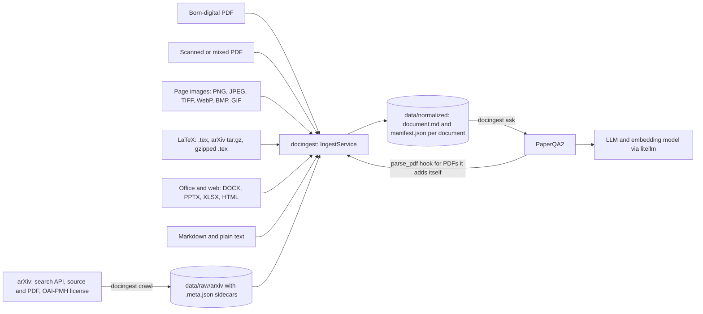
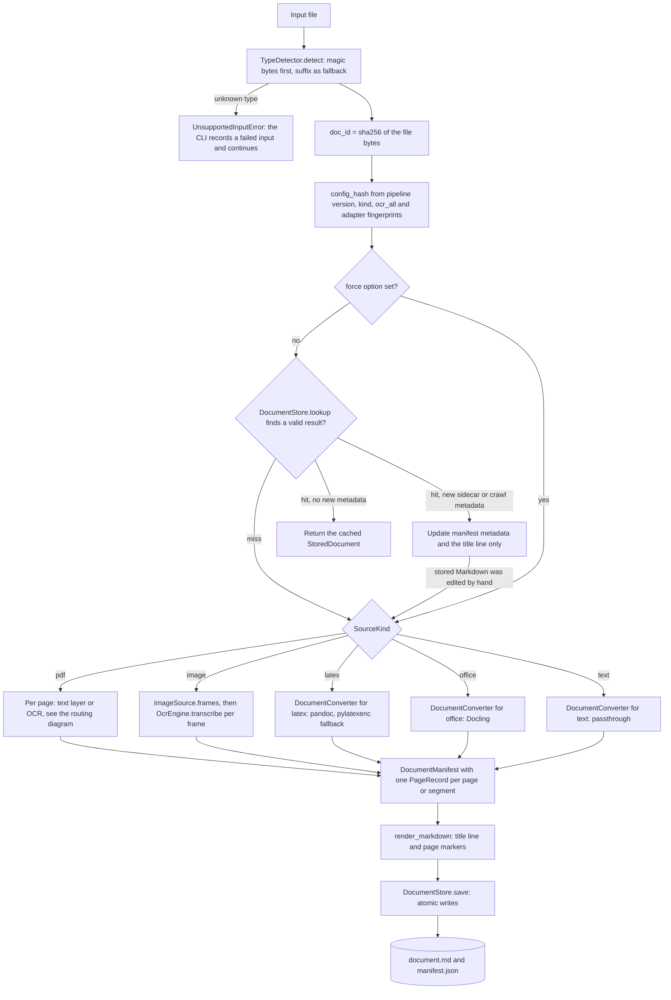
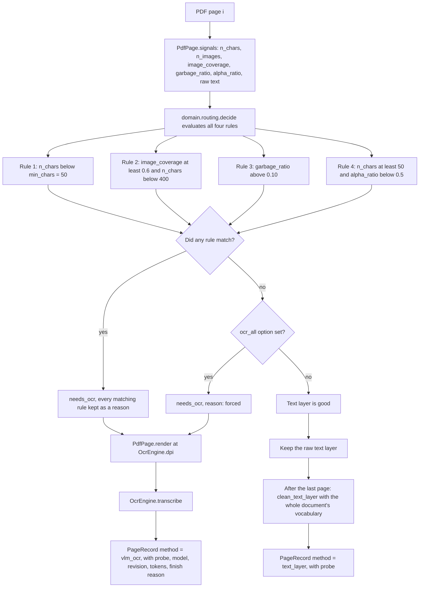
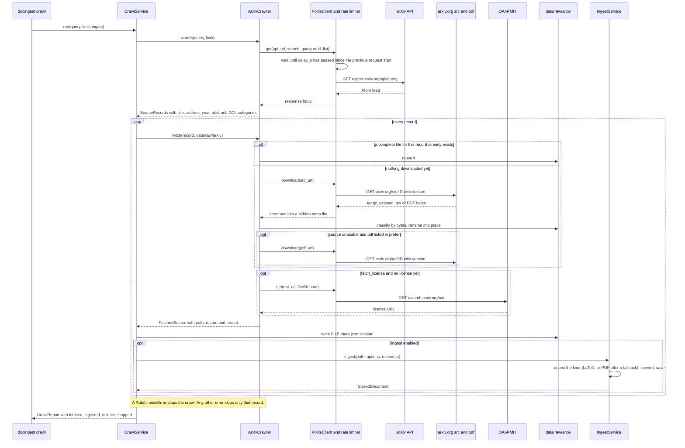
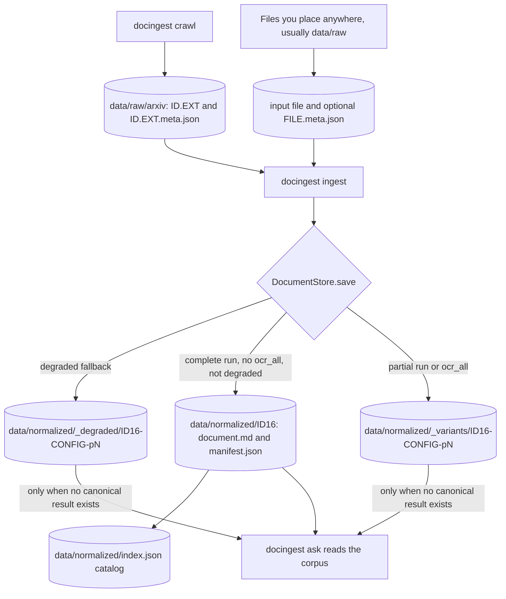
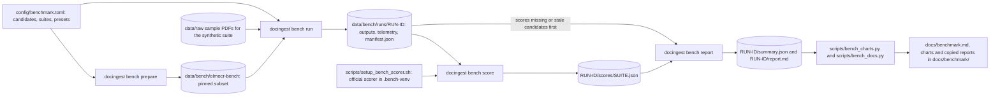
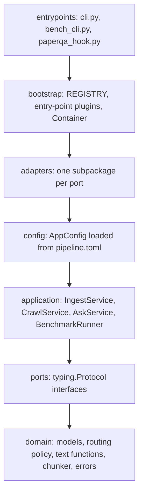

# docingest

Part of the research engine: see the [top-level README](../../README.md) for the other packages.

docingest is a document normalization layer for a research agent. It takes a research document in any of the common formats (born-digital PDF, scanned PDF, page images, arXiv LaTeX source, DOCX, PPTX, XLSX, HTML, Markdown, plain text) and turns it into one canonical form: a Markdown file with page or section markers, plus a JSON manifest that records how every page was produced. [PaperQA2](https://github.com/Future-House/paper-qa), or any other retrieval-augmented agent, reads that canonical form instead of the raw files.

- Scanned pages are transcribed by a vision-language model, either in-process on Apple Silicon (mlx-vlm) or through any OpenAI-compatible vision endpoint (vLLM, LM Studio, Ollama, `mlx_vlm.server`).
- arXiv papers are fetched as LaTeX source, so math, tables and section structure arrive intact instead of being recovered from a rendered PDF.
- Everything is pinned and content-addressed: `uv.lock`, model commits, input checksums, and output directories named after the input's sha256.

Package: `docingest` 0.3.1, Python 3.12, managed with [uv](https://docs.astral.sh/uv/). Source in [`src/docingest/`](src/docingest/README.md).

## Contents

- [What docingest is and why](#what-docingest-is-and-why)
- [Features](#features)
- [How it works](#how-it-works)
  - [System context](#system-context)
  - [The ingestion pipeline](#the-ingestion-pipeline)
  - [Per-page PDF routing](#per-page-pdf-routing)
  - [Inputs and how each is handled](#inputs-and-how-each-is-handled)
  - [LaTeX conversion](#latex-conversion)
  - [arXiv crawl](#arxiv-crawl)
  - [Question answering with PaperQA2](#question-answering-with-paperqa2)
  - [Where files go on disk](#where-files-go-on-disk)
  - [Canonical output format](#canonical-output-format)
  - [Caching and invalidation](#caching-and-invalidation)
  - [Benchmark flow](#benchmark-flow)
- [Quick start](#quick-start)
- [Using docingest from Python](#using-docingest-from-python)
- [CLI overview](#cli-overview)
- [Configuration overview](#configuration-overview)
- [Architecture overview](#architecture-overview)
- [How to extend](#how-to-extend)
- [OCR models and benchmark](#ocr-models-and-benchmark)
- [PaperQA2 integration](#paperqa2-integration)
- [Project layout](#project-layout)
- [Development and quality gates](#development-and-quality-gates)
- [Reproducibility](#reproducibility)
- [Documentation index](#documentation-index)
- [Version history](#version-history)
- [License](#license)

## What docingest is and why

A research agent answers questions from a corpus of papers. The quality of its answers is bounded by the quality of the text it retrieves, and research corpora are messy:

- **Born-digital PDFs** carry a text layer, but it can be broken: bad font encodings produce replacement glyphs, math becomes symbol soup, and line-end hyphenation splits words.
- **Scanned PDFs and page images** have no text at all. Some PDFs are mixed: born-digital pages next to a scanned appendix.
- **arXiv papers** also exist as LaTeX source, which is far better input than the rendered PDF, but it arrives as tar archives with includes, custom macros and several candidate main files.
- **Office and web documents** (DOCX, PPTX, XLSX, HTML) need their own converter.

docingest hides all of that behind a single operation: `ingest(file) -> document.md + manifest.json`. Each PDF page is routed on its own, so the expensive OCR model runs only on pages that need it. Every decision (text layer or OCR, and why; which converter; which model and revision) is written to the manifest, so a citation in an answer can be traced back to how its text was obtained. Outputs are cached by content, and the cache is invalidated automatically when an adapter, model or setting that affects the output changes.

The codebase uses a hexagonal (ports and adapters) architecture, so the OCR model, the OCR runtime, the LaTeX converter, the store, the crawler and the QA engine can each be replaced by editing the configuration or installing a plugin, without changing the use cases. See [docs/architecture.md](docs/architecture.md) and [ADR 0001](docs/adr/0001-hexagonal-architecture.md).

## Features

- **One canonical output for every input type.** `document.md` with `<!-- page N | method=... -->` markers, and `manifest.json` with full provenance ([format](#canonical-output-format)).
- **Per-page OCR routing for PDFs.** Four rules taken from Marker and olmOCR decide per page between the embedded text layer and OCR, and every matching rule is recorded as a reason ([routing](#per-page-pdf-routing), [ADR 0002](docs/adr/0002-per-page-routing-and-content-addressed-cache.md)).
- **Local vision-language OCR.** In-process with mlx-vlm on Apple Silicon, or over HTTP to any OpenAI-compatible server. Per-model profiles set the prompt, input size, output clean-up and generation limits from each model's card, and a retry ladder handles truncated or invalid outputs ([OCR](#ocr-models-and-benchmark)).
- **Document-level de-hyphenation.** A line-end hyphen in the text layer is removed only when the joined word occurs elsewhere in the same document.
- **LaTeX-first arXiv crawler.** Search by arXiv query syntax or by id list, polite rate limiting shared by every request, source-first download with PDF fallback, license lookup through OAI-PMH, and metadata sidecars ([crawl](#arxiv-crawl), [ADR 0003](docs/adr/0003-latex-first-for-arxiv.md)).
- **Robust LaTeX conversion.** Safe archive extraction, arXiv-style main-file detection, a Python flattener for includes, pandoc in `--sandbox` mode with a timeout and heap cap, and a pylatexenc plain-text fallback ([LaTeX](#latex-conversion)).
- **Content-addressed cache.** Outputs are keyed by the input's sha256 and by the fingerprints of the adapters that produce that kind of input. Partial and forced-OCR runs are stored as variants and never replace a complete result ([caching](#caching-and-invalidation)).
- **PaperQA2 integration.** A corpus mode (`docingest ask`) with page-aware chunks, and a native `parse_pdf` hook for PaperQA2's own `Docs.aadd` ([PaperQA2](#paperqa2-integration)).
- **Replaceable components.** Every pipeline port has a named slot in `[adapters]` (benchmark suites are declared in `config/benchmark.toml` instead), third-party adapters plug in through Python entry points, and five import-linter contracts enforce the layering in CI ([architecture](#architecture-overview)).
- **Reproducible OCR benchmark.** `docingest bench` runs every configured candidate model on two suites, resumably, and reports comparisons with clustered bootstrap confidence intervals ([benchmark flow](#benchmark-flow), [docs/benchmark.md](docs/benchmark.md)).

## How it works

### System context

The diagram shows what enters docingest, what it produces, and who consumes it. Files can be ingested from any path; the arXiv crawler downloads into `data/raw/arxiv/` first. PaperQA2 either reads the normalized store (`docingest ask`) or calls docingest directly through the `parse_pdf` hook.



### The ingestion pipeline

`IngestService.ingest` in [`application/ingest.py`](src/docingest/application/README.md) turns one file into one stored result. The diagram follows a file from disk to `document.md` and `manifest.json`, including the cache check. Where a port or a function does the work, the box names it.



Step by step:

1. **Detect.** `MagicBytesDetector` reads the first 1024 bytes and returns a `SourceKind` (`pdf`, `image`, `office`, `latex`, `text`) and a MIME type. Magic bytes win over the suffix, because extensions lie.
2. **Identify.** `doc_id` is the sha256 of the raw bytes. The same file under another name is the same document.
3. **Key the cache.** `config_hash` covers everything that can change this kind's output and nothing else (see [Caching and invalidation](#caching-and-invalidation)).
4. **Metadata.** Bibliographic metadata comes from the caller (the crawler passes it), else from an optional sidecar `<file>.meta.json` next to the input, else, after conversion, from the converter (of the built-in converters only the pandoc LaTeX converter returns metadata: title, authors and abstract).
5. **Look up.** Unless `--force` is given, the store returns a cached result that is valid for these run options. If only the metadata changed, the manifest and the Markdown title line are updated without re-processing. If the stored `document.md` no longer starts with the title line docingest wrote (it was edited by hand, or cannot be read), the document is processed again instead.
6. **Convert.** PDFs are routed per page, images are OCRed frame by frame, and LaTeX, office and text files go to the `DocumentConverter` configured for their kind. Converters are built lazily, so Docling or pandoc load only when such a document appears.
7. **Record.** A `DocumentManifest` is assembled with one `PageRecord` per page or segment.
8. **Save.** `render_markdown` writes the title line and page markers, and `DocumentStore.save` writes both files atomically to a canonical, variant or degraded location (see [Where files go on disk](#where-files-go-on-disk)).

### Per-page PDF routing

Each PDF page is measured by `PdfPage.signals()` (pypdfium2) and judged by the pure function `domain.routing.decide`. The diagram shows the decision for one page. All four rules are evaluated, every rule that matches is recorded in the manifest as a reason, and the page goes to OCR when at least one matches or when `--ocr-all` is set.



The thresholds live in `[routing]` of [`config/pipeline.toml`](config/README.md) and are part of the PDF cache key:

| Key | Default | The page goes to OCR when | Origin |
|---|---|---|---|
| `min_chars` | `50` | it has fewer than 50 embedded non-space characters | Marker, olmOCR |
| `image_coverage` | `0.6` | image objects cover at least 60% of the page... | Marker |
| `image_coverage_max_chars` | `400` | ...and it has fewer than 400 characters | Marker |
| `max_garbage_ratio` | `0.10` | more than 10% of its characters are broken glyphs | Marker `detect_bad_ocr` |
| `min_alpha_ratio` | `0.5` | it has at least `min_chars` characters but fewer than 50% of them are letters | olmOCR filter |

How the signals are measured (`adapters/pdf/pdfium.py`, `domain/text.py`):

- `image_coverage` is the area of image objects, measured in page space (including nested Form XObjects and rotated or offset page boxes) and clipped to the visible page box, divided by the page area.
- `garbage_ratio` counts U+FFFD replacement characters, control characters, private-use characters and `(cid:N)` sequences among the non-space characters. pdfium's soft-hyphen marker (U+0002) is not counted.
- `alpha_ratio` is the share of letters among the non-space characters.

When `--ocr-all` is set and no rule matched, the recorded reason is `forced (--ocr-all)`. Text-layer pages are cleaned after the whole document has been read: pdfium turns a line-end hyphen into U+0002, and the two halves are joined only when the joined word appears elsewhere in the document, otherwise the hyphen is kept.

### Inputs and how each is handled

| Input | Detected by | Port (`[adapters]` key) and adapter | Page or segment method |
|---|---|---|---|
| Born-digital PDF | `%PDF-` header | `pdf`: pypdfium2 | `text_layer`, with document-level de-hyphenation |
| Scanned or garbled PDF page | routing rules on the page signals | `ocr`: mlx-vlm or openai-compatible | `vlm_ocr` |
| Mixed PDF | per page | both of the above | chosen per page, with the reasons recorded |
| PNG, JPEG, TIFF, GIF, WebP, BMP | magic bytes | `images`: Pillow, then `ocr` | `vlm_ocr`, one page per frame (multi-page TIFF gives several) |
| LaTeX `.tex` / `.ltx`, arXiv `.tar.gz`, plain `.tar`, single gzipped `.tex` | suffix, gzip and tar header sniffing | `latex`: pandoc | `latex` (one segment per section), or `latex_plaintext` fallback |
| DOCX, PPTX, XLSX, HTML (`.html`, `.htm`), XHTML | suffix | `office`: Docling (`office` extra) | `docling`, one segment |
| Markdown (`.md`, `.markdown`), text (`.txt`) | suffix | `text`: passthrough | `passthrough`, one segment |

Detection details worth knowing:

- A `.tex`, `.ltx`, `.md`, `.markdown` or `.txt` file that happens to start with a `%PDF-` comment line keeps its LaTeX or text kind (it is not taken for a PDF) as long as its first 1024 bytes decode as UTF-8 and contain no NUL byte.
- Images are recognised by their magic bytes only; the suffix alone does not make a file an image.
- A gzip file is opened to look inside: a tar is a source archive, a gzipped PDF is refused with "gunzip it first", PostScript or HTML is refused, and anything else is treated as a single gzipped `.tex` (the same rule the arXiv crawler uses).
- Any other file raises `UnsupportedInputError`; `docingest ingest` reports it and carries on with the next input.

### LaTeX conversion

The `pandoc` adapter ([`adapters/converters/`](src/docingest/adapters/converters/README.md)) accepts a `.tex` file, an arXiv source archive or a single gzipped `.tex`. pandoc is not trusted with the file system (it resolves includes against its working directory, drops non-UTF-8 includes, can loop forever on self-referential macros, and reads any path it is given), so the preparation happens in Python first:

1. **Safe extraction.** Only regular files are extracted, with tarfile's `data` filter. Links, devices, figures, media and nested archives are skipped. The unpacked size is capped by `[latex].max_archive_mb` (200) and the member count by 20,000; the cap is checked while headers are read, so an archive bomb is refused early.
2. **Main-file detection.** arXiv's `00README.json` (`usage: toplevel`) or legacy `00README.XXX` first; then files that contain both `\documentclass` and `\begin{document}`; then the conventional names `main`, `ms`, `paper`, `article`; then the file no other file includes; then the largest.
3. **Flattening.** `\input`, `\include`, `\subfile` and the `import` package commands are inlined with cycle protection, a depth limit of 20 and no reads outside the source root. Each file is decoded as UTF-8, and bytes that are not UTF-8 as cp1252 (or latin-1). Comments are stripped, macro definitions from local `.sty` files are kept, self-referential or structural macro redefinitions are dropped, and a `.bbl` with `thebibliography` is inlined as the references section.
4. **pandoc.** The bundled pandoc (from `pypandoc-binary`, pinned by `uv.lock`, or `[latex].pandoc_path`) runs with `--sandbox`, a heap cap (`+RTS -M2g`) and the `[latex].timeout_s` wall-clock limit (120 s). Its Markdown profile keeps `$...$` and `$$...$$` math, pipe tables and `[@cite]` keys.
5. **Segments.** The Markdown is split at headings up to `[latex].split_level` (2). Each segment is titled with its heading path (for example `Model > Attention`), the abstract comes first, and title, authors and abstract become the document metadata.
6. **Fallback.** If pandoc fails, times out or keeps less than 20% of the source's text, and `[latex].fallback` is true, pylatexenc produces plain text with the math kept verbatim (method `latex_plaintext`); it is used when it yields more text than pandoc did, otherwise pandoc's short output is kept with a warning. If neither produced any text, the conversion fails with `ConversionError`. When the cause was the machine rather than the document (timeout, signal, heap exhaustion, no pandoc binary), the result is marked degraded: it is stored under `_degraded/`, never served from the cache, and the next run retries pandoc.

### arXiv crawl

`docingest crawl` runs `CrawlService` with the `arxiv` adapter ([`adapters/sources/arxiv.py`](src/docingest/adapters/README.md)). The sequence diagram shows one crawl: a search, then for every record a download, a license lookup, a metadata sidecar and an ingest. All HTTP requests go through one `PoliteClient`, which serializes them and enforces the rate limit.



What the crawler guarantees:

- **Queries.** arXiv query syntax (`cat:cs.CL AND ti:retrieval`, `au:Shannon`) or an id list (`ids:1706.03762,2409.13740`). Ids may carry an `arXiv:` prefix or be abs/pdf URLs.
- **Politeness.** At least `[arxiv].delay_s` (3.0 s, as the arXiv API terms require) between request starts, one request in flight, `[arxiv].retries` (3) retries on HTTP 406 (an intermittent arXiv CDN response), 429, 500, 502, 503 and 504, network errors and truncated bodies, with exponential backoff or the server's `Retry-After`, and a User-Agent `docingest/<version> (+research ingestion)` that includes `mailto:` when `[arxiv].contact` is set. A `Retry-After` longer than 300 s, or retries exhausted while still told to back off, raises `RateLimitedError`, which stops the whole crawl and reports the remaining records as not attempted.
- **LaTeX first.** The source URL serves whatever the authors submitted. The saved file is classified from its bytes: `<id><version>.tar.gz` or `.tar` (`latex-archive`), `.tex.gz` or `.tex` (`latex`), or `.pdf` for PDF-only submissions. The PDF URL is the fallback, in the order given by `[arxiv].prefer` (`["latex", "pdf"]`).
- **Atomic, reusable downloads.** Files are streamed to a hidden `.part` file and renamed into place, so a visible file is always complete and is reused on the next crawl. When a lower-preference format was saved only because the preferred one failed transiently, a hidden `.<id><version>.fallback` marker makes the next crawl try the preferred format again.
- **Metadata and license.** Title, authors, year, abstract, DOI, categories and URL come from the Atom API; the license comes from OAI-PMH `GetRecord`. They are written to `<file>.meta.json`, passed to the ingest, stored in the manifest and used for PaperQA2 citations, for example `Vaswani et al. (2017). Attention Is All You Need. arXiv:1706.03762v7`. A failed license lookup never erases a license recorded by an earlier crawl.
- **Licensing.** arXiv metadata is CC0, but e-prints may not be redistributed without the copyright holder's permission. `data/raw/` is git-ignored and every paper's license is recorded.

### Question answering with PaperQA2

PaperQA2 can consume docingest in two ways. The diagram shows both: corpus mode, where `docingest ask` feeds the whole normalized store to PaperQA2, and hook mode, where PaperQA2's own `Docs.aadd` calls docingest to parse each PDF.

```mermaid
flowchart TD
    subgraph corpus["Corpus mode: docingest ask"]
        Q["Question"] --> AS["AskService.ask"]
        AS --> CO["DocumentStore.corpus: canonical result, else the variant or degraded result with the most pages, with warnings"]
        CO --> SP["split_pages on each document.md"]
        SP --> CH["paperqa chunk_pdf: page-aware chunks of chunk_chars with overlap"]
        CH --> TW["Re-split chunks longer than the pinned embedder's token window"]
        TW --> AT["Docs.aadd_texts with the citation from the manifest"]
        AT --> AQ["Docs.aquery with the configured LLM"]
        AQ --> ANS["Formatted answer citing page ranges"]
    end
    subgraph hook["Hook mode: PaperQA2 drives"]
        PA["PaperQA2 Docs.aadd of a PDF"] --> PP["settings.parsing.parse_pdf = parse_pdf_to_pages"]
        PP --> IS["IngestService.ingest, same routing and cache as the CLI"]
        IS --> PT["ParsedText with one entry per page"]
        PT --> PQ["PaperQA2 chunks, embeds and answers with its own settings"]
        IS -->|"DocumentOpenError"| IPE["ImpossibleParsingError, PaperQA2 skips the file"]
    end
```



The PaperQA2 index is built in memory on every `ask` call; nothing from it is written to disk. Usage and settings are in [PaperQA2 integration](#paperqa2-integration).

### Where files go on disk

All paths are relative to the working directory (run from the package folder, `packages/docingest`). The diagram shows where a crawl, an ingest and an ask read and write, and how the store chooses between the canonical, variant and degraded locations.



In the names above, `ID16` is the first 16 hex characters of the input's sha256, `CONFIG` is the 12-character `config_hash`, and `pN` is `p` followed by the `--max-pages` value, or `pall` for a run over all pages. When a document has no canonical result, `docingest ask` uses whichever of its variant and degraded results has the most pages, and prints a warning that only a partial run or only a degraded conversion exists.

```
data/
  raw/                                     inputs (git-ignored)
    attention_1706.03762.pdf               sample corpus from scripts/fetch_samples.sh
    <file>.meta.json                       optional SourceMetadata sidecar for any input
    arxiv/                                 downloads of docingest crawl
      1706.03762v7.tar.gz                  source archive (or .tex.gz, .tar, .tex, .pdf)
      1706.03762v7.tar.gz.meta.json        metadata and license sidecar
      .1706.03762v7.fallback               hidden marker: retry the preferred format next time
  samples/                                 small demo inputs (only some are tracked)
  normalized/                              output_dir (git-ignored)
    index.json                             catalog of canonical documents with citations
    <sha256[:16]>/                         canonical result: complete run, default options
      document.md
      manifest.json
      ocr_eval.json                        only after docingest eval-ocr
    _variants/<sha256[:16]>-<config_hash>-p<N or all>/   partial (--max-pages) or --ocr-all runs
    _degraded/<sha256[:16]>-<config_hash>-p<N or all>/   environment-caused fallbacks
  bench/                                   benchmark data (git-ignored)
    olmocr-bench/<subset>/                 pinned olmOCR-Bench subset
    runs/<run-id>/                         one benchmark run
```

When `docingest ingest` walks a directory it skips hidden files (names starting with `.`), such as the crawler's `.part` downloads and `.fallback` markers. The sidecars `*.meta.json` and `*.truth.json` are never treated as documents, even when named on the command line.

### Canonical output format

`document.md` starts with a `# title` line, followed by one marker per page (PDF, image) or segment (LaTeX section, office file, text file):

```markdown
# Attention Is All You Need

<!-- page 1 | method=text_layer -->
Text of page 1 ...

<!-- page 2 | method=vlm_ocr -->
Markdown transcription of page 2 ...
```

`docingest.domain.text.split_pages` parses it back into `{page number: text}`. The title is the metadata title if there is one, else the title found by the PDF reader or converter, else the file name without its suffix.

`manifest.json` is a serialized `DocumentManifest` ([`domain/models.py`](src/docingest/domain/README.md)):

| Field | Meaning |
|---|---|
| `doc_id` | sha256 of the input bytes |
| `source_path`, `source_name`, `source_kind`, `mime`, `size_bytes` | what was ingested |
| `n_pages`, `source_pages` | pages or segments processed in this run, and in the source; `n_pages < source_pages` means a partial run |
| `max_pages`, `ocr_all` | run options, recorded for provenance |
| `pages` | one `PageRecord` per page or segment: `index`, `method`, `n_chars`, `seconds`, `engine`, `title` (section title), `probe` (routing signals, `needs_ocr`, `reasons`), and for OCR pages `model`, `model_revision`, `gen_tokens`, `finish_reason` |
| `pipeline_version`, `config_hash` | cache identity |
| `ocr_model` | `repo_id` and `revision` of the OCR model, when any page used OCR |
| `title`, `metadata` | title and `SourceMetadata` (title, authors, year, abstract, doi, arxiv_id, version, url, license, categories) |
| `created_at`, `total_seconds` | timing |

`data/normalized/index.json` maps each canonical `doc_id` to its source name, title, kind, page count, OCR page count, directory and citation.

### Caching and invalidation

- **Document identity.** `doc_id` is the sha256 of the input's bytes; the canonical directory is its first 16 hex characters.
- **Cache key.** `config_hash` is the first 12 hex characters of the sha256 of the pipeline version (`0.3.1`), the source kind, the `ocr_all` flag and the fingerprints of the adapters that produce that kind:

  | Kind | Parts of `config_hash` besides version, kind and `ocr_all` |
  |---|---|
  | `pdf` | the `[routing]` policy, the PDF reader fingerprint, the OCR engine fingerprint |
  | `image` | the image source fingerprint (`pillow <version>`), the OCR engine fingerprint |
  | `latex`, `office`, `text` | the fingerprint of the converter configured for that kind |

- **Fingerprints.** Each adapter exposes a `fingerprint` with its name, version and output-relevant settings. For the OCR adapters that is the model and revision, profile and its `code_version` (bumped when its clean-up code changes), prompt, image size, DPI, generation settings and retry ladder, plus the mlx-vlm version (`mlx-vlm`) or the server URL and served model name (`openai-compatible`); transport settings such as the timeout, the retry count and the API key are excluded. For pandoc it is the adapter revision, the pandoc version, its arguments, `split_level` and the fallback. Changing any of them re-processes exactly the documents of the affected kind.
- **Lookup rules.** A complete canonical result with the same `config_hash` and `ocr_all` satisfies both a default run and a `--max-pages` run. A `--max-pages` or `--ocr-all` run otherwise looks for its own variant. Degraded results are never returned by a lookup, so the next run retries the real conversion.
- **Metadata refresh.** When a cached result is found but a sidecar or the crawler brings new metadata, only the manifest's metadata and the title line are updated, without re-running OCR or pandoc.
- **Forcing.** `--force` ignores the cache for that run.

### Benchmark flow

The benchmark compares OCR candidates (model, profile and settings) on the same pages. The diagram shows the path from the configuration to the published comparison; `bench run` also builds missing suite data itself, so `bench prepare` is optional: it downloads the data and checks that the samples load ahead of a run. Results, methodology and statistics are in [docs/benchmark.md](docs/benchmark.md).



## Quick start

Prerequisites:

- [uv](https://docs.astral.sh/uv/getting-started/installation/). uv installs Python 3.12 from `.python-version` if needed.
- macOS on Apple Silicon for in-process OCR and the local QA server (mlx-vlm). On Linux, mlx-vlm is skipped by its platform marker and OCR goes to an OpenAI-compatible server instead (`[adapters] ocr = "openai-compatible"`, see [`config/examples/remote-ocr.toml`](config/examples/remote-ocr.toml)). `uv.lock` resolves for Apple Silicon macOS and Linux only.
- `curl` and `shasum` for the sample script. pandoc is bundled by `pypandoc-binary`; no system install is needed.

Model weights are downloaded into the Hugging Face cache the first time they are needed. The OCR model is loaded only when a page or image actually goes to OCR: PDFs whose pages all have a good text layer, LaTeX, office and text files never load it.

1. Clone and install. The extras are `mlx` (Apple Silicon OCR), `qa` (PaperQA2) and `office` (Docling).

   ```bash
   git clone https://github.com/etxsA/research-engine.git
   cd research-engine/packages/docingest
   uv sync --locked --all-extras
   ```

2. Download the sample corpus: three arXiv PDFs and a scanned 1948 paper into `data/raw/` (verified against `scripts/samples.sha256`), and one arXiv HTML page into `data/samples/`. Files already present are not downloaded again. See [scripts/README.md](scripts/README.md).

   ```bash
   ./scripts/fetch_samples.sh
   ```

3. Ingest. Directories are walked recursively. `--max-pages N` gives a quick look (stored as a variant when the document has more than N pages); the scanned paper goes through OCR page by page and is the slow part of a full run.

   ```bash
   uv run docingest ingest data/raw --max-pages 2
   uv run docingest ingest data/raw
   uv run docingest ingest data/samples/shannon_page3.png      # image input, OCR
   uv run docingest ingest data/samples/paperqa2_arxiv.html    # HTML, Docling
   ```

4. Crawl arXiv: search, download the LaTeX source, and ingest it.

   ```bash
   uv run docingest crawl 'cat:cs.CL AND ti:retrieval' --limit 5
   uv run docingest crawl 'ids:1706.03762,2409.13740'
   uv run docingest crawl 'au:Shannon' --no-ingest            # download only
   ```

5. Ask a question. The default LLM is the pinned Qwen3-VL snapshot served locally by `scripts/serve_llm.sh` on `127.0.0.1:8080`.

   ```bash
   ./scripts/serve_llm.sh &
   uv run docingest ask "What are the main failure modes of retrieval-augmented generation?"
   ```

   To use Ollama instead: `ollama pull llama3.1 && ollama pull mxbai-embed-large`, then add `--config config/examples/ollama-qa.toml` to the `ask` command.

6. Inspect the wiring and try the OCR evaluation on a simulated scan. `make-scan` is deterministic, so this reproduces the scan whose ground truth (`attention_scanned.truth.json`) is tracked in `data/samples/`:

   ```bash
   uv run docingest adapters
   uv run docingest make-scan data/raw/attention_1706.03762.pdf data/samples/attention_scanned.pdf --pages 2,3
   uv run docingest eval-ocr data/samples/attention_scanned.pdf
   ```

Results are in `data/normalized/<sha256[:16]>/document.md` and `manifest.json`; the CLI prints the output directory of every document and a summary table.

## Using docingest from Python

The CLI is a thin layer over the use cases, which are wired by `Container` in [`bootstrap.py`](src/docingest/README.md). The same objects can be used directly. Run from the package folder (`packages/docingest`), since the paths in the configuration are relative.

```python
from pathlib import Path

from docingest.application.ingest import IngestOptions
from docingest.bootstrap import Container
from docingest.config import load_config
from docingest.domain.text import split_pages

container = Container(load_config())  # config/pipeline.toml; or load_config(Path("my.toml"))
service = container.ingest

stored = service.ingest(Path("data/raw/attention_1706.03762.pdf"), IngestOptions(max_pages=3))
print(stored.location, stored.canonical)   # output directory; True only for a complete result
print(stored.manifest.citation())
for page in stored.manifest.pages:
    print(page.index + 1, page.method.value, page.probe.reasons if page.probe else [])

pages = split_pages(service.store.markdown(stored))   # {1: "text of page 1", ...}

documents, warnings = container.adapter("store").corpus()   # the whole normalized corpus
```

`IngestOptions` has three fields: `force`, `ocr_all` and `max_pages` (at least 1 when set). With `max_pages`, a complete canonical result that is already stored satisfies the request, so `stored.canonical` is `True` in that case; otherwise the partial run is saved as a variant and `stored.canonical` is `False`. `IngestService.ingest(path, options, metadata)` also accepts a `SourceMetadata` to attach to the document. For tests and notebooks, `Container(cfg, overrides={"ocr": my_engine})` replaces any adapter without touching the configuration.

## CLI overview

`uv run docingest --help` lists the commands, and `uv run docingest <command> --help` shows every option. Every command that reads the pipeline configuration (`ingest`, `crawl`, `ask`, `adapters`, `model-path`, `eval-ocr`) takes `--config/-c`. Without it, the repository's `config/pipeline.toml` is used (located from the package, not from the working directory; built-in defaults apply if that file is missing); a `--config` path that does not exist is an error. Full reference: [src/docingest/entrypoints/README.md](src/docingest/entrypoints/README.md).

| Command | What it does | Main options |
|---|---|---|
| `docingest ingest PATHS...` | Normalize files and directories into Markdown plus manifest. Exits with status 1 if any input failed, after processing the others. | `--force`, `--ocr-all`, `--max-pages N` |
| `docingest crawl QUERY` | Search arXiv, download sources (PDF fallback) with metadata, then ingest them. Exits with status 1 on any failure. | `--limit` (default 5), `--no-ingest`, `--max-pages N` |
| `docingest ask QUESTION` | Answer a question with PaperQA2 over the normalized corpus. Needs the `qa` extra. | `--config` |
| `docingest adapters` | List every port, its selected adapter and the available ones, including installed plugins. | `--config` |
| `docingest model-path [ROLE]` | Print the local snapshot path of the pinned `llm` (default), `embedding` or `ocr` model, downloading it if it is not cached. Used by `scripts/serve_llm.sh`. | `--config` |
| `docingest make-scan SRC OUT` | Rasterize and degrade born-digital pages into an image-only PDF, with the cleaned text layer as ground truth in a `.truth.json` file next to `OUT` (same name, suffix replaced). Does not read the pipeline configuration. | `--pages` (0-based, comma separated, default `0`), `--dpi` (default 150) |
| `docingest eval-ocr SCANNED_PDF` | Ingest a `make-scan` PDF, score each page against the `.truth.json` next to it (CER, WER, word F1, char-3-gram F1), and write `ocr_eval.json` into the result's directory. | `--force` |
| `docingest bench prepare` | Download or build the suite data and check that samples load. | `--suite`, `--preset`, `--per-category` |
| `docingest bench run` | Transcribe every suite sample with every candidate; resumable. | `--run-id` (required), `--suite`, `--candidates`, `--preset`, `--per-category`, `--time-budget`, `--retry-errors` |
| `docingest bench score` | Score a run's outputs into `scores/<suite>.json` (olmOCR-Bench with the official scorer). | `--run-id` (required), `--suite`, `--candidates` |
| `docingest bench report` | Write `summary.json` and `report.md` for a run, scoring whatever is missing or stale first. | `--run-id` (required), `--rescore`, `--resamples` (default 10000), `--seed` (default 0) |
| `docingest bench candidates` | List the configured candidates. | `--config` (default `config/benchmark.toml`) |

Every `bench` command takes `--config/-c` pointing at a benchmark file (default: the repository's `config/benchmark.toml`), not at the pipeline configuration; the benchmark file names its own base pipeline configuration in `pipeline_config`.

## Configuration overview

The pipeline reads one TOML file, [`config/pipeline.toml`](config/pipeline.toml) by default. A file given with `--config` replaces it entirely (it is not merged); sections it omits take the defaults in [`config.py`](src/docingest/README.md). Unknown keys in `[adapters]`, `[routing]`, `[ocr]`, `[qa]`, `[latex]` and `[arxiv]` are rejected, and unknown top-level sections are kept so that plugins can read their own settings. Relative paths inside the file (`output_dir`, `raw_dir`) are resolved against the working directory, so run docingest from the package folder (`packages/docingest`). Full reference: [config/README.md](config/README.md).

| Section | Controls | Examples | Affects the cache key |
|---|---|---|---|
| top level | where outputs and crawls go | `output_dir = "data/normalized"`, `raw_dir = "data/raw"` | no |
| `[adapters]` | which adapter plugs into each port | `ocr = "mlx-vlm"` or `"openai-compatible"` | yes, through the adapters' fingerprints |
| `[routing]` | per-page OCR thresholds | `min_chars = 50`, `image_coverage = 0.6` | yes, for PDFs |
| `[ocr]` | OCR model and generation | `repo_id`, `revision` (a commit sha of that repo, required unless `repo_id` is the built-in default), `profile`, `dpi = 150`, `temperature = 0.0`, optional overrides `prompt`, `max_side`, `max_tokens`, `repetition_penalty`; for HTTP: `base_url`, `served_model`, `api_key_env`, `timeout_s = 600`, `retries = 3` | yes, through the selected OCR adapter's fingerprint (`timeout_s`, `retries` and `api_key_env` excluded) |
| `[qa]` | PaperQA2 | `llm`, `llm_base`, `embedding`, `embedding_repo_id`, `embedding_revision`, `chunk_chars = 900`, `overlap = 100`, `evidence_k = 10`, `answer_max_sources = 3`, `max_concurrent_requests = 2`, `temperature = 0.0` | no |
| `[latex]` | LaTeX conversion | `timeout_s = 120`, `max_archive_mb = 200`, `split_level = 2`, `fallback = true`, `pandoc_path` | `split_level`, `fallback` and the pandoc version |
| `[arxiv]` | crawler | `delay_s = 3.0`, `timeout_s = 60.0`, `retries = 3`, `contact`, `prefer = ["latex", "pdf"]`, `fetch_license = true`, plus the endpoint URLs | no |

Ready-made alternatives in [`config/examples/`](config/README.md):

- `remote-ocr.toml`: OCR through an OpenAI-compatible endpoint instead of in-process MLX.
- `ollama-qa.toml`: PaperQA2 answers with `ollama/llama3.1` and `ollama/mxbai-embed-large`.

The benchmark has its own file, [`config/benchmark.toml`](config/benchmark.toml): candidates, suites, presets (`smoke`, `screen`, `deep`) and scoring options.

### Environment variables

| Variable | Read by | Effect |
|---|---|---|
| `DOCINGEST_LLM` | `docingest ask` | A litellm model string that overrides `[qa].llm`. |
| `DOCINGEST_LLM_SERVE_MODEL` | `scripts/serve_llm.sh` | The model to serve (a local snapshot path or a model id) instead of the output of `docingest model-path llm`. `docingest ask` does not read it. |
| `DOCINGEST_EMBEDDING` | `docingest ask` | A PaperQA2 embedding string that overrides `[qa].embedding` and the pinned embedder. |
| `OPENAI_API_KEY` | `docingest ask` (PaperQA2 through litellm) | Used for a custom `openai/...` LLM in `[qa].llm` or `DOCINGEST_LLM`; when it is unset, the placeholder key `sk-local` is sent. The default local model always uses `sk-local`. |
| `PORT` | `scripts/serve_llm.sh` | Port of the local LLM server (default 8080; change `[qa].llm_base` to match). |
| the name set in `[ocr].api_key_env` | openai-compatible OCR adapter | Bearer key for an authenticated OCR server. The configuration holds the variable's name, never the key. |
| `DOCINGEST_BENCH_SCORER_PYTHON`, `DOCINGEST_BENCH_PLAYWRIGHT_BROWSERS`, `DOCINGEST_BENCH_SCORER_HOME` | `docingest bench` | Override the scorer paths from `config/benchmark.toml`. |
| `DOCINGEST_BENCH_VENV` | `scripts/setup_bench_scorer.sh` | Location of the scorer venv (default `.bench-venv`). |
| `DOCINGEST_MODEL_TESTS`, `DOCINGEST_NETWORK_TESTS`, `DOCINGEST_LATEX_SAMPLES` | tests | Enable opt-in tests (see [Development](#development-and-quality-gates)). |

## Architecture overview

docingest is organised in layers, from the pure domain at the center to the entrypoints at the edge. An arrow means "may import": outer layers import inner ones, never the reverse. The diagram mirrors the `layers` contract in `pyproject.toml`.



| Layer | Package | Contains | README |
|---|---|---|---|
| Domain | `docingest.domain` | `DocumentManifest`, `PageRecord`, `SourceMetadata`, `RoutingPolicy` and `decide`, text cleanup and Markdown (de)serialization, page-aware chunking, errors. Standard library and pydantic only. | [domain](src/docingest/domain/README.md) |
| Ports | `docingest.ports` | `typing.Protocol` interfaces, all `@runtime_checkable`, plus their data classes. Adapters satisfy them by shape, without subclassing. | [ports](src/docingest/ports/README.md) |
| Application | `docingest.application` | Use cases (`ingest`, `crawl`, `ask`, `benchmark`), OCR metrics and statistics. Depends on the domain and the ports, never on adapters or on I/O and model libraries (numpy is used for the statistics). | [application](src/docingest/application/README.md) |
| Config | `docingest.config` | pydantic settings for every section of `pipeline.toml`. | [package](src/docingest/README.md) |
| Adapters | `docingest.adapters.*` | One subpackage per port; adapters do not import each other (the shared Hugging Face resolver excepted). | [adapters](src/docingest/adapters/README.md) |
| Composition root | `docingest.bootstrap` | Maps `[adapters]` names to factories, discovers plugins, builds the `Container`. | [package](src/docingest/README.md) |
| Entrypoints | `docingest.entrypoints` | The typer CLI, the benchmark CLI and the PaperQA2 hook. | [entrypoints](src/docingest/entrypoints/README.md) |

Ports and their built-in adapters:

| `[adapters]` key | Port | Built-in name: class | Module |
|---|---|---|---|
| `detector` | `TypeDetector` | `magic`: `MagicBytesDetector` | `adapters/detection/magic.py` |
| `pdf` | `PdfReader` | `pdfium`: `PdfiumReader` | `adapters/pdf/pdfium.py` |
| `ocr` | `OcrEngine` | `mlx-vlm`: `MlxVlmOcr`; `openai-compatible`: `OpenAICompatibleOcr` | [`adapters/ocr/`](src/docingest/adapters/ocr/README.md) |
| `images` | `ImageSource` | `pillow`: `PillowImageSource` | `adapters/images/pillow.py` |
| `latex` | `DocumentConverter` | `pandoc`: `PandocLatexConverter` | [`adapters/converters/`](src/docingest/adapters/converters/README.md) |
| `office` | `DocumentConverter` | `docling`: `DoclingConverter` | [`adapters/converters/`](src/docingest/adapters/converters/README.md) |
| `text` | `DocumentConverter` | `passthrough`: `PassthroughConverter` | [`adapters/converters/`](src/docingest/adapters/converters/README.md) |
| `store` | `DocumentStore` | `filesystem`: `FilesystemStore` | `adapters/store/filesystem.py` |
| `crawler` | `SourceCrawler` | `arxiv`: `ArxivCrawler` | `adapters/sources/arxiv.py` |
| `qa` | `QuestionAnswerer` | `paperqa`: `PaperQAAnswerer` | `adapters/qa/paperqa.py` |
| `embedder`, `index`, `reranker` | `Embedder`, `ChunkIndex`, `Reranker` | `none`: `NoEmbedder`, `NoIndex`, `NoReranker` (the defaults; real ones come from plugins) | `adapters/retrieval/none.py` |
| set in `config/benchmark.toml` | `BenchmarkSuite` | `synthetic`: `SyntheticSuite`; `olmocr-bench`: `OlmOcrBenchSuite` | `adapters/datasets/` |

The layering is enforced by five import-linter contracts that run in CI (`uv run lint-imports`): inward-only layers, independent adapter subpackages, a pure domain, an application layer free of concrete libraries, and adapters imported only by `bootstrap` and `entrypoints`. Adapter modules are imported lazily inside their factories, so heavy optional dependencies (mlx-vlm, Docling, PaperQA2) load only when that adapter is selected and used.

Details: [docs/architecture.md](docs/architecture.md), [ADR 0001](docs/adr/0001-hexagonal-architecture.md), [ADR 0002](docs/adr/0002-per-page-routing-and-content-addressed-cache.md), [ADR 0003](docs/adr/0003-latex-first-for-arxiv.md).

## How to extend

The contribution workflow, the full procedures and the review checklist are in [CONTRIBUTING.md](CONTRIBUTING.md); the adapter contract is in [src/docingest/adapters/README.md](src/docingest/adapters/README.md). Where each common change goes:

| I want to | Where | Read |
|---|---|---|
| Use another OCR model | `[ocr] repo_id`, `revision` and `profile` in `pipeline.toml` | [OCR adapters](src/docingest/adapters/ocr/README.md) |
| Support a model that needs its own prompt or clean-up | a new `OcrProfile` in `PROFILES`, `adapters/ocr/profiles.py` | [OCR adapters](src/docingest/adapters/ocr/README.md) |
| Run OCR on a GPU server | `[adapters] ocr = "openai-compatible"` and `[ocr] base_url` | [config](config/README.md) |
| Compare a model against the others | a `[[candidates]]` entry in `config/benchmark.toml` | [docs/benchmark.md](docs/benchmark.md) |
| Replace any component | a class with the port's shape (including `fingerprint` where the port declares one), registered in `bootstrap.REGISTRY` | [ports](src/docingest/ports/README.md), [adapters](src/docingest/adapters/README.md) |
| Add an adapter without forking | an entry point in the group `docingest.<port>` | below |
| Add a document source other than arXiv | a `SourceCrawler` adapter, selected with `[adapters] crawler` (note that `Container.crawl` downloads into `<raw_dir>/arxiv` whichever crawler is selected) | [ports](src/docingest/ports/README.md) |
| Add a new input kind | a `SourceKind`, the detector, the `[adapters]` settings and the composition root, plus a converter | [CONTRIBUTING.md](CONTRIBUTING.md) |
| Add a CLI command | `entrypoints/cli.py`, calling a use case through `Container` | [entrypoints](src/docingest/entrypoints/README.md) |
| Change the routing thresholds | `[routing]` in `pipeline.toml` | [config](config/README.md) |

A third-party package can add an adapter with no change to this repository. The adapter only needs the port's shape (ports are structural `Protocol`s), and its factory takes the `AppConfig`:

```python
# my_pkg/ocr.py
from docingest.domain.models import ModelRef
from docingest.ports import OcrResult


class EchoOcr:
    fingerprint = "echo-ocr 1"  # feeds the cache key: change it when the output changes
    model = ModelRef(repo_id="example/echo", revision="0")
    dpi = 150

    def transcribe(self, image) -> OcrResult:
        return OcrResult(text="...", seconds=0.0, gen_tokens=0, finish_reason="stop")


def factory(cfg):  # (AppConfig) -> adapter
    return EchoOcr()
```

```toml
# in the plugin's pyproject.toml
[project.entry-points."docingest.ocr"]
echo-ocr = "my_pkg.ocr:factory"
```

After installing the plugin, `ocr = "echo-ocr"` in `[adapters]` selects it, and `uv run docingest adapters` lists it. A built-in adapter wins a name clash. Behavioural tests shared by the fake and real implementations of a port live in `tests/contract/` (today for the OCR engine, the store, the embedder, the chunk index and the reranker); see [tests/README.md](tests/README.md).

## OCR models and benchmark

The OCR model is configuration. `[ocr]` names a Hugging Face `repo_id`, an exact `revision` (a commit sha of that repo, required for any model other than the built-in default) and a `profile`. The same profiles are used by both OCR adapters, so a model gets the same prompt, input size and clean-up whether it runs in-process or behind a server.

| Profile | Prompt | Longest image side | `max_tokens` | Notes |
|---|---|---|---|---|
| `markdown` | this project's Markdown prompt (reading order, headings, Markdown tables, LaTeX math, no page headers or footers) | 1600 | 4096 | used for Qwen3-VL and Qwen3.5 |
| `olmocr` | olmOCR-2 training prompt | 1288 | 8000 | prompt before the image, olmOCR temperature ladder, output accepted only with front matter, front matter stripped |
| `nanonets` | Nanonets-OCR2 model-card prompt | 1600 | 8000 | page numbers, watermarks, headers and footers marked by the model are removed |
| `glm-ocr` | `Text Recognition:` | 1600 | 8192 | thinking-enabled chat template, repetition penalty 1.1 |
| `paddleocr-vl` | `OCR:` | 1600 | 4096 | the model's own processor caps the input at about one megapixel |

A page is retried when the output hits `max_tokens` (usually a repetition loop), has no letter or digit left after clean-up, or is invalid for the profile. Unless the profile defines its own ladder, the attempts are the configured `[ocr].temperature` (0.0, greedy, by default), then temperature 0.2 and 0.5 with a stronger repetition penalty (at least 1.15, then at least 1.25). If no attempt is acceptable, the last attempt that produced text is kept. With mlx-vlm, sampled retries are seeded from the page image, so a rerun reproduces them. `[ocr]` keys `prompt`, `max_side`, `max_tokens` and `repetition_penalty` override the profile.

Candidates configured in [`config/benchmark.toml`](config/benchmark.toml), each pinned to a commit:

| Candidate | Hugging Face repo | Profile |
|---|---|---|
| `qwen3-vl-2b`, `qwen3-vl-4b`, `qwen3-vl-8b` | `mlx-community/Qwen3-VL-{2B,4B,8B}-Instruct-4bit` | `markdown` |
| `qwen3-vl-30b-a3b` | `mlx-community/Qwen3-VL-30B-A3B-Instruct-4bit` | `markdown` (mixture-of-experts; needs the GPU wired-memory limit raised, see the comment in the file) |
| `qwen3.5-4b`, `qwen3.5-9b` | `mlx-community/Qwen3.5-{4B,9B}-MLX-4bit` | `markdown` |
| `olmocr-2-7b`, `olmocr-2-7b-v2` | `mlx-community/olmOCR-2-7B-1025-mlx-4bit` | `olmocr` |
| `nanonets-ocr2-3b` | `mlx-community/Nanonets-OCR2-3B-4bit` | `nanonets` |
| `glm-ocr` | `mlx-community/GLM-OCR-4bit` | `glm-ocr` |
| `paddleocr-vl` | `mlx-community/PaddleOCR-VL-1.6-4bit` | `paddleocr-vl` |

olmOCR-2 appears twice with the same weights. `olmocr-2-7b` was first run with the original adapter (image before the prompt, retried only on the token cap); `olmocr-2-7b-v2` was run closer to its authors' pipeline (prompt before the image and their temperature ladder, retried until the output has front matter followed by page text). The current `olmocr` profile behaves like v2; [docs/benchmark.md](docs/benchmark.md) explains how the first run is reproduced and how both differ from the authors' own pipeline.

There are two suites:

- **Synthetic degraded scans.** Pages of the born-digital sample PDFs, rasterized and degraded at three levels (`clean`, `light`, `heavy`), scored against the page's own text layer with CER (primary), WER, word F1 and char-3-gram F1.
- **olmOCR-Bench subset.** A seeded, pinned sample of `allenai/olmOCR-bench` per category (arXiv math, old scans, old scans with math, tables, headers and footers, multi-column, long tiny text), scored by the official scorer (`olmocr==0.4.27`) in an isolated venv.

```bash
./scripts/setup_bench_scorer.sh                                # once: official scorer in .bench-venv
uv run docingest bench prepare --preset screen
uv run docingest bench run --preset screen --run-id screen     # resumable: rerun to continue
uv run docingest bench report --run-id screen                  # summary.json + report.md
```

The benchmark compares models; it does not pick one. The default in `config/pipeline.toml` (Qwen3-VL-4B Instruct, 4-bit) is simply the first model that was integrated, not a recommendation. Results, per-category comparisons, throughput, memory and failure analyses are in [docs/benchmark.md](docs/benchmark.md).

## PaperQA2 integration

Install the `qa` extra (`uv sync --locked --all-extras`, or `--extra qa`).

**Corpus mode.** `uv run docingest ask "..."` reads every document in the store (the canonical result, or else the variant or degraded result with the most pages, with a warning), splits each `document.md` at its page markers and chunks it with PaperQA2's page-aware `chunk_pdf`, so citations point at page ranges. With the pinned embedder, any chunk longer than the embedder's token window is re-split by tokens so no text goes unembedded. The documents are added with `Docs.aadd_texts`, and the question is answered with `Docs.aquery`. Each document's citation comes from its manifest; a partial document's citation says which pages were ingested. PaperQA2's network metadata lookups and multimodal parsing are turned off.

**Model selection.**

| Setting | Default | Alternatives |
|---|---|---|
| LLM | the pinned `[ocr]` model snapshot, served at `http://127.0.0.1:8080/v1` by `scripts/serve_llm.sh` (`mlx_vlm.server`, with `HF_HUB_OFFLINE=1`) | any litellm model in `[qa].llm` or `DOCINGEST_LLM`, e.g. `ollama/llama3.1` with `[qa].llm_base = "http://localhost:11434"` |
| Embedding | pinned `sentence-transformers/all-MiniLM-L6-v2` snapshot | any PaperQA2 embedding string in `[qa].embedding` or `DOCINGEST_EMBEDDING`, e.g. `ollama/mxbai-embed-large` |
| Retrieval | `chunk_chars = 900`, `overlap = 100`, `evidence_k = 10`, `answer_max_sources = 3`, `max_concurrent_requests = 2` | `[qa]` keys |
| Temperature | `temperature = 0.0`, sent on every request | `[qa].temperature` |

`[qa]` settings do not affect ingestion output and are not part of any cache key.

**Native hook.** PaperQA2 can call docingest for every PDF it adds itself. Pages then go through the same text-layer or OCR routing, with the same cache:

```python
import asyncio

from paperqa import Docs, Settings

from docingest.entrypoints.paperqa_hook import parse_pdf_to_pages


async def main() -> None:
    settings = Settings()  # PaperQA2's own LLM and embedding settings apply
    settings.parsing.parse_pdf = parse_pdf_to_pages
    docs = Docs()
    await docs.aadd("data/raw/attention_1706.03762.pdf", settings=settings)
    session = await docs.aquery("What is multi-head attention?", settings=settings)
    print(session.formatted_answer)


asyncio.run(main())
```

The hook uses the default `config/pipeline.toml` and keeps one ingest service per process, so the OCR model stays loaded across calls. It follows PaperQA2's reader contract: a PDF that cannot be opened, or a page longer than `page_size_limit`, raises `ImpossibleParsingError`, and `page_range` is honoured. In hook mode the LLM, embedding and chunking are whatever the PaperQA2 `Settings` say; to start from the models configured in `[qa]`, use `local_settings(load_config())` from `docingest.adapters.qa.paperqa` instead of `Settings()`.

## Project layout

Each directory with its own README is linked.

- [`config/`](config/README.md): `pipeline.toml` (the pipeline), `benchmark.toml` (the benchmark), `examples/` (alternative setups).
- [`docs/`](docs/README.md): documentation hub.
  - [`architecture.md`](docs/architecture.md): layers, contracts, replacement, testing strategy.
  - [`adr/`](docs/adr/): architecture decision records.
  - [`benchmark.md`](docs/benchmark.md) and [`benchmark/`](docs/benchmark/): OCR benchmark results, generated reports, failure analyses and charts.
- [`scripts/`](scripts/README.md): quality gates, sample download, local LLM server, benchmark scorer setup, chart and document generators.
- [`src/docingest/`](src/docingest/README.md): the package; `bootstrap.py` (composition root) and `config.py` (settings) live here.
  - [`domain/`](src/docingest/domain/README.md): pure models, routing policy, text functions, chunker, errors.
  - [`ports/`](src/docingest/ports/README.md): Protocol interfaces.
  - [`application/`](src/docingest/application/README.md): use cases, metrics, statistics.
  - [`adapters/`](src/docingest/adapters/README.md): implementations, one subpackage per port.
    - [`ocr/`](src/docingest/adapters/ocr/README.md): mlx-vlm and OpenAI-compatible OCR, model profiles.
    - [`converters/`](src/docingest/adapters/converters/README.md): pandoc LaTeX, Docling, passthrough.
    - `detection/`, `pdf/`, `images/`, `store/`, `sources/`, `qa/`, `datasets/`, `models/`: described in the adapters README.
  - [`entrypoints/`](src/docingest/entrypoints/README.md): CLI, benchmark CLI, PaperQA2 hook.
- [`tests/`](tests/README.md): `unit/`, `contract/`, `integration/`, `fixtures/`, plus in-memory fakes (`fakes.py`) and builders.
- `data/`: inputs, outputs and benchmark data; git-ignored except a few small samples (see [Where files go on disk](#where-files-go-on-disk)).
- `pyproject.toml`: package metadata and tool settings.
- At the repository root (the uv workspace): [`pyproject.toml`](../../pyproject.toml) (workspace members, supported platforms), [`uv.lock`](../../uv.lock) (the locked environment of every package), `.python-version`, and [`.github/workflows/ci.yml`](../../.github/workflows/ci.yml) (CI: Linux core lane, macOS full lane).

## Development and quality gates

```bash
./scripts/check.sh      # ruff check, ruff format --check, lint-imports, pyright, pytest --cov
```

`scripts/check.sh` runs the same gates as CI. CI runs them in two lanes: Linux with the core and dev dependencies only (ruff, format, import contracts, tests) and macOS with every extra (pyright, tests). Coverage is measured on branches and must stay at or above 85% (`fail_under` in `pyproject.toml`). ruff uses a line length of 100.

Tests are organised by level ([tests/README.md](tests/README.md)):

- **unit:** the domain, and the use cases against in-memory fakes of every port;
- **contract:** the same behavioural tests run against the fake and the real implementation of a port;
- **integration:** real adapters, a fake HTTP server, and recorded arXiv responses;
- **opt-in:** tests that load multi-GB models or talk to live services, skipped unless enabled.

```bash
DOCINGEST_MODEL_TESTS=1 uv run pytest -m model        # loads a Qwen3-VL model
DOCINGEST_NETWORK_TESTS=1 uv run pytest -m network    # live arXiv and Hugging Face
DOCINGEST_LATEX_SAMPLES=<dir of raw arXiv /src files> uv run pytest tests/integration/test_pandoc_latex.py
```

pytest runs with `--strict-markers`; the markers are `model`, `network` and `slow`. Coding conventions, how to add tests and the pull-request checklist are in [CONTRIBUTING.md](CONTRIBUTING.md).

## Reproducibility

- **Environment.** `uv.lock`, `.python-version` (3.12) and `uv sync --locked`; CI also runs with `--frozen`. `mlx-vlm` is a platform-marked extra, so Linux installs cleanly. pandoc comes from `pypandoc-binary`, pinned by the lock file.
- **Models.** The OCR model must be pinned by commit (`[ocr].revision`); the QA LLM defaults to the same pinned snapshot; the embedder and every benchmark candidate and dataset are pinned by commit. Models load offline-first: the local Hugging Face cache is tried before any download, and `scripts/serve_llm.sh` runs with `HF_HUB_OFFLINE=1`.
- **Inputs.** The sample corpus is verified against `scripts/samples.sha256`. `make-scan` output is byte-identical on every run (no timestamps, seeded degradation), so a scan's sha256 and `doc_id` are stable.
- **Outputs.** Content-addressed, written atomically (temporary file and rename), and keyed by the fingerprints of the adapters that produced them. An unreadable manifest counts as a cache miss.
- **OCR retries.** With the mlx-vlm adapter, sampled retry attempts are seeded from the page image.
- **Benchmark runs.** A run directory records each suite's settings and fingerprint, every candidate's spec, library versions and machine information, and refuses to resume with different settings.

## Documentation index

| Document | Contents |
|---|---|
| [README.md](README.md) | This overview |
| [CONTRIBUTING.md](CONTRIBUTING.md) | Development workflow, conventions, how to add adapters, profiles, candidates and commands |
| [docs/README.md](docs/README.md) | Documentation hub |
| [docs/architecture.md](docs/architecture.md) | Hexagonal architecture, import contracts, component replacement, testing strategy |
| [docs/adr/0001-hexagonal-architecture.md](docs/adr/0001-hexagonal-architecture.md) | ADR: hexagonal architecture with a plugin registry |
| [docs/adr/0002-per-page-routing-and-content-addressed-cache.md](docs/adr/0002-per-page-routing-and-content-addressed-cache.md) | ADR: per-page OCR routing and the content-addressed cache |
| [docs/adr/0003-latex-first-for-arxiv.md](docs/adr/0003-latex-first-for-arxiv.md) | ADR: LaTeX sources before PDFs for arXiv |
| [docs/benchmark.md](docs/benchmark.md) | OCR benchmark: results, methodology, statistics, how to reproduce |
| [docs/benchmark/screen_report.md](docs/benchmark/screen_report.md), [docs/benchmark/deep_report.md](docs/benchmark/deep_report.md) | Generated reports of the screening and deep runs |
| [docs/benchmark/synthetic_failure_analysis.md](docs/benchmark/synthetic_failure_analysis.md), [docs/benchmark/olmocr_bench_failure_analysis.md](docs/benchmark/olmocr_bench_failure_analysis.md) | Failure analyses per suite |
| [config/README.md](config/README.md) | Every configuration key, default and example file |
| [scripts/README.md](scripts/README.md) | What each script does and when to run it |
| [tests/README.md](tests/README.md) | Test levels, fakes, fixtures, opt-in tests |
| [src/docingest/README.md](src/docingest/README.md) | Package overview, composition root and configuration loading |
| [src/docingest/domain/README.md](src/docingest/domain/README.md) | Domain models, routing policy, text functions, chunker, errors |
| [src/docingest/ports/README.md](src/docingest/ports/README.md) | Every port and its contract |
| [src/docingest/application/README.md](src/docingest/application/README.md) | Use cases, metrics and statistics |
| [src/docingest/adapters/README.md](src/docingest/adapters/README.md) | All adapters and how to write one |
| [src/docingest/adapters/ocr/README.md](src/docingest/adapters/ocr/README.md) | OCR adapters and model profiles |
| [src/docingest/adapters/converters/README.md](src/docingest/adapters/converters/README.md) | LaTeX, office and text converters |
| [src/docingest/entrypoints/README.md](src/docingest/entrypoints/README.md) | CLI reference, benchmark CLI, PaperQA2 hook |

## Version history

- **v0.1:** first prototype: PDF text layer plus Qwen3-VL OCR, with PaperQA2 integration.
- **v0.2:** 26 defects found by adversarial review and fixed (pdfium hyphen markers, cache variants, token windows, pinning, and more).
- **v0.3:** hexagonal architecture, LaTeX ingestion and the arXiv crawler, the OpenAI-compatible OCR adapter, the benchmark harness, and quality gates. The current version is 0.3.1.

## License

Apache License 2.0. See [LICENSE](LICENSE). Model weights, datasets and papers used by the pipeline and the benchmark keep their own licenses.
