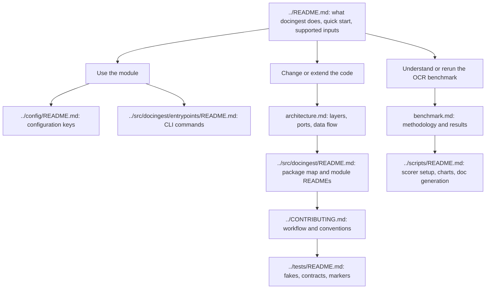
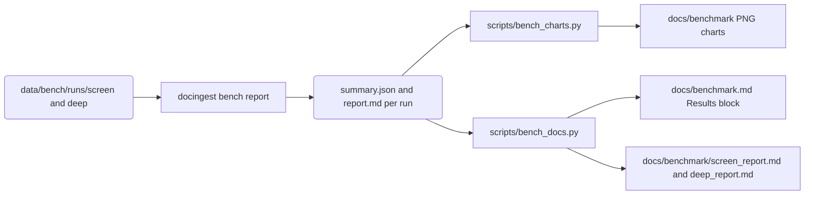

# Documentation

This folder holds the project-wide documentation of `docingest`: the architecture reference, the architecture decision records (ADRs) and the OCR benchmark. Documentation that belongs to one part of the code lives next to that code as a `README.md`; all of it is indexed below.

Some files in this folder are generated from benchmark run data by scripts. Those files, or the marked parts of them, must not be edited by hand, because the next regeneration overwrites the edits. They are listed in [Generated files](#generated-files-do-not-edit-by-hand).

## Where to start

Pick the path that matches what you want to do. The three boxes under the main README name a goal; every other box is a document, read in the order of the arrows.

## Index of `docs/`

| Document | Content | Maintained |
|---|---|---|
| [architecture.md](architecture.md) | The architecture reference: design goals, vocabulary, layers and the import contracts that enforce them, every port and its adapters, the composition root and plugins, how a document flows through the pipeline, caching and fingerprints, the manifest, error handling, the crawl, ask and benchmark subsystems, extension points and testing | By hand |
| [adr/0001-hexagonal-architecture.md](adr/0001-hexagonal-architecture.md) | Why the code uses ports and adapters with a plugin registry, adapter fingerprints in the cache key, and import-linter contracts in CI | By hand |
| [adr/0002-per-page-routing-and-content-addressed-cache.md](adr/0002-per-page-routing-and-content-addressed-cache.md) | Why each PDF page is routed on its own between the text layer and OCR, with the reason recorded, and why outputs are addressed by the SHA-256 of the input | By hand |
| [adr/0003-latex-first-for-arxiv.md](adr/0003-latex-first-for-arxiv.md) | Why arXiv papers are fetched as LaTeX source first with a PDF fallback, and the steps of the pandoc LaTeX converter | By hand |
| [adr/0004-chunk-index-and-two-stage-retrieval.md](adr/0004-chunk-index-and-two-stage-retrieval.md) | Why retrieval has two stages (dense and BM25 fused, then a reranker), why the index and its model clients live in the separate `docingest-index` package, and how the on-disk index is keyed and kept in step with the corpus | By hand |
| [benchmark.md](benchmark.md) | The OCR model benchmark: what it compares and how (candidates, the synthetic and olmOCR-Bench suites, statistics, throughput, how to reproduce), and the results. It presents comparisons only and does not choose a model | Introduction and Methodology by hand; the Results block is generated by `scripts/bench_docs.py` |
| [benchmark/screen_report.md](benchmark/screen_report.md) | Full generated report of the screening run (`screen`): every candidate on the synthetic suite and on the smaller olmOCR-Bench sample | Generated: written by `docingest bench report`, copied here by `scripts/bench_docs.py` |
| [benchmark/deep_report.md](benchmark/deep_report.md) | Full generated report of the deep run (`deep`): the candidates selected for the larger olmOCR-Bench sample (the selection rule is in benchmark.md), olmOCR-Bench suite only | Generated: written by `docingest bench report`, copied here by `scripts/bench_docs.py` |
| [benchmark/quality_vs_speed.png](benchmark/quality_vs_speed.png) | Chart of olmOCR-Bench pass rate against median seconds per page | Generated by `scripts/bench_charts.py` |
| [benchmark/olmocr_categories.png](benchmark/olmocr_categories.png) | Heat map of olmOCR-Bench pass rate per category | Generated by `scripts/bench_charts.py` |
| [benchmark/synthetic_cer.png](benchmark/synthetic_cer.png) | Chart of character error rate per degradation level on the synthetic suite | Generated by `scripts/bench_charts.py` |
| [benchmark/synthetic_failure_analysis.md](benchmark/synthetic_failure_analysis.md) | Failure analysis of every synthetic-suite outlier unit (one page at one degradation level) of the screening run, classified by failure mode | Written analysis, not produced by a script |
| [benchmark/synthetic_failure_analysis.json](benchmark/synthetic_failure_analysis.json) | The data behind that analysis: per unit the candidate, sample, CER, primary and secondary failure class, quoted evidence and whether the output is still usable for retrieval (`units`), and a verdict per group of related units (`groups`) | Written analysis data, not produced by a script |
| [benchmark/olmocr_bench_failure_analysis.md](benchmark/olmocr_bench_failure_analysis.md) | Failure analysis per model on the olmOCR-Bench screening subset, from per-test scorer failures | Written analysis, not produced by a script |

The failure analyses describe one specific run and scoring version, named at the top of each file. Nothing regenerates them when the runs change, so check that header before relying on them.

## Documentation elsewhere in the repository

| Document | Content |
|---|---|
| [../README.md](../README.md) | Project overview, installation, quick start, supported inputs and how each is handled |
| [../CONTRIBUTING.md](../CONTRIBUTING.md) | Development workflow, conventions, how to add code and submit changes |
| [../config/README.md](../config/README.md) | The TOML configuration files (`pipeline.toml`, `benchmark.toml`, `examples/`), their schemas and keys |
| [../scripts/README.md](../scripts/README.md) | Every helper script: purpose, usage, inputs, outputs, side effects, requirements |
| [../tests/README.md](../tests/README.md) | Test layout, fakes and builders, contract tests, markers and opt-in variables, coverage, how to write tests |
| [../src/docingest/README.md](../src/docingest/README.md) | Map of the `docingest` package and its layers |
| [../src/docingest/domain/README.md](../src/docingest/domain/README.md) | The canonical document representation (manifest), the OCR routing policy, the pure text functions and the error hierarchy |
| [../src/docingest/ports/README.md](../src/docingest/ports/README.md) | The port Protocols that adapters implement |
| [../src/docingest/application/README.md](../src/docingest/application/README.md) | The use cases: ingest, crawl, ask, benchmark, metrics and statistics |
| [../src/docingest/adapters/README.md](../src/docingest/adapters/README.md) | The concrete adapters for every port and how configuration selects them |
| [../src/docingest/adapters/ocr/README.md](../src/docingest/adapters/ocr/README.md) | OCR engines and model profiles |
| [../src/docingest/adapters/converters/README.md](../src/docingest/adapters/converters/README.md) | Whole-document converters: LaTeX sources, office and HTML files, Markdown and plain text |
| [../src/docingest/entrypoints/README.md](../src/docingest/entrypoints/README.md) | The driving adapters: the `docingest` CLI, its `bench` sub-app and the PaperQA2 hook |

## Generated files: do not edit by hand

Everything below is produced from the benchmark run directories under `data/bench/runs/`, which are gitignored. The diagram shows which tool writes which file.

| File or part | Generated by | Regenerate with | To change its content |
|---|---|---|---|
| `docs/benchmark.md`, everything between `<!-- RESULTS -->` and `<!-- /RESULTS -->` | `scripts/bench_docs.py` | `uv run python scripts/bench_docs.py` | Edit `bench_docs.py` (wording, tables, the comparisons in `observations()`) |
| `docs/benchmark/screen_report.md`, `docs/benchmark/deep_report.md` | `docingest bench report` (`write_report` and `render_report` in `src/docingest/application/benchmark.py`), copied by `scripts/bench_docs.py` | `uv run docingest bench report --run-id <run>`, then `uv run python scripts/bench_docs.py` | Edit `render_report` |
| `docs/benchmark/quality_vs_speed.png`, `olmocr_categories.png`, `synthetic_cer.png` | `scripts/bench_charts.py` | `uv run python scripts/bench_charts.py data/bench/runs/screen docs/benchmark` | Edit `bench_charts.py` |

Text outside the RESULTS markers in `benchmark.md` (the introduction and the Methodology section) is hand-written and safe to edit. Keep both markers in place: `bench_docs.py` stops with an error when the start marker is missing, and when only the end marker is missing it replaces everything after the start marker, Methodology included. Full details, inputs and the order of the commands are in [../scripts/README.md](../scripts/README.md#bench_docspy).

## Writing documentation

1. **Accuracy first.** Every command, option, path, class and default must match the code. Check the CLI with `uv run docingest --help` and `uv run docingest <command> --help`.
2. **Benchmark neutrality.** The benchmark compares models and never recommends one. Do not copy benchmark numbers into other documents, because they change with every run; link to [benchmark.md](benchmark.md) instead.
3. **Diagrams** are Mermaid code blocks that GitHub renders. Use `flowchart`, `sequenceDiagram` or `classDiagram`, put node labels in double quotes, keep HTML tags and semicolons out of labels, and introduce each diagram with a sentence saying what it shows.
4. **Links** are relative paths, for example `../src/docingest/ports/README.md`.
5. **A new ADR** takes the next number and a file name `adr/NNNN-short-title.md`, and follows the existing ones: a title `# ADR NNNN: <decision>`, a `**Status:**` line with the date, then Context, Decision and Consequences sections. Add it to the index above.
6. **A new module README** goes next to the package it describes and gets a row in [Documentation elsewhere in the repository](#documentation-elsewhere-in-the-repository).
