# Architecture

This document explains how docingest is built and why. It covers the layers and the rule between them, the ports and their adapters, how the object graph is wired, how each kind of file moves through the pipeline, how results are cached, what the manifest records, how failures are handled, and where the OCR benchmark fits.

It is a design document. For the exact API of a package, follow the links to the module READMEs.

| If you want to | Read |
|---|---|
| install the tool and run it | [README.md](../README.md) |
| change settings in `config/pipeline.toml` or `config/benchmark.toml` | [config/README.md](../config/README.md) |
| add or change code | [CONTRIBUTING.md](../CONTRIBUTING.md) and the module READMEs in [Where to go next](#15-where-to-go-next) |
| know the exact contract of a port | [src/docingest/ports/README.md](../src/docingest/ports/README.md) |
| read benchmark results and methodology | [benchmark.md](benchmark.md) |
| see every document in `docs/` | [docs/README.md](README.md) |

## Contents

1. [Design goals](#1-design-goals)
2. [Vocabulary](#2-vocabulary)
3. [Layers and the dependency rule](#3-layers-and-the-dependency-rule)
4. [Import contracts](#4-import-contracts)
5. [Ports and adapters](#5-ports-and-adapters)
6. [The composition root](#6-the-composition-root)
7. [How a document flows through the pipeline](#7-how-a-document-flows-through-the-pipeline)
8. [Caching and fingerprints](#8-caching-and-fingerprints)
9. [The manifest and page records](#9-the-manifest-and-page-records)
10. [Error handling](#10-error-handling)
11. [The crawl and ask use cases](#11-the-crawl-and-ask-use-cases)
12. [The benchmark subsystem](#12-the-benchmark-subsystem)
13. [Extension points](#13-extension-points)
14. [Testing the architecture](#14-testing-the-architecture)
15. [Where to go next](#15-where-to-go-next)
16. [Architecture decision records](#16-architecture-decision-records)

## 1. Design goals

docingest turns research documents into one canonical representation: a Markdown file with page markers (`document.md`) plus a JSON manifest (`manifest.json`) with the provenance of every page. Accepted inputs are born-digital and scanned PDFs, images, office and HTML files, LaTeX sources and arXiv source archives, and Markdown or plain text. Downstream consumers (PaperQA2, the `ask` command, a vector database, an agent) only ever read those two files.

The architecture follows from four goals:

1. **Every technology choice is replaceable.** The OCR model and its runtime, the LaTeX converter, the store, the question-answering engine and the document source can each be swapped by configuration or by an installed plugin, without editing the core. See [ADR 0001](adr/0001-hexagonal-architecture.md).
2. **Expensive work is done only where it adds information.** Each PDF page is routed on its own, and OCR runs only on pages whose text layer is missing or broken. See [ADR 0002](adr/0002-per-page-routing-and-content-addressed-cache.md).
3. **Results are reproducible and never stale.** Outputs are addressed by the hash of the input bytes, and the cache key contains the fingerprint of every adapter that can change the output. OCR models are pinned to a commit.
4. **The core is testable in milliseconds, and the layering is checked by a tool.** Use cases depend only on `typing.Protocol` ports, so tests plug in in-memory fakes. import-linter contracts fail the build when a dependency points the wrong way.

## 2. Vocabulary

| Term | Meaning in this codebase |
|---|---|
| Port | A `typing.Protocol` in `docingest.ports` that the application depends on, for example `OcrEngine`. |
| Adapter | A concrete class that has the shape of a port, for example `MlxVlmOcr`. Adapters never subclass or import the Protocol classes. |
| Composition root | `docingest.bootstrap`: the only module that maps configuration names to adapters and wires them into use cases. |
| Use case | An application service: `IngestService`, `CrawlService`, `AskService`, `BenchmarkRunner`. |
| Page, segment | The unit of a document in the manifest. For PDFs it is a page, for images a frame, for LaTeX a section, for office and text files the whole document. The code calls all of them pages (`PageRecord`). |
| `doc_id` | The SHA-256 of the input file's raw bytes. |
| Fingerprint | A string on an adapter that names its version and every setting that can change its output. |
| `config_hash` | A 12-character hash of the pipeline version, the source kind, the `ocr_all` option and whatever else can change the output for that kind (for PDFs the routing thresholds plus the PDF reader and OCR fingerprints, for images the image source and OCR fingerprints, for converted kinds the converter fingerprint). It is the cache key together with `doc_id`. |
| Canonical result | A complete run with default options, stored under `<output_dir>/<doc_id[:16]>/`. |
| Variant | A partial (`--max-pages`) or forced-OCR (`--ocr-all`) run, stored under `_variants/`. |
| Degraded result | A converter fallback caused by the environment (timeout, crash, missing binary), stored under `_degraded/` and never served from the cache. |

## 3. Layers and the dependency rule

The package has seven layers. A module may import modules of its own layer and of any layer below it, never of a layer above it. The diagram shows the layers from outermost to innermost. Each arrow means "may import", and a layer may also import every layer further down, not only the next one.

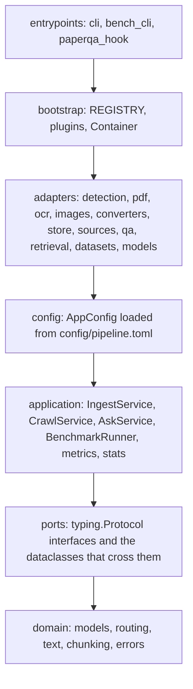

The same structure, drawn as a hexagon, separates the driving side (what calls the application) from the driven side (what the application calls through ports). The application and the domain in the middle know nothing about PDF libraries, MLX, pandoc, PaperQA2 or arXiv.

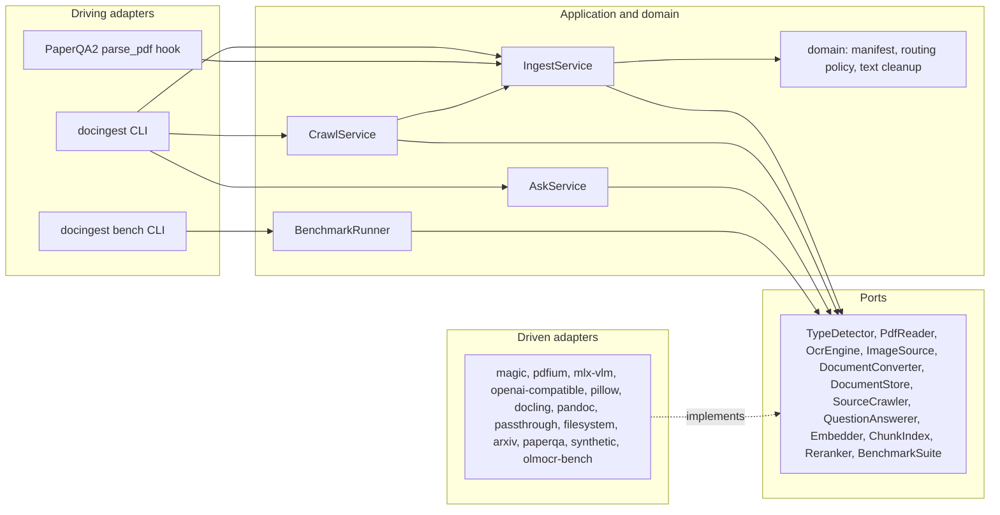

| Layer | Package | May import inside docingest | Contains |
|---|---|---|---|
| Entrypoints | `docingest.entrypoints` | every layer below | `cli.py` (the `docingest` typer app), `bench_cli.py` (`docingest bench`, which is also the benchmark's composition root), `paperqa_hook.py` (a PaperQA2 `parse_pdf` replacement) |
| Composition root | `docingest.bootstrap` | adapters, config, application, ports, domain | `REGISTRY`, `plugins`, `available`, `factory`, `build`, `Container` |
| Adapters | `docingest.adapters.*` | config, application, ports, domain | one subpackage per technology area, plus the shared Hugging Face resolver in `adapters.models` |
| Config | `docingest.config` | application, ports, domain (in practice only `domain.routing`) | `AppConfig` and its sections, `load_config` |
| Application | `docingest.application` | ports, domain | use cases, the benchmark runner and report, `metrics`, `stats` |
| Ports | `docingest.ports` | domain | `@runtime_checkable` Protocols and frozen dataclasses such as `OcrResult`, `Conversion`, `StoredDocument` |
| Domain | `docingest.domain` | nothing else in docingest | `models`, `routing`, `text`, `chunking`, `errors` |

Consequences of the rule that are visible in the code:

- The application never reads configuration. `IngestService` receives a `RoutingPolicy` object, and `CrawlService` receives a `raw_dir` path. Only the composition root turns `AppConfig` into objects.
- Adapters that need settings receive config objects: `PandocLatexConverter(LatexConfig)`, `ArxivCrawler(ArxivConfig)`, `PaperQAAnswerer(AppConfig)`, and `OpenAICompatibleOcr.from_config(OcrConfig, profile)`.
- Adapters may reuse application code because it is further in. `SyntheticSuite` scores with `application.metrics` and hashes its sources with `application.ingest.sha256_file`, both benchmark suites compute confidence intervals with `application.stats`, and the arXiv crawler names sidecar files with `application.ingest.SIDECAR_SUFFIX`.
- Adapters import only value types from `docingest.ports` (`OcrResult`, `Conversion`, `Segment`, `StoredDocument`, `SourceRecord`, `FetchedSource`, `Sample`, `SuiteScore`, `Estimate`). They satisfy the Protocols structurally.
- Images cross the ports as `PIL.Image.Image`. This is the one third-party type allowed in port signatures (ADR 0001).

## 4. Import contracts

The layering is enforced by six import-linter contracts in `[tool.importlinter]` of `pyproject.toml`. They run with `uv run lint-imports`, which is part of `scripts/check.sh` and of the Linux job in `.github/workflows/ci.yml`.

| # | Contract name | Type | What it enforces |
|---|---|---|---|
| 1 | Hexagonal layers: outer layers may import inner ones, never the reverse | `layers` | The order `entrypoints`, `bootstrap`, `adapters`, `config`, `application`, `ports`, `domain`. A module may import its own layer and the layers listed after it, never a layer listed before it. |
| 2 | Adapters are independent of each other (shared HF resolver excepted) | `independence` | None of `adapters.detection`, `pdf`, `ocr`, `images`, `converters`, `store`, `sources`, `qa`, `retrieval`, `datasets` imports another. `adapters.models` is deliberately not in the list, so `ocr.mlx_vlm` and `qa.paperqa` can share `models.huggingface.resolve`. |
| 3 | Domain is pure: no I/O or framework libraries | `forbidden` | `docingest.domain` may not import `pypdfium2`, `PIL`, `numpy`, `mlx`, `mlx_vlm`, `paperqa`, `docling`, `pypandoc`, `huggingface_hub`, `httpx`, `urllib`, `typer`, `rich`, `jiwer`. |
| 4 | Application depends on ports, not on concrete libraries | `forbidden` | `docingest.application` and `docingest.ports` may not import `pypdfium2`, `mlx`, `mlx_vlm`, `paperqa`, `docling`, `pypandoc`, `huggingface_hub`, `httpx`, `typer`, `rich`. |
| 5 | docingest never imports a plugin package (plugins are found by entry point) | `forbidden` | `docingest` may not import `docingest_index`. The plugin package has a contract of its own, in its `pyproject.toml`: it may import only `docingest.ports`, `docingest.domain` and `docingest.config`. |
| 6 | Only the composition root and entrypoints wire concrete adapters | `protected` | Only `docingest.bootstrap`, `docingest.entrypoints` and the adapters themselves may import `docingest.adapters`. |

Global settings that matter:

- `include_external_packages = true` lets the `forbidden` contracts name third-party packages.
- `exclude_type_checking_imports = true` makes every contract ignore imports under `if TYPE_CHECKING:`, which exist only for the type checker. Today the only such import is in `adapters/ocr/openai_compat.py`, which annotates `from_config` with `OcrConfig` without importing `docingest.config` at run time.
- Contract 4 does not forbid `PIL`, `numpy` or `jiwer`. Ports use PIL images, `application.stats` uses numpy, and `application.metrics` imports jiwer inside `score`.

When a contract fails, the fix is to move the code to the right layer or to pass the dependency in through a port, not to weaken the contract.

## 5. Ports and adapters

Every port is a `typing.Protocol` decorated with `@runtime_checkable`, so `isinstance(obj, OcrEngine)` checks the shape of any object. The diagram shows which built-in adapters implement which port, labelled with the `[adapters]` key that selects them in `config/pipeline.toml`. `BenchmarkSuite` has no `[adapters]` key: its implementations are built by `docingest bench` from `config/benchmark.toml`.

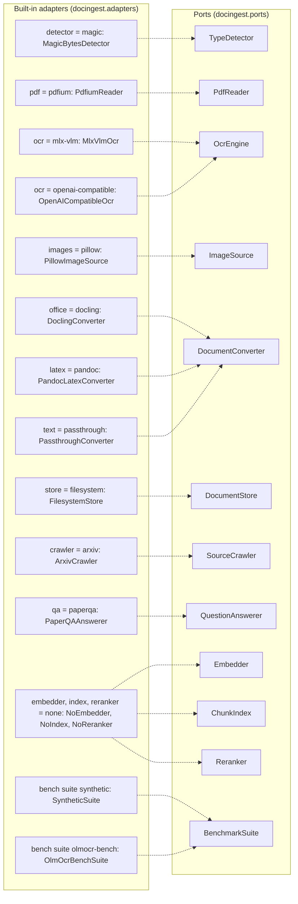

| Port | Defined in | `[adapters]` key | Built-in name | Adapter class and module | Used by |
|---|---|---|---|---|---|
| `TypeDetector` | `ports/detection.py` | `detector` | `magic` | `MagicBytesDetector`, `adapters/detection/magic.py` | `IngestService` |
| `PdfReader` (with `PdfDocument`, `PdfPage`) | `ports/pdf.py` | `pdf` | `pdfium` | `PdfiumReader`, `adapters/pdf/pdfium.py` | `IngestService` |
| `OcrEngine` | `ports/ocr.py` | `ocr` | `mlx-vlm` | `MlxVlmOcr`, `adapters/ocr/mlx_vlm.py` | `IngestService`, `BenchmarkRunner` |
| `OcrEngine` | `ports/ocr.py` | `ocr` | `openai-compatible` | `OpenAICompatibleOcr`, `adapters/ocr/openai_compat.py` | `IngestService`, `BenchmarkRunner` |
| `ImageSource` | `ports/images.py` | `images` | `pillow` | `PillowImageSource`, `adapters/images/pillow.py` | `IngestService` |
| `DocumentConverter` | `ports/converters.py` | `office` | `docling` | `DoclingConverter`, `adapters/converters/docling.py` | `IngestService` for office and HTML |
| `DocumentConverter` | `ports/converters.py` | `latex` | `pandoc` | `PandocLatexConverter`, `adapters/converters/pandoc_latex.py` | `IngestService` for LaTeX |
| `DocumentConverter` | `ports/converters.py` | `text` | `passthrough` | `PassthroughConverter`, `adapters/converters/plaintext.py` | `IngestService` for Markdown and text |
| `DocumentStore` | `ports/store.py` | `store` | `filesystem` | `FilesystemStore`, `adapters/store/filesystem.py` | `IngestService`, `AskService`, `eval-ocr`, the PaperQA2 hook |
| `SourceCrawler` | `ports/sources.py` | `crawler` | `arxiv` | `ArxivCrawler`, `adapters/sources/arxiv.py` | `CrawlService` |
| `QuestionAnswerer` | `ports/qa.py` | `qa` | `paperqa` | `PaperQAAnswerer`, `adapters/qa/paperqa.py` | `AskService` |
| `Embedder` | `ports/embedding.py` | `embedder` | `none` | `NoEmbedder`, `adapters/retrieval/none.py` | `IndexService` |
| `ChunkIndex` | `ports/index.py` | `index` | `none` | `NoIndex`, `adapters/retrieval/none.py` | `IndexService` |
| `Reranker` | `ports/reranking.py` | `reranker` | `none` | `NoReranker`, `adapters/retrieval/none.py` | no use case yet |
| `BenchmarkSuite` | `ports/benchmark.py` | none | `synthetic`, `olmocr-bench` | `SyntheticSuite`, `OlmOcrBenchSuite`, `adapters/datasets/` | `BenchmarkRunner`, `score_run` |

Some adapter modules are shared helpers rather than port implementations: `adapters/models/huggingface.py` (`resolve(repo_id, revision)`, an offline-first snapshot resolver), `adapters/ocr/profiles.py` (per-model prompt, image size, clean-up and retry ladder, shared by both OCR adapters), `adapters/converters/latex_source.py` (safe unpacking, main-file detection and `\input` flattening for LaTeX) and `adapters/sources/http.py` (`PoliteClient`, the rate-limited HTTP client of the arXiv crawler). See [adapters/README.md](../src/docingest/adapters/README.md), [adapters/ocr/README.md](../src/docingest/adapters/ocr/README.md) and [adapters/converters/README.md](../src/docingest/adapters/converters/README.md).

### Port shapes

The next two class diagrams show the members of each Protocol and the value types they return. The first covers the ports used during ingestion.

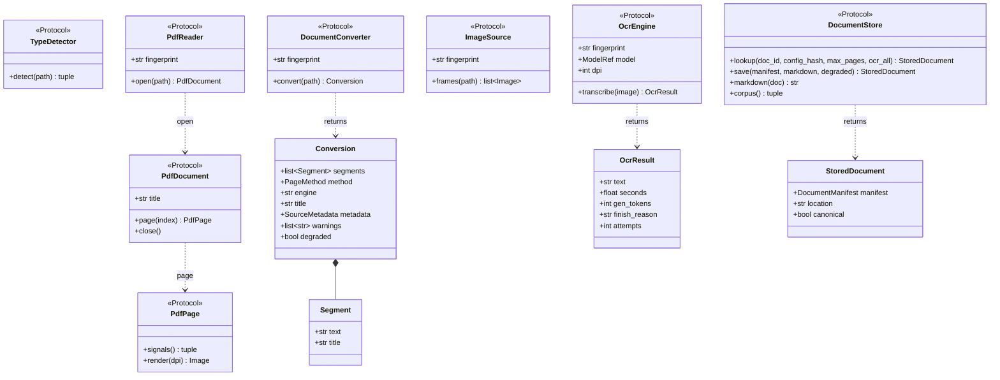

`TypeDetector.detect` returns `(SourceKind, mime)`. `PdfPage.signals` returns `(PageSignals, raw_text)`. `DocumentStore.lookup` returns `None` on a miss, and `corpus` returns `(documents, warnings)`. `PdfDocument` also implements `__len__` (the page count). `OcrResult` has more fields than shown (`peak_memory_gb`, `first_finish_reason`, `total_gen_tokens`, `gen_seconds`, `raw_text`) that describe the whole retry ladder and resource use, mainly for benchmark telemetry.

The second diagram covers the crawl, question-answering, retrieval and benchmark ports.

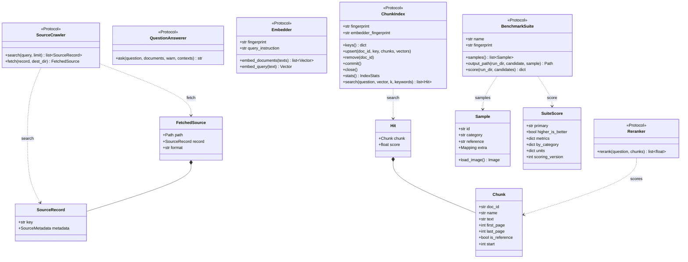

`QuestionAnswerer.ask` is `async`. Its `documents` argument is a list of `(StoredDocument, markdown)` pairs. The optional `contexts` argument is a list of `Chunk` already retrieved: the adapter then answers from exactly those and needs only the manifests of their papers. `FetchedSource.format` is one of `"latex-archive"`, `"latex"` or `"pdf"`. A suite may also expose `scoring_version: int`.

### Fingerprints

Seven ports carry a `fingerprint`: `PdfReader`, `OcrEngine`, `ImageSource`, `DocumentConverter`, `Embedder`, `ChunkIndex` and `BenchmarkSuite`. The first four feed the ingestion cache key ([section 8](#8-caching-and-fingerprints)). The suite fingerprint identifies a benchmark run's data ([section 12](#12-the-benchmark-subsystem)); the embedder and index fingerprints identify a chunk index, which is valid only for the model and chunker settings it was built with. The other ports have no fingerprint and are not part of any cache key: the detector's only output that matters is the kind, which is in the key, and the store, question answering, the crawler and the reranker do not change what is written.

| Adapter | Fingerprint contents |
|---|---|
| `PdfiumReader` | `"pypdfium2 "` plus the installed pypdfium2 version |
| `PillowImageSource` | `"pillow "` plus the installed Pillow version |
| `MlxVlmOcr` | `"mlx-vlm "` plus sorted JSON of: mlx-vlm version, model (`repo_id`, `revision`), profile name and `code_version`, prompt, `max_side`, `chat_kwargs`, `prompt_first`, retry ladder, whether the profile validates output, `dpi`, `max_tokens`, `temperature`, `repetition_penalty` |
| `OpenAICompatibleOcr` | `"openai-compatible "` plus sorted JSON of: `base_url`, `served_model`, `repo_id@revision`, and the same profile and generation settings as above. Transport settings (`timeout_s`, `retries`, the API key) are excluded because they cannot change the text. |
| `PandocLatexConverter` | adapter revision (`REVISION`), pandoc version, the pandoc arguments, `split_level`, and the pylatexenc version or `no fallback` |
| `DoclingConverter` | `"docling "` plus the installed docling version, or `docling missing` |
| `PassthroughConverter` | `"passthrough 1"` |
| `SyntheticSuite` | SHA-256 of: source file names with their SHA-256 and pages, levels, `dpi`, `seed`, `min_ref_chars`, `DEGRADE_VERSION`, and the pypdfium2, pillow and numpy versions |
| `OlmOcrBenchSuite` | SHA-256 of: the prepared subset's metadata, `long_side`, and the pypdfium2 version |

## 6. The composition root

`docingest/bootstrap.py` is the only module that knows every adapter. It has three parts: a registry of built-in factories, entry-point plugin discovery, and a lazily wired `Container`.

### The registry

`REGISTRY[port][name]` maps each name that may appear in `[adapters]` to a factory `(AppConfig) -> adapter`. Every factory imports its adapter module inside the function body, so heavy optional dependencies (mlx-vlm, docling, paperqa) load only when that adapter is selected.

```python
REGISTRY: dict[str, dict[str, Factory]] = {
    "detector": {"magic": _magic},
    "pdf": {"pdfium": _pdfium},
    "ocr": {"mlx-vlm": _mlx_vlm, "openai-compatible": _openai_ocr},
    "images": {"pillow": _pillow},
    "office": {"docling": _docling},
    "latex": {"pandoc": _pandoc},
    "text": {"passthrough": _passthrough},
    "store": {"filesystem": _filesystem},
    "qa": {"paperqa": _paperqa},
    "crawler": {"arxiv": _arxiv},
    "embedder": {"none": _no_embedder},
    "index": {"none": _no_index},
    "reranker": {"none": _no_reranker},
}
```

The port names in `REGISTRY` are the field names of `AdapterSelection` in `config.py` (`[adapters]` in the TOML file). `uv run docingest adapters` prints every port, the selected adapter and the available names.

### Resolving an adapter name

`build(port, cfg)` reads the name from `cfg.adapters`, resolves it with `factory(port, name)` and calls the factory with the whole `AppConfig`. The flowchart shows how a name is resolved.

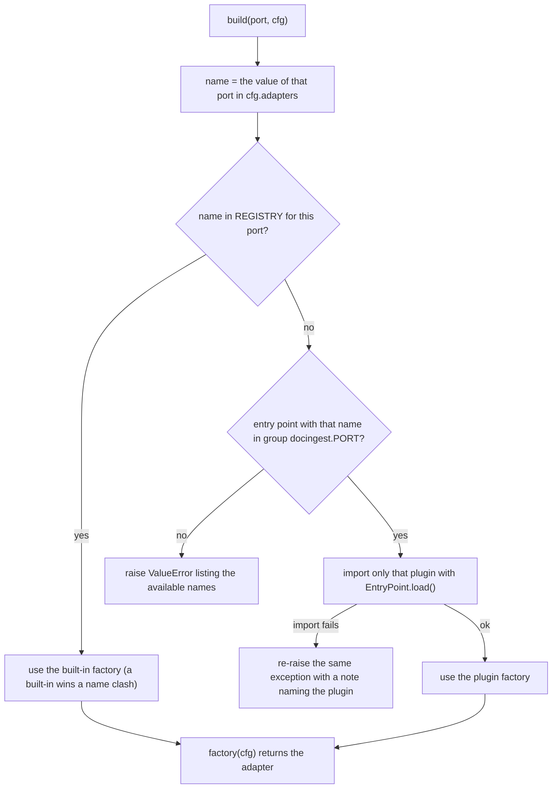

`plugins(port)` lists the installed entry points of a port without importing any of them, and `available(port)` returns the built-in names plus the plugin names. Only the selected plugin is ever imported, so one broken plugin cannot break a port whose selected adapter is another one.

A third-party package adds an adapter by declaring an entry point in the group `docingest.<port>` (for example `docingest.ocr` or `docingest.latex`) whose object is a factory:

```toml
# pyproject.toml of the plugin package
[project.entry-points."docingest.ocr"]
my-ocr = "my_pkg.ocr:factory"
```

```python
# my_pkg/ocr.py
from docingest.config import AppConfig


def factory(cfg: AppConfig):
    # AppConfig keeps unknown top-level sections in model_extra,
    # so a plugin can read its own [my_ocr] table from pipeline.toml.
    settings = (cfg.model_extra or {}).get("my_ocr", {})
    return MyOcr(**settings)  # the plugin's own class, shaped like OcrEngine
```

Selecting it is then one line in `config/pipeline.toml`: `ocr = "my-ocr"` under `[adapters]`. There is no entry-point group for benchmark suites.

### The Container

`Container(cfg, log=print, overrides=None)` builds the object graph for one configuration, lazily. `adapter(port)` returns the override for that port if there is one, otherwise it builds the adapter with `build(port, cfg)` and keeps the instance in a cache of its own (the caller's `overrides` dict is copied, never filled), so each port is built at most once per container. The use cases are `functools.cached_property` attributes. The diagram shows what each one receives.

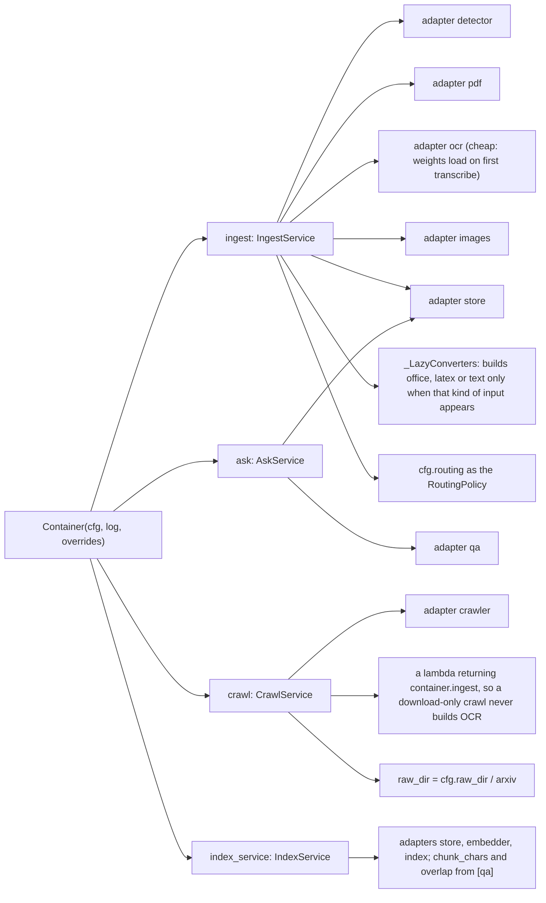

The laziness matters in practice: ingesting only PDFs never imports docling or runs `pandoc --version`, and `docingest crawl --no-ingest` never constructs the OCR engine. `MlxVlmOcr` also defers loading the model weights until its first `transcribe` call.

`overrides` replaces any port with a ready-made object. Tests and notebooks use it to bypass configuration. The example below plugs a trivial OCR engine into an otherwise default pipeline:

```python
from pathlib import Path

from PIL.Image import Image

from docingest.bootstrap import Container
from docingest.config import AppConfig
from docingest.domain.models import ModelRef
from docingest.ports import OcrEngine, OcrResult


class EchoOcr:
    fingerprint = "echo-ocr 1"  # part of the cache key of PDFs and images
    model = ModelRef(repo_id="local/echo", revision="0" * 40)
    dpi = 72

    def transcribe(self, image: Image) -> OcrResult:
        text = f"a {image.width}x{image.height} page"
        return OcrResult(text=text, seconds=0.0, gen_tokens=0, finish_reason="stop")


assert isinstance(EchoOcr(), OcrEngine)  # structural check, no subclassing
container = Container(AppConfig(output_dir="/tmp/docingest-demo"), overrides={"ocr": EchoOcr()})
stored = container.ingest.ingest(Path("scan.pdf"))
print(stored.location, stored.manifest.ocr_pages)
```

Two other places build their own graph:

- `entrypoints/paperqa_hook.py` creates one `Container(load_config(), ...)` per process (cached with `functools.cache`), so the OCR model stays loaded across PaperQA2's `parse_pdf` calls.
- `entrypoints/bench_cli.py` is the composition root of the benchmark. Its `engine_factory` turns each `CandidateSpec` into an `OcrConfig` and an `[adapters] ocr` name on a copy of the base `AppConfig`, then calls `bootstrap.build("ocr", cfg)`. See [section 12](#12-the-benchmark-subsystem).

## 7. How a document flows through the pipeline

### From source to consumer

The first diagram shows the whole data path, from where files come from to who reads the normalized output. Paths are the defaults (`raw_dir = "data/raw"`, `output_dir = "data/normalized"`).

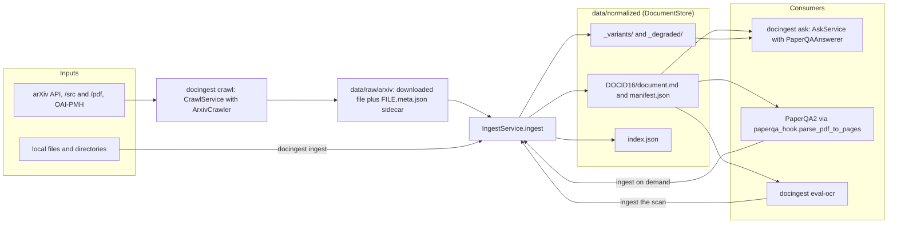

`docingest ingest PATHS...` accepts files and directories. Directories are walked recursively in sorted order, files whose name starts with a dot are skipped, and sidecar files (names ending in `.meta.json` or `.truth.json`) are never treated as documents. One `IngestService.ingest` call handles one file.

### Input kinds

`MagicBytesDetector` reads the first 1024 bytes and decides the `SourceKind` from content first and the file suffix second, because extensions lie. The table lists how each kind is detected and handled.

| `SourceKind` | Detected when | Handler in `IngestService` | Ports used | `PageMethod` of its records | One record per |
|---|---|---|---|---|---|
| `pdf` | the bytes start with `%PDF-` (unless the suffix is `.md`, `.markdown`, `.txt`, `.tex` or `.ltx` and the head is valid text), or `%PDF-x.y` appears in the head of a file whose suffix is not one of the recognized image, office, text or LaTeX suffixes (for example `.pdf`) | `_pdf` | `PdfReader`, `OcrEngine` | `text_layer` or `vlm_ocr`, decided per page | PDF page |
| `image` | PNG, JPEG, TIFF, GIF, WebP or BMP signature | `_image` | `ImageSource`, `OcrEngine` | `vlm_ocr` | frame (a multi-page TIFF has several) |
| `latex` | gzip containing a tar (source archive) or anything that is not a PDF, PostScript or HTML (a single gzipped `.tex`), a plain tar, or suffix `.tex` or `.ltx` | `_convert` | `DocumentConverter` from `[adapters] latex` | `latex`, or `latex_plaintext` after the fallback | section at `[latex] split_level` |
| `office` | suffix `.docx`, `.pptx`, `.xlsx`, `.html`, `.htm` or `.xhtml` | `_convert` | `DocumentConverter` from `[adapters] office` | `docling` | whole document |
| `text` | suffix `.md`, `.markdown` or `.txt` | `_convert` | `DocumentConverter` from `[adapters] text` | `passthrough` | whole file |

Anything else raises `UnsupportedInputError`, and so does a gzip file that is corrupt or contains a PDF, PostScript or HTML. The checks run in this order: `%PDF-` at the start, image signatures, gzip, tar, `%PDF-x.y` in the head, then the suffix. Office and text files are recognized by suffix only.

### One ingest call

The sequence diagram follows `IngestService.ingest(path, options, metadata)` through the ports. `options` is an `IngestOptions(force, ocr_all, max_pages)`. `metadata` is optional bibliographic data, and when it is not passed the service reads the sidecar `<file>.meta.json` next to the input if one exists (a sidecar that does not validate as `SourceMetadata` fails the document).

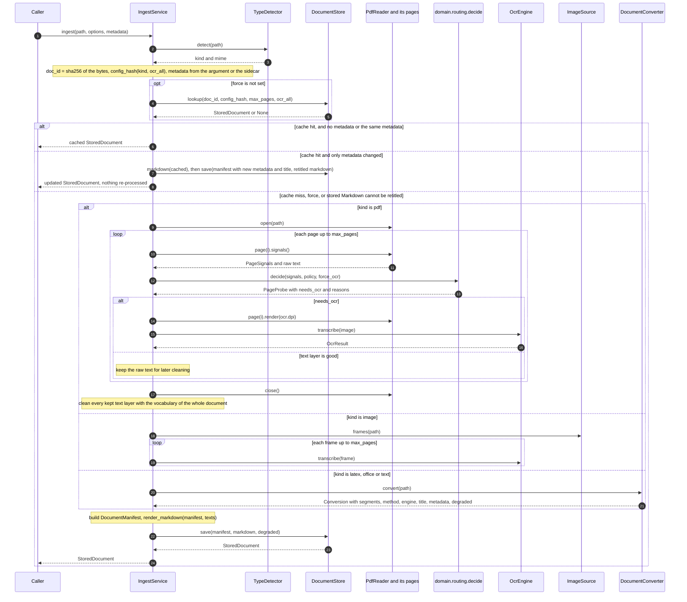

`--ocr-all` only applies to PDFs. For any other kind the service sets `ocr_all` to `False` before computing the cache key.

### PDF page routing

Each page is measured by the PDF adapter and judged by the pure function `domain.routing.decide`. The flowchart shows what happens to one page.

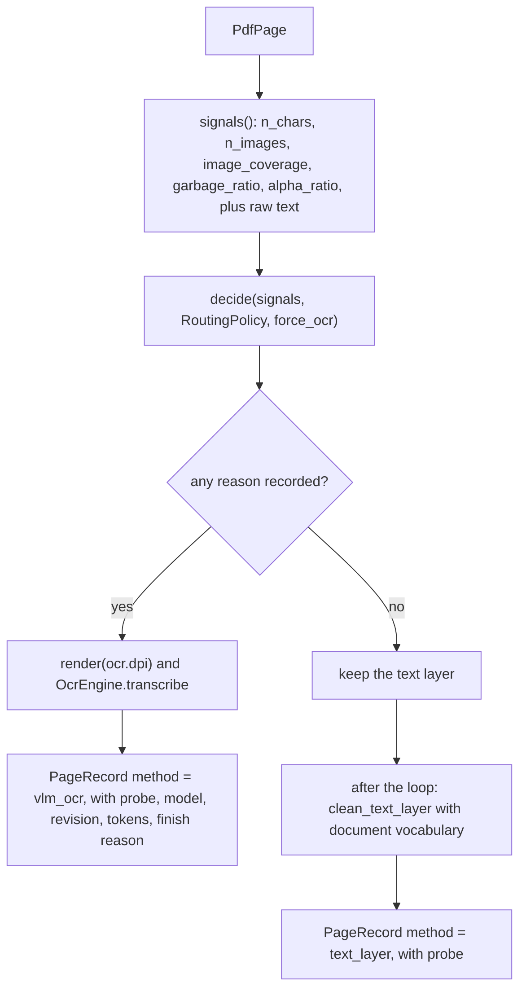

A page goes to OCR when at least one rule fires. The thresholds come from Marker and olmOCR and are set in `[routing]` of `config/pipeline.toml` (defaults shown).

| Rule | Condition | `[routing]` key and default |
|---|---|---|
| Too little text | `n_chars < min_chars` | `min_chars = 50` |
| Big image, little text | `image_coverage >= image_coverage` and `n_chars < image_coverage_max_chars` | `image_coverage = 0.6`, `image_coverage_max_chars = 400` |
| Broken glyphs | `garbage_ratio > max_garbage_ratio` | `max_garbage_ratio = 0.10` |
| Mostly non-letters | `n_chars >= min_chars` and `alpha_ratio < min_alpha_ratio` | `min_alpha_ratio = 0.5` |
| Forced | `--ocr-all` and no other rule fired | none |

The signals are measured by `PdfiumPage.signals`: `n_chars` counts non-whitespace characters of the embedded text, `image_coverage` is the share of the visible page box covered by image objects (measured in page space, including nested Form XObjects), `garbage_ratio` is the share of replacement, control, private-use and `(cid:N)` glyphs, and `alpha_ratio` is the share of letters. Every reason is recorded in the page's `probe.reasons`, so the manifest explains each decision. See [ADR 0002](adr/0002-per-page-routing-and-content-addressed-cache.md).

Text-layer cleaning runs after all pages are read. pdfium replaces a line-end hyphen with U+0002 and joins the lines. `clean_text_layer` joins the two halves only when the joined word occurs elsewhere in the document (the vocabulary includes every kept text layer and every OCR transcription), and otherwise keeps the hyphen. That is why cleaning cannot happen page by page.

### Images

`ImageSource.frames` returns every frame of the file (a multi-page TIFF gives several). With `--max-pages N` only the first N frames are transcribed, and `source_pages` records the total. Every frame becomes a `vlm_ocr` record with no probe. Both OCR adapters fit the image before sending it: EXIF orientation is applied, transparency is composited on white, and the longest side is reduced to the profile's `max_side`.

### Converted kinds: LaTeX, office, text

For `latex`, `office` and `text` the service calls one `DocumentConverter`, chosen by the kind (`_LazyConverters` maps `LATEX` to the `latex` port, `OFFICE` to `office`, `TEXT` to `text`). The converter always converts the whole document. `--max-pages N` then keeps the first N segments, and the conversion time is divided evenly among the kept segments. Converter warnings are logged. The converter's metadata is used when none was passed in or found in a sidecar, and its title is used when the metadata has no title.

The LaTeX converter is the most involved adapter. In short, it unpacks archives safely (tar `data` filter, a size cap from `[latex] max_archive_mb`, media files skipped), finds the main file (`00README.json` first, then heuristics), inlines `\input`, `\include`, `\subfile` and `\import` in Python, runs pandoc with `--sandbox`, a heap cap and `[latex] timeout_s`, splits the Markdown into one segment per section at `split_level`, and falls back to pylatexenc plain text when pandoc fails. See [ADR 0003](adr/0003-latex-first-for-arxiv.md) and [adapters/converters/README.md](../src/docingest/adapters/converters/README.md). The fallback and the `degraded` flag are described in [section 10](#10-error-handling).

### Building the result

After the handler returns, the service builds one `DocumentManifest` (fields in [section 9](#9-the-manifest-and-page-records)) and renders the Markdown with `domain.text.render_markdown`. The title is the first available of: the metadata title, the title found in the document (PDF `Title` metadata or the converter's title), and the file name without its suffix. `ocr_model` is set only if at least one page used OCR. Finally `DocumentStore.save` writes both files and decides where they go ([section 8](#8-caching-and-fingerprints)).

## 8. Caching and fingerprints

The cache has two keys. `doc_id` says which input this is. `config_hash` says which pipeline produced the output. A stored result is reused only when both match and the stored run satisfies the requested options.

### The two keys

`doc_id` is the SHA-256 of the raw file bytes (`sha256_file`). Renaming or moving a file does not change it, and editing a single byte does. The canonical directory is named after its first 16 hexadecimal characters.

`config_hash` is computed by `IngestService.config_hash(kind, ocr_all=...)`:

```python
key = json.dumps([PIPELINE_VERSION, kind.value, ocr_all, *parts])
config_hash = hashlib.sha256(key.encode()).hexdigest()[:12]
```

`parts` contains only what can change the output for that kind of input:

| Kind | `parts` |
|---|---|
| `pdf` | the `RoutingPolicy` as JSON (all `[routing]` thresholds), the `PdfReader` fingerprint, the `OcrEngine` fingerprint |
| `image` | the `ImageSource` fingerprint, the `OcrEngine` fingerprint |
| `latex`, `office`, `text` | the fingerprint of the converter for that kind |

`PIPELINE_VERSION` is defined in `application/ingest.py` (it is also `docingest.__version__`). Bumping it invalidates every cached result.

What is deliberately not in the key:

- `max_pages`. The store handles it: a complete result answers any `--max-pages` request, and partial runs are kept apart as variants.
- Bibliographic metadata. A change is applied to the cached result without re-processing (see below).
- `[qa]` settings. They only affect question answering.
- Transport settings of the OpenAI-compatible OCR adapter (`timeout_s`, `retries`, `api_key_env`), and the LaTeX adapter's `timeout_s` and `max_archive_mb`. They decide whether a conversion succeeds, not what it produces.

Because the OCR fingerprint is in the PDF key, changing the OCR model, profile (including its `code_version`, bumped when its clean-up code changes), prompt or generation settings re-processes every PDF and every image, including PDFs whose pages all use the text layer. The key does not depend on which pages of a document used OCR, so the store never needs that information to decide a hit. The cost is that born-digital PDFs are read again, which is cheap compared with OCR.

### Lookup

`FilesystemStore.lookup(doc_id, config_hash, max_pages=..., ocr_all=...)` decides whether a stored result can be reused. The flowchart shows its logic.

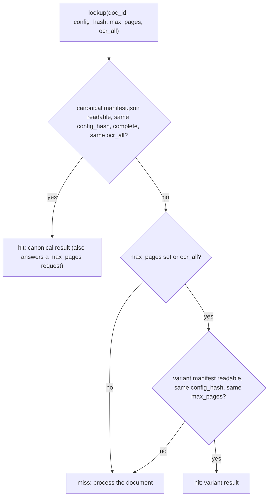

A manifest that is missing, truncated or does not validate against the current `DocumentManifest` schema counts as a miss. `lookup` never reads `_degraded/`.

### Save and the store layout

`FilesystemStore.save(manifest, markdown, degraded=...)` chooses the directory from the manifest itself. The flowchart shows the decision.

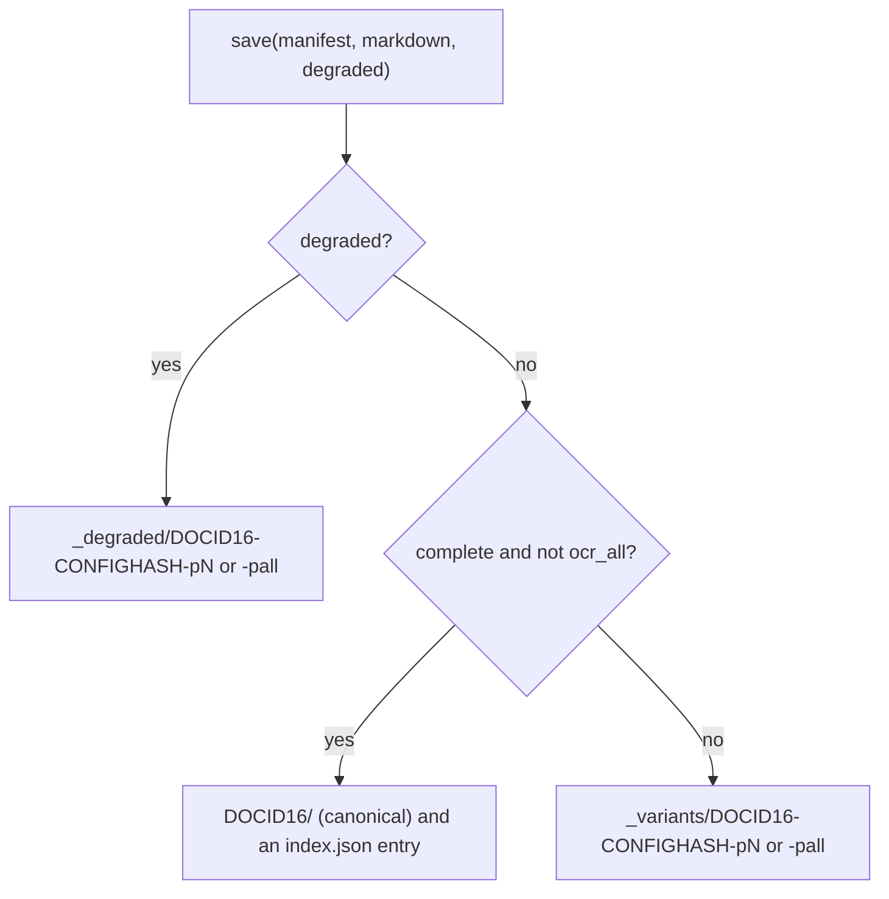

`complete` means `n_pages == source_pages`, so `--max-pages 100` on a 10-page PDF still produces a canonical result. The resulting layout under `output_dir`:

```text
data/normalized/
    index.json                                   catalog of canonical documents
    <doc_id[:16]>/                               canonical: complete run, default options
        document.md
        manifest.json
    _variants/<doc_id[:16]>-<config_hash>-p<N|all>/    --max-pages and --ocr-all runs
        document.md
        manifest.json
    _degraded/<doc_id[:16]>-<config_hash>-p<N|all>/    environment-caused fallbacks
        document.md
        manifest.json
```

| Location | Written when | Returned by `lookup` | Listed by `corpus` | Replaced by |
|---|---|---|---|---|
| `<doc_id[:16]>/` | a complete run without `--ocr-all`, not degraded | yes, if `config_hash` and `ocr_all` match | yes, always preferred | the next canonical save of the same input, even under another `config_hash` |
| `_variants/...` | a partial run or an `--ocr-all` run | yes, for the same `config_hash` and `max_pages` | only when no canonical result exists and no other variant or degraded result has more pages, with a warning | a save of the same input, `config_hash` and `max_pages` |
| `_degraded/...` | a converter fallback caused by the environment | never | only when no canonical result exists and no variant has as many pages, with a warning | a later degraded save with the same name |
| `index.json` | every canonical save | not used | not used | updated in place per `doc_id` |

Each `index.json` entry, keyed by the full `doc_id`, holds `source_name`, `title`, `kind`, `pages`, `ocr_pages`, `dir` and `citation`.

Consequences of this layout:

- A partial, forced-OCR or degraded run never replaces a complete result.
- Canonical results from an older `config_hash` are overwritten when the document is re-processed. Variants and degraded results carry the `config_hash` in their name, so older ones stay on disk until removed by hand.
- `eval-ocr` writes an extra file, `ocr_eval.json`, into the stored document's directory.
- Every file is written atomically (a temporary file in the same directory, then `os.replace`), with normal permissions derived from the process umask.

### When a document is processed again

A call to `ingest` processes the input instead of returning a stored result when any of these holds:

1. The bytes changed, which gives a new `doc_id`.
2. A part of the key for its kind changed: `PIPELINE_VERSION`, any `[routing]` threshold (PDFs), the pypdfium2 version (PDFs), the OCR fingerprint (PDFs and images), the image source fingerprint (images), or the converter fingerprint (LaTeX, office, text).
3. `--force` was given. The lookup is skipped, and the new result is saved over the stored result with the same run shape (a degraded result still goes to `_degraded/` and replaces nothing).
4. The stored manifest is missing, unreadable or from an incompatible schema.
5. The only stored result is degraded.
6. The request needs a run shape the store does not have: `--ocr-all` when only the default run exists, or `--max-pages N` when there is neither a complete result nor a variant with the same N.
7. New metadata arrived and the stored Markdown cannot be read, or does not start with the title line this pipeline wrote, so it cannot be retitled safely.

### Metadata refresh without re-processing

`doc_id` and `config_hash` do not cover metadata. When a lookup hits but the metadata passed in (or read from the sidecar) differs from the stored one, `IngestService._refresh_metadata` updates only the manifest's `metadata` and `title` and the Markdown's `# title` line, then saves through the store, which rewrites the same directory and, for canonical results, the `index.json` entry. If the new metadata has no title, the stored title is kept. This is how a license found by a later crawl reaches the manifest without running OCR or pandoc again.

### Which result a consumer sees

`DocumentStore.corpus()` returns one entry per `doc_id`: the canonical result if there is one, otherwise the variant or degraded result with the most pages. It also returns warnings for documents that exist only as a partial run or only as a degraded conversion. `AskService` prints those warnings before answering. `corpus()` does not filter by `config_hash`: it lists what is on disk.

## 9. The manifest and page records

The domain models in `domain/models.py` are pydantic models with no I/O. The class diagram shows the manifest, its page records and the types they use.

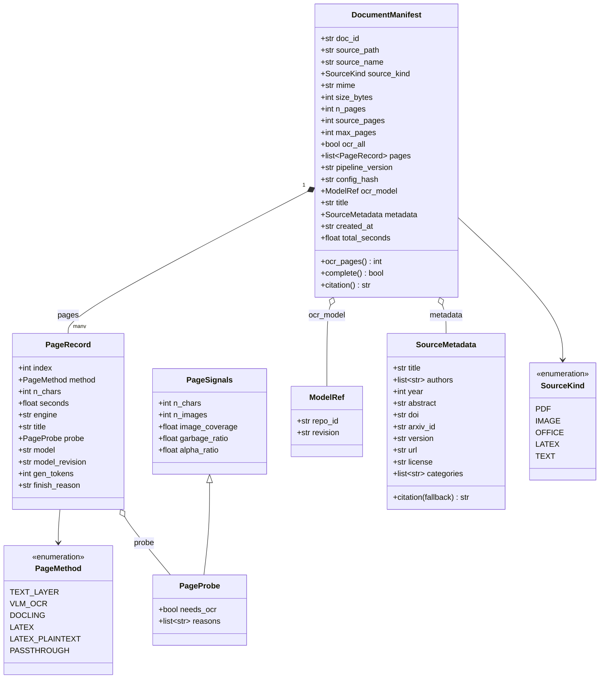

### DocumentManifest fields that matter

| Field | Meaning |
|---|---|
| `doc_id` | SHA-256 of the input bytes. The identity of the document. |
| `source_path`, `source_name` | Absolute path of the input at ingestion time, and its file name. |
| `source_kind`, `mime` | What the detector decided. |
| `n_pages`, `source_pages` | Records processed in this run, and records in the source. `n_pages < source_pages` means a partial run. `complete` is `n_pages == source_pages`. |
| `max_pages`, `ocr_all` | The run options, recorded for provenance and used by the store to place and find variants. |
| `pages` | One `PageRecord` per processed page or segment, in order. |
| `pipeline_version`, `config_hash` | Which pipeline produced this result. `config_hash` is the cache key. |
| `ocr_model` | The `ModelRef` of the OCR engine, set only when at least one page used OCR. |
| `title`, `metadata` | Display title and optional bibliographic metadata (arXiv API, sidecar or converter). `citation()` builds the short citation used in QA answers and in `index.json`. |
| `created_at`, `total_seconds` | UTC timestamp, and the processing time of the handler (detection, hashing and the cache lookup are not included). |
| `ocr_pages` | Computed property: the number of `vlm_ocr` records. |

### PageRecord fields that matter

| Field | Meaning |
|---|---|
| `index` | 0-based position. The Markdown marker uses `index + 1`. |
| `method` | How the text was produced (table below). |
| `n_chars` | Length of the emitted text for this record (after cleaning for text-layer pages). This differs from `probe.n_chars`, which counts the non-whitespace characters of the raw embedded text. |
| `seconds` | Time for this record. For converted kinds it is the conversion time divided by the number of kept segments. |
| `engine` | The adapter that produced the text: the PDF reader's fingerprint for text-layer pages, the OCR fingerprint for OCR pages, and `Conversion.engine` (for example `pandoc <version>` or `pylatexenc <version>`) for converted kinds. |
| `title` | Section or segment title from a converter. |
| `probe` | PDF pages only: the measured `PageSignals` plus `needs_ocr` and the human-readable `reasons`. |
| `model`, `model_revision`, `gen_tokens`, `finish_reason` | OCR pages only: the pinned model, tokens generated by the kept attempt, and why generation stopped (`"length"` means it hit `max_tokens`). |

| `PageMethod` value | Produced by |
|---|---|
| `text_layer` | `IngestService._pdf` for a PDF page with a good text layer |
| `vlm_ocr` | `IngestService._ocr_record`, for PDF pages routed to OCR and for every image frame |
| `docling` | `DoclingConverter` |
| `latex` | `PandocLatexConverter` when pandoc succeeds |
| `latex_plaintext` | `PandocLatexConverter` when the pylatexenc fallback is used |
| `passthrough` | `PassthroughConverter` |

### The Markdown format

`render_markdown` writes a title line and one HTML comment marker before each record's text. `split_pages` in `domain/text.py` is its inverse and returns `{page number: text}`. The PaperQA2 hook, `PaperQAAnswerer` and `eval-ocr` all read pages back this way, so the marker format is part of the contract between the store and its consumers.

```markdown
# Document title

<!-- page 1 | method=text_layer -->
Text of page 1, taken from the embedded text layer.

<!-- page 2 | method=vlm_ocr -->
Text of page 2, transcribed by the OCR engine.
```

## 10. Error handling

### Domain errors

Adapters translate library exceptions into domain errors, so use cases and entrypoints can handle failures without knowing which library failed. The class diagram shows the hierarchy, including the subclasses that adapters define.

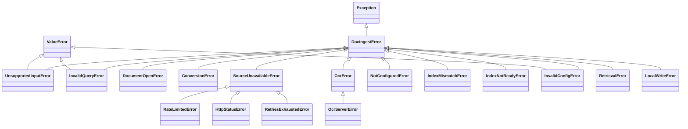

`DocingestError` and its twelve subclasses `UnsupportedInputError`, `InvalidQueryError`, `DocumentOpenError`, `ConversionError`, `SourceUnavailableError`, `OcrError`, `NotConfiguredError`, `IndexMismatchError`, `IndexNotReadyError`, `InvalidConfigError`, `RetrievalError` and `RateLimitedError` live in `domain/errors.py`. `HttpStatusError`, `RetriesExhaustedError` and `LocalWriteError` are defined in `adapters/sources/http.py`, and `OcrServerError` in `adapters/ocr/openai_compat.py`.

| Error | Meaning | Raised by | Handled by |
|---|---|---|---|
| `UnsupportedInputError` | The input type is not recognized, or no converter is configured for its kind. | `MagicBytesDetector.detect`, `IngestService._converter` | `docingest ingest` records the file as failed and continues |
| `InvalidQueryError` | A crawler query that cannot be sent: empty, or `ids:` without ids. | `ArxivCrawler.search` (`query_params`, `parse_ids`) | `CrawlService` ends the crawl with a report, before any request |
| `DocumentOpenError` | The file exists but cannot be opened (corrupt, encrypted, truncated). | `PdfiumReader.open`, `PillowImageSource.frames`, the benchmark suites | `docingest ingest` records the failure. The PaperQA2 hook converts it to PaperQA2's `ImpossibleParsingError`, so PaperQA2 skips the file instead of retrying. |
| `ConversionError` | A converter could not produce text. | `DoclingConverter` (missing `office` extra or a docling failure), `PandocLatexConverter` and `latex_source` (unreadable or oversized source, no text from pandoc or the fallback) | recorded as a failed input or crawl record |
| `SourceUnavailableError` | A remote source has no downloadable content for a record. | `ArxivCrawler`, `PoliteClient`, olmOCR-bench subset preparation | `CrawlService` records the failure and moves to the next record. A search failure ends the crawl with a report. |
| `RateLimitedError` | The source asked for a pause the crawler will not sit out. Carries `retry_after_s`. | `PoliteClient` | `CrawlService` stops the whole crawl (next section) |
| `OcrError` | The OCR engine could not transcribe a page. | `OpenAICompatibleOcr` (as `OcrServerError`, with the HTTP `status` when there was one) | not caught by `IngestService`, so the document fails. `BenchmarkRunner` records it in telemetry and continues. |
| `NotConfiguredError` | A port was used whose `[adapters]` entry is `"none"`, or an index is selected without an embedder. | `NoEmbedder`, `NoIndex`, `NoReranker`, `Container` | `docingest index` and `docingest ask` with an index print it and exit with 1 |
| `IndexMismatchError` | The chunk index holds vectors of another embedder than the configured one. | `IndexService`, `AskService` | `docingest index build`, `ingest --index` and `ask` print it and exit with 1 |
| `IndexNotReadyError` | The chunk index cannot answer yet: it is empty, nothing in it is committed, or nothing it returned belongs to the corpus. The message says to run `docingest index build`. | `AskService` | `docingest ask` prints it and exits with 1 |
| `InvalidConfigError` | A configuration table holds a value that cannot be used (also a `ValueError`); the message names the table and key. | `index_config`, `Container` when it builds the retrieval adapters | `docingest ask` with an index prints it and exits with 1 |
| `RetrievalError` | A retrieval step returned something unusable: a reranker that scores another number of chunks, or an index that returns no hit. | `AskService` | `docingest ask` prints it and exits with 1 |

`IngestService` does not catch processing errors: a failure on any page fails the whole document, and nothing is saved for it. Isolation happens one level up, in the driving code:

| Caller | Failure policy |
|---|---|
| `docingest ingest` | Catches any exception per file, prints it, continues with the next file, shows a "Failed inputs" table, and exits with status 1 if any file failed. |
| `CrawlService.run` | A `DocingestError` from the search ends the crawl with a report (other exceptions from the search propagate). A per-record error (fetch, sidecar write or ingest) is recorded and the crawl continues. A `RateLimitedError` stops the crawl. `docingest crawl` exits with status 1 if any failure was recorded. |
| `paperqa_hook.parse_pdf_to_pages` | Maps `DocumentOpenError` to `ImpossibleParsingError`. Raises `ImpossibleParsingError` when a page exceeds PaperQA2's `page_size_limit`, like PaperQA2's own readers. |
| `BenchmarkRunner` | A failed transcription is written as an empty output and scores as a miss. Five consecutive failures stop the candidate and delete that streak's outputs so a resumed run retries them ([section 12](#12-the-benchmark-subsystem)). |

Configuration errors are raised early: `load_config` refuses an explicit config path that does not exist instead of silently using defaults, `OcrConfig` refuses a `repo_id` without a pinned `revision` (the default model has a built-in pin), and an unknown adapter name raises `ValueError` when the port is first built.

### Degraded conversions

A converter can return text even when something went wrong, and the pipeline must distinguish a problem with the document (it will fail the same way next time) from a problem with the machine (a timeout on a loaded laptop, a crash, a missing binary). `Conversion.degraded = True` marks the second case. The flowchart shows how `PandocLatexConverter` decides.

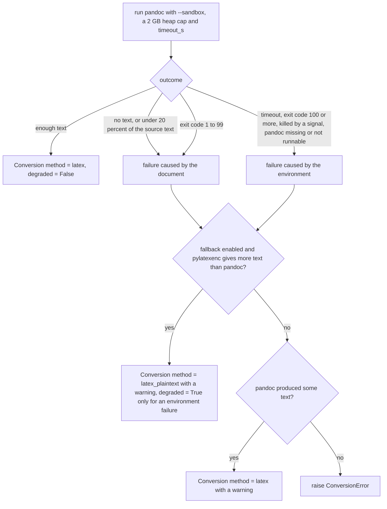

The split between the two kinds of failure follows pandoc's exit codes: its own error exits (1 to 99, for example 64 for a parse error or 91 for a macro loop) recur on every run, so they are the document's fault, while a signal (the OOM killer, a kill) or a runtime abort such as 251 (heap exhausted under the cap) is the machine's.

`IngestService` passes the flag to `DocumentStore.save(..., degraded=True)` and logs a warning. The store puts the result under `_degraded/`, never marks it canonical, never lets it replace a stored result, and never returns it from `lookup`, so the next run tries the real conversion again. Until then, `corpus()` still lists it (with a warning) so the corpus is not missing the document. A fallback caused by the document itself is not degraded: it is the best result this pipeline can produce, so it is cached like any other.

### Rate limiting and retries

All HTTP requests of the arXiv crawler (search, source and PDF downloads, OAI-PMH license lookups) go through one `PoliteClient`, so they share one budget:

- at least `[arxiv] delay_s` seconds between the starts of any two requests, retries included;
- one request in flight at a time;
- up to `[arxiv] retries` extra attempts on HTTP 406, 429, 500, 502, 503, 504 and on network errors or truncated bodies, with exponential backoff (`max(delay_s, 1) * 2**attempt`) or the server's `Retry-After`;
- a `Retry-After` pauses the shared limiter for every later request, not only the retried URL.

`PoliteClient` raises `RateLimitedError` when a `Retry-After` is longer than `max_retry_after_s` (300 seconds by default), when a request is attempted while the remaining pause is still longer than that limit, or when retries run out while the server is still saying to back off. Because the error concerns every later request to the same host, `CrawlService` stops the crawl, sets `CrawlReport.stopped`, and records the remaining records as not attempted. Other exhausted retries raise `RetriesExhaustedError`, which only fails the current record. A local write failure during a download raises `LocalWriteError` and is never retried.

`OpenAICompatibleOcr` has its own, independent retry policy: up to `[ocr] retries` extra attempts on HTTP 408, 429 and 5xx and on connection errors, with exponential backoff capped at 60 seconds that honours a `Retry-After` given in seconds. A request that times out (`[ocr] timeout_s`) is not retried, because the generation may still be running on the server. Redirects are refused so the `Authorization` header is never replayed to another host.

## 11. The crawl and ask use cases

### Crawl

`CrawlService.run(query, limit, ingest=True, options=None)` searches a source, downloads each record, writes its metadata sidecar and, unless ingestion is disabled, ingests it. The flowchart shows one run, including the failure paths.

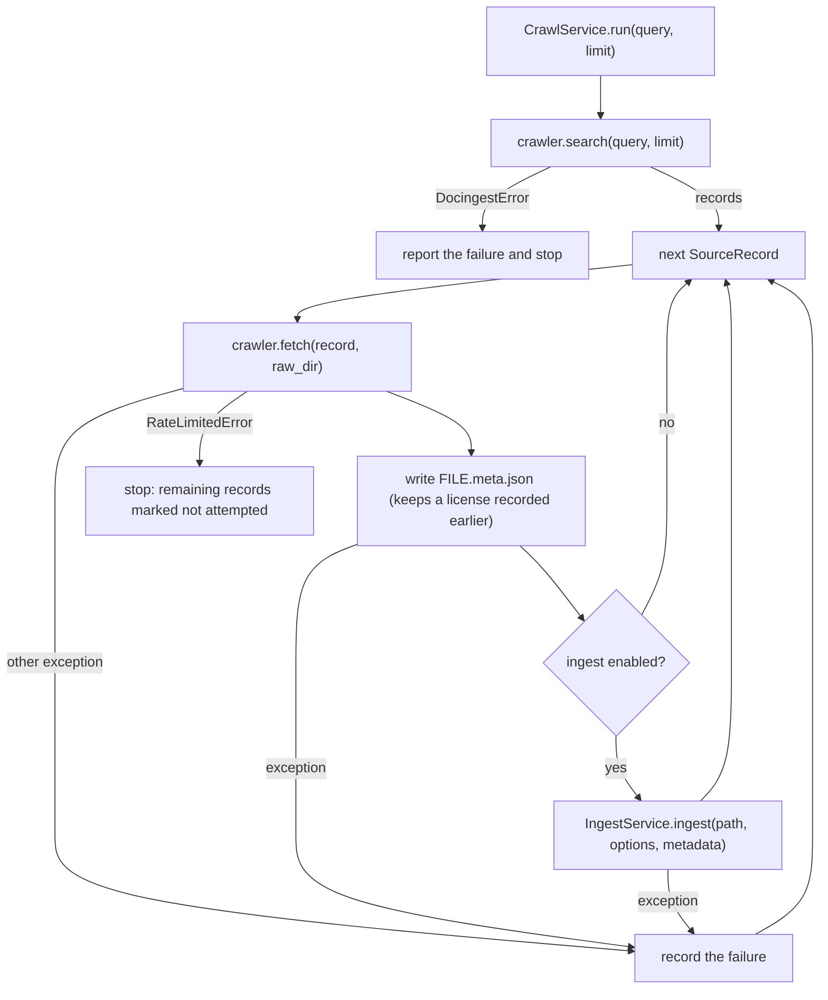

`ArxivCrawler.fetch` follows `[arxiv] prefer` (default `["latex", "pdf"]`): the LaTeX source first, the PDF as a fallback. A PDF saved because the source download failed transiently is marked, and a later crawl tries the preferred format again. The sidecar lets a later plain `docingest ingest data/raw/arxiv` produce the same manifest metadata as the crawl did. Details are in [ADR 0003](adr/0003-latex-first-for-arxiv.md) and [adapters/README.md](../src/docingest/adapters/README.md).

### Ask

`AskService.ask(question, warn)` reads the corpus through `DocumentStore.corpus()`, forwards its warnings, raises `RuntimeError` if nothing has been ingested, and passes `(StoredDocument, markdown)` pairs to `QuestionAnswerer.ask`. `PaperQAAnswerer` splits each document back into pages with `split_pages`, chunks them page-aware so citations point at page ranges, cites each document with `manifest.citation()` (noting partial runs), and runs a PaperQA2 query with the LLM and embedding model from `[qa]` (the environment variables `DOCINGEST_LLM` and `DOCINGEST_EMBEDDING` override them). Nothing in `[qa]` affects ingestion or any cache key.

## 12. The benchmark subsystem

The benchmark compares OCR candidates (a model, a profile and generation settings) on benchmark suites. It reuses the same `OcrEngine` adapters as ingestion, so a candidate means exactly what the same settings mean in `[ocr]` of `config/pipeline.toml`. Results and methodology are in [benchmark.md](benchmark.md). This section only describes how the code is organized.

### Where it fits

The diagram places the benchmark pieces in the same layers as the rest of the code.

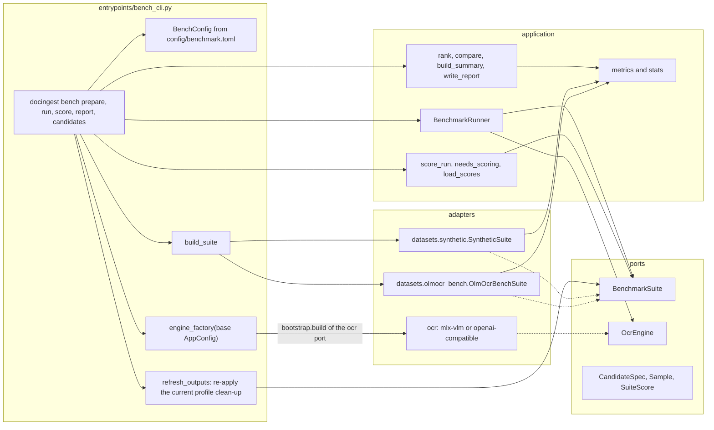

- **`BenchmarkSuite` (port)** owns its data and its file layout. `samples()` returns `Sample` objects whose images load lazily, `output_path(run_dir, candidate, sample)` says where a transcription must be written (official scorers expect exact layouts), and `score(run_dir, candidates)` returns a `SuiteScore` per candidate.
- **`SyntheticSuite`** renders born-digital PDF pages at the levels `clean` (raster only), `light` and `heavy` (deterministic, seeded degradations), and scores transcriptions against the cleaned text layer with `application.metrics` (CER, WER, word F1, character 3-gram F1).
- **`OlmOcrBenchSuite`** uses a seeded subset of a pinned olmOCR-bench revision and runs the official scorer in its own virtual environment (`scripts/setup_bench_scorer.sh` creates `.bench-venv`), then parses its output. Confidence intervals come from `application.stats`.
- **`BenchmarkRunner`** (application) transcribes every sample with each candidate, one model at a time, and writes outputs, telemetry and the run manifest.
- **`bench_cli`** (entrypoint) is the benchmark's composition root: it validates `config/benchmark.toml`, builds suites with `build_suite`, and builds each candidate's engine through `bootstrap.build("ocr", cfg)` on a copy of the `AppConfig` named by `pipeline_config` in `benchmark.toml`. Before scoring, `bench score` and `bench report` call its `refresh_outputs`, which re-applies each candidate's current profile clean-up to the stored outputs of candidates that finished transcribing.

### A benchmark run

The sequence diagram shows the path from `bench run` to `bench report` for one suite. `bench run` and `bench report` are separate commands, usually run in separate processes.

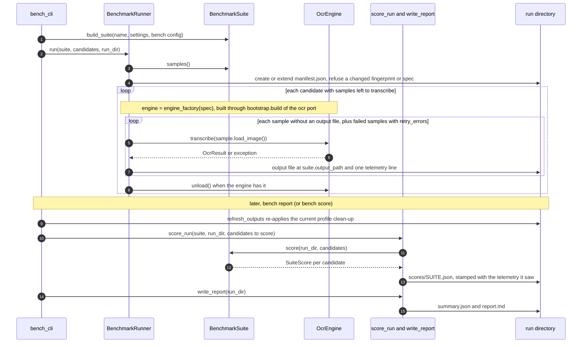

A run directory (`data/bench/runs/<run-id>/` by default) is self-describing:

| Path | Content |
|---|---|
| `manifest.json` | each suite's fingerprint, settings, sample count and candidate names, every candidate's spec, library versions, machine information, and any change of versions or machine during the run |
| `<suite>/<candidate>/...` | the transcriptions, where `suite.output_path` puts them (`<sample id>.md` for `synthetic`, `<pdf path without .pdf>_pg1_repeat1.md` for `olmocr-bench`) |
| `telemetry/<suite>/<candidate>.jsonl` | one line per transcription: timing, tokens, finish reason, retry attempts, peak memory, errors |
| `model_raw/<suite>/<candidate>/<sample id>.txt` | the model's raw output when clean-up changed it |
| `scores/<suite>.json` | the `SuiteScore` of each candidate, stamped with the telemetry state it describes |
| `summary.json`, `report.md` | written by `bench report` |
| `raw_outputs/`, `postprocess_log.json` | written when `refresh_outputs` (in `bench_cli.py`, run by `bench score` and `bench report`) rewrites stored outputs with a changed profile clean-up: `raw_outputs/` keeps the originals, `postprocess_log.json` lists every rewritten file |

### Resuming, invalidation and re-scoring

- **Resumable.** A sample whose output file exists is skipped, so rerunning the same command continues an interrupted run. `--retry-errors` re-runs samples whose last telemetry record has an error. `--time-budget` caps each candidate's wall time per suite.
- **Failure streaks.** Five consecutive failures (`max_consecutive_errors`) stop a candidate and delete that streak's empty outputs, because a streak points at the model or the machine, not at those pages.
- **Suite fingerprint.** If a suite's data or rendering settings change, its fingerprint changes and the runner refuses to extend the run with `RunMismatchError`. The same happens when a candidate name is reused with a different spec. Use a new `--run-id`.
- **Scoring version.** Scoring rules are versioned separately with `scoring_version` (`SCORING_VERSION` in each suite module). A change re-scores a finished run and never forces a re-transcription.
- **Stale scores.** `needs_scoring` treats a saved score as stale when the candidate's telemetry changed since it was scored, when the score has errors or is incomplete, when it has no primary metric, when it was made under another scoring version, or when it was made with other scoring options (a suite's optional `scoring_options`: `[scoring.synthetic]` for the synthetic suite, the result-changing scorer settings for olmOCR-bench). `bench report` re-scores exactly those, plus candidates whose stored outputs `refresh_outputs` just rewrote (or everything with `--rescore`), before writing the report.

The report ranks candidates by each suite's primary metric and compares every other candidate with the top-ranked one using a paired cluster bootstrap and a sign-flip test (`application.stats`), over the clusters and strata each suite defines. The code makes no choice of model: which model to configure in `[ocr]` is a decision for the user, informed by [benchmark.md](benchmark.md).

## 13. Extension points

The table lists common changes, where the code goes, and what else has to change with it. [CONTRIBUTING.md](../CONTRIBUTING.md) has the step-by-step procedures.

| Change | Where | Also required |
|---|---|---|
| Another implementation of an existing port | a new module under the matching `adapters/` subpackage, with the Protocol's shape and a `fingerprint` if the port has one | a factory in `bootstrap.REGISTRY` (or an entry point in an external package), contract tests in `tests/contract` if the port has them, and the new name in `[adapters]` to select it |
| An adapter outside this repository | the plugin's own package | an entry point in group `docingest.<port>`, then its name in `[adapters]`. Its settings can live in its own top-level table of `pipeline.toml`. |
| A new OCR profile (prompt, image size, clean-up, retry ladder) | `PROFILES` in `adapters/ocr/profiles.py` | select it with `[ocr] profile`. It becomes part of both OCR fingerprints automatically. |
| A new routing rule or threshold | `domain/routing.py` (`RoutingPolicy` and `decide`) | the new field appears in `[routing]` and in the PDF cache key through `policy.model_dump_json()` |
| A new input kind | `SourceKind` in `domain/models.py`, the detector, and a handler or converter mapping in `IngestService` and `_LazyConverters` | a new `[adapters]` field in `AdapterSelection` and a `REGISTRY` entry if it uses a new converter port, plus tests |
| A new port | a Protocol in `ports/`, exported from `ports/__init__.py` | a field in `AdapterSelection` (it forbids unknown keys), a `REGISTRY` entry, wiring in `Container`, a new adapter subpackage listed in the import-linter independence contract, and fakes in `tests/fakes.py` |
| A new benchmark suite | a class with the `BenchmarkSuite` shape in `adapters/datasets/` | in `entrypoints/bench_cli.py`: its settings model, a field in `SuitesConfig` (it forbids unknown keys), `BenchConfig.suite_settings`, `build_suite`, `SUITES` and `SCORING_VERSIONS`. Then a section under `[suites]` in `config/benchmark.toml` |
| A new benchmark candidate | a `[[candidates]]` entry in `config/benchmark.toml` | nothing else: fields are those of `CandidateSpec` |
| A new CLI command | `entrypoints/cli.py` (or `bench_cli.py`) | keep it thin: parse arguments, get a use case from a `Container`, format the output |
| An output format change | `PIPELINE_VERSION` in `application/ingest.py` if the output of the core changes, or the adapter's own revision (for example `REVISION` in `pandoc_latex.py`) if only one adapter changes | otherwise old cached results would be served as if they were current |

## 14. Testing the architecture

The layering is what makes the test suite fast. `tests/fakes.py` has in-memory implementations of every ingestion, crawl and question-answering port (`FakeOcr`, `FakePdfReader`, `FakeDetector`, `FakeImages`, `FakeConverter`, `InMemoryStore`, `FakeCrawler`, `FakeQA`), and the benchmark tests use the in-memory `MemSuite` from `tests/unit/test_benchmark.py` for `BenchmarkSuite`. They are real implementations of the contracts, not mocks, and the contract tests in `tests/contract` run the same behavioural checks against the fakes and the real adapters. Unit tests build use cases directly or with `Container(..., overrides=...)`.

| Level | Location | What it proves |
|---|---|---|
| Unit | `tests/unit` | domain rules and use cases with fakes of every port, and the arXiv crawler replaying recorded responses from `tests/fixtures/arxiv` |
| Contract | `tests/contract` | every implementation of a port, fake or real, behaves the same (OCR and store) |
| Integration | `tests/integration` | real adapters on real files, the OpenAI-compatible OCR adapter against a local stub HTTP server, the CLI |
| Opt-in | tests marked `model` or `network` | multi-GB models and live remote services, skipped unless `DOCINGEST_MODEL_TESTS=1` or `DOCINGEST_NETWORK_TESTS=1` |

All quality gates (ruff, import-linter, pyright, pytest with coverage) run with `./scripts/check.sh`. See [tests/README.md](../tests/README.md) and [scripts/README.md](../scripts/README.md).

## 15. Where to go next

| Package or folder | README |
|---|---|
| Package overview | [src/docingest/README.md](../src/docingest/README.md) |
| Domain models, routing, text, chunking, errors | [src/docingest/domain/README.md](../src/docingest/domain/README.md) |
| Ports | [src/docingest/ports/README.md](../src/docingest/ports/README.md) |
| Use cases, metrics, statistics | [src/docingest/application/README.md](../src/docingest/application/README.md) |
| Adapters | [src/docingest/adapters/README.md](../src/docingest/adapters/README.md) |
| OCR adapters and profiles | [src/docingest/adapters/ocr/README.md](../src/docingest/adapters/ocr/README.md) |
| Converters (LaTeX, office, text) | [src/docingest/adapters/converters/README.md](../src/docingest/adapters/converters/README.md) |
| CLI, benchmark CLI, PaperQA2 hook | [src/docingest/entrypoints/README.md](../src/docingest/entrypoints/README.md) |
| Configuration files | [config/README.md](../config/README.md) |
| Scripts | [scripts/README.md](../scripts/README.md) |
| Tests | [tests/README.md](../tests/README.md) |

## 16. Architecture decision records

| ADR | Decision |
|---|---|
| [0001: Hexagonal architecture with a plugin registry](adr/0001-hexagonal-architecture.md) | Protocol ports, a pure domain, one composition root with entry-point plugins, adapter fingerprints in the cache key, and import-linter contracts in CI. |
| [0002: Per-page OCR routing and a content-addressed cache](adr/0002-per-page-routing-and-content-addressed-cache.md) | Route each PDF page on measured signals, record the reason, address outputs by content, and keep partial and forced-OCR runs as variants. |
| [0003: Prefer LaTeX sources over PDFs for arXiv](adr/0003-latex-first-for-arxiv.md) | Download the source first, convert it with pandoc after safe unpacking and include flattening, fall back to plain text, and record metadata and license. |
