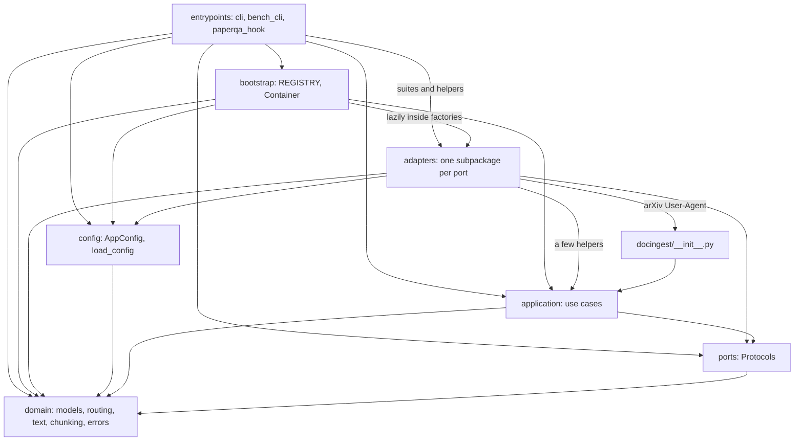
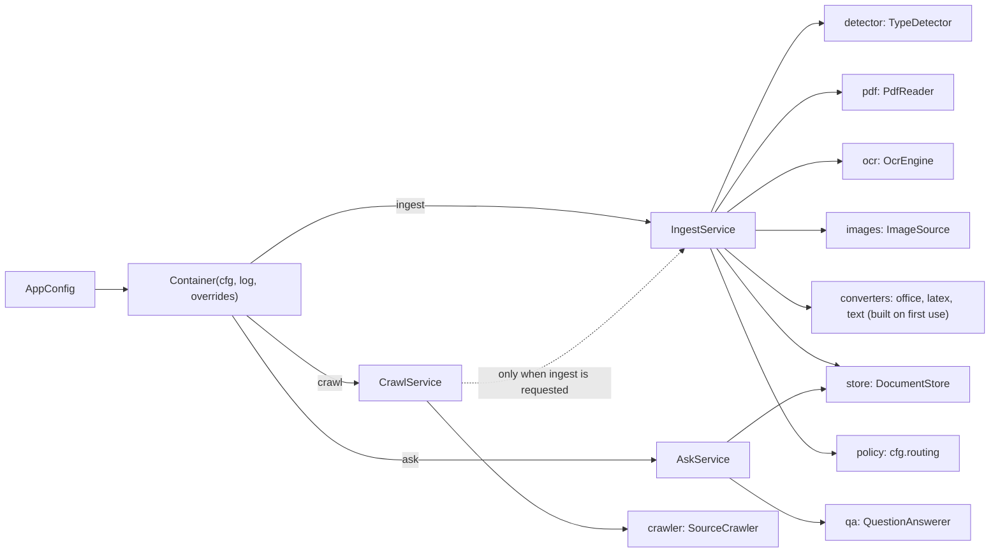
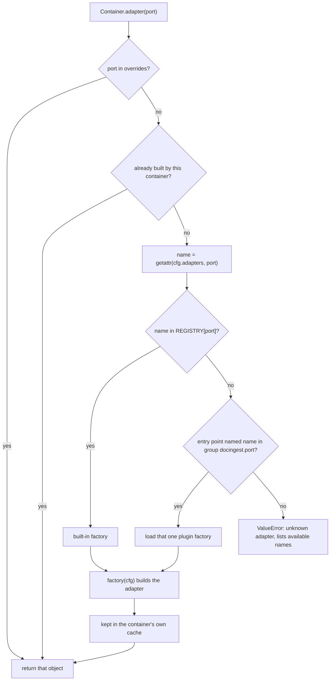

# The `docingest` package

`src/docingest/` is the Python package behind the `docingest` command. It turns a research document (born-digital or scanned PDF, page image, LaTeX source or arXiv archive, DOCX/PPTX/XLSX/HTML, Markdown or plain text) into two artifacts:

- `document.md`: normalized Markdown, one marked block per page or segment.
- `manifest.json`: a `DocumentManifest` recording how every page was produced.

Everything the CLI does is also available from Python. This page maps the package, shows how its modules depend on each other and how the runtime object graph is wired, and gives working examples of using `docingest` as a library.

Related reading:

- [docs/architecture.md](../../docs/architecture.md) and [ADR 0001](../../docs/adr/0001-hexagonal-architecture.md): why the package is split into ports and adapters.
- [config/README.md](../../config/README.md): every configuration key.
- [entrypoints/README.md](entrypoints/README.md): the command line.

## Contents

- [Layout](#layout)
- [Module map](#module-map)
- [How the modules depend on each other](#how-the-modules-depend-on-each-other)
- [Runtime wiring: `bootstrap.Container`](#runtime-wiring-bootstrapcontainer)
- [Using docingest as a library](#using-docingest-as-a-library)
- [Where new code goes](#where-new-code-goes)

## Layout

```text
src/docingest/
├── __init__.py        __version__ (the pipeline version)
├── config.py          AppConfig and load_config(): config/pipeline.toml as pydantic models
├── bootstrap.py       composition root: adapter REGISTRY, entry-point plugins, Container
├── domain/            pure models, OCR routing policy, text functions, chunker, errors
├── ports/             typing.Protocol interfaces and the value types that cross them
├── application/       use cases: ingest, crawl, ask, benchmark (plus metrics and statistics)
├── adapters/          implementations of the ports, one subpackage per concern
│   ├── converters/    office (Docling), LaTeX (pandoc + pylatexenc fallback), text (passthrough)
│   ├── datasets/      benchmark suites: synthetic scans, olmOCR-bench
│   ├── detection/     magic-byte type detector
│   ├── images/        Pillow image frames
│   ├── models/        Hugging Face snapshot resolver (shared by ocr and qa)
│   ├── ocr/           mlx-vlm and OpenAI-compatible OCR engines, per-model OCR profiles
│   ├── pdf/           pypdfium2 PDF reader
│   ├── qa/            PaperQA2 question answering
│   ├── sources/       arXiv crawler and the polite HTTP client it uses
│   └── store/         filesystem document store
└── entrypoints/       typer CLI, benchmark CLI, PaperQA2 parse_pdf hook
```

## Module map

| Path | Layer | What it contains | Main public names | Details |
|---|---|---|---|---|
| `__init__.py` | package | Re-exports the pipeline version. `__version__` is `PIPELINE_VERSION` from `application/ingest.py`. | `__version__` | - |
| `config.py` | config | Pydantic models for `config/pipeline.toml` and the loader. One model per TOML section. | `AppConfig`, `AdapterSelection`, `OcrConfig`, `QaConfig`, `LatexConfig`, `ArxivConfig`, `load_config`, `DEFAULT_CONFIG`, `DEFAULT_OCR_REPO`, `DEFAULT_OCR_REVISION`, `DEFAULT_LLM_BASE` | [config/README.md](../../config/README.md) |
| `bootstrap.py` | composition root | The only module that knows every adapter. Maps adapter names to factories, discovers entry-point plugins and builds the services. | `REGISTRY`, `Factory`, `plugins`, `available`, `factory`, `build`, `Container` | [below](#runtime-wiring-bootstrapcontainer) |
| `domain/` | domain | `models.py` (manifest, page records, metadata, enums), `routing.py` (OCR routing policy), `text.py` (text-layer clean-up, Markdown serialization), `chunking.py` (page-aware chunks), `errors.py` (exception hierarchy). No I/O. | `DocumentManifest`, `PageRecord`, `SourceKind`, `PageMethod`, `SourceMetadata`, `RoutingPolicy`, `decide`, `render_markdown`, `split_pages`, `chunk_pages`, `DocingestError` | [domain/README.md](domain/README.md) |
| `ports/` | ports | One module per concern, each defining `@runtime_checkable` Protocols plus the dataclasses passed through them. | `TypeDetector`, `PdfReader`, `OcrEngine`, `ImageSource`, `DocumentConverter`, `DocumentStore`, `SourceCrawler`, `QuestionAnswerer`, `BenchmarkSuite` | [ports/README.md](ports/README.md) |
| `application/` | application | `ingest.py` (`IngestService`, `IngestOptions`), `crawl.py` (`CrawlService`, `CrawlReport`), `ask.py` (`AskService`), `benchmark.py` (`BenchmarkRunner`, scoring and reports), `metrics.py` (CER, WER, F1 on normalized text), `stats.py` (cluster bootstrap and paired tests). Depends on ports, never on adapters. | `IngestService`, `IngestOptions`, `PIPELINE_VERSION`, `CrawlService`, `AskService`, `BenchmarkRunner` | [application/README.md](application/README.md) |
| `adapters/` | adapters | Concrete implementations of the ports. Subpackages are independent of each other (only `adapters/models` is shared). | see [adapters/README.md](adapters/README.md) | [adapters/README.md](adapters/README.md) |
| `adapters/ocr/` | adapters | `MlxVlmOcr`, `OpenAICompatibleOcr` and the `OcrProfile` table (prompt, image size, clean-up, retry ladder per model family). | `MlxVlmOcr`, `OpenAICompatibleOcr`, `PROFILES`, `profile_for` | [adapters/ocr/README.md](adapters/ocr/README.md) |
| `adapters/converters/` | adapters | `DoclingConverter`, `PandocLatexConverter` (with `latex_source.py`, which unpacks, flattens and prepares the LaTeX source without calling pandoc), `PassthroughConverter`. | as listed | [adapters/converters/README.md](adapters/converters/README.md) |
| `entrypoints/` | entrypoints | `cli.py` (the `docingest` typer app), `bench_cli.py` (`docingest bench ...`, also the benchmark's composition root), `paperqa_hook.py` (`parse_pdf_to_pages` for PaperQA2). | `app`, `bench_app`, `parse_pdf_to_pages` | [entrypoints/README.md](entrypoints/README.md) |

The console script `docingest` is declared in `pyproject.toml` as `docingest.entrypoints.cli:app`.

## How the modules depend on each other

The layers are enforced by import-linter contracts in `pyproject.toml` (run `uv run lint-imports`). The `layers` contract lists them from outermost to innermost: `entrypoints`, `bootstrap`, `adapters`, `config`, `application`, `ports`, `domain`. A module may import from layers below it, never from layers above it.

The diagram shows the imports that actually exist in the code. An arrow means "imports from".



What each arrow carries:

| From | To | What is imported |
|---|---|---|
| `entrypoints` | `bootstrap` | `Container`, `REGISTRY`, `available`, `factory`, `plugins` (CLI) and `build` (benchmark CLI, to build each candidate's OCR engine). |
| `entrypoints` | `adapters` | `bench_cli.py` imports the benchmark suites from `adapters/datasets` at module level and `adapters/ocr/profiles` lazily. `cli.py` imports `adapters/datasets/synthetic` (for `make-scan`), `adapters/models/huggingface` and `adapters/qa/paperqa` (for `model-path`) inside the commands. |
| `bootstrap` | `adapters` | Every adapter module, imported inside its factory function, so optional heavy dependencies (mlx-vlm, docling, paperqa) load only when that adapter is selected. |
| `adapters` | `config` | Section models: `LatexConfig` (pandoc converter), `ArxivConfig` (arXiv crawler), `AppConfig` and `DEFAULT_LLM_BASE` (PaperQA2 adapter). `OcrConfig` is imported by the OpenAI-compatible OCR adapter for type checking only. |
| `adapters` | `application` | `SIDECAR_SUFFIX` (arXiv crawler), `sha256_file`, `metrics` and `stats` helpers (benchmark suites). |
| `adapters` | `docingest/__init__.py` | `__version__`, which the arXiv crawler puts in its User-Agent (`adapters/sources/arxiv.py`). |
| `config` | `domain` | `RoutingPolicy`, which is the `[routing]` section. |
| `application` | `ports`, `domain` | Protocols, value types, models, `decide`, text functions, errors. Never an adapter. The only third-party libraries it uses are numpy (`stats.py`) and jiwer (`metrics.py`, imported inside a function), both for OCR evaluation (the benchmark and `eval-ocr`); the heavy runtime libraries are forbidden by contract 4 below. |
| `ports` | `domain` | `SourceKind`, `PageMethod`, `PageSignals`, `ModelRef`, `SourceMetadata`, `DocumentManifest`. Ports also use `PIL.Image.Image` as the image type (the one third-party type allowed in a port, see ADR 0001). |
| `docingest/__init__.py` | `application` | `PIPELINE_VERSION`, exposed as `__version__`. |

The remaining import-linter contracts, numbered as in [docs/architecture.md](../../docs/architecture.md#4-import-contracts) and [CONTRIBUTING.md](../../CONTRIBUTING.md) (contract 1 is the `layers` contract above):

2. Adapter subpackages (`detection`, `pdf`, `ocr`, `images`, `converters`, `store`, `sources`, `qa`, `datasets`) do not import each other. `adapters/models` is outside that list and is shared by `ocr` and `qa`.
3. `domain` may not import pypdfium2, PIL, numpy, mlx, mlx_vlm, paperqa, docling, pypandoc, huggingface_hub, httpx, urllib, typer, rich or jiwer.
4. `application` and `ports` may not import pypdfium2, mlx, mlx_vlm, paperqa, docling, pypandoc, huggingface_hub, httpx, typer or rich.
5. Only `bootstrap`, `entrypoints` and `adapters` itself may import `docingest.adapters`.

## Runtime wiring: `bootstrap.Container`

`Container(cfg, log=print, overrides=None)` is a lazily built object graph for one `AppConfig`. Its three `functools.cached_property` services are the entry points of the library.



Each port slot is resolved by `Container.adapter(port)`:



Behaviour worth knowing:

- Port names (the keys of `REGISTRY`, of `[adapters]` and of `overrides`) are `detector`, `pdf`, `ocr`, `images`, `office`, `latex`, `text`, `store`, `qa`, `crawler`.
- An adapter is built once per container and shared: `ingest` and `ask` use the same store instance. The container copies the `overrides` dict you pass and keeps built adapters in a cache of its own, so your dict is never modified and can be passed to several containers with different configurations.
- A built-in adapter wins a name clash with a plugin. A plugin is imported only when it is selected; if its import fails, the exception keeps its type and gets a note naming the plugin.
- `Container.ingest` builds the detector, PDF reader, OCR engine, image source and store when first accessed. Converters are built only when a document of that kind is ingested (`_LazyConverters` maps `SourceKind.OFFICE`, `LATEX`, `TEXT` to the `office`, `latex`, `text` slots).
- Building the OCR engine is cheap: the mlx-vlm engine loads model weights on the first `transcribe()` call, and the OpenAI-compatible engine only opens HTTP connections per request.
- `Container.crawl` gets a lazy factory for `IngestService`, so `run(..., ingest=False)` never builds the OCR engine. Downloads go to `Path(cfg.raw_dir) / "arxiv"`.
- `log` receives progress lines as plain strings. Pass `log=lambda _: None` to silence it.

## Using docingest as a library

Install the project with uv from the package folder (`packages/docingest`); `uv sync` at the repository root installs every package of the workspace. The base install covers born-digital PDFs, LaTeX sources, Markdown and text, and OCR through an OpenAI-compatible server. Extras add the rest:

| Extra | Needed for |
|---|---|
| `mlx` | the default `mlx-vlm` OCR adapter (Apple Silicon only) |
| `office` | DOCX, PPTX, XLSX and HTML inputs through Docling |
| `qa` | `AskService` through PaperQA2 |

```bash
uv sync --all-extras                 # or: uv sync --extra mlx --extra qa
uv run python my_script.py
```

The examples below use only names that exist in the package. Paths such as `paper.pdf` are placeholders for your own files.

### 1. Load a configuration

```python
from pathlib import Path

from docingest.config import AppConfig, load_config

# config/pipeline.toml in the package folder, or all defaults if that file is absent
cfg = load_config()
cfg = load_config(Path("config/examples/remote-ocr.toml"))  # an explicit path must exist

# The same keys as the TOML file, validated by pydantic:
cfg = AppConfig.model_validate(
    {
        "output_dir": "/tmp/docingest/normalized",
        "raw_dir": "/tmp/docingest/raw",
        "routing": {"min_chars": 80},
    }
)
```

- `load_config(None)` reads `DEFAULT_CONFIG`, which is resolved from the package location (`<repository>/config/pipeline.toml`). If that file does not exist it returns `AppConfig()`. An explicit path that does not exist raises `FileNotFoundError`; it never falls back to defaults.
- `output_dir` (default `data/normalized`) and `raw_dir` (default `data/raw`) are used as given, so relative paths are relative to the current working directory.
- The `[adapters]`, `[routing]`, `[ocr]`, `[qa]`, `[latex]` and `[arxiv]` models reject unknown keys with a `ValidationError`. Unknown top-level tables are kept in `cfg.model_extra` for plugins.
- `OcrConfig` requires `revision` whenever `repo_id` is not the default model; the default model's revision is filled in for you.

### 2. Build a container and ingest a file

```python
from pathlib import Path

from docingest.bootstrap import Container
from docingest.config import load_config

container = Container(load_config(), log=print)
stored = container.ingest.ingest(Path("paper.pdf"))

# filesystem store, canonical result: <output_dir>/<first 16 hex chars of the SHA-256>
print(stored.location)
print(stored.canonical)  # True for a complete run without ocr_all that is not a degraded fallback
```

`IngestService.ingest(path, options=None, metadata=None)` detects the input kind, hashes the bytes, returns a cached result when one matches the current configuration, and otherwise routes each page or segment (text layer, OCR or converter) and saves `document.md` plus `manifest.json` through the store. It returns a `StoredDocument(manifest, location, canonical)`. The step-by-step flow is in [application/README.md](application/README.md).

### 3. Read the result and the manifest

```python
from docingest.domain.text import split_pages

m = stored.manifest  # docingest.domain.models.DocumentManifest
print(m.source_kind.value, m.mime, m.n_pages, m.source_pages, m.complete)
print(m.ocr_pages, m.config_hash, m.pipeline_version, m.title)
for rec in m.pages:
    reasons = rec.probe.reasons if rec.probe else []
    print(rec.index + 1, rec.method.value, rec.n_chars, rec.seconds, reasons)

markdown = container.ingest.store.markdown(stored)
pages = split_pages(markdown)  # {1: "text of page 1", 2: "...", ...}
print(m.citation())
```

With the filesystem store you can also read the files directly, without a container:

```python
import json
from pathlib import Path

from docingest.domain.models import DocumentManifest

doc_dir = Path("data/normalized") / "0123456789abcdef"  # the first 16 hex chars of doc_id
manifest = DocumentManifest.model_validate_json((doc_dir / "manifest.json").read_text())
markdown = (doc_dir / "document.md").read_text()
# canonical documents, keyed by doc_id
catalog = json.loads(Path("data/normalized/index.json").read_text())
```

Where the filesystem store puts each result:

| Directory | Holds |
|---|---|
| `<output_dir>/<doc_id[:16]>/` | canonical results: complete runs without `ocr_all` (a `max_pages` at least the document length still gives a complete run) |
| `<output_dir>/_variants/<doc_id[:16]>-<config_hash>-p<N or all>/` | partial `max_pages` runs and `ocr_all` runs |
| `<output_dir>/_degraded/<doc_id[:16]>-<config_hash>-p<N or all>/` | environment-caused converter fallbacks, never served from the cache |
| `<output_dir>/index.json` | catalog of canonical documents |

Every field of the manifest is described in [domain/README.md](domain/README.md#documentmanifest).

### 4. Run options: partial runs, forced OCR, bypassing the cache

```python
from docingest.application.ingest import IngestOptions

svc = container.ingest
# only the first 2 pages, frames or segments
svc.ingest(Path("paper.pdf"), IngestOptions(max_pages=2))
# OCR every PDF page, even with a good text layer
svc.ingest(Path("paper.pdf"), IngestOptions(ocr_all=True))
svc.ingest(Path("paper.pdf"), IngestOptions(force=True))  # ignore cached results and process again
```

| Option | Default | Effect |
|---|---|---|
| `force` | `False` | Skip the cache lookup. The new result is saved as usual. |
| `ocr_all` | `False` | Force OCR on every PDF page. Ignored for other kinds. Recorded in the manifest and part of the cache key; such runs are stored as variants. |
| `max_pages` | `None` | Process only the first N pages (PDF), frames (image) or segments (converters). Must be at least 1, otherwise `ValueError`. A partial run is stored as a variant and never replaces a complete one. A complete canonical result also satisfies a later `max_pages` request. |

To see the cache key a run would use without running it:

```python
from docingest.domain.models import SourceKind

print(container.ingest.config_hash(SourceKind.PDF))  # 12 hex chars
print(container.ingest.config_hash(SourceKind.PDF, ocr_all=True))  # a different key
```

### 5. Supply bibliographic metadata

```python
from docingest.domain.models import SourceMetadata

meta = SourceMetadata(
    title="Attention Is All You Need",
    authors=["Ashish Vaswani", "Noam Shazeer"],
    year=2017,
    arxiv_id="1706.03762",
    version="v7",
)
stored = container.ingest.ingest(Path("paper.pdf"), metadata=meta)
# Vaswani et al. (2017). Attention Is All You Need. arXiv:1706.03762v7
print(stored.manifest.citation())

# Or write a sidecar next to the input; a later plain ingest (CLI or library) picks it up:
Path("paper.pdf.meta.json").write_text(meta.model_dump_json(indent=2))
```

- Precedence: the `metadata` argument, then the `<file>.meta.json` sidecar, then (for converter inputs) the metadata the converter extracted, for example title, authors and abstract from LaTeX.
- The manifest title is `metadata.title`, else the document's own title (PDF `Title` info or the converter's title), else the file name without its last suffix (`Path.stem`, so `paper.tar.gz` gives `paper.tar`).
- The three sources are not merged field by field: the first one that exists is used whole.
- When a cached result is found but the metadata differs, only the manifest's metadata and title and the Markdown's `# title` line are updated; pages are not processed again. If the stored Markdown does not start with the title line the pipeline wrote, the document is processed again instead.

### 6. Enumerate the corpus

```python
store = container.adapter("store")  # the same instance the services use
documents, warnings = store.corpus()
for w in warnings:
    print("warning:", w)
for doc in documents:
    print(doc.manifest.source_name, doc.canonical, doc.location)
```

`corpus()` returns one entry per document: the canonical result when there is one, otherwise the most complete variant (partial, `ocr_all` or degraded), with a warning for each document that has no canonical result. The filesystem store also warns about manifests it cannot read.

### 7. Ask a question over the corpus

```python
import asyncio

answer = asyncio.run(container.ask.ask("What problem does the paper address?", warn=print))
print(answer)
```

- Requires the `qa` extra. By default the LLM is the pinned `[ocr]` model served at `DEFAULT_LLM_BASE` (`http://127.0.0.1:8080/v1`, or `[qa] llm_base` when set) by `scripts/serve_llm.sh`. Any litellm model can be configured instead (`[qa] llm`, see `config/examples/ollama-qa.toml` and [config/README.md](../../config/README.md)). The environment variables `DOCINGEST_LLM` and `DOCINGEST_EMBEDDING` override `[qa] llm` and `[qa] embedding` when the adapter runs.
- `AskService.ask` raises `RuntimeError` when the store holds no documents.
- Inside a running event loop (for example a notebook), use `await container.ask.ask(...)` instead of `asyncio.run`.

### 8. Crawl arXiv

```python
report = container.crawl.run("cat:cs.CL AND ti:retrieval", 3, ingest=False)
for fetched in report.fetched:
    print(fetched.record.key, fetched.format, fetched.path)
for key, error in report.failures:
    print("failed:", key, error)
if report.stopped:
    print("stopped early:", report.stopped)
```

- This makes network requests to arXiv, spaced by `[arxiv] delay_s` seconds.
- Files are saved under `<raw_dir>/arxiv/`, each with a `<file>.meta.json` sidecar holding the record's `SourceMetadata`.
- With `ingest=True` (the default) every fetched file is ingested with `options` and its metadata, and `report.ingested` lists the resulting `StoredDocument`s.
- A failure on one record is recorded in `report.failures` and the crawl continues. A rate limit (`RateLimitedError`) stops the crawl and records the remaining records as not attempted.

### 9. Swap an adapter

By configuration, for example OCR through an OpenAI-compatible server instead of in-process MLX:

```python
from docingest.bootstrap import Container, REGISTRY, available
from docingest.config import AppConfig

for port in REGISTRY:
    print(port, available(port))  # built-ins plus installed plugins, none imported

cfg = AppConfig.model_validate(
    {
        "adapters": {"ocr": "openai-compatible"},
        "ocr": {"base_url": "http://127.0.0.1:8080/v1"},
    }
)
container = Container(cfg)
```

By injecting any object that implements the port. Overrides bypass the registry, which is how tests and notebooks plug in fakes:

```python
from pathlib import Path

from docingest.bootstrap import Container
from docingest.config import load_config
from docingest.domain.models import PageMethod
from docingest.ports import Conversion, DocumentConverter, Segment


class UpperCaseText:
    """A toy DocumentConverter for Markdown and text inputs."""

    fingerprint = "upper-case-text 1"  # part of the cache key of text inputs

    def convert(self, path: Path) -> Conversion:
        text = path.read_text(errors="replace").upper()
        return Conversion(
            segments=[Segment(text)], method=PageMethod.PASSTHROUGH, engine="upper-case-text"
        )


assert isinstance(UpperCaseText(), DocumentConverter)
container = Container(load_config(), overrides={"text": UpperCaseText()})
```

Because the converter's fingerprint is part of the cache key, results produced by the default converter are not reused for this one. The in-memory fakes in `tests/fakes.py` (`FakeOcr`, `InMemoryStore`, `FakePdfReader` and others) are complete implementations of every port the `Container` wires and can be injected the same way. To publish an adapter as a reusable plugin, see [ports/README.md](ports/README.md#registering-an-adapter).

### 10. Handle errors

```python
from pathlib import Path

from docingest.application.ingest import SIDECAR_SUFFIX
from docingest.domain.errors import DocingestError, UnsupportedInputError

# Files only: a directory (such as data/raw/arxiv) raises IsADirectoryError, and
# <file>.meta.json sidecars and hidden files are not documents.
inputs = sorted(
    p
    for p in Path("data/raw").rglob("*")
    if p.is_file() and not p.name.startswith(".") and not p.name.endswith(SIDECAR_SUFFIX)
)
for path in inputs:
    try:
        container.ingest.ingest(path)
    except UnsupportedInputError as e:
        print("skipped:", path.name, e)
    except DocingestError as e:
        print("failed:", path.name, type(e).__name__, e)
```

The CLI selects inputs the same way (`iter_inputs` in `entrypoints/cli.py`, which also skips `.truth.json` ground-truth files). `DocingestError` is the base of every expected failure (unsupported input, unreadable document, conversion failure, OCR failure, unavailable source). Other exceptions can still escape, for example an `OSError` or a pydantic `ValidationError` from a malformed sidecar, which is why the CLI catches every exception per input file. The hierarchy is in [domain/README.md](domain/README.md#errorspy).

### 11. Use docingest inside PaperQA2

`entrypoints/paperqa_hook.py` exposes `parse_pdf_to_pages`, a drop-in for PaperQA2's `settings.parsing.parse_pdf`:

```python
from paperqa import Settings

from docingest.entrypoints.paperqa_hook import parse_pdf_to_pages

settings = Settings()
settings.parsing.parse_pdf = parse_pdf_to_pages
```

PaperQA2's own `Docs.aadd("paper.pdf")` then sends every page through the text-layer and OCR router with the content-addressed cache. The hook builds one `IngestService` per process from `load_config()` (the default configuration file) with logging silenced, so the OCR model stays loaded between calls. A PDF that cannot be opened becomes PaperQA2's `ImpossibleParsingError`.

## Where new code goes

| Task | Where | Guide |
|---|---|---|
| A new implementation of an existing port (another OCR runtime, store, crawler, converter) | `adapters/<concern>/`, registered in `bootstrap.py` or as an entry-point plugin | [ports/README.md](ports/README.md#implementing-a-new-adapter) |
| A new OCR model family (prompt, image size, output clean-up) | `adapters/ocr/profiles.py` | [adapters/ocr/README.md](adapters/ocr/README.md) |
| A new input format | `SourceKind` in `domain/models.py`, detection in `adapters/detection/magic.py`, a converter, a slot in `AdapterSelection` (`config.py`) and in `REGISTRY` and `_LazyConverters._PORT` (`bootstrap.py`) | [domain/README.md](domain/README.md#changing-the-domain-safely), [adapters/converters/README.md](adapters/converters/README.md) |
| A change to routing thresholds | `[routing]` in `config/pipeline.toml` (no code change) | [domain/README.md](domain/README.md#routingpy) |
| A new use case | `application/`, depending on ports only, then a property on `Container` | [application/README.md](application/README.md) |
| A new CLI command | `entrypoints/cli.py` (or `bench_cli.py` for `docingest bench`) | [entrypoints/README.md](entrypoints/README.md) |
| A new benchmark candidate | `config/benchmark.toml` | [config/README.md](../../config/README.md), [docs/benchmark.md](../../docs/benchmark.md) |
| Tests for any of the above | `tests/unit`, `tests/contract`, `tests/integration` | [tests/README.md](../../tests/README.md), [CONTRIBUTING.md](../../CONTRIBUTING.md) |
