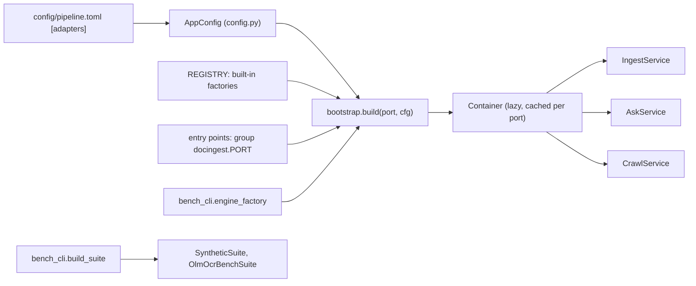
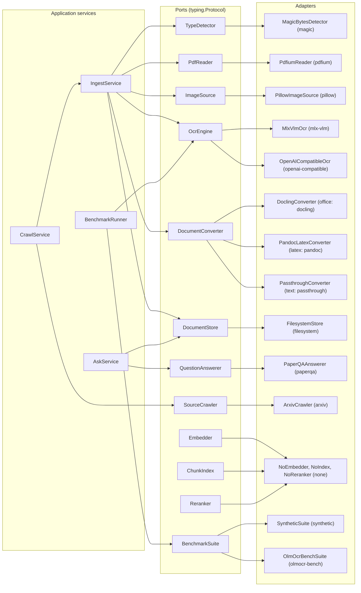
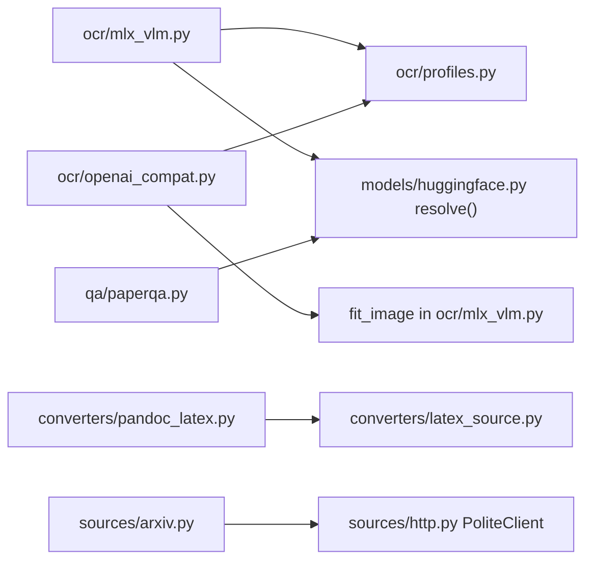
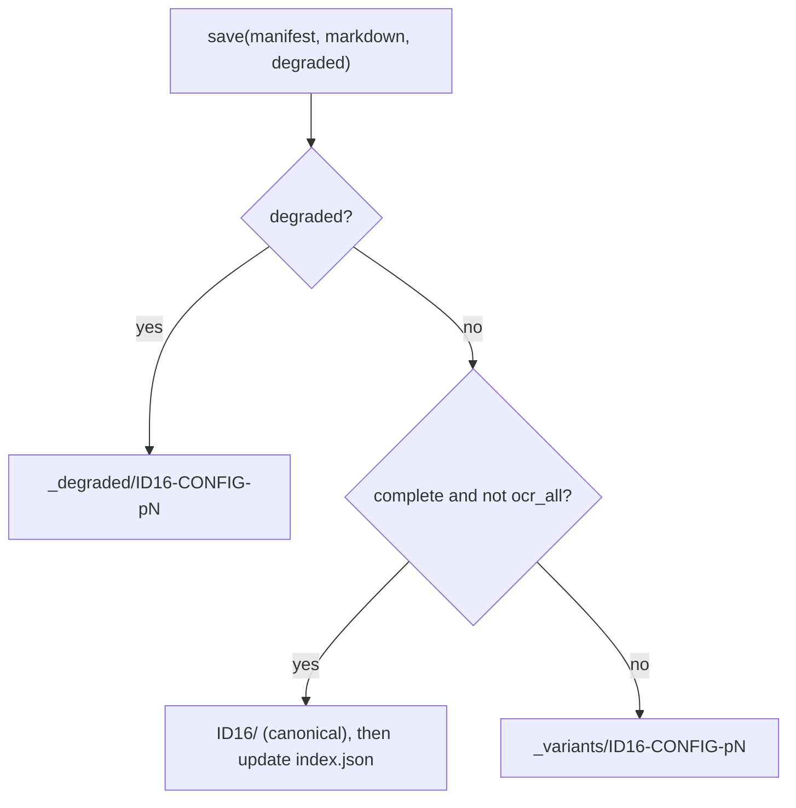
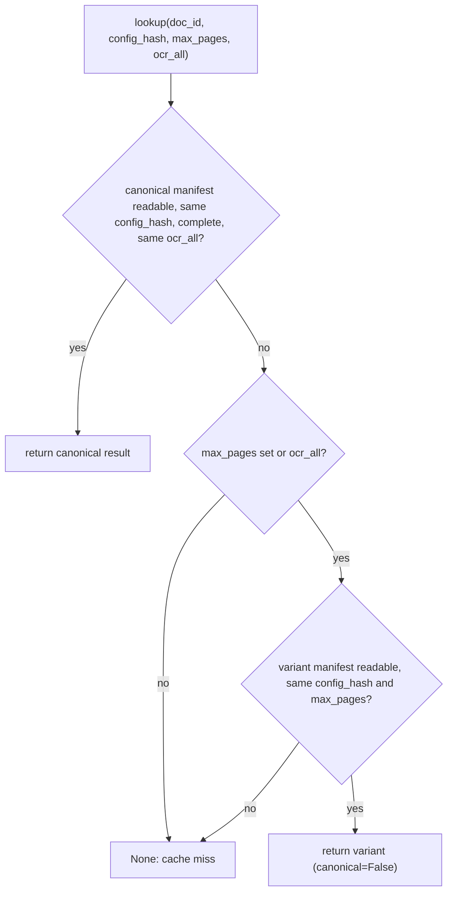
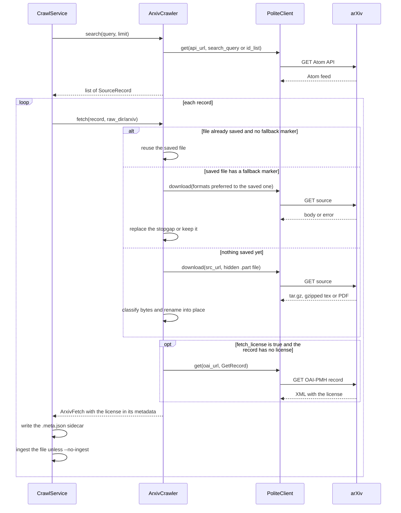
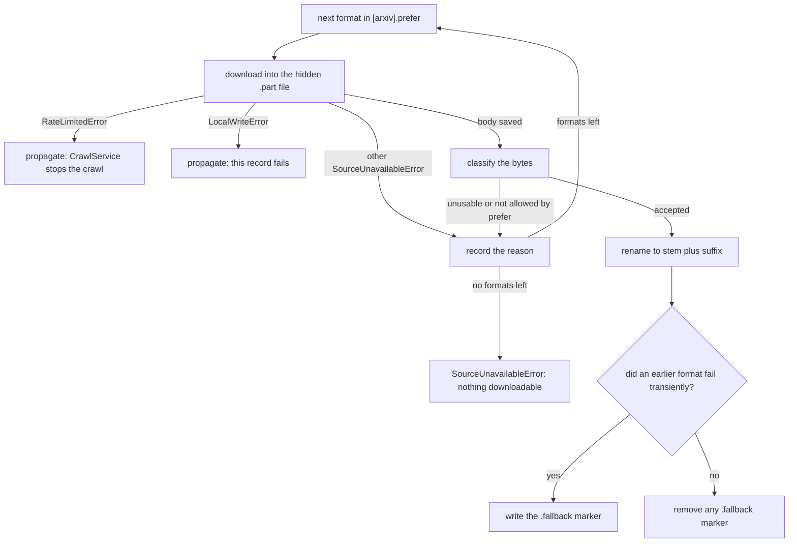
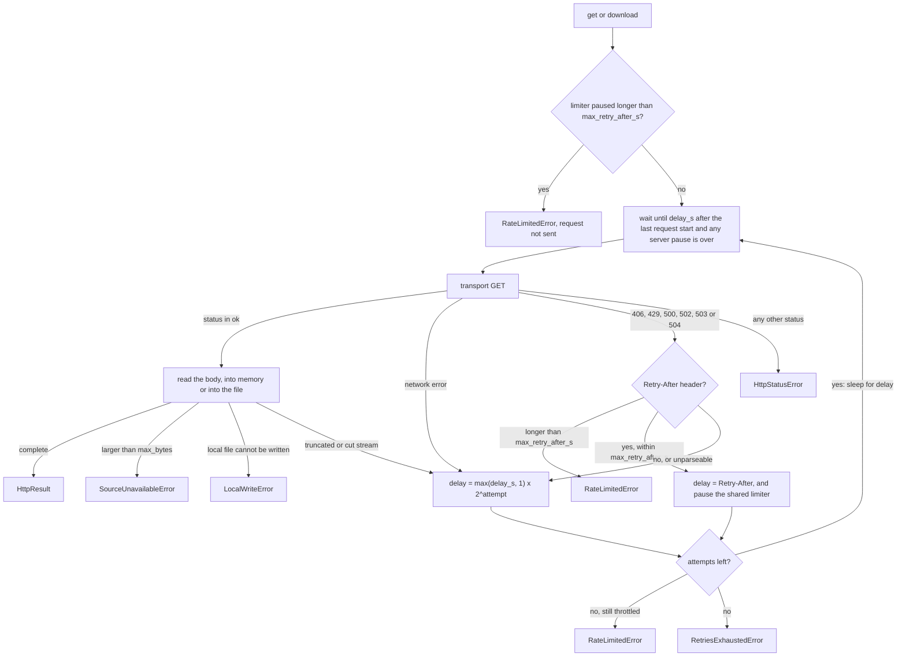
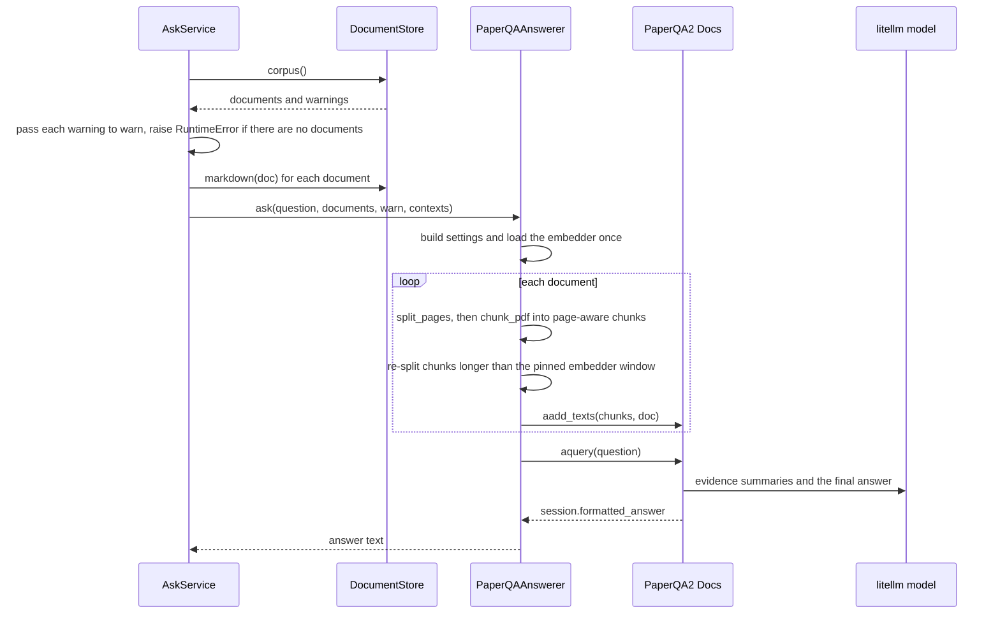
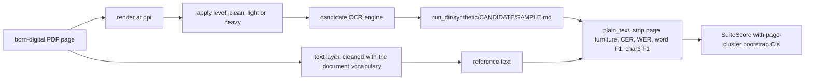

# Adapters

`src/docingest/adapters/` holds the concrete implementations of the ports defined in [`../ports/`](../ports/README.md). Each adapter wraps one library, service or file layout (pypdfium2, Pillow, mlx-vlm, an OpenAI-compatible server, pandoc, Docling, the local filesystem, arXiv, PaperQA2) and satisfies a port, which is a `typing.Protocol`, so the application layer never imports a concrete library. A few shared helpers live here too (the Hugging Face snapshot resolver, the polite HTTP client, the OCR profiles, the LaTeX source utilities); they implement no port.

Which adapter plugs into which port is a configuration choice (the `[adapters]` table of `config/pipeline.toml`), resolved by the composition root [`../bootstrap.py`](../bootstrap.py). Nothing else in the package constructs adapters, apart from the driving adapters in [`../entrypoints/`](../entrypoints/README.md) (the benchmark CLI builds its suites and per-candidate OCR engines).

This page is the catalog. For every adapter it lists the port it implements, its registry name, the configuration keys it reads, its fingerprint, its dependencies, and the behaviour and limits worth knowing before you use it or replace it. OCR engines and document converters have their own detailed pages: [ocr/README.md](ocr/README.md) and [converters/README.md](converters/README.md).

## Contents

- [Catalog](#catalog)
- [How adapters are selected and wired](#how-adapters-are-selected-and-wired)
- [Ports to adapters map](#ports-to-adapters-map)
- [Fingerprints and the cache key](#fingerprints-and-the-cache-key)
- [detection: MagicBytesDetector](#detection-magicbytesdetector)
- [pdf: PdfiumReader](#pdf-pdfiumreader)
- [images: PillowImageSource](#images-pillowimagesource)
- [ocr: OCR engines (summary)](#ocr-ocr-engines-summary)
- [converters: document converters (summary)](#converters-document-converters-summary)
- [store: FilesystemStore](#store-filesystemstore)
- [sources: ArxivCrawler](#sources-arxivcrawler)
- [sources: the polite HTTP helper](#sources-the-polite-http-helper)
- [qa: PaperQAAnswerer](#qa-paperqaanswerer)
- [retrieval: the none adapters](#retrieval-the-none-adapters)
- [models: Hugging Face snapshot resolution](#models-hugging-face-snapshot-resolution)
- [datasets: benchmark suites](#datasets-benchmark-suites)
- [Domain errors raised by adapters](#domain-errors-raised-by-adapters)
- [Writing a new adapter](#writing-a-new-adapter)
- [Testing adapters](#testing-adapters)
- [Related documentation](#related-documentation)

## Catalog

### Adapters selected through `[adapters]`

These are the entries of `bootstrap.REGISTRY`. The first column is the key in the `[adapters]` table of `config/pipeline.toml` (and the port name used by `bootstrap.build`), the second is the value that selects the adapter. The defaults in the table are the values of `AdapterSelection` in [`../config.py`](../config.py).

| `[adapters]` key | Name (default in bold) | Class | Module | Port | Fingerprint | Dependencies |
|---|---|---|---|---|---|---|
| `detector` | **`magic`** | `MagicBytesDetector` | [detection/magic.py](detection/magic.py) | `TypeDetector` | none | stdlib |
| `pdf` | **`pdfium`** | `PdfiumReader` | [pdf/pdfium.py](pdf/pdfium.py) | `PdfReader` | `pypdfium2 <version>` | `pypdfium2` (core) |
| `ocr` | **`mlx-vlm`** | `MlxVlmOcr` | [ocr/mlx_vlm.py](ocr/mlx_vlm.py) | `OcrEngine` | `mlx-vlm ` + JSON of settings | `mlx` extra (macOS, Apple Silicon only) |
| `ocr` | `openai-compatible` | `OpenAICompatibleOcr` | [ocr/openai_compat.py](ocr/openai_compat.py) | `OcrEngine` | `openai-compatible ` + JSON of settings | stdlib HTTP, plus a running server |
| `images` | **`pillow`** | `PillowImageSource` | [images/pillow.py](images/pillow.py) | `ImageSource` | `pillow <version>` | `pillow` (core) |
| `office` | **`docling`** | `DoclingConverter` | [converters/docling.py](converters/docling.py) | `DocumentConverter` | `docling <version>` | `office` extra |
| `latex` | **`pandoc`** | `PandocLatexConverter` | [converters/pandoc_latex.py](converters/pandoc_latex.py) | `DocumentConverter` | `pandoc-latex r2` + pandoc version, arguments, `split_level`, fallback | `pypandoc-binary`, `pylatexenc` (core) |
| `text` | **`passthrough`** | `PassthroughConverter` | [converters/plaintext.py](converters/plaintext.py) | `DocumentConverter` | `passthrough 1` | none |
| `store` | **`filesystem`** | `FilesystemStore` | [store/filesystem.py](store/filesystem.py) | `DocumentStore` | none | stdlib |
| `qa` | **`paperqa`** | `PaperQAAnswerer` | [qa/paperqa.py](qa/paperqa.py) | `QuestionAnswerer` | none | `qa` extra (`paper-qa[local]`) |
| `crawler` | **`arxiv`** | `ArxivCrawler` | [sources/arxiv.py](sources/arxiv.py) | `SourceCrawler` | none | stdlib |
| `embedder` | **`none`** | `NoEmbedder` | [retrieval/none.py](retrieval/none.py) | `Embedder` | `none` | stdlib |
| `index` | **`none`** | `NoIndex` | [retrieval/none.py](retrieval/none.py) | `ChunkIndex` | `none` | stdlib |
| `reranker` | **`none`** | `NoReranker` | [retrieval/none.py](retrieval/none.py) | `Reranker` | none | stdlib |

"Core" means a regular dependency in `pyproject.toml`. Extras are installed with `uv sync --extra <name>` (`mlx`, `qa`, `office`), or all at once with `uv sync --all-extras`.

### Adapters and helpers outside the registry

| Module | Provides | Role | Built or used by |
|---|---|---|---|
| [datasets/synthetic.py](datasets/synthetic.py) | `SyntheticSuite`, `make_scan`, `degrade`, `degrade_heavy` | `BenchmarkSuite` named `synthetic`; simulated scans with known ground truth | `build_suite` in [`../entrypoints/bench_cli.py`](../entrypoints/bench_cli.py); `docingest make-scan` |
| [datasets/olmocr_bench.py](datasets/olmocr_bench.py) | `OlmOcrBenchSuite`, `prepare_subset`, `ScorerConfig` | `BenchmarkSuite` named `olmocr-bench`, scored by the official scorer | `build_suite` in `bench_cli.py` |
| [ocr/profiles.py](ocr/profiles.py) | `OcrProfile`, `PROFILES`, `profile_for`, `attempts`, `acceptable` | Per-model prompt, image size, output clean-up and retry ladder | Both OCR adapters |
| [converters/latex_source.py](converters/latex_source.py) | `unpack`, `find_main`, `flatten`, `prepare_for_pandoc`, `split_sections` | Safe unpacking of LaTeX sources and archives, main-file detection, include inlining (no pandoc, no pylatexenc) | `PandocLatexConverter` |
| [sources/http.py](sources/http.py) | `PoliteClient`, `UrllibTransport`, `RateLimiter`, `RawResponse`, `HttpStatusError`, `RetriesExhaustedError`, `LocalWriteError` | Rate-limited, serialized, retrying HTTP GET (stdlib only) | `ArxivCrawler` |
| [models/huggingface.py](models/huggingface.py) | `resolve(repo_id, revision)` | Pinned Hugging Face snapshot to a local path, offline first | `MlxVlmOcr`, `qa/paperqa.py`, `docingest model-path` |

## How adapters are selected and wired

1. `load_config()` in [`../config.py`](../config.py) reads `config/pipeline.toml` into an `AppConfig`. Its `[adapters]` table (`AdapterSelection`, unknown keys rejected) has exactly ten keys: `detector`, `pdf`, `ocr`, `images`, `office`, `latex`, `text`, `store`, `qa`, `crawler`.
2. `bootstrap.REGISTRY[port][name]` maps each name to a factory with the signature `(AppConfig) -> adapter`. Every factory imports its adapter module inside the function body, so an adapter module is imported only when that adapter is selected and built. The heavy optional libraries are deferred further: mlx-vlm is imported on the first `transcribe()`, Docling on the first `convert()`, PaperQA2 on the first `ask()`.
3. `bootstrap.build(port, cfg)` calls `factory(port, getattr(cfg.adapters, port))(cfg)`. `factory()` returns the built-in when the name is in `REGISTRY` (a built-in wins a name clash), otherwise the installed plugin with that entry-point name, otherwise raises `ValueError` listing the available names.
4. `bootstrap.Container` builds each adapter on first use and keeps it (`Container.adapter(port)`). The document converters are wrapped in `_LazyConverters`, a dict that builds the `office`, `latex` or `text` adapter only when a document of that `SourceKind` is ingested. `Container(cfg, overrides={"ocr": fake})` replaces any port, which is how tests and notebooks inject fakes.
5. Third-party adapters plug in without editing this repository: an entry point in the group `docingest.<port>` (for example `docingest.ocr`, where `<port>` is one of the ten `[adapters]` keys) whose object is a factory `(AppConfig) -> adapter`. `bootstrap.plugins()` lists entry points without importing them; only the selected plugin is loaded, and a plugin import error is re-raised with a note naming the plugin.

The following diagram shows how the configuration reaches the services through the composition root.



`docingest adapters [-c FILE]` prints the selected adapter and every available name per port (plugins are marked, an unknown selected name is flagged `(unknown)`, and a selected plugin that fails to import is shown as broken instead of crashing the listing). With the default configuration it prints:

```text
                  Ports and adapters
┏━━━━━━━━━━┳━━━━━━━━━━━━━┳━━━━━━━━━━━━━━━━━━━━━━━━━━━━┓
┃ port     ┃ selected    ┃ available                  ┃
┡━━━━━━━━━━╇━━━━━━━━━━━━━╇━━━━━━━━━━━━━━━━━━━━━━━━━━━━┩
│ detector │ magic       │ magic                      │
│ pdf      │ pdfium      │ pdfium                     │
│ ocr      │ mlx-vlm     │ mlx-vlm, openai-compatible │
│ images   │ pillow      │ pillow                     │
│ office   │ docling     │ docling                    │
│ latex    │ pandoc      │ pandoc                     │
│ text     │ passthrough │ passthrough                │
│ store    │ filesystem  │ filesystem                 │
│ qa       │ paperqa     │ paperqa                    │
│ crawler  │ arxiv       │ arxiv                      │
│ embedder │ none        │ none                       │
│ index    │ none        │ none                       │
│ reranker │ none        │ none                       │
└──────────┴─────────────┴────────────────────────────┘
```

### Import rules

The contracts in `pyproject.toml` (checked by `lint-imports`, part of `./scripts/check.sh`) constrain what an adapter may import:

| Contract | Consequence for adapters |
|---|---|
| Hexagonal layers | Adapters may import `config`, `application`, `ports` and `domain`, never `bootstrap` or `entrypoints`. |
| Adapters are independent of each other | `detection`, `pdf`, `ocr`, `images`, `converters`, `store`, `sources`, `qa`, `retrieval` and `datasets` must not import one another. `models` is not in that list, so the shared Hugging Face resolver can be used by any of them. |
| Only the composition root and entrypoints wire concrete adapters | `docingest.adapters` may be imported only by `docingest.bootstrap`, `docingest.entrypoints` and other adapter modules. |

## Ports to adapters map

The next diagram maps each application service to the ports it depends on and each port to the adapters that implement it. Registry names are in parentheses. The benchmark suites and OCR engines used by `BenchmarkRunner` are built by the benchmark CLI rather than by `Container`.



Inside the adapters layer a few modules share helpers. This diagram shows those dependencies, which are the only imports between adapter modules.



## Fingerprints and the cache key

Ports whose output ends up in a stored document declare a `fingerprint: str` (`PdfReader`, `OcrEngine`, `ImageSource`, `DocumentConverter`), and so does `BenchmarkSuite`. `Embedder` and `ChunkIndex` declare one too, but it identifies a chunk index, not a stored document, and is in no cache key. `IngestService.config_hash()` in [`../application/ingest.py`](../application/ingest.py) hashes the fingerprints that can change a document of a given kind, so replacing an adapter or changing one of its settings produces a new `config_hash` and the stored result is no longer a cache hit.

| Document kind | Parts hashed into `config_hash` |
|---|---|
| `pdf` | `PIPELINE_VERSION`, kind, `ocr_all`, `[routing]` policy, `PdfReader.fingerprint`, `OcrEngine.fingerprint` |
| `image` | `PIPELINE_VERSION`, kind, `ocr_all`, `ImageSource.fingerprint`, `OcrEngine.fingerprint` |
| `office`, `latex`, `text` | `PIPELINE_VERSION`, kind, `ocr_all`, the fingerprint of that kind's converter |

`ocr_all` can only be true for a PDF: `IngestService` ignores `--ocr-all` for every other kind. The hash is the first 12 hex characters of a SHA-256 of the JSON list of these parts. The detector, the store, the QA adapter and the crawler have no fingerprint and are not part of any cache key: the detector's only output that matters is the kind, which is in the key, and the others do not change what is written. A replacement detector that only changes the MIME type recorded in the manifest does not invalidate stored results; re-run with `docingest ingest --force` if that matters.

Rules for a fingerprint, all enforced or relied on by existing code and tests:

- Include the adapter name, the library version, and every setting that can change the output text (for OCR: model, revision, profile and its `code_version`, prompt, image size, dpi, generation settings).
- When the adapter's own code changes its output while library versions and settings stay the same, change the fingerprint by hand: a revision constant (`PandocLatexConverter.REVISION`, `"passthrough 1"`), or for an OCR profile's `postprocess` / `valid` code its `code_version` (`tests/unit/test_ocr_profiles.py` pins that code, so an edit cannot go unnoticed).
- Leave out settings that cannot change the text. `OpenAICompatibleOcr` excludes its timeout, retry count and API key.
- Keep it stable: the same settings give the same string, and calling the adapter does not change it (`test_fingerprint_is_stable` in [`tests/contract/test_ocr_contract.py`](../../../tests/contract/test_ocr_contract.py)).

## detection: MagicBytesDetector

| | |
|---|---|
| Module | [detection/magic.py](detection/magic.py) |
| Port | `TypeDetector.detect(path) -> (SourceKind, mime)` |
| Registry | `[adapters] detector = "magic"` |
| Config keys | none (constructed without arguments) |
| Fingerprint | none |
| Dependencies | stdlib (`gzip`, `tarfile`, `codecs`) |

The detector decides which pipeline a file takes. It reads the first 1024 bytes and trusts magic bytes over the file extension ("extensions lie"), using the suffix only as a fallback. Checks run in this order, and the first match wins:

| # | Condition | Result kind | MIME |
|---|---|---|---|
| 1 | Starts with `%PDF-`, unless the suffix is `.md`, `.markdown`, `.txt`, `.tex` or `.ltx` and the head is valid UTF-8 without NUL bytes (a TeX comment line such as `%PDF-A compliant`) | `pdf` | `application/pdf` |
| 2 | PNG signature | `image` | `image/png` |
| 3 | `FF D8 FF` | `image` | `image/jpeg` |
| 4 | `II*\0` or `MM\0*` | `image` | `image/tiff` |
| 5 | `GIF8` | `image` | `image/gif` |
| 6 | `RIFF` + `WEBP` at offset 8 | `image` | `image/webp` |
| 7 | `BM`, zero reserved bytes and a known DIB header size (12, 40, 52, 56, 64, 108 or 124) | `image` | `image/bmp` |
| 8 | Gzip (`1F 8B`): see the gzip rule below | `latex` or error | `application/gzip` |
| 9 | A valid tar header in the first 512-byte block (checksum verified) | `latex` | `application/x-tar` |
| 10 | `%PDF-d.d` anywhere in the head, and the suffix is not one of the known office, text, image or LaTeX suffixes (the PDF format tolerates junk before the header) | `pdf` | `application/pdf` |
| 11 | Suffix `.tex` or `.ltx` | `latex` | `application/x-tex` |
| 12 | Suffix `.docx`, `.pptx`, `.xlsx`, `.html`, `.htm`, `.xhtml` | `office` | the format's MIME type |
| 13 | Suffix `.md` or `.markdown` | `text` | `text/markdown` |
| 14 | Suffix `.txt` | `text` | `text/plain` |
| 15 | Anything else | raises `UnsupportedInputError` | |

Gzip rule (`MagicBytesDetector._gzip`): the first 1024 decompressed bytes decide. A tar inside is a LaTeX source archive; a PDF inside raises `UnsupportedInputError` asking to gunzip it first; PostScript or an HTML page inside raises `UnsupportedInputError`; anything else is treated as a single gzipped `.tex`; a corrupt or truncated stream raises `UnsupportedInputError`. This is deliberately the same rule as the arXiv crawler's `classify()`, so every file the crawler saves as LaTeX is ingested as LaTeX (tested in `test_whatever_the_arxiv_crawler_saves_as_latex_is_latex`).

Limits:

- Images need a real signature. The image suffixes have no fallback, so a `.png` file whose bytes match none of the rules above is rejected (a `.png` holding JPEG bytes is accepted as `image/jpeg`).
- Office formats are recognized by suffix only (there is no ZIP sniffing), so a `.docx` renamed to `.bin` is rejected.
- The tar check validates one header block with `tarfile.TarInfo.frombuf` instead of opening the archive, because `tarfile.open` can read a large pax or GNU long-name member into memory before any size limit applies.

## pdf: PdfiumReader

| | |
|---|---|
| Module | [pdf/pdfium.py](pdf/pdfium.py) |
| Port | `PdfReader.open(path) -> PdfDocument`; `PdfDocument` (`title`, `len()`, `page(i)`, `close()`); `PdfPage` (`signals()`, `render(dpi)`) |
| Registry | `[adapters] pdf = "pdfium"` |
| Config keys | none read by the adapter. `[ocr] dpi` sets the render resolution (through `OcrEngine.dpi`), and `[routing]` sets the thresholds applied to its signals (in [`../domain/routing.py`](../domain/routing.py)). |
| Fingerprint | `pypdfium2 <installed version>`, for example `pypdfium2 5.13.0`. It is also recorded as the `engine` of every text-layer page. |
| Dependencies | `pypdfium2` (core) |

Behaviour:

- `open()` wraps `pypdfium2.PdfDocument`. A `PdfiumError` (corrupt, encrypted or truncated file) becomes `DocumentOpenError`.
- `PdfiumDocument.title` is the PDF metadata `Title`, stripped, or `None` when empty.
- `PdfiumPage.signals()` returns `(PageSignals, raw_text)`:
  - `raw_text` is `get_textpage().get_text_bounded()`, returned unmodified.
  - `n_chars` counts non-whitespace characters of the text layer.
  - `n_images` and `image_coverage` come from the page's image objects, including images nested inside Form XObjects: their bounds are transformed through each enclosing container's matrix, then clipped to the visible page box (`get_bbox()`, in unrotated user space, not assumed to start at the origin). Areas are summed, capped at 1.0 and rounded to 3 decimals.
  - `garbage_ratio` and `alpha_ratio` come from [`../domain/text.py`](../domain/text.py), rounded to 3 decimals.
- `PdfiumPage.render(dpi)` renders at scale `dpi / 72` and returns a PIL image.

Text layer and U+0002. pdfium replaces a line-end hyphen with the control character U+0002 and joins the two lines, both for real hyphenation (`transduc-tion`) and for compounds (`sequence-aligned`). The adapter returns that marker as is. The domain handles it: `garbage_ratio` does not count U+0002 as a broken glyph, and `IngestService` passes every text-layer page to `clean_text_layer(raw, vocab)` with the vocabulary of the whole document. The two halves are joined only when the joined word occurs elsewhere in the document; otherwise a hyphen is kept, which never loses information. A PDF adapter built on another library must return a raw text layer that `clean_text_layer` handles correctly, or the Markdown output changes.

How the signals are used: `IngestService` passes them to `domain.routing.decide()`, which sends a page to OCR when it has fewer than `min_chars` characters, when images cover at least `image_coverage` of it with fewer than `image_coverage_max_chars` characters, when `garbage_ratio` exceeds `max_garbage_ratio`, when `alpha_ratio` is below `min_alpha_ratio`, or when `--ocr-all` forces it. See [`../domain/README.md`](../domain/README.md) and [`../../../config/README.md`](../../../config/README.md).

## images: PillowImageSource

| | |
|---|---|
| Module | [images/pillow.py](images/pillow.py) |
| Port | `ImageSource.frames(path) -> list[PIL.Image.Image]` |
| Registry | `[adapters] images = "pillow"` |
| Config keys | none |
| Fingerprint | `pillow <version>` (hashed with the OCR engine's fingerprint for images: decoding decides what the model sees) |
| Dependencies | `pillow` (core) |

Behaviour and limits:

- Opens the file with Pillow and returns a copy of every frame (`ImageSequence.Iterator`), so a multi-page TIFF yields several frames and each frame becomes one OCR page.
- `UnidentifiedImageError` and `OSError` become `DocumentOpenError`.
- Every frame is decoded into memory at once. `--max-pages` truncates the list after it is loaded.
- No preprocessing happens here. EXIF orientation, transparency and resizing are handled by the OCR adapters (`fit_image` in [ocr/mlx_vlm.py](ocr/mlx_vlm.py)).

## ocr: OCR engines (summary)

Full reference: [ocr/README.md](ocr/README.md).

| | `MlxVlmOcr` | `OpenAICompatibleOcr` |
|---|---|---|
| Module | [ocr/mlx_vlm.py](ocr/mlx_vlm.py) | [ocr/openai_compat.py](ocr/openai_compat.py) |
| Registry | `[adapters] ocr = "mlx-vlm"` (default) | `[adapters] ocr = "openai-compatible"` |
| Runs | In process, on Apple Silicon | Any server that accepts `POST {base_url}/chat/completions` with an `image_url` part (vLLM, LM Studio, Ollama `/v1`, `mlx_vlm.server`, hosted APIs) |
| Model loading | Lazily on the first `transcribe()`, from the pinned snapshot resolved by `models/huggingface.py`; `unload()` frees it | Stateless; the server decides which weights answer, `repo_id`/`revision` only label the output |
| Fingerprint | `mlx-vlm ` + sorted JSON of mlx-vlm version, model, profile fields, dpi, `max_tokens`, `temperature`, `repetition_penalty` | `openai-compatible ` + sorted JSON of `base_url`, `served_model`, model, profile fields, dpi, generation settings (not timeout, retries or key) |
| Dependencies | `mlx` extra (`mlx-vlm`, installed only on macOS arm64) | stdlib `urllib` |

Both read the `[ocr]` table: `repo_id`, `revision` (a commit sha, required unless `repo_id` is the default model), `profile`, `prompt`, `max_side`, `dpi` (default 150), `max_tokens`, `temperature` (default 0.0), `repetition_penalty`. `OpenAICompatibleOcr` also reads `base_url` (default `http://127.0.0.1:8080/v1`), `served_model` (default: `repo_id`), `api_key_env` (the name of an environment variable, never the key), `timeout_s` (default 600.0) and `retries` (default 3).

Shared behaviour, from [ocr/profiles.py](ocr/profiles.py):

- A profile (`markdown`, `olmocr`, `nanonets`, `glm-ocr`, `paddleocr-vl`) fixes the prompt, the longest image side, the output clean-up and model-card defaults for `max_tokens` and `repetition_penalty`. `None` in `[ocr]` means "use the profile's value".
- Each page goes through a retry ladder (`attempts()`): the profile's own ladder (only `olmocr` has one), or the configured `temperature` and `repetition_penalty` (greedy with the default `temperature = 0.0`) followed by two sampled attempts (temperature 0.2, then 0.5) with a repetition penalty of at least 1.15, then 1.25. An attempt is accepted when it did not stop at `max_tokens` (`finish_reason == "length"`), leaves some text after clean-up, and passes the profile's validity check. `OcrResult` reports the whole ladder (`attempts`, `first_finish_reason`, `total_gen_tokens`).

The benchmark selects an OCR adapter per candidate with the `ocr` field of a `[[candidates]]` entry in `config/benchmark.toml` (default `mlx-vlm`); `bench_cli.engine_factory` builds it through `bootstrap.build("ocr", ...)`.

## converters: document converters (summary)

Full reference: [converters/README.md](converters/README.md). All three implement `DocumentConverter.convert(path) -> Conversion` and are built lazily per `SourceKind` by `_LazyConverters`. The port asks for `ConversionError` when a document cannot be converted: `DoclingConverter` and `PandocLatexConverter` raise it, while `PassthroughConverter` replaces undecodable bytes instead of failing.

| Kind | Registry | Class | Config keys | Output | Notes |
|---|---|---|---|---|---|
| `office` | `office = "docling"` | `DoclingConverter` | none | One segment, `PageMethod.DOCLING` | Needs the `office` extra. If Docling is missing, `convert()` raises `ConversionError` suggesting `uv sync --extra office`, and the fingerprint reads `docling missing`. |
| `latex` | `latex = "pandoc"` | `PandocLatexConverter` | `[latex]`: `timeout_s` (120), `max_archive_mb` (200), `split_level` (2), `pandoc_path` (none: the pandoc bundled by `pypandoc-binary`), `fallback` (true) | One segment per section at `split_level` (an `Abstract` segment first when the source has one), `PageMethod.LATEX`; `PageMethod.LATEX_PLAINTEXT` for the fallback | Accepts `.tex`, tar and tar.gz archives and single gzipped `.tex` files. Unpacks safely, picks the main file, inlines includes in Python, runs pandoc `--sandbox` with a heap cap and a wall-clock timeout. Falls back to pylatexenc plain text when pandoc fails, times out or keeps too little text, and sets `degraded=True` when the cause was the machine (timeout, crash, missing pandoc) rather than the document. |
| `text` | `text = "passthrough"` | `PassthroughConverter` | none | One segment, `PageMethod.PASSTHROUGH` | Reads the file as text with `errors="replace"`. |

The pandoc fingerprint has the form `pandoc-latex r2 | pandoc <version> | <pandoc arguments> | split_level=<n> | pylatexenc <version>` (the last part is `no fallback` when `fallback = false`). A `Conversion` with `degraded=True` is stored under `_degraded/` by the filesystem store and is never served from the cache, so the next run retries the real conversion.

## store: FilesystemStore

| | |
|---|---|
| Module | [store/filesystem.py](store/filesystem.py) |
| Port | `DocumentStore`: `lookup()`, `save()`, `markdown()`, `corpus()` |
| Registry | `[adapters] store = "filesystem"` |
| Config keys | `output_dir` (top level, default `data/normalized`) |
| Fingerprint | none |
| Dependencies | stdlib |

The store is content-addressed: a document's `doc_id` is the SHA-256 of its raw bytes (computed by `IngestService`), and its directory is named after the first 16 hex characters.

```text
<output_dir>/
├── <doc_id[:16]>/                               canonical: complete run, no --ocr-all, not degraded
│   ├── document.md
│   └── manifest.json
├── _variants/<doc_id[:16]>-<config_hash>-p<N|all>/   partial runs (--max-pages below the page count) and --ocr-all runs
├── _degraded/<doc_id[:16]>-<config_hash>-p<N|all>/   environment-caused fallbacks (never served)
└── index.json                                   catalog of canonical documents
```

`p<N|all>` is `p` followed by the `--max-pages` value, or `pall` when no limit was set.

### save

A result is canonical when it is complete (`n_pages == source_pages`), was not produced with `--ocr-all`, and is not degraded. Canonical results go to `<doc_id[:16]>/` and update `index.json`; everything else goes to `_variants/` or `_degraded/`. Saving the same run again replaces it in place (used when only the bibliographic metadata changed). Because partial, forced-OCR and degraded runs are written to other directories, they never replace a complete result.



### lookup

`lookup(doc_id, config_hash, max_pages=..., ocr_all=...)` returns a cached result valid for those run options, or `None`. A complete canonical result also satisfies a `--max-pages` request. `_degraded/` is never read here.



### corpus and index

- `corpus()` returns one `StoredDocument` per `doc_id`: the canonical result if there is one, otherwise the variant or degraded result with the most pages. It also returns warnings for unreadable manifests, for documents whose best result is under `_variants/` (reported as `only a partial run exists (n_pages/source_pages pages)`, which also covers a complete `--ocr-all` run), and for documents that only have a degraded conversion. `AskService` passes these warnings to its `warn` callback (the CLI prints them) before answering.
- `index.json` maps each canonical `doc_id` to `source_name`, `title`, `kind`, `pages`, `ocr_pages`, `dir` and `citation`.

### Durability

- Every write (`document.md`, `manifest.json`, `index.json`) is atomic: the content goes to a hidden temporary file in the same directory (`.<name>.*.tmp`), which is then renamed over the target with `os.replace`. On any error the temporary file is removed.
- `mkstemp` creates files with mode 0600; the store resets them to `0o666 & ~umask` so outputs have normal permissions. The umask is read once at import time.
- A missing, truncated or older-schema `manifest.json` counts as a cache miss, so the document is simply processed again.

## sources: ArxivCrawler

| | |
|---|---|
| Module | [sources/arxiv.py](sources/arxiv.py) |
| Port | `SourceCrawler`: `search(query, limit) -> list[SourceRecord]`, `fetch(record, dest_dir) -> FetchedSource` |
| Registry | `[adapters] crawler = "arxiv"` |
| Config keys | `[arxiv]` (below); `CrawlService` passes `dest_dir = <raw_dir>/arxiv` (default `data/raw/arxiv`) |
| Fingerprint | none |
| Dependencies | stdlib only (through [sources/http.py](sources/http.py)) |
| Used by | `docingest crawl QUERY [--limit N] [-c FILE] [--no-ingest] [--max-pages N]` through `CrawlService` (`--limit` defaults to 5) |

Configuration (`ArxivConfig` in [`../config.py`](../config.py)):

| Key | Default | Meaning |
|---|---|---|
| `api_url` | `https://export.arxiv.org/api/query` | Atom search API (metadata, CC0) |
| `src_url` | `https://arxiv.org/src/{id}` | Source download, used for the `latex` format |
| `eprint_url` | `https://arxiv.org/e-print/{id}` | Used for `latex` only when `src_url` is empty (`/e-print/` redirects to `/src/`) |
| `pdf_url` | `https://arxiv.org/pdf/{id}` | PDF download, used for the `pdf` format |
| `oai_url` | `https://oaipmh.arxiv.org/oai` | OAI-PMH endpoint used for licenses |
| `delay_s` | `3.0` | Minimum seconds between the starts of any two requests |
| `timeout_s` | `60.0` | Per-request timeout |
| `retries` | `3` | Extra attempts after a transient failure |
| `contact` | none | Adds `mailto:<contact>` to the User-Agent |
| `prefer` | `["latex", "pdf"]` | Download order; must be a non-empty list drawn from `latex` and `pdf`, otherwise the constructor raises `ValueError` |
| `fetch_license` | `true` | One extra OAI-PMH request per paper |

`{id}` is replaced by the record key, which includes the version (for example `1706.03762v7`). The User-Agent is `docingest/<version> (+research ingestion)`, or `docingest/<version> (+research ingestion; mailto:<contact>)` when `contact` is set.

### search

- The query is arXiv query syntax (`cat:cs.CL AND ti:retrieval`), sent as `search_query`, or an id list written `ids:1706.03762,math/0211159` (commas or whitespace), sent as `id_list` with an empty `search_query`. Ids may be bare, `arXiv:`-prefixed, or `abs`/`pdf`/`src` URLs; duplicates are dropped and at most `limit` ids are requested. An empty query, or `ids:` with no id, raises `ValueError`; `limit < 1` returns an empty list before any request.
- Query results are paged (at most 2000 per request) until `limit` records or `totalResults` are reached. Responses with status 200 and 400 are both parsed, because arXiv reports a bad query as a 400 whose feed holds an error entry; that entry raises `SourceUnavailableError`, and so does malformed XML.
- A page that comes back empty before `totalResults` is a known transient API quirk: it is requested again up to 3 times (`EMPTY_PAGE_RETRIES`), then reported as an error when nothing was found or as a warning after partial results.
- Entries without an arXiv id are skipped with a warning, but still count for pagination.
- Id lists are sent in batches of up to 2000 ids. If arXiv refuses a batch of more than one id with HTTP 406 (after the HTTP client's own retries), the batch is retried one id at a time; ids refused individually are skipped with a warning, and `SourceUnavailableError` is raised when ids were refused and no record was returned at all. A 406 on a single-id batch, or any other error, propagates.
- Records are deduplicated by key. Each carries `SourceMetadata`: `title`, `authors`, `year` (from `published`, else `updated`), `abstract`, `doi`, `arxiv_id` (without version), `version`, `url`, `categories` (primary category first).

### fetch

Downloaded files are named after the record key made safe for the filesystem (`safe_filename`: `math/0211159v1` becomes `math_0211159v1`).

| File in `dest_dir` | Meaning |
|---|---|
| `<stem>.tar.gz`, `<stem>.tar` | LaTeX source archive, `FetchedSource.format = "latex-archive"` |
| `<stem>.tex.gz`, `<stem>.tex` | Single LaTeX file, `format = "latex"` |
| `<stem>.pdf` | PDF, `format = "pdf"` |
| `.<stem>.<pid>.part` | Hidden temporary file during a download, always removed afterwards |
| `.<stem>.fallback` | Hidden marker: the saved file is a stopgap because the preferred format failed transiently. Its content lists the reasons. |
| `<file>.meta.json` | Metadata sidecar. Written by `CrawlService`, not by the adapter. |

Steps of `fetch(record, dest_dir)`:

1. If a non-empty file for the key already exists (searched in `prefer` order), it is reused without a download request (the license lookup of step 5 still runs). If a fallback marker exists, the formats preferred to the saved one are tried once more first: on success the stopgap file is replaced (its sidecar moves to the new file), on a permanent failure the marker is removed and the stopgap becomes final, on a transient failure it stays a stopgap.
2. Otherwise each format in `prefer` is tried in order. The body is streamed into the hidden `.part` file, then classified by its bytes (`classify()`): `%PDF-` is a PDF; a gzip holding a tar is `latex-archive`; a gzip holding a PDF, PostScript or HTML, or a corrupt gzip, is rejected; any other gzip is a single `.tex`; a tar is `latex-archive`; a non-HTML file with a `.tex` name hint or a TeX command such as `\documentclass` or `\section` is `latex`. The `Content-Disposition` file name is only a tie-breaker. The file is then renamed into place.
3. A PDF-only submission returned by the source URL is accepted as `pdf` only if `pdf` is in `prefer`. The `pdf` choice must return a PDF.
4. `RateLimitedError` is never a reason to try the next format (the PDF lives on the same host): it propagates, and `CrawlService` stops the whole crawl, marking the remaining records as not attempted. Other `SourceUnavailableError`s (an unaccepted HTTP status, exhausted retries, an oversized body) and unusable bodies are recorded and the next format is tried; only `RetriesExhaustedError` counts as a transient failure for the fallback marker. A `LocalWriteError` (disk full, permissions) is not caught: that record fails and the crawl moves on. If nothing is downloadable, `SourceUnavailableError` lists every reason.
5. The license is added (next section) and an `ArxivFetch` is returned. It extends `FetchedSource` with `url`, `etag`, `size_bytes`, `seconds` and `reused`.

### License through OAI-PMH

arXiv e-prints may not be redistributed without permission, so each paper's license travels with its metadata. When `fetch_license` is true and the record has no license yet, the crawler sends one OAI-PMH `GetRecord` request (`identifier=oai:arXiv.org:<arxiv_id>`, `metadataPrefix=arXiv`) and reads the `license` element. If the lookup fails (including a rate limit) the paper is still returned, with a `license unknown` warning. `CrawlService` then keeps a license already recorded in an existing sidecar instead of erasing it.

The next diagram shows one crawl from search to ingestion.



This diagram shows how the crawler chooses a format for a record that is not on disk yet.



Testing seams: `ArxivCrawler(cfg, transport=..., clock=..., sleep=..., page_size=..., log=...)` accepts a fake transport and clock, which is how [`tests/unit/test_arxiv.py`](../../../tests/unit/test_arxiv.py) replays recorded responses without sockets or real sleeping.

## sources: the polite HTTP helper

[sources/http.py](sources/http.py) is not an adapter of its own. It is the HTTP layer every request of the arXiv crawler goes through (search, source, PDF, OAI-PMH), so all of them share one budget. It uses only the standard library.

| Piece | Behaviour |
|---|---|
| `UrllibTransport` | One GET through `urllib.request`. Follows redirects, has no keep-alive, sends `Accept-Encoding: gzip` and decodes gzip while streaming. `proxies=None` uses the environment or system proxy settings, `{}` disables proxies. Every HTTP status is returned as a response. |
| `RateLimiter` | At least `delay_s` between request starts (retries included), plus any pause recorded from a `Retry-After` header. One instance is one shared budget. |
| `PoliteClient.get(url, params=None, *, ok=(200,), accept="*/*")` | GET into memory (API and OAI responses); `params` are URL-encoded into the query string. |
| `PoliteClient.download(url, path, *, ok=(200,), accept="*/*")` | GET streamed into `path` (overwritten on each attempt). |
| Serialization | A lock keeps one request in flight until its body is fully read. |
| Retries | `retries` extra attempts on status 406, 429, 500, 502, 503 or 504, on network errors (`OSError`, `http.client.HTTPException`, `EOFError`, `zlib.error`) and on bodies whose size does not match `Content-Length` (a connection dropped mid-body). 406 is retried because arXiv's CDN returns it intermittently for valid queries. |
| Backoff | `max(delay_s, 1) * 2**attempt` seconds, or the server's `Retry-After` (delta-seconds or HTTP-date), which also pauses the shared limiter for every later request. |
| Final errors | `HttpStatusError(url, status)` for a status that is neither accepted nor retryable (with a snippet of the body). `RateLimitedError` when a `Retry-After` exceeds `max_retry_after_s` (300 s), when a request is about to start while the remaining pause is longer than `max_retry_after_s` (it is then not sent), or when the retries run out while the server was still throttling (429 or a positive `Retry-After`). `RetriesExhaustedError(status=...)` for other exhausted retries. `SourceUnavailableError` when a body exceeds `max_bytes` (1 GiB). `LocalWriteError` when the download cannot be written locally (never retried). `max_retry_after_s` and `max_bytes` are constructor arguments; `ArxivCrawler` uses their defaults and `[arxiv]` does not expose them. |
| Test seams | The network sits behind the `Transport` protocol (`(url, headers, timeout) -> RawResponse`), and `clock` and `sleep` are injectable. `PoliteClient.requests` counts every attempt that reached the transport. |

The next diagram shows the life of one request.



Example: a client that talks to a fake transport, with no network access.

```python
import io

from docingest.adapters.sources.http import PoliteClient, RawResponse


def transport(url, headers, timeout):
    return RawResponse(200, url, {"content-type": "text/plain"}, io.BytesIO(b"ok"))


client = PoliteClient(
    user_agent="docingest-example", delay_s=0, timeout_s=5, retries=0, transport=transport
)
result = client.get("https://example.org/api", {"q": "x"})
print(result.url, result.body)  # https://example.org/api?q=x b'ok'
```

## qa: PaperQAAnswerer

| | |
|---|---|
| Module | [qa/paperqa.py](qa/paperqa.py) |
| Port | `QuestionAnswerer.ask(question, documents, warn, contexts=None) -> str` (async) |
| Registry | `[adapters] qa = "paperqa"` (the factory receives the whole `AppConfig`) |
| Config keys | `[qa]` (below), plus `[ocr] repo_id` and `[ocr] revision` for the default LLM |
| Environment | `DOCINGEST_LLM` overrides `[qa] llm`, `DOCINGEST_EMBEDDING` overrides `[qa] embedding`, `OPENAI_API_KEY` (see below) |
| Fingerprint | none. The QA step does not change ingestion output and is in no cache key. |
| Dependencies | `qa` extra (`paper-qa[local]`); PaperQA2, litellm and transformers are imported inside the functions that use them |
| Used by | `docingest ask QUESTION` through `AskService` |

Configuration (`QaConfig`):

| Key | Default | Meaning |
|---|---|---|
| `llm` | none | Any litellm model string, for example `ollama/llama3.1`. None selects the pinned `[ocr]` model served locally. |
| `llm_base` | none | API base URL. None means `http://127.0.0.1:8080/v1` for the default local model, and the provider's own endpoint for any other model. |
| `llm_revision` | none | Revision of the `[ocr] repo_id` snapshot used as the default LLM, when it should differ from `[ocr] revision` |
| `embedding_repo_id` | `sentence-transformers/all-MiniLM-L6-v2` | Pinned embedding model |
| `embedding_revision` | `1110a243fdf4706b3f48f1d95db1a4f5529b4d41` | Commit of the embedding model |
| `embedding` | none | Any PaperQA embedding string; replaces the pinned embedder |
| `chunk_chars` | `900` | Target chunk size in characters |
| `overlap` | `100` | Chunk overlap in characters |
| `evidence_k` | `10` | PaperQA `answer.evidence_k` |
| `answer_max_sources` | `3` | PaperQA `answer.answer_max_sources` |
| `max_concurrent_requests` | `2` | PaperQA `answer.max_concurrent_requests` |
| `temperature` | `0.0` | Sampling temperature sent with every LLM request |

LLM selection (`llm_params`):

- Default (`llm` and `DOCINGEST_LLM` unset): model `openai/<local snapshot path of [ocr] repo_id>`, `api_base` = `llm_base` or `http://127.0.0.1:8080/v1`, placeholder key `sk-local`, `max_tokens` 1024, `temperature` = `[qa] temperature`. The snapshot path is the one `scripts/serve_llm.sh` serves (`docingest model-path llm`), so the model id in the request matches the server. The server must be running, and resolving the snapshot downloads it if it is not in the local Hugging Face cache.
- Custom model: `model` = the string, `max_tokens` 1024, `temperature` = `[qa] temperature`, `api_base` only if `llm_base` is set. The placeholder key `sk-local` is added only for an `openai/` model when `OPENAI_API_KEY` is unset (a keyless local OpenAI-compatible server still needs a non-empty key); a real key is never overridden.

PaperQA settings (`local_settings`): `llm` and `summary_llm` both point at one litellm model entry named `local`; the embedding is `DOCINGEST_EMBEDDING`, else `[qa] embedding`, else `st-<local snapshot path of the pinned embedder>`; `parsing.use_doc_details = False` (no network metadata lookups), `parsing.multimodal = False`, `parsing.reader_config = {chunk_chars, overlap}`; the three `answer.*` values above. litellm debug output is silenced.

How a question is answered:



Details:

- With `contexts` (chunks retrieved elsewhere, such as by a chunk index) the adapter skips the chunking and PaperQA2's retrieval: it builds a `Docs` that holds exactly those chunks, grouped by paper in order of first appearance and added as given (no token re-split), sets `answer.evidence_retrieval = False` so every chunk is summarized, and answers from them. Only `documents[i][0].manifest` is used then, for the `Doc` citations; the Markdown is not read. An empty `contexts` list raises `ValueError` (PaperQA2 would answer "no papers"). The embedder is still loaded because `Docs` embeds what it is given, but PaperQA2 does not use those vectors.
- The stored Markdown is split back into pages with `split_pages()` (the `<!-- page N | method=... -->` markers) and chunked with PaperQA's `chunk_pdf`, so citations point at page ranges.
- Each document becomes a PaperQA `Doc` with `docname = doc_id[:16]`, `dockey = doc_id` and `citation = manifest.citation()`; a partial run appends `, pages 1-N of M`.
- With the pinned embedder, chunks longer than its window (`max_seq_length - 2` tokens, read from the snapshot's `sentence_bert_config.json`) are re-split into token windows with a 32-token overlap (`token_windows`), so no text goes unembedded. With a custom embedder no re-splitting is done, because its window is unknown.
- `AskService` raises `RuntimeError` when the store holds no documents.

The reverse direction, PaperQA2 calling docingest to parse PDFs, is a driving adapter: `parse_pdf_to_pages` in [`../entrypoints/paperqa_hook.py`](../entrypoints/paperqa_hook.py). See [`../entrypoints/README.md`](../entrypoints/README.md).

## retrieval: the none adapters

| | |
|---|---|
| Module | [retrieval/none.py](retrieval/none.py) |
| Ports | `Embedder` (`NoEmbedder`), `ChunkIndex` (`NoIndex`), `Reranker` (`NoReranker`) |
| Registry | `[adapters] embedder = "none"`, `index = "none"`, `reranker = "none"` (the defaults) |
| Config keys | none |
| Fingerprint | `"none"` on `NoEmbedder` and `NoIndex`; `NoReranker` has none |
| Dependencies | stdlib only |
| Used by | nothing yet: no use case calls these ports |

They stand for "no chunk index configured" and keep `docingest` working without a package that provides real ones. Every method raises `NotConfiguredError` with the message `[adapters] <port> is "none": select an adapter to use it`, so a missing setting cannot silently return empty results. Real adapters come from plugin packages through the entry-point groups `docingest.embedder`, `docingest.index` and `docingest.reranker`, and read their settings from their own top-level tables (`[embedder]`, `[index]`, `[reranker]`), which `AppConfig` keeps untouched in `model_extra` (see [config/README.md](../../../config/README.md#plugin-sections)).

## models: Hugging Face snapshot resolution

[models/huggingface.py](models/huggingface.py) has one function and no port:

```python
def resolve(repo_id: str, revision: str) -> str: ...
```

| | |
|---|---|
| Port | none (a shared helper, the one adapter module every other adapter package may import) |
| Registry | none |
| Config keys | none of its own; callers pass `repo_id` and `revision` (see the table below) |
| Fingerprint | none. A model's revision reaches the cache key through the OCR fingerprint (`ModelRef`). |
| Dependencies | `huggingface-hub` (core); network access only when the snapshot is not in the local cache |

It returns the local path of the snapshot `repo_id@revision`. It first calls `huggingface_hub.snapshot_download(..., local_files_only=True)`, which needs no network when the pinned revision is already in the local Hugging Face cache; on any error it calls `snapshot_download` again with network access. Files go to the default Hugging Face cache.

Callers:

| Caller | Model |
|---|---|
| `MlxVlmOcr._ensure_loaded()` | The `[ocr]` model, on the first `transcribe()` |
| `llm_path(cfg)` in `qa/paperqa.py` | `[ocr] repo_id` at `[qa] llm_revision` or `[ocr] revision` |
| `embedding_path(cfg)` in `qa/paperqa.py` | `[qa] embedding_repo_id` at `[qa] embedding_revision` |
| `docingest model-path [llm\|embedding\|ocr]` | Prints one of the paths above (used by `scripts/serve_llm.sh`) |

Revisions are commit hashes. `OcrConfig` refuses a `repo_id` without a `revision`, except for the default model, whose revision is pinned in `config.py`. The olmOCR-bench suite downloads its dataset with its own offline-first helper (`_fetch` in [datasets/olmocr_bench.py](datasets/olmocr_bench.py)), not with `resolve()`.

## datasets: benchmark suites

Both suites implement `BenchmarkSuite` from [`../ports/benchmark.py`](../ports/benchmark.py):

| Member | Meaning |
|---|---|
| `name` | Suite name, also the directory under a run |
| `fingerprint` | Data, rendering and reference settings. A change invalidates a run: resuming a run with different suite settings is refused. |
| `samples()` | `Sample` objects (`id`, `category`, lazy `load_image`, optional `reference`, `extra`) |
| `output_path(run_dir, candidate, sample)` | Where a candidate's transcription of a sample is written; the suite owns this layout |
| `score(run_dir, candidates)` | A `SuiteScore` per candidate |
| `scoring_version` (optional) | Version of the scoring rules. A change re-scores a finished run (`docingest bench report` does it automatically) and never forces a re-transcription. |
| `scoring_options` (optional) | Scoring-time settings outside the fingerprint, stamped on every score: `{"report_separately": ...}` for the synthetic suite, `bootstrap_samples`, `confidence_level` and `skip_baseline` for olmOCR-bench. A change re-scores the same way. |

| | `SyntheticSuite` | `OlmOcrBenchSuite` |
|---|---|---|
| Module | [datasets/synthetic.py](datasets/synthetic.py) | [datasets/olmocr_bench.py](datasets/olmocr_bench.py) |
| Port | `BenchmarkSuite` | `BenchmarkSuite` |
| Name (`--suite`) | `synthetic` | `olmocr-bench` |
| Config keys | `[suites.synthetic]` and `[[scoring.synthetic.report_separately]]` in `config/benchmark.toml` | `[suites.olmocr-bench]` in `config/benchmark.toml`, plus `data_dir` (top level, default `data/bench`) |
| Fingerprint | SHA-256 of the suite definition (below) | SHA-256 of the subset definition (below) |
| Dependencies | `pypdfium2`, `pillow`, `numpy`, and `jiwer` through `application.metrics` (all core) | `pypdfium2`, `pillow`, `huggingface-hub` (core); the separate scorer virtual environment with `olmocr`; network access for the first download of a subset |

They are not in `REGISTRY`. `build_suite()` in [`../entrypoints/bench_cli.py`](../entrypoints/bench_cli.py) builds them from `config/benchmark.toml` (`[suites.synthetic]` and `[suites.olmocr-bench]`). `docingest bench prepare`, `bench run` and `bench score` select them with `--suite synthetic|olmocr-bench|all`, and `docingest bench report` writes the summary; the runner is `BenchmarkRunner` in [`../application/benchmark.py`](../application/benchmark.py). This catalog does not list results or compare models; see [docs/benchmark.md](../../../docs/benchmark.md) for the methodology and the current results.

### SyntheticSuite (`synthetic`)

Born-digital PDF pages are rasterized and degraded deterministically; the reference is the page's own cleaned text layer, so OCR quality can be measured without hand-labelled data.

Configuration (`[suites.synthetic]` in `config/benchmark.toml`, model `SyntheticSettings` in `bench_cli.py`):

| Key | Default | Meaning |
|---|---|---|
| `documents` | required | List of `{path, pages}`; `pages` are 0-based |
| `levels` | `["clean", "light", "heavy"]` | Degradation levels to generate |
| `dpi` | `200` | Rasterization resolution |
| `seed` | `0` | Base seed of the degradations |
| `min_ref_chars` | `200` | Pages with fewer non-whitespace reference characters are skipped |
| `primary_metric` | `"cer"` | Ranking metric: `cer`, `wer`, `word_f1` or `char3_f1` |

Scoring-time option: `[[scoring.synthetic.report_separately]]` entries (`cluster`, `reason`) set `headline_exclusions`. A cluster id is `<pdf file name>#p<NNN>` (1-based page, three digits), one page with all its levels. Those pages are scored and reported in `details["reported_separately"]` but kept out of the headline metrics and paired tests. This option is not part of the fingerprint; it is the suite's `scoring_options` (`{"report_separately": {cluster: reason}}`), stamped on every score, so changing it makes `bench report` re-score.

Levels (`apply_level`):

| Level | Image the model sees |
|---|---|
| `clean` | The raster alone (RGB) |
| `light` | `degrade()`: grayscale, rotation within ±1.2°, Gaussian blur radius 0.6, noise sigma 12, contrast `x * 0.92 + 10` |
| `heavy` | `degrade_heavy()`: grayscale, rotation within ±2.5°, blur radius 1.1, noise sigma 22, contrast `x * 0.85 + 18`, then JPEG quality 35 |

Behaviour:

- Samples: for each document, every page's text layer is read to build the document vocabulary (for `clean_text_layer`) and the running header and footer lines. One `Sample` per selected page and level, with id `<pdf stem>_p<NNN>_<level>` (1-based page, three digits) and `category` = level. Out-of-range and too-short pages are listed in `suite.skipped`.
- Images are rendered lazily. The seed of each sample is a CRC32 of `(seed, pdf name, page, level)`, stable across processes.
- `output_path`: `<run_dir>/synthetic/<candidate>/<sample id>.md`.
- Scoring: the output goes through `plain_text()`, page furniture (running headers, bare page numbers, arXiv margin stamps) is removed from reference and output (`strip_furniture`), then CER, WER, word F1 and character-trigram F1 are computed. Confidence intervals come from a cluster bootstrap in which all levels of one page form one cluster. `by_category` holds per-level estimates; missing outputs are reported in `errors`.
- Fingerprint: SHA-256 of the sources (name, SHA-256, pages), levels, dpi, seed, `min_ref_chars`, `DEGRADE_VERSION` (1) and the versions of pypdfium2, Pillow and NumPy. `primary_metric` is not part of it.
- `SCORING_VERSION = 3`. The module comment describes versions 1 and 2; version 3 followed the normalizer fixes motivated by [docs/benchmark/synthetic_failure_analysis.md](../../../docs/benchmark/synthetic_failure_analysis.md).

`make_scan(src, out_pdf, pages, dpi=150, seed=0)` is the single-file version used by `docingest make-scan SRC OUT --pages 0,3 --dpi 150`. It writes an image-only PDF of the selected pages with the `light` degradation (JPEG quality 70, no timestamps, so the bytes and therefore the `doc_id` are identical on every run) and, next to it, a truth file whose suffix is replaced by `.truth.json` (`scan.pdf` gives `scan.truth.json`). The truth file holds the source name and SHA-256, pages, dpi, seed, the scan's SHA-256 and the cleaned reference text per page. An out-of-range page, or a page with fewer than 50 non-whitespace reference characters, raises `ValueError`. `docingest eval-ocr` ingests such a scan and scores it against the truth file.



### OlmOcrBenchSuite (`olmocr-bench`)

The suite runs a pinned, seeded subset of the public olmOCR-bench dataset (`allenai/olmOCR-bench` on Hugging Face) and scores it with the official scorer, `olmocr.bench.benchmark`, run from its own virtual environment. The benchmark consists of pass/fail unit tests per single-page PDF rather than an edit distance, and it is not reimplemented here, so pass rates are the scorer's.

Configuration (`[suites.olmocr-bench]`, model `OlmOcrBenchSettings`):

| Key | Default | Part of the definition | Meaning |
|---|---|---|---|
| `repo_id` | `allenai/olmOCR-bench` | yes | Dataset repository |
| `revision` | required | yes | Dataset commit |
| `per_category` | `20` | yes | Seeded sample of PDFs per category; `0` keeps every PDF. `--per-category` on `bench prepare` and `bench run` overrides it. |
| `seed` | `0` | yes | Sampling seed |
| `long_side` | `2048` | yes | Long side of the rendered page in pixels; the OCR profile then resizes to its own `max_side` |
| `categories` | all seven | yes | `arxiv_math`, `old_scans_math`, `table_tests`, `old_scans`, `headers_footers`, `multi_column`, `long_tiny_text` |
| `scorer_python` | `.bench-venv/bin/python` | no | Interpreter of the scorer venv (env override `DOCINGEST_BENCH_SCORER_PYTHON`) |
| `playwright_browsers` | `.bench-venv/pw` | no | `PLAYWRIGHT_BROWSERS_PATH` for the math tests (env override `DOCINGEST_BENCH_PLAYWRIGHT_BROWSERS`) |
| `scorer_home` | `.bench-venv/home` | no | `HOME` for the scorer, which keeps its equation cache there (env override `DOCINGEST_BENCH_SCORER_HOME`) |
| `scorer_timeout_s` | `3600` | no | Scorer timeout per candidate |
| `bootstrap_samples` | `1000` | no | Passed to the scorer |
| `confidence_level` | `0.95` | no | Passed to the scorer |
| `skip_baseline` | `false` | no | Passes `--skip_baseline` and drops the baseline tests |

The scorer paths are made absolute against the current directory. When `playwright_browsers` or `scorer_home` is empty, the scorer inherits `PLAYWRIGHT_BROWSERS_PATH` or `HOME` from the environment. The scorer venv is created by `scripts/setup_bench_scorer.sh` (see [`../../../scripts/README.md`](../../../scripts/README.md)).

Behaviour:

- `prepare_subset()` builds `<data_dir>/olmocr-bench/<subset-id>/` (default `data_dir` is `data/bench`) with the filtered jsonl test files, a `pdfs/` directory and `subset.json`. The subset id is `<revision[:8]>-n<per_category or all>-s<seed>-<6-char hash of the categories>`. PDFs are shuffled per category with a string seed, so a smaller `per_category` is a subset of a larger one. Files are read from the Hugging Face cache when present and downloaded otherwise; a download failure raises `SourceUnavailableError`. `subset.json`, which records the SHA-256 of every jsonl and PDF, is written last and marks a complete subset, so the function is idempotent.
- Samples: one per PDF (the first page, rendered with its long side at `long_side` pixels), id = the PDF path without `.pdf`, `category` = its jsonl category. A PDF listed in several categories is taken once.
- `output_path`: `<run_dir>/olmocr-bench/<candidate>/<pdf path without .pdf>_pg1_repeat1.md`, the exact layout the scorer expects. `scorer_dir()` copies the jsonl files next to the candidate directories and links `pdfs` with a relative symlink.
- Scoring needs an output for every sample and an installed scorer; otherwise the `SuiteScore` carries an error instead of a number. The scorer runs as `<scorer_python> -m olmocr.bench.benchmark --dir <view> --candidate <name> --bootstrap_samples N --confidence_level X` with `TQDM_DISABLE=1` and `PYTHONUNBUFFERED=1` (plus `PLAYWRIGHT_BROWSERS_PATH` and `HOME` when configured), and `--skip_baseline` when `skip_baseline` is true. Its stdout and stderr are saved to `<run_dir>/scores/olmocr-bench/<candidate>.log` and its stdout is parsed (`parse_scorer_stdout`).
- Confidence intervals: the scorer's own interval resamples individual tests as if the tests of one PDF were independent. The suite instead resamples whole PDFs within their category (2000 resamples, seed 0) and keeps the scorer's interval in `details["official_ci"]` for comparison. A mismatch between the scorer's per-file counts and the per-test parse is reported in `details["warnings"]`.
- Fingerprint: SHA-256 of `subset.json`, `long_side` and the pypdfium2 version.
- `SCORING_VERSION = 3`. The module comment describes versions 1 and 2 (in version 2, overall and per-category CIs resample PDFs and the scorer's CI moved to `details["official_ci"]`).

The diagram follows the olmOCR-Bench suite from the pinned dataset to a `SuiteScore`: subset preparation, rendering, transcription by a candidate, and scoring by the official scorer.


## Domain errors raised by adapters

Adapters translate library exceptions into the errors of [`../domain/errors.py`](../domain/errors.py), or into adapter-specific subclasses of them, all subclasses of `DocingestError`, so the application and the CLI can report them without knowing the library.

| Error | Raised by |
|---|---|
| `UnsupportedInputError` | `MagicBytesDetector` (unknown type, corrupt gzip, gzipped PDF, PostScript or HTML) |
| `DocumentOpenError` | `PdfiumReader.open`, `PillowImageSource.frames`, the benchmark suites (missing source PDF, unprepared subset, unreadable PDF) |
| `ConversionError` | `DoclingConverter` (including a missing `office` extra), `PandocLatexConverter` and `converters/latex_source.py`. `PassthroughConverter` raises none. |
| `OcrError` | `OcrServerError(message, status)` in `ocr/openai_compat.py`: unreachable server or timeout, an HTTP error status (after retries when it is retryable), a non-JSON reply or one without `choices[0].message`, an unset API key variable. `MlxVlmOcr` does not translate mlx-vlm exceptions. |
| `SourceUnavailableError` | `ArxivCrawler` (API error, nothing downloadable, unusable record key), `PoliteClient` (oversized body), olmOCR-bench downloads. Subclasses in `sources/http.py`: `HttpStatusError(url, status)` and `RetriesExhaustedError(status)` |
| `NotConfiguredError` | `NoEmbedder`, `NoIndex`, `NoReranker` (`retrieval/none.py`) on any call |
| `RateLimitedError` | `PoliteClient`; carries `retry_after_s`. `CrawlService` stops the crawl on it. |
| `LocalWriteError` | `PoliteClient` when a download cannot be written to disk (defined in `sources/http.py`; a direct subclass of `DocingestError`, not of `SourceUnavailableError`) |

## Writing a new adapter

[CONTRIBUTING.md](../../../CONTRIBUTING.md) describes the general workflow (environment, checks, commits). The steps specific to adapters are:

1. Pick the port and read its `Protocol` in [`../ports/`](../ports/README.md). Ports use structural typing: the adapter never subclasses the `Protocol`, it only needs the right attributes and methods, and it imports from `ports` only the data types it returns (`OcrResult`, `Conversion`, `Segment`, `StoredDocument`, `SourceRecord`, `FetchedSource`, `Sample`, `SuiteScore`, `Estimate`). `isinstance(obj, OcrEngine)` works because every port is `runtime_checkable`; it checks that the members exist, not their types.
2. Create the module under the matching package, for example `src/docingest/adapters/store/sqlite.py`. Import only the standard library, your library, `domain`, `ports` and, if needed, `config` or `application` (the layers contract allows these). Do not import another adapter package (the independence contract); `models/huggingface.py` is the one shared helper.
3. Import optional or heavy dependencies (anything outside the core dependencies of `pyproject.toml`) inside the methods that use them, never at module level, so the rest of the pipeline works without them. The existing adapters do this for mlx-vlm, Docling, PaperQA2, litellm and transformers.
4. Translate library exceptions into domain errors (see the table above). Raise `UnsupportedInputError` for unknown input types, `DocumentOpenError` for unreadable files, `ConversionError` for unconvertible documents, `SourceUnavailableError` or `RateLimitedError` in a crawler.
5. If the port declares `fingerprint`, follow the [fingerprint rules](#fingerprints-and-the-cache-key).
6. Respect the port's contract, not only its signatures:
   - `OcrEngine`: expose `model` (a `ModelRef` with a revision), `dpi` and `fingerprint`; accept any PIL image mode; return an `OcrResult`.
   - `ImageSource`: expose `fingerprint` (implementation and image-library version), since decoding decides what the OCR engine sees.
   - `DocumentConverter`: set `Conversion.degraded=True` only for fallbacks caused by the environment (timeout, crash, missing tool).
   - `DocumentStore`: never return a degraded result from `lookup`, never let a partial or degraded run replace a complete one, and replace a saved run in place when it is saved again.
   - `SourceCrawler`: raise `RateLimitedError` when the source asks for a pause you will not wait out; `CrawlService` then stops. From `search()`, raise only `DocingestError`s for expected failures (`InvalidQueryError` for a query that cannot be sent).
   - `BenchmarkSuite`: own the output layout in `output_path`, put in the fingerprint everything that changes what the model sees or what it is scored against, and bump `scoring_version` instead of the fingerprint when only the scoring rules change. Put scoring-time settings in `scoring_options` so a change re-scores. A new suite also needs, in `bench_cli.py`, a settings model and a field in `SuitesConfig`, a case in `BenchConfig.suite_settings()` (which currently chooses between the two existing suites), a branch in `build_suite()`, and entries in `SUITES` and `SCORING_VERSIONS`.
7. Register it.
   - Built-in: add a factory to `REGISTRY` in [`../bootstrap.py`](../bootstrap.py) that imports the module lazily. In this sketch `SqliteStore` stands for the class you are adding:

     ```python
     def _sqlite_store(cfg: AppConfig):
         from .adapters.store.sqlite import SqliteStore

         return SqliteStore(Path(cfg.output_dir) / "docs.sqlite")


     REGISTRY: dict[str, dict[str, Factory]] = {
         # ...
         "store": {"filesystem": _filesystem, "sqlite": _sqlite_store},
         # ...
     }
     ```

     If the adapter needs settings, add a pydantic section to [`../config.py`](../config.py) (with `extra="forbid"`) and document it in `config/pipeline.toml`. If you add a new adapter package, add it to the independence contract in `pyproject.toml`. An adapter for a new port also needs a field in `AdapterSelection` (its default name), because `bootstrap.build` reads the selection with `getattr(cfg.adapters, port)` and `[adapters]` rejects unknown keys, and a new top-level key in `REGISTRY`.
   - Plugin in another package: expose a factory `(AppConfig) -> adapter` as an entry point in the group `docingest.<port>`. Unknown top-level tables of `pipeline.toml` are kept in `AppConfig.model_extra`, so a plugin can carry its own settings in the same file.

     ```toml
     # pyproject.toml of the plugin package
     [project.entry-points."docingest.ocr"]
     echo-ocr = "my_package.ocr:factory"
     ```

     ```python
     # my_package/ocr.py
     from PIL.Image import Image

     from docingest.config import AppConfig
     from docingest.domain.models import ModelRef
     from docingest.ports import OcrResult


     class EchoOcr:
         def __init__(self, text: str):
             self.model = ModelRef(repo_id="example/echo", revision="0" * 40)
             self.dpi = 150
             self.fingerprint = f"echo-ocr 1 {text!r}"
             self._text = text

         def transcribe(self, image: Image) -> OcrResult:
             return OcrResult(text=self._text, seconds=0.0, gen_tokens=0, finish_reason="stop")


     def factory(cfg: AppConfig) -> EchoOcr:
         settings = (cfg.model_extra or {}).get("echo_ocr", {})
         return EchoOcr(settings.get("text", "no text"))
     ```

     ```toml
     # config/pipeline.toml
     [adapters]
     ocr = "echo-ocr"

     [echo_ocr]
     text = "hello"
     ```
8. Select it in `[adapters]` and check with `docingest adapters` that it is listed and selected (a plugin appears as `echo-ocr (plugin)`).
9. Test it (next section) and run `./scripts/check.sh` (ruff lint and format check, import-linter, pyright, pytest with coverage).

## Testing adapters

- Contract tests run the same assertions against every implementation of a port. [`tests/contract/test_store_contract.py`](../../../tests/contract/test_store_contract.py) runs against the in-memory fake and `FilesystemStore`; [`tests/contract/test_ocr_contract.py`](../../../tests/contract/test_ocr_contract.py) against the fake, `OpenAICompatibleOcr` (with a local stub server) and `MlxVlmOcr` (opt in with `DOCINGEST_MODEL_TESTS=1`). Add a new store or OCR adapter to the fixture's `params`.
- Integration tests exercise one real adapter each: `test_magic_detector.py`, `test_pdfium_reader.py`, `test_filesystem_store.py`, `test_openai_ocr.py`, `test_pandoc_latex.py`, `test_paperqa_adapter.py`, `test_bench_datasets.py`, `test_synthetic_and_images.py` and `test_arxiv_network.py` in [`tests/integration/`](../../../tests/integration/). Tests marked `network` need `DOCINGEST_NETWORK_TESTS=1`.
- Unit tests cover the pure parts: [`tests/unit/test_arxiv.py`](../../../tests/unit/test_arxiv.py) and `test_arxiv_fixes.py` (crawler and HTTP client against a fake transport and clock), `test_latex_source.py` and `test_latex_fixes.py`, `test_bootstrap.py` (registry, plugins, overrides).
- [`tests/fakes.py`](../../../tests/fakes.py) has in-memory fakes for the ports the ingest, ask and crawl services use (`FakeDetector`, `FakePdfReader`, `FakeOcr`, `FakeImages`, `FakeConverter`, `InMemoryStore`, `FakeCrawler`, `FakeQA`). To test a service with one real adapter and fakes for the rest, pass the fakes to `Container(cfg, overrides={...})`. For `BenchmarkSuite`, the in-memory `MemSuite` in `tests/unit/test_benchmark.py` is the model to follow.

See [`../../../tests/README.md`](../../../tests/README.md) for the test layout and markers.

## Related documentation

- [Project README](../../../README.md) and [architecture](../../../docs/architecture.md)
- [Package overview](../README.md), [ports](../ports/README.md), [domain](../domain/README.md), [application services](../application/README.md), [entrypoints](../entrypoints/README.md)
- [OCR adapters](ocr/README.md) and [document converters](converters/README.md)
- [Configuration reference](../../../config/README.md), [scripts](../../../scripts/README.md), [tests](../../../tests/README.md), [contributing](../../../CONTRIBUTING.md)
- ADRs: [0001 hexagonal architecture](../../../docs/adr/0001-hexagonal-architecture.md), [0002 per-page routing and content-addressed cache](../../../docs/adr/0002-per-page-routing-and-content-addressed-cache.md), [0003 LaTeX first for arXiv](../../../docs/adr/0003-latex-first-for-arxiv.md)
- [Benchmark methodology and results](../../../docs/benchmark.md)
