# Application layer: `docingest.application`

The application layer holds the use cases of docingest. Each use case orchestrates the
ports (the `typing.Protocol` interfaces in [`docingest.ports`](../ports/README.md)) and
the pure rules of [`docingest.domain`](../domain/README.md). It never imports an adapter
or a library that an adapter wraps (PDFium, mlx-vlm, pandoc, docling, PaperQA2, HTTP
clients), so the same code runs against the real adapters, against in-memory fakes in the
tests, or against a third-party plugin. The little I/O it does itself uses the standard
library: hashing an input file, reading and writing `.meta.json` sidecars, and the files of
a benchmark run directory.

This document describes every module in the package: what each service does, its inputs
and outputs, its options, the files it causes to be written, how caching and versioning
work, how errors surface, and how to call it. It ends with a guide to adding a new use
case.

- [Package at a glance](#package-at-a-glance)
- [How the services are built](#how-the-services-are-built)
- [`ingest.py`: one document to Markdown and a manifest](#ingestpy-one-document-to-markdown-and-a-manifest)
- [`crawl.py`: search, download, ingest](#crawlpy-search-download-ingest)
- [`ask.py`: question answering over the corpus](#askpy-question-answering-over-the-corpus)
- [`benchmark.py`: OCR benchmark runner, scoring and report](#benchmarkpy-ocr-benchmark-runner-scoring-and-report)
- [`metrics.py`: OCR quality metrics](#metricspy-ocr-quality-metrics)
- [`stats.py`: cluster bootstrap and paired sign-flip test](#statspy-cluster-bootstrap-and-paired-sign-flip-test)
- [Adding or changing a use case](#adding-or-changing-a-use-case)
- [Tests](#tests)
- [Related documentation](#related-documentation)

## Package at a glance

| Module | Main public names | Purpose | Called by |
|---|---|---|---|
| `ingest.py` | `IngestService`, `IngestOptions`, `PIPELINE_VERSION`, `SIDECAR_SUFFIX`, `sha256_file`, `read_sidecar`, `retitle_markdown`, `Log` | Turn one file (PDF, image, office, LaTeX, text) into Markdown plus a `DocumentManifest`, with a content-addressed cache | `bootstrap.Container.ingest`, `docingest ingest`, `docingest eval-ocr`, the PaperQA2 hook, `CrawlService` |
| `crawl.py` | `CrawlService`, `CrawlReport` | Search a remote source, download each record, write a metadata sidecar, ingest it | `bootstrap.Container.crawl`, `docingest crawl` |
| `ask.py` | `AskService` | Answer a question over every stored document | `bootstrap.Container.ask`, `docingest ask` |
| `benchmark.py` | `BenchmarkRunner`, `CandidateRun`, `RunMismatchError`, `score_run`, `needs_scoring`, `load_scores`, `rank`, `compare`, `throughput`, `build_summary`, `render_report`, `write_report`, `read_manifest`, `read_telemetry`, `telemetry_path`, `telemetry_stamp`, `latest_by_sample`, `machine_info`, `library_versions` | Transcribe benchmark samples with each OCR candidate (resumable), record telemetry, score, and write `summary.json` and `report.md` | `docingest bench run`, `bench score`, `bench report` (in `entrypoints/bench_cli.py`); `scripts/bench_docs.py` reads `load_scores` and `compare` |
| `metrics.py` | `score`, `normalize`, `plain_text`, `latex_to_text`, `word_f1`, `char3_f1`, `running_lines`, `strip_furniture`, `bootstrap_ci`, `FURNITURE_ZONE` | Format-neutral text comparison: CER, WER, word F1, character 3-gram F1 | the synthetic benchmark suite, `docingest eval-ocr` |
| `stats.py` | `cluster_bootstrap_ci`, `paired_bootstrap`, `PairedResult`, `quantile`, `MIN_CLUSTERS`, `bootstrap_ci` (re-exported) | Confidence intervals that resample clusters, and a paired sign-flip test | both benchmark suites, `benchmark.py` |

`__init__.py` contains only the layer docstring; import names from their modules.

The following diagram shows the imports between the modules of this package and the
inner layers they depend on.

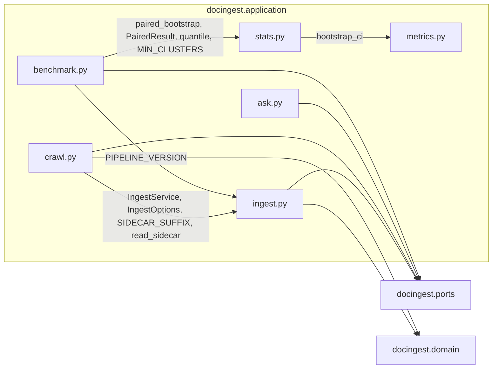

The next diagram shows who uses the application layer from the outside: the composition
root, the entrypoints, and three adapters that reuse helpers from it.

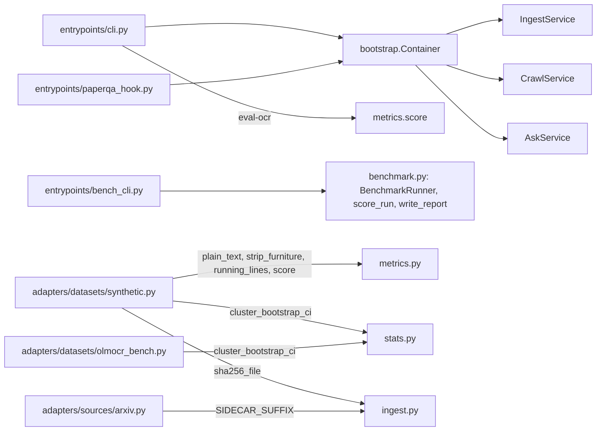

The layer rule is enforced by import-linter contracts in `pyproject.toml` (run
`uv run lint-imports`). For this package that means:

- It may import `docingest.domain` and `docingest.ports`, and other modules of this
  package.
- It may not import `docingest.adapters`, `docingest.bootstrap`, `docingest.config` or
  `docingest.entrypoints`.
- It may not import `pypdfium2`, `mlx`, `mlx_vlm`, `paperqa`, `docling`, `pypandoc`,
  `huggingface_hub`, `httpx`, `typer` or `rich`. `numpy` (in `stats.py`) and `jiwer`
  (imported inside `metrics.score`) are allowed.

See [docs/architecture.md](../../../docs/architecture.md) and
[ADR 0001](../../../docs/adr/0001-hexagonal-architecture.md) for the reasoning.

The main classes and the relations between them:

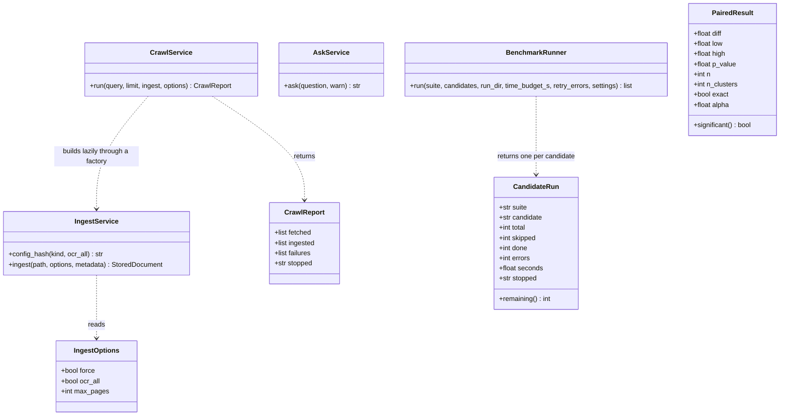

`AskService.ask` is a coroutine (`async def`). `CandidateRun.remaining` and
`PairedResult.significant` are properties. `IngestOptions` and `PairedResult` are frozen
dataclasses; `CrawlReport` and `CandidateRun` are mutable dataclasses.

## How the services are built

`IngestService`, `CrawlService` and `AskService` receive every port through keyword-only
constructor arguments. In the application they are built by `docingest.bootstrap.Container`
from the adapter names selected in `[adapters]` of `config/pipeline.toml` (see
[config/README.md](../../../config/README.md)):

| Container property | Builds | Ports it passes |
|---|---|---|
| `Container.ingest` | `IngestService` | `detector`, `pdf`, `ocr`, `images`, the office / latex / text converters (built lazily, only when a document of that kind arrives), `store`, and `cfg.routing` as `policy` |
| `Container.crawl` | `CrawlService` | `crawler`, `ingest=lambda: self.ingest` (so `--no-ingest` never builds the OCR engine), `raw_dir=Path(cfg.raw_dir) / "arxiv"` (default `data/raw/arxiv`) |
| `Container.ask` | `AskService` | `store`, `qa` |

All three are `cached_property`, so one `Container` builds each service once and shares
the adapters between them. Building `IngestService` builds the OCR adapter, which is
cheap: the `mlx-vlm` adapter loads model weights on its first `transcribe()` call.

`BenchmarkRunner` is not in the `Container`. `entrypoints/bench_cli.py` builds it with an
engine factory that creates each candidate's OCR engine through `bootstrap.build("ocr", cfg)`.

```python
from pathlib import Path

from docingest.application.ingest import IngestOptions
from docingest.bootstrap import Container
from docingest.config import load_config

container = Container(load_config())  # config/pipeline.toml, or built-in defaults if absent
stored = container.ingest.ingest(Path("paper.pdf"), IngestOptions(max_pages=2))
print(stored.location, stored.canonical, stored.manifest.config_hash)
markdown = container.ingest.store.markdown(stored)
```

To replace one adapter without editing configuration (tests, notebooks), pass
`overrides`, for example `Container(cfg, overrides={"ocr": my_ocr_engine})`. To wire a
service by hand, pass objects that satisfy the ports:

```python
from docingest.application.ingest import IngestService
from docingest.domain.models import SourceKind
from docingest.domain.routing import RoutingPolicy

service = IngestService(
    detector=my_detector,  # TypeDetector
    pdf=my_pdf_reader,  # PdfReader
    ocr=my_ocr_engine,  # OcrEngine
    images=my_image_source,  # ImageSource
    converters={SourceKind.LATEX: my_latex_converter},  # only the kinds you need
    store=my_store,  # DocumentStore
    policy=RoutingPolicy(),
    log=lambda _: None,  # progress lines; default is print
)
```

`tests/fakes.py` contains an in-memory implementation of every port these three services
use (`FakeDetector`, `FakePdfReader`, `FakeOcr`, `FakeImages`, `FakeConverter`,
`InMemoryStore`, `FakeCrawler`, `FakeQA`), and `tests/unit/test_ingest_service.py` and
`tests/unit/test_services.py` wire the services exactly like this. The benchmark tests
define their own suite and engine (see [`benchmark.py`](#benchmarkpy-ocr-benchmark-runner-scoring-and-report)).

## `ingest.py`: one document to Markdown and a manifest

### Public API

| Name | Kind | Description |
|---|---|---|
| `PIPELINE_VERSION` | `str`, currently `"0.3.1"` | Version of the ingestion logic. Part of every cache key and of every manifest. Re-exported as `docingest.__version__`. See [Versioning](#versioning-pipeline_version). |
| `SIDECAR_SUFFIX` | `str`, `".meta.json"` | Suffix of the optional metadata sidecar next to an input file: `paper.pdf` has the sidecar `paper.pdf.meta.json`. |
| `Log` | type alias | `Callable[[str], None]`, the progress logger every service accepts. |
| `IngestOptions` | frozen dataclass | Run options, see below. |
| `sha256_file(path)` | function | Hex SHA-256 of the file's bytes, read in 1 MiB chunks. This is the `doc_id`. |
| `read_sidecar(path)` | function | `SourceMetadata` from `<path>.meta.json`, or `None` when there is no sidecar. An invalid sidecar raises pydantic's `ValidationError` (a `ValueError`). |
| `retitle_markdown(markdown, old, new)` | function | Replace the `# old` title line that `render_markdown` wrote with `# new`, keeping the page text. Returns `None` when the Markdown does not start with the line rendered for `old` (edited by hand or written by something else). |
| `IngestService` | class | The use case. |

### `IngestOptions`

| Field | Type | Default | Effect |
|---|---|---|---|
| `force` | `bool` | `False` | Skip the cache lookup and process the document again. The result is saved as usual. CLI: `--force`. |
| `ocr_all` | `bool` | `False` | Send every PDF page to OCR, even pages with a good text layer. Ignored for other kinds (the service sets it to `False` for them). A forced-OCR result is always stored as a variant, never as the canonical result. CLI: `--ocr-all`. |
| `max_pages` | `int` or `None` | `None` | Process only the first N PDF pages, image frames or converter segments. Values below 1 raise `ValueError("max_pages must be >= 1")`. CLI: `--max-pages N`. |

### `IngestService`

Constructor (all keyword-only):

| Argument | Port or type | Used for |
|---|---|---|
| `detector` | `TypeDetector` | `detect(path) -> (SourceKind, mime)` |
| `pdf` | `PdfReader` | opening PDFs; its `fingerprint` is part of the PDF cache key |
| `ocr` | `OcrEngine` | transcribing scanned PDF pages and image frames; its `fingerprint` is part of the PDF and image cache keys, `dpi` sets the rasterization resolution, `model` goes into the manifest |
| `images` | `ImageSource` | `frames(path)` for image inputs (a multi-page TIFF gives several frames); its `fingerprint` is part of the image cache key |
| `converters` | `Mapping[SourceKind, DocumentConverter]` | one converter per non-PDF, non-image kind (`OFFICE`, `LATEX`, `TEXT`) |
| `store` | `DocumentStore` | cache lookup, persistence, reading Markdown back |
| `policy` | `RoutingPolicy` | thresholds for the per-page OCR decision (`[routing]` in `pipeline.toml`) |
| `log` | `Log` | progress lines; default `print` |

Methods:

- `ingest(path, options=None, metadata=None) -> StoredDocument`: the use case.
  `options` defaults to `IngestOptions()`. `metadata` is optional `SourceMetadata` that
  overrides the sidecar and the converter's metadata.
- `config_hash(kind, *, ocr_all=False) -> str`: the 12-character cache key for a
  `SourceKind` with the current adapters. See [Caching](#caching).

### What `ingest()` does

1. Resolve `path` to an absolute path.
2. `detector.detect(path)` returns the `SourceKind` and MIME type.
3. `doc_id = sha256_file(path)`: the document's identity is its bytes, not its name.
4. `ocr_all` is kept only for PDFs. `config_hash(kind, ocr_all=...)` computes the cache
   key. For office, LaTeX and text inputs this builds the converter for that kind (lazily,
   in the `Container`) to read its `fingerprint`, so a missing converter fails here.
5. `metadata = metadata or read_sidecar(path)`.
6. Unless `options.force`, `store.lookup(doc_id, config_hash, max_pages=..., ocr_all=...)`.
   On a hit, see [Cache hits and metadata refresh](#cache-hits-and-metadata-refresh).
7. On a miss, process by kind:
   - PDF: `_pdf` routes every page (up to `max_pages`) to the text layer or to OCR.
   - Image: `_image` sends every frame (up to `max_pages`) to OCR.
   - Office, LaTeX, text: `_convert` calls the converter once and keeps the first
     `max_pages` segments.
8. Build the `DocumentManifest` (fields below).
9. `render_markdown(manifest, texts)` from `domain.text` produces the Markdown.
10. `store.save(manifest, markdown, degraded=...)` persists both and returns the
    `StoredDocument`.

The following flowchart shows the same steps with the branch per kind.

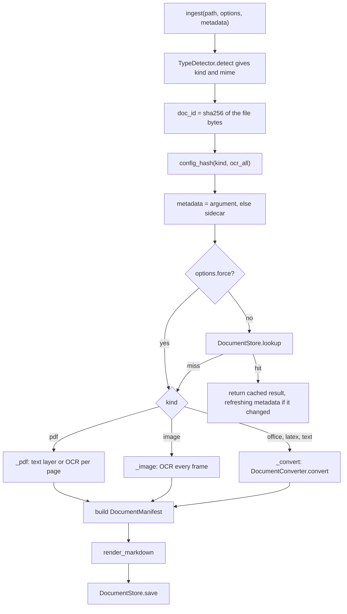

### PDF pages: per-page routing

For each page index `i` below `min(len(doc), max_pages)`:

1. `page.signals()` returns `PageSignals` (embedded character count, number of images,
   image coverage, garbage ratio, alphabetic ratio) and the raw embedded text.
2. `domain.routing.decide(signals, policy, force_ocr=options.ocr_all)` returns a
   `PageProbe` with `needs_ocr` and the human-readable `reasons`.
3. If `needs_ocr`, the page is rendered at `ocr.dpi` and sent to `ocr.transcribe()`. The
   page record gets `method=vlm_ocr`, the OCR engine's fingerprint, model repo and
   revision, generated tokens and finish reason.
4. Otherwise the raw text layer is kept aside and the record gets `method=text_layer`
   and `engine=pdf.fingerprint`.

The PDF is closed in a `finally` block. After the loop, the text-layer pages are cleaned
with `domain.text.clean_text_layer`, using one vocabulary built from every raw text
layer and every OCR text of the document. This decides whether a line-end hyphen is
real hyphenation (`transduc-tion` becomes `transduction` when that word occurs elsewhere
in the document) or part of a compound (kept). Each text-layer record's `n_chars` is set
after cleaning. The routing thresholds are described in
[ADR 0002](../../../docs/adr/0002-per-page-routing-and-content-addressed-cache.md) and
the [domain README](../domain/README.md).

This sequence diagram follows a PDF whose pages mix born-digital text and scans.

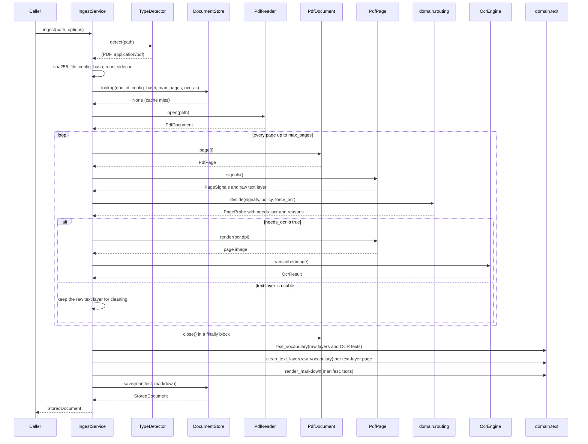

### Images

`images.frames(path)` returns every frame; `source_pages` is the frame count and only the
first `max_pages` frames are transcribed. Every frame goes to OCR (`method=vlm_ocr`,
`probe=None`). There is no text layer and no routing decision.

### Office, LaTeX and text: converters

`_convert` looks up the converter for the kind (a missing one raises
`UnsupportedInputError("no converter configured for <kind> inputs")`), calls
`convert(path)` once, logs every `Conversion.warnings` entry, and keeps the first
`max_pages` segments. Each segment becomes one `PageRecord` with the conversion's
`method` (`docling`, `latex`, `latex_plaintext` or `passthrough`), the conversion's
`engine` string, the segment's `title` (a section heading for LaTeX), and `seconds`
equal to the total conversion time divided by the number of segments kept. The
conversion's `title`, `metadata` and `degraded` flag are passed on to the manifest and
the store.

An arXiv source archive (`<id><version>.tar.gz`, as saved by the crawler) is detected
as `LATEX` from its bytes: the detector sees the gzip magic bytes and a tar header inside.
The default LaTeX converter (`pandoc`) unpacks it, finds the main file, inlines includes,
runs pandoc in a sandbox under a timeout and splits the Markdown into one segment per
section (`[latex] split_level`). When pandoc fails, times out or keeps too little of the
source text, it falls back to a pylatexenc plain-text conversion (only when
`[latex] fallback` is true, the default). The details are in
[adapters/converters/README.md](../adapters/converters/README.md) and
[ADR 0003](../../../docs/adr/0003-latex-first-for-arxiv.md). The sequence below shows what
the application layer sees.

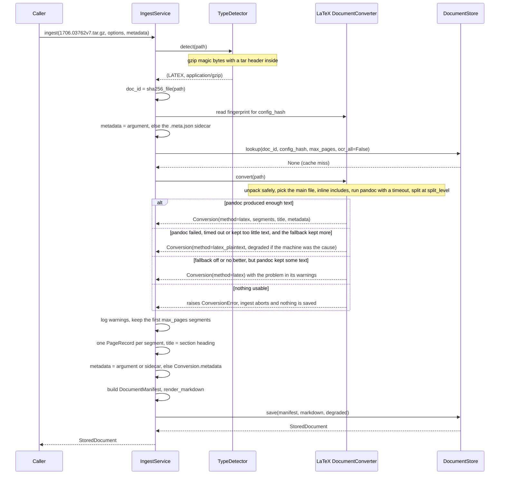

### Metadata and title precedence

| Priority | Metadata source | When it applies |
|---|---|---|
| 1 | the `metadata` argument of `ingest()` | whenever it is given (the crawl passes the fetched record's metadata) |
| 2 | the sidecar `<file>.meta.json` | when no argument is given |
| 3 | `Conversion.metadata` | office, LaTeX and text inputs only, when neither of the above exists |

The winning `SourceMetadata` replaces the others whole; fields are not merged.

The manifest `title` is the first non-empty value of: `metadata.title`, the document's own
title (`PdfDocument.title` for PDFs, `Conversion.title` for converters), and the file name
without its suffix (`path.stem`).

### Output: Markdown and manifest

`render_markdown` writes the title line, then one block per page or segment, each
preceded by a marker:

```markdown
# Attention Is All You Need

<!-- page 1 | method=text_layer -->
page 1 text

<!-- page 2 | method=vlm_ocr -->
page 2 text
```

`domain.text.split_pages` is the inverse: it returns `{page number: text}`, which is how
`eval-ocr`, the PaperQA2 adapter and the PaperQA2 hook read the pages back.

The `DocumentManifest` fields that `IngestService` fills:

| Field | Value |
|---|---|
| `doc_id` | SHA-256 of the file bytes |
| `source_path`, `source_name` | absolute path and file name at ingest time |
| `source_kind`, `mime` | from the detector |
| `size_bytes` | file size |
| `n_pages` | pages, frames or segments processed in this run |
| `source_pages` | pages, frames or segments in the source (`n_pages < source_pages` means a partial run, `complete` is `False`) |
| `max_pages`, `ocr_all` | the run options, for provenance (`ocr_all` is `True` only for forced-OCR PDFs) |
| `pages` | one `PageRecord` per processed page or segment: `index`, `method`, `n_chars`, `seconds`, `engine`, and when relevant `title`, `probe`, `model`, `model_revision`, `gen_tokens`, `finish_reason` |
| `pipeline_version` | `PIPELINE_VERSION` |
| `config_hash` | the cache key |
| `ocr_model` | the OCR engine's `ModelRef` if at least one page used OCR, else `None` |
| `title`, `metadata` | see [Metadata and title precedence](#metadata-and-title-precedence) |
| `total_seconds` | processing time from after the cache check to the manifest (the save is not included) |
| `created_at` | set by the domain model (UTC, ISO 8601) |

### Caching

A result is found again by two keys:

- `doc_id`: the SHA-256 of the bytes. Renaming or moving a file does not change it. A
  cache hit returns the stored manifest, so `source_path` and `source_name` keep the
  values of the run that produced the result.
- `config_hash`: the first 12 hex characters of the SHA-256 of a JSON list. It contains
  everything that can change the output for that kind, and nothing else:

| Kind | Inputs of `config_hash` |
|---|---|
| PDF | `PIPELINE_VERSION`, `"pdf"`, `ocr_all`, the `RoutingPolicy` as JSON, `PdfReader.fingerprint`, `OcrEngine.fingerprint` |
| Image | `PIPELINE_VERSION`, `"image"`, `False`, `ImageSource.fingerprint`, `OcrEngine.fingerprint` |
| Office, LaTeX, text | `PIPELINE_VERSION`, the kind, `False`, the converter's `fingerprint` |

Consequences:

- Changing the OCR adapter, model or revision, profile (or its `code_version`, bumped
  when its clean-up code changes), prompt, `dpi` or generation settings changes the OCR
  fingerprint, so PDFs (including those whose pages all used the text layer) and images
  are processed again. LaTeX, office and text results stay cached.
- Replacing the image source, or upgrading Pillow for the built-in one, re-processes
  images only.
- Changing a routing threshold in `[routing]` re-processes PDFs only.
- Upgrading pandoc or changing `[latex] split_level` changes the LaTeX converter's
  fingerprint and re-processes LaTeX inputs only.
- `max_pages` is not in the hash. The store decides: a complete result satisfies any
  `max_pages` request, and a partial run is stored and looked up as a variant keyed by
  `max_pages`.
- Metadata (sidecar or argument) is not in the hash. A metadata change updates a cached
  result without re-processing (next section).
- The `[qa]` settings are not in any cache key.

Where results go is the store's decision. With the default `filesystem` store:

| Result | Location under `output_dir` (default `data/normalized`) | Returned by `lookup` |
|---|---|---|
| complete (`n_pages == source_pages`), not forced OCR, not degraded (canonical) | `<doc_id[:16]>/document.md` and `manifest.json`, plus an entry in `index.json` | yes, when `config_hash` matches and the request is not `ocr_all`, whatever `max_pages` is |
| partial (`n_pages < source_pages`, because of `max_pages`) or forced OCR (`ocr_all`) | `_variants/<doc_id[:16]>-<config_hash>-p<N or all>/` | yes, for the same `config_hash` and `max_pages` (for PDFs `ocr_all` is part of `config_hash`) |
| degraded conversion | `_degraded/<doc_id[:16]>-<config_hash>-p<N or all>/` | never, so the next run retries |

The canonical directory depends only on `doc_id`, so a new canonical result for the same
file replaces the old one in place. See the [adapters README](../adapters/README.md) for
the store's atomic writes and corpus rules.

### Cache hits and metadata refresh

`doc_id` and `config_hash` cover only the bytes and the adapters. A sidecar written or
edited after the first run, or a later crawl that learned a paper's license, must reach
the manifest without `--force` (which would re-run OCR or pandoc). On a cache hit:

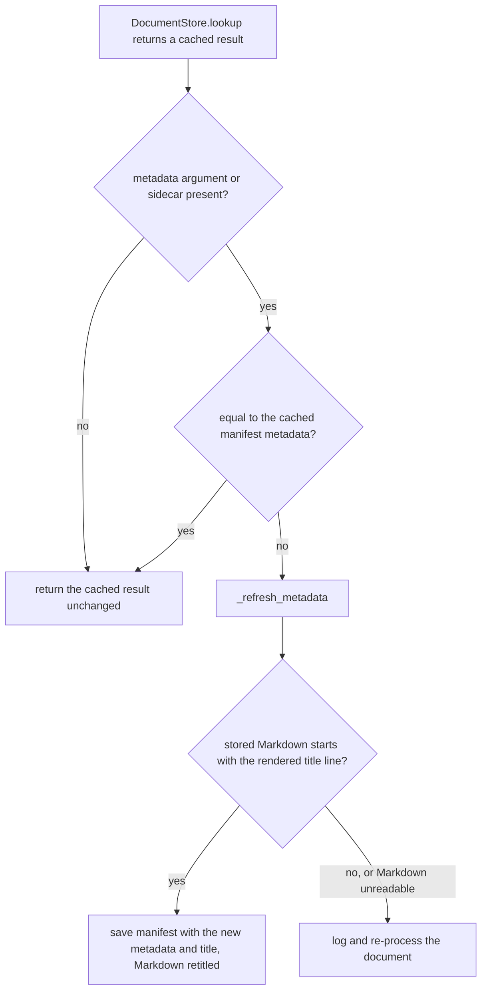

`_refresh_metadata` changes only the manifest's `metadata` and `title`, the Markdown's
`# title` line (through `retitle_markdown`), and, through `store.save`, the store's
catalog. The new title is `metadata.title`, or the stored title when the new metadata has
none. A cache hit with no sidecar and no argument keeps the converter's metadata that the
manifest already holds.

### Degraded conversions

A converter sets `Conversion.degraded=True` when it had to fall back because of the
environment (a timeout, a crash, a missing binary) rather than the document. The service
logs `warning: degraded fallback conversion (timeout / crash): stored outside the cache,
the next run retries the converter` and calls `store.save(..., degraded=True)`. The store
keeps the result so the corpus is not missing the document, but never returns it from
`lookup` and never lets it replace a stored result. The next `ingest` of the same file
calls the converter again.

### Versioning: `PIPELINE_VERSION`

`PIPELINE_VERSION` is defined once in `ingest.py` and is used:

- in every `config_hash`, for every kind;
- in every manifest (`pipeline_version`);
- as `docingest.__version__` (in `src/docingest/__init__.py`), which the arXiv adapter
  puts in its User-Agent;
- in a benchmark run's `manifest.json` under `versions.pipeline`.

Changing it re-processes every document on its next ingest. Change it when a change in
the application or domain layer changes what `ingest` writes for the same input and the
same adapters, for example routing, text-layer cleaning, Markdown rendering or manifest
content. A change inside one adapter belongs in that adapter's `fingerprint` instead (the
pandoc LaTeX converter has a `REVISION` constant for this), so only the affected
documents are re-processed. `pyproject.toml` declares the same number in
`[project] version` as a separate literal, and `uv.lock` records it for the `docingest`
package: update all three together (`uv lock` rewrites the lock).
`test_pipeline_version_is_the_package_and_lockfile_version` in
`tests/unit/test_core_fixes.py` fails when they differ.

### Side effects

`IngestService` writes nothing itself. Every write goes through `DocumentStore.save`.
It reads the input file (the default `magic` detector reads its first 1024 bytes,
`sha256_file` reads it whole, then the adapter for the kind reads it) and the sidecar if
one exists. Adapters may have their own side effects: the LaTeX converter unpacks into a
temporary directory that it removes, and the `mlx-vlm` OCR adapter loads model weights on
its first transcription (the Hugging Face resolver uses the local cache first and
downloads a pinned revision that is missing).

Progress goes to `log`. Typical lines:

```text
[cache] paper.pdf -> data/normalized/0123456789abcdef (config 1a2b3c4d5e6f)
  p1/3: text layer (2841 chars)
  p2/3: OCR (only 0 embedded chars (<50); image covers 100% of page with little text)
    -> 1920 chars, 612 tok in 8.4s (stop)
  latex: 12 segment(s) via pandoc 3.8
  metadata changed: manifest and title updated, not re-processed
```

### Error handling

`IngestService` does not catch processing errors: an exception on any page aborts the
document and nothing is saved for it. (The one exception it catches is an `OSError` while
reading stored Markdown during a metadata refresh; the document is then re-processed.) The expected failures are domain errors (`docingest.domain.errors`, all
subclasses of `DocingestError`):

| Situation | Raised by | Exception |
|---|---|---|
| unknown file type | `TypeDetector.detect` | `UnsupportedInputError` |
| no converter configured for the kind | `IngestService._converter` (during `config_hash`) | `UnsupportedInputError` |
| corrupt, encrypted or truncated PDF | `PdfReader.open` | `DocumentOpenError` |
| unreadable image | `ImageSource.frames` | `DocumentOpenError` |
| converter cannot produce any text | `DocumentConverter.convert` | `ConversionError` |
| OCR failure | `OcrEngine.transcribe` | whatever the adapter raises (the OpenAI-compatible adapter raises `OcrServerError`, an `OcrError`) |
| invalid sidecar JSON | `read_sidecar` | pydantic `ValidationError` (a `ValueError`) |
| `max_pages < 1` | `IngestOptions` | `ValueError` |

Batch behaviour belongs to the caller. `docingest ingest` catches every exception per
file, prints a "Failed inputs" table and exits with code 1 if any file failed. The
PaperQA2 hook turns `DocumentOpenError` into PaperQA2's `ImpossibleParsingError`.

### Calling it

From the command line (see [entrypoints/README.md](../entrypoints/README.md)):

```bash
uv run docingest ingest paper.pdf scans/ notes.md   # files or directories
uv run docingest ingest paper.pdf --max-pages 3     # a variant if the PDF has more pages
uv run docingest ingest paper.pdf --ocr-all         # force OCR on every PDF page
uv run docingest ingest paper.pdf --force           # ignore the cache
uv run docingest ingest paper.pdf -c my-pipeline.toml
```

When a directory is given, `docingest ingest` walks it recursively, skips hidden files,
and skips sidecars (`*.meta.json`) and ground-truth files (`*.truth.json`).

From Python, see [How the services are built](#how-the-services-are-built).

## `crawl.py`: search, download, ingest

`CrawlService` discovers documents at a remote source through the `SourceCrawler` port
(the built-in adapter is arXiv), downloads each one, writes its metadata sidecar, and
optionally ingests it.

### API

`CrawlService(*, crawler, ingest, raw_dir, log=print)`:

| Argument | Type | Meaning |
|---|---|---|
| `crawler` | `SourceCrawler` | `search(query, limit)` and `fetch(record, dest_dir)` |
| `ingest` | `Callable[[], IngestService]` or `None` | factory, called only when a record is ingested, so a download-only crawl never builds the OCR engine. `None` disables ingestion. |
| `raw_dir` | `Path` | where the crawler saves downloads (the `Container` passes `<raw_dir>/arxiv`) |
| `log` | `Log` | progress lines |

`run(query, limit, *, ingest=True, options=None) -> CrawlReport`:

| Parameter | Meaning |
|---|---|
| `query` | passed to `crawler.search`. For arXiv: query syntax such as `cat:cs.CL AND ti:retrieval`, or `ids:1706.03762,math/0211159` for an id list. |
| `limit` | maximum number of records |
| `ingest` | `False` downloads only |
| `options` | `IngestOptions` for every ingest (default `IngestOptions()`) |

`CrawlReport` fields:

| Field | Type | Content |
|---|---|---|
| `fetched` | `list[FetchedSource]` | every downloaded (or reused) file with its record and format (`latex-archive`, `latex` or `pdf`) |
| `ingested` | `list[StoredDocument]` | every successful ingest |
| `failures` | `list[tuple[str, str]]` | `(record key, "ErrorType: message")`; a failed search uses the key `search '<query>'` |
| `stopped` | `str` or `None` | why the crawl ended before its last record, if it did |

### Behaviour

1. `crawler.search(query, limit)`. A `DocingestError` here (for example the search API
   is down) is not raised: it becomes one failure and `stopped = "search failed: ..."`,
   and `run` returns the report. Other exception types propagate (the arXiv adapter
   raises `ValueError` for an empty query).
2. For each record, in order:
   1. `crawler.fetch(record, raw_dir)` returns a `FetchedSource`. The arXiv adapter
      reuses a complete file that is already in `raw_dir`.
   2. `_metadata(fetched)` takes the fetched record's metadata. If it has no license, and
      the existing sidecar of the same file has one, the earlier license is kept: a
      license lookup can fail transiently and must not erase a known license. An
      unreadable or invalid existing sidecar is ignored and rewritten.
   3. The sidecar `<file>.meta.json` is written next to the download, so a later plain
      `docingest ingest` of `raw_dir` has the same metadata.
   4. If `ingest` is true and a factory was given, `IngestService.ingest(path, options,
      metadata)` runs with that metadata. A paper already in the cache is not
      re-processed: if its metadata changed, only the manifest metadata and title are
      refreshed (see [Cache hits and metadata refresh](#cache-hits-and-metadata-refresh)).
3. Exceptions inside the loop:
   - `RateLimitedError` (the source asked to back off): the record fails, every
     remaining record is added to `failures` as "not attempted: the crawl stopped, the
     source asked us to back off", `stopped` is set, and the loop ends. Every later
     request would hit the same limit.
   - Any other exception: the record fails and the crawl continues with the next one.

The sequence diagram below shows one crawl run.

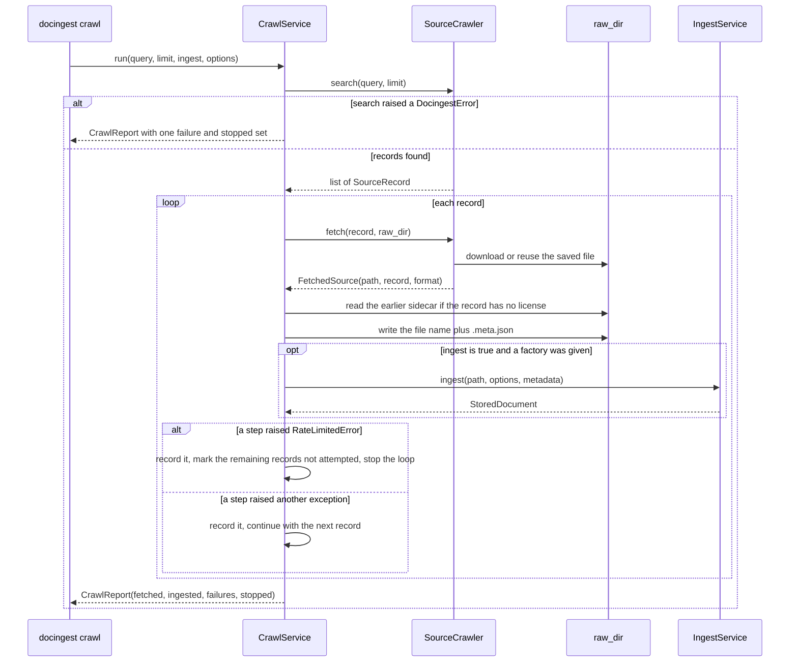

### Side effects

- Downloads in `raw_dir`, written by the crawler adapter. The arXiv adapter names them
  after the record key (`<id><version>`, made filesystem-safe) plus `.tar.gz`, `.tex.gz`,
  `.tar`, `.tex` or `.pdf`, and may leave a
  hidden `.fallback` marker when a lower-preference format was saved because the
  preferred one failed transiently (see [adapters/README.md](../adapters/README.md)).
- One sidecar per fetched file, `<file>.meta.json`, overwritten on every crawl.
- Whatever `IngestService` writes for each ingested file.

### Calling it

```bash
uv run docingest crawl "cat:cs.CL AND ti:retrieval" --limit 3
uv run docingest crawl "ids:1706.03762" --no-ingest      # download and sidecar only
uv run docingest crawl "ids:1706.03762" --max-pages 5
```

The CLI prints the ingestion summary table (when at least one record was ingested),
`fetched N, ingested M`, a "crawl stopped early" line when `stopped` is set, and a
"Failed inputs" table; it exits with code 1 when `failures` is not empty. `--limit`
defaults to 5. `docingest crawl` has no `--force` or `--ocr-all`: it passes
`IngestOptions(max_pages=...)` only.

```python
from docingest.application.ingest import IngestOptions
from docingest.bootstrap import Container
from docingest.config import load_config

report = Container(load_config()).crawl.run(
    "ids:1706.03762", 1, ingest=True, options=IngestOptions(max_pages=5)
)
for key, error in report.failures:
    print(key, error)
```

## `ask.py`: question answering over the corpus

`AskService(*, store, qa)` has one coroutine:

`async ask(question, warn=print) -> str`

1. `store.corpus()` returns one `StoredDocument` per document (the canonical result, else
   the most complete partial or degraded one) and a list of warnings (for example
   "only a partial run exists"). Each warning is passed to `warn`.
2. If there are no documents it raises
   ``RuntimeError("no ingested documents; run `docingest ingest` first")``.
3. It reads every document's Markdown with `store.markdown(doc)` and awaits
   `qa.ask(question, [(document, markdown), ...], warn)`.
4. It returns the answerer's text unchanged.

All Markdown is loaded in memory before the `QuestionAnswerer` is called. The default
answerer (PaperQA2) splits each document back into pages with `split_pages`, so its
citations can name page ranges, and labels partial runs in the citation ("pages 1-N of
M"). `AskService` writes nothing. The `[qa]` configuration is described in
[config/README.md](../../../config/README.md).

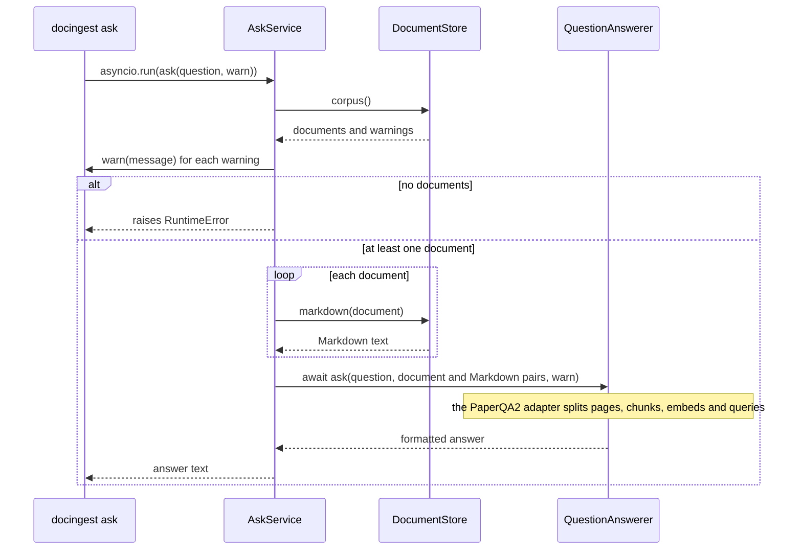

```bash
uv run docingest ask "What is scaled dot-product attention?"
```

```python
import asyncio

from docingest.bootstrap import Container
from docingest.config import load_config

answer = asyncio.run(Container(load_config()).ask.ask("What is scaled dot-product attention?"))
```

The default `qa` adapter needs the `qa` extra and a language model server; see the
[main README](../../../README.md).

## `benchmark.py`: OCR benchmark runner, scoring and report

`benchmark.py` compares OCR candidates (model, profile and generation settings) on
benchmark suites. It is suite-agnostic: a suite is any object that satisfies the
`BenchmarkSuite` port (`samples()`, `output_path()`, `score()`, `name`, `fingerprint`,
optionally `scoring_version`). The two suites in this repository, synthetic degraded scans
and an olmOCR-bench subset, live in `adapters/datasets/`. Methodology and current results
are in [docs/benchmark.md](../../../docs/benchmark.md); this section documents the code.

The work is split into three steps that can run at different times: transcription
(`BenchmarkRunner.run`), scoring (`score_run`) and reporting (`write_report`). Each step
reads what the previous one left in the run directory.

### Run directory

`data/bench/runs/<run-id>/` (`runs_dir` in `config/benchmark.toml`) describes itself:

```text
<run-id>/
  manifest.json                          suites (fingerprint, settings, n_samples, candidates),
                                         candidate specs, library versions, machine, changes
  <suite>/<candidate>/...                transcriptions, wherever suite.output_path puts them
  model_raw/<suite>/<candidate>/<id>.txt raw model output when the engine's clean-up changed it
  telemetry/<suite>/<candidate>.jsonl    one JSON line per transcription, with the retry ladder
  scores/<suite>.json                    SuiteScore per candidate, stamped
  summary.json, report.md                written by write_report
```

Other entries are written outside this module. The benchmark CLI writes `raw_outputs/`
and `postprocess_log.json` when `bench score` or `bench report` re-applies a profile's
clean-up to stored outputs (see [Scoring](#scoring)). The olmOCR-bench suite adapter
writes `scores/olmocr-bench/<candidate>.log` and the scorer view in `olmocr-bench/`
(copies of the test `.jsonl` files and a `pdfs` symlink next to the candidates' outputs).

The file names are module constants: `MANIFEST = "manifest.json"`,
`SCORES_DIR = "scores"`, `TELEMETRY_DIR = "telemetry"`, `RAW_DIR = "model_raw"`.
Transcriptions, `model_raw` copies, `manifest.json`, `scores/<suite>.json`,
`summary.json` and `report.md` go through `_write_atomic` (write to `<name>.part`, then
`os.replace`), so a crash never leaves a truncated output that a resume would skip.
Telemetry is appended one line at a time and flushed after each record.

### `BenchmarkRunner`

`BenchmarkRunner(engine_factory, log=print, *, max_consecutive_errors=5,
clock=time.perf_counter, environment=machine_info)`

| Argument | Meaning |
|---|---|
| `engine_factory` | `EngineFactory = Callable[[CandidateSpec], OcrEngine]`, called once per candidate, only when that candidate has samples to transcribe |
| `log` | progress lines |
| `max_consecutive_errors` | length of a failure streak that stops a candidate |
| `clock` | time source (tests inject a fake one) |
| `environment` | returns the machine description stored in the manifest; `machine_info()` records platform, machine, CPU and RAM (on macOS it runs `sysctl -n` for the CPU name and memory size) |

`run(suite, candidates, run_dir, *, time_budget_s=None, retry_errors=False,
settings=None) -> list[CandidateRun]`:

1. `suite.samples()`; duplicate sample ids raise `ValueError`.
2. `_record` creates or extends `manifest.json`:
   - a suite already recorded with a different `fingerprint` raises `RunMismatchError`
     ("use the same settings or a new run id");
   - a candidate already recorded with a different spec raises `RunMismatchError`
     ("rename the candidate or use a new run id");
   - `versions` (`library_versions()`: Python, `PIPELINE_VERSION` and the tracked
     distributions `docingest`, `mlx-vlm`, `mlx`, `transformers`, `pypdfium2`, `pillow`,
     `numpy`, `jiwer`, `huggingface-hub`) and `machine` are recorded when the run starts;
     if they differ later, the original is kept, the new value is appended once to
     `changes`, and a warning is logged;
   - `settings` (the suite's resolved configuration) is stored so the suite can be rebuilt
     for scoring; `None` keeps the stored settings.
3. For each candidate in order, one model at a time:
   1. `todo` = samples whose output file does not exist, plus (with `retry_errors`)
      samples whose latest telemetry record has an error. If `todo` is empty the
      candidate is skipped without building its engine.
   2. `engine_factory(spec)` builds the engine.
   3. For each sample in `todo`, while the time budget lasts (checked before each sample,
      measured from after the engine is built): `_transcribe` loads the image, calls
      `engine.transcribe`, writes the output, appends one telemetry line and flushes it.
   4. A transcription that raises is caught. Its output is written as an empty file, so it
      scores as a miss (official scorers need one file per page), and the telemetry
      record carries `error`. `--retry-errors` re-runs such samples later.
   5. After `max_consecutive_errors` errors in a row (a model that fails to load, out of
      memory), the outputs of that streak are deleted, so a resume retries them, and the
      candidate stops. A streak says something about the model, not about those pages.
   6. In a `finally` block, `engine.unload()` is called if the engine has that method, so
      the next model does not load on top of this one.
4. It returns one `CandidateRun` per candidate: `total`, `skipped` (outputs already
   present), `done`, `errors`, `seconds`, `stopped` (reason, or `None`) and the property
   `remaining`.

Resuming is the same command again: existing outputs are skipped and new telemetry
records are appended. The runner never rewrites telemetry (the benchmark CLI's clean-up
refresh, described under [Scoring](#scoring), may correct the `chars` and `empty` fields
of existing records). `docingest bench run` turns `RunMismatchError` into an error
message and exit code 2.

Errors in `run`:

| Situation | Behaviour |
|---|---|
| duplicate sample ids in the suite | `ValueError` before anything is written |
| suite fingerprint or candidate spec differs from the manifest | `RunMismatchError` (a `ValueError`) before anything is transcribed |
| `sample.load_image()` or `engine.transcribe` raises for one sample | caught: empty output, telemetry record with `error`, the run continues |
| `max_consecutive_errors` failures in a row | the streak's outputs are deleted, `CandidateRun.stopped` is set, the next candidate starts |
| `engine_factory(spec)` raises (unknown adapter, invalid settings) | not caught: `run` ends and later candidates are not attempted. The `mlx-vlm` adapter loads its weights on the first `transcribe`, so a model that fails to load appears as a streak of per-sample errors instead |
| time budget reached | not an error: `CandidateRun.stopped` is set and the remaining samples stay for the next run |

The sequence diagram shows one `run` call: the run manifest check, then for each candidate in turn the engine construction, the transcription of every sample still to do, the output and telemetry writes, and the unload before the next model.

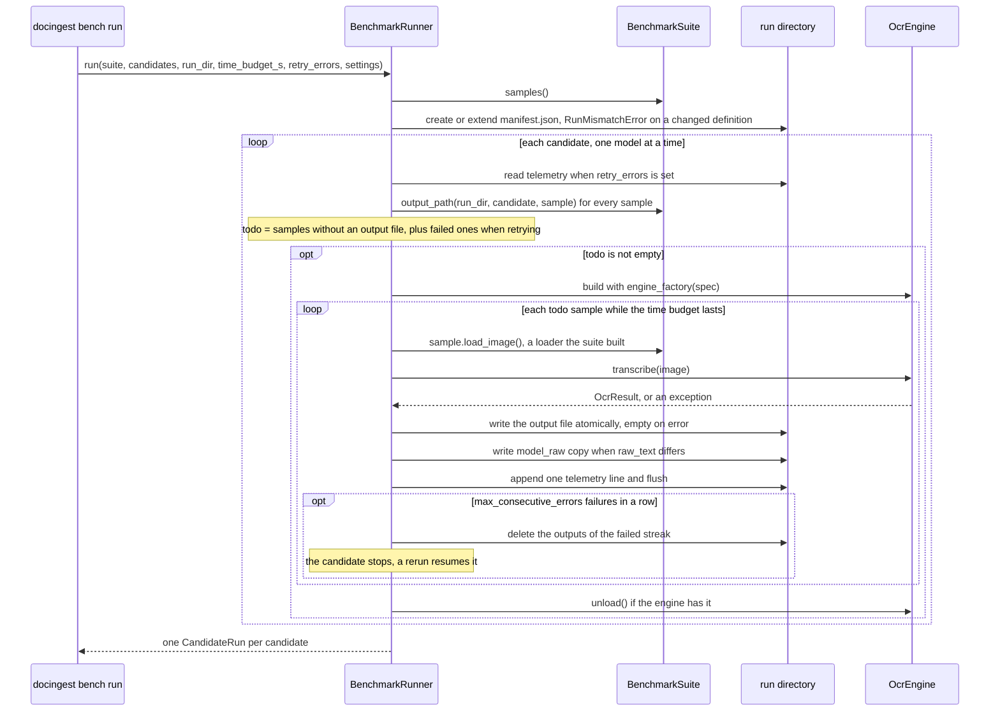

### Telemetry records

`telemetry/<suite>/<candidate>.jsonl` holds one JSON object per transcription.
`read_telemetry(path)` parses it and `latest_by_sample(records)` keeps the last record per
`sample_id` (a resumed or retried run appends new records).

| Key | Meaning |
|---|---|
| `sample_id`, `category` | the sample and its breakdown key (degradation level, olmOCR-bench test file) |
| `seconds` | the engine's `OcrResult.seconds` (wall time of every attempt, prefill included), or the wall time when it raised |
| `wall_seconds` | wall time measured by the runner, including image loading and writing |
| `gen_tokens`, `finish_reason` | of the attempt whose text was kept |
| `attempts`, `first_finish_reason`, `total_gen_tokens` | the engine's retry ladder: a first attempt that hit `max_tokens` stays visible even when a retry finished |
| `gen_seconds` | decode time of every attempt, when the engine measured it (`None` over HTTP) |
| `peak_memory_gb` | as reported by the engine |
| `chars`, `empty` | length of the written text and whether it is blank |
| `error` | `"ErrorType: message"` or `None` |
| `ts` | UTC timestamp |

### Throughput and failure modes

`throughput(records)` summarizes the latest record of each sample. Every rate below is a
share of the successful samples (`ok`), not of all samples:

| Key | Meaning |
|---|---|
| `pages`, `ok`, `errors` | samples with a record, without an error, with an error |
| `median_s`, `p90_s`, `total_s` | over `seconds` of successful samples (`quantile` from `stats.py`) |
| `gen_tok_s`, `gen_tok_s_basis` | generated tokens per second. `decode`: every attempt's tokens over measured decode time. `end-to-end`: tokens over page time, prefill included (HTTP engines). `legacy`: telemetry written before retries were recorded. The last two are lower bounds on decode speed. |
| `peak_memory_gb` | maximum over samples |
| `first_truncation_rate` | share of pages whose first attempt hit `max_tokens` (`first_finish_reason`, else `finish_reason`, equal to `"length"`), even if a retry then finished |
| `truncation_rate` | share of pages whose kept text is still truncated |
| `retried_rate` | share of pages retried; `None` when no record carries the retry ladder |
| `lower_bound` | `True` when some records predate the retry ladder, so the first-try truncation and retry rates are lower bounds |
| `empty_rate` | share of blank outputs |

### Scoring

`score_run(suite, run_dir, candidates=None) -> dict[str, SuiteScore]`:

1. Reads the manifest with `read_manifest(run_dir)`, which raises `FileNotFoundError`
   when `manifest.json` is missing. A suite that was not run raises `ValueError`; a suite
   whose `fingerprint` changed raises `RunMismatchError`.
2. Takes a `telemetry_stamp` (size, `mtime_ns`, record count of the telemetry file) for
   each candidate before scoring. A transcription that lands while the scorer runs
   therefore makes the stamp stale.
3. Calls `suite.score(run_dir, names)` (default: every candidate recorded for the suite).
4. Stores the stamp in each `SuiteScore.stamp` (`{"telemetry": ..., "scoring_options":
   ...}`, the latter from `scoring_options(suite)`) and merges the scores into
   `scores/<suite>.json`, keeping other candidates' scores.

`scoring_options(suite)` returns the suite's optional `scoring_options` attribute (an
empty dict without one): JSON-able settings applied at scoring time that are not part of
the fingerprint. `SyntheticSuite` returns `{"report_separately": headline_exclusions}`
(`[scoring.synthetic]`), `OlmOcrBenchSuite` the scorer settings that change the scores
(`bootstrap_samples`, `confidence_level`, `skip_baseline`).

`needs_scoring(run_dir, suite, *, scoring_version=None, scoring_options=None)` lists
candidates whose saved score is missing or stale. A score is stale when:

- it has errors, or fewer outputs than samples (the cause may be fixed now);
- its primary metric has no mean;
- `scoring_version` is given and differs from the score's (scored under older rules);
- `scoring_options` is given and differs from the options in the score's stamp (a stamp
  written before options were recorded counts as having none);
- it has no telemetry stamp, or the stamp differs from the current telemetry.

A suite's `fingerprint` covers what the model sees and the reference (data, rendering,
degradation). Its `scoring_version` covers how outputs are scored. Changing the scoring
rules therefore bumps `scoring_version`, and `bench report` re-scores finished runs
without re-transcribing anything.

`load_scores(run_dir, suite)` reads `scores/<suite>.json` back as `SuiteScore` objects.

Before scoring, `bench score` and `bench report` call `refresh_outputs` (defined in
`entrypoints/bench_cli.py`, not in this module). For every candidate whose telemetry file
has at least as many lines as the suite has samples (a candidate still being transcribed
is left alone), it re-applies the candidate's current profile
`postprocess` clean-up to the stored outputs, backs up each original once under
`raw_outputs/`, lists every rewritten file in `postprocess_log.json`, and corrects the
`chars` and `empty` fields of telemetry records that no longer match the files. A
clean-up fix therefore reaches a finished run without re-transcription. `bench report`
then scores the union of `needs_scoring(...)` and the candidates `refresh_outputs`
changed, or every candidate with `--rescore`.

### Report

- `rank(scores)`: candidate names ordered by the primary metric in its better direction
  (`higher_is_better`). Candidates whose score has errors come after complete ones,
  candidates without a primary mean come last, and ties are broken by name.
- `compare(a, b, *, n=10_000, seed=0) -> PairedResult`: `paired_bootstrap` of
  `a - b` on `a.primary`, over the units both candidates scored. It uses the suite's
  units, groups, clusters and strata as stored in `a` (see [`stats.py`](#statspy-cluster-bootstrap-and-paired-sign-flip-test)).
- `build_summary(run_dir, *, n_boot=10_000, seed=0)`: for each suite, the ranking, the
  top-ranked candidate on the primary metric (the key `best` in the code and in
  `summary.json`), a paired comparison of every other scored candidate against it
  (`paired_vs_best`, difference = candidate minus top-ranked), `throughput` for every
  candidate, the unscored candidates, the scoring versions seen, and the scores without
  per-unit data (which stays in `scores/<suite>.json`).
- `render_report(summary)`: Markdown with the candidates table, then per suite the
  overall metrics with 95% CIs, the cluster definition and the official scorer's interval
  when there is one, per-category results, the paired comparison table (difference with
  CI, p-value, significance, pairs, clusters), a warning when a comparison has fewer than
  `MIN_CLUSTERS` clusters, the throughput table and an issues list.
- `write_report(run_dir, *, n_boot=10_000, seed=0) -> (summary.json path, report.md path)`.

The ranking and the reference candidate are mechanical outputs of the code, not a
recommendation; read [docs/benchmark.md](../../../docs/benchmark.md) for how results
are interpreted.

The sequence below shows `docingest bench report`. `bench score` runs the same per-suite
steps (rebuild, `refresh_outputs`, `score_run`) for the candidates given (default all),
without `needs_scoring`, and writes no report.

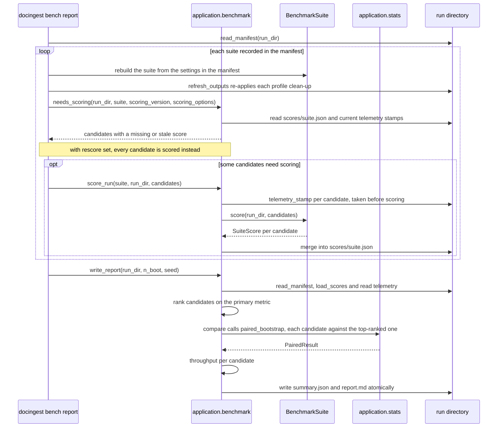

### Calling it

```bash
uv run docingest bench candidates                         # list configured candidates
uv run docingest bench prepare --preset smoke             # download / build suite data
uv run docingest bench run --run-id smoke --preset smoke  # resumable: rerun to continue
uv run docingest bench run --run-id my-run --suite synthetic --candidates <name>,<name>
uv run docingest bench run --run-id my-run --retry-errors --time-budget 3600
uv run docingest bench score --run-id my-run --suite synthetic
uv run docingest bench report --run-id my-run --resamples 10000 --seed 0
uv run docingest bench report --run-id my-run --rescore
```

Scoring olmOCR-bench needs the official scorer installed by
`scripts/setup_bench_scorer.sh` (see [scripts/README.md](../../../scripts/README.md)).

From Python, with your own suite and engine factory:

```python
from pathlib import Path

from docingest.application.benchmark import BenchmarkRunner, score_run, write_report
from docingest.ports import CandidateSpec

runner = BenchmarkRunner(lambda spec: build_my_engine(spec))  # returns an OcrEngine
spec = CandidateSpec("my-model", "org/my-model", "<commit sha>")
run_dir = Path("data/bench/runs/my-run")
results = runner.run(my_suite, [spec], run_dir)
score_run(my_suite, run_dir)
summary_path, report_path = write_report(run_dir)
```

`tests/unit/test_benchmark.py` defines a complete in-memory suite (`MemSuite`) and engine
(`EchoOcr`) that follow this pattern. How to add a suite or a candidate is described in
[adapters/README.md](../adapters/README.md), [adapters/ocr/README.md](../adapters/ocr/README.md)
and [config/README.md](../../../config/README.md).

## `metrics.py`: OCR quality metrics

`metrics.py` compares a transcription (hypothesis) with reference text. Raw character
error rate is inflated by things that are not recognition errors: Markdown syntax,
hyphenation, reading order, LaTeX versus Unicode math, figure placeholders, page headers.
The module therefore normalizes both sides the same way and reports several views.

It is used by the synthetic benchmark suite (reference = the page's cleaned PDF text
layer) and by `docingest eval-ocr`. The olmOCR-bench suite does not use it: its pass
rates come from the official scorer. Every function in `metrics.py` and `stats.py` is
pure: no file or network I/O, no global state, deterministic for a given `seed`.

### Normalization

`normalize(text)` applies these steps, in order, to reference and hypothesis alike:

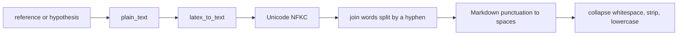

| Step | Function | What it does |
|---|---|---|
| 1 | `plain_text` | Reduces a transcription to what a text layer can contain. Removes HTML comments, Markdown images (``, also when unclosed), `...</img>` figure placeholders with their description, code-fence lines, OTSL table tokens (`<fcel>`, `<nl>`, ...), olmOCR front-matter keys (`primary_language:`, `is_table:`, ...) and bare `(http...)` URLs. `[text](url)` becomes `text`. A fixed list of HTML tags (table cells, `br`, `p`, `sup`, `sub`, headings, `page_number`, `watermark`, `signature`, ...) is removed while their text stays. HTML entities are unescaped. |
| 2 | `latex_to_text` | Spells LaTeX math the way a PDF text layer prints it. Greek letters and common symbols become Unicode (`\alpha` to `α`, `\leq` to `≤`), layout and font commands are dropped but their argument stays (`\mathrm{softmax}` to `softmax`), spacing commands become a space, other commands keep their name (`\log` to `log`), a sub- or superscript joins its base (`d_{k}` to `dk`), the two arguments of `\frac` read as two words, alignment `&` inside environments becomes a space, and `$`, `{`, `}` are dropped. |
| 3 | `unicodedata.normalize("NFKC")` | Folds compatibility characters (ligatures, variant Greek glyphs) the same way on both sides. |
| 4 | regex `(\w)[-\x02]\s*(\w)` | Joins two word characters separated by a hyphen (or pdfium's `\x02` soft-hyphen mark) and optional whitespace, so `transduc-\ntion` and `transduction` compare equal. |
| 5 | `_MD` regex | Replaces each of the characters `#`, `*`, `_`, `` ` ``, `>`, `\|`, `[`, `]`, `\`, `$`, `^`, `{`, `}`, every HTML comment and every run of three or more `-` with a space. |
| 6 | | Collapses whitespace, strips, lowercases. |

Examples (verified against the current code):

```python
from docingest.application.metrics import latex_to_text, normalize

normalize("## **Bold** `x`")  # 'bold x'
latex_to_text(r"$d_{model}$")  # 'dmodel'
latex_to_text(r"$\alpha = 0.3$")  # 'α = 0.3'
latex_to_text(r"\mathrm{softmax}\left(\frac{QK^T}{\sqrt{d_k}}\right)")  # 'softmax(QKT √dk)'
normalize("The trans-\nformer uses $d_k$, see  a chart</img> [link](http://x)")
# 'the transformer uses dk, see link'
```

Because every step runs on both sides, a formatting choice never costs a candidate
anything. The steps can also change ordinary text that looks like markup (an underscore
inside a word, a hyphenated compound); that is harmless for the same reason.

### Page furniture

Running headers, page numbers and arXiv margin stamps are in every PDF text layer, while
OCR prompts disagree on whether to transcribe them. Two functions remove them from both
sides before scoring; they are separate from `normalize` because recognizing a running
header needs the whole document.

- `running_lines(pages, *, zone=FURNITURE_ZONE)`: normalized lines that appear within the
  first or last `zone` (default 3) non-empty lines of at least half of the pages, and of
  at least two pages, that have at least 4 alphanumeric characters and are not a bare
  page number. The synthetic suite computes this once per document from the cleaned
  text layers and stores it in each sample's `extra["running"]`.
- `strip_furniture(reference, hypothesis, running=())` returns both texts without
  furniture:
  - from the reference: arXiv stamps (such as `arXiv:1706.03762v7 [cs.CL] 2 Aug 2023`)
    anywhere, `running` lines within the top or bottom zone, then a bare page number
    (`3`, `page 3`, `- 3 -`, `3 / 10`, `3 of 10`) as the first or last remaining line;
  - from the hypothesis: arXiv stamps, and each line removed from the reference, at most
    once and only when the same normalized text sits within the hypothesis's top or
    bottom zone. Because hypothesis lines are removed only when the same line was removed
    from this page's reference, a line that is furniture only on other pages (a title that
    doubles as the running header) stays in this page's hypothesis.

The synthetic suite scores a sample as
`score(*strip_furniture(reference, plain_text(output), running))`:

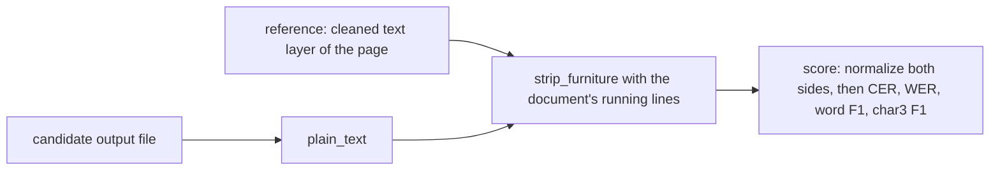

### Metric definitions

`score(reference, hypothesis) -> dict` normalizes both texts and returns:

| Key | Definition | Direction | Order-sensitive |
|---|---|---|---|
| `cer` | character error rate: (substitutions + deletions + insertions) / characters of the normalized reference, computed by `jiwer.cer`, capped at 1.0 | lower is better | yes |
| `wer` | the same over whitespace-separated words (`jiwer.wer`), capped at 1.0 | lower is better | yes |
| `word_f1` | F1 of the multiset of words: overlap = size of the multiset intersection, precision = overlap / hypothesis words, recall = overlap / reference words, F1 = 2PR / (P + R), 0 when there is no overlap | higher is better | no |
| `char3_f1` | the same F1 over character trigrams taken inside each word padded with one space on each side (`" fox "` gives `" fo"`, `"fox"`, `"ox "`) | higher is better | no between words, yes within a word |
| `ref_chars`, `hyp_chars` | lengths of the normalized texts | | |

The four rates are rounded to 4 decimals. Insertions can push CER and WER above 1
(runaway, looping output), so both are capped at 1.0. When the normalized reference is
empty, every rate is `None` (jiwer would return an insertion count, not a rate) and
`ref_chars` is 0. `jiwer` is imported inside `score`, so importing the module does not
require it.

Examples (verified against the current code):

| Reference | Hypothesis | cer | wer | word_f1 | char3_f1 |
|---|---|---|---|---|---|
| `the quick brown fox` | `# The quick brown fox` | 0.0 | 0.0 | 1.0 | 1.0 |
| `the quick brown fox` | `the quikc brown` | 0.3158 | 0.5 | 0.5714 | 0.6897 |
| `alpha beta gamma` | `gamma beta alpha` | 0.5 | 0.6667 | 1.0 | 1.0 |

The second row: WER is 2 errors (a substitution and a deletion) over 4 words; word F1
has 2 common words, P = 2/3, R = 2/4, F1 = 4/7. The third row shows why the
order-insensitive views exist: a different reading order (for example two columns read in
another order) costs CER and WER but not F1.

`word_f1(ref, hyp)` and `char3_f1(ref, hyp)` can be called directly on already
normalized text.

### `bootstrap_ci`

`bootstrap_ci(values, *, n=2000, alpha=0.05, seed=0) -> (mean, low, high)`: percentile
bootstrap CI of the mean of independent values, using `random.Random(seed)` (deterministic
for a seed). `None` values are dropped; no values give `(nan, nan, nan)`. The benchmark
suites use the clustered version in `stats.py` instead; `stats.py` re-exports this one.

### Maintaining the metrics

- Keep every transformation symmetric: it must run on reference and hypothesis alike
  (inside `normalize`, or in both branches of `strip_furniture`).
- `plain_text` must never remove page text. Removing a model's own additions (image
  descriptions, front matter) is fine; removing content the page shows is not.
- A change that alters scores requires a new `SCORING_VERSION` in each affected suite
  (`adapters/datasets/synthetic.py`), never a change to the suite fingerprint. `bench
  report` then re-scores existing runs without re-transcribing (the CLI reads the
  versions from `SCORING_VERSIONS` in `entrypoints/bench_cli.py`).
- Add a case to `tests/unit/test_metrics.py` or `tests/unit/test_bench_fixes.py` for
  every new rule, including a check that plain text passes through unchanged.

## `stats.py`: cluster bootstrap and paired sign-flip test

### Why this module exists

Two problems make naive statistics wrong for an OCR benchmark:

1. Candidates are scored on the same pages, and a hard page is hard for every model.
   Two overlapping independent CIs say little about which candidate is better. The paired
   analysis keeps each unit's two scores together and looks at their difference.
2. Units are not independent. The synthetic suite scores every page at several
   degradation levels, and an olmOCR-bench PDF carries many tests that share one
   transcription. Resampling such units as if they were independent gives intervals that
   are too narrow and p-values that are too small (the module docstring records a null
   simulation with 12 pages x 3 levels that rejected 27% of the time at a nominal 5%).
   Units are therefore grouped into clusters that are resampled, and sign-flipped,
   together.

### Vocabulary

| Term | Meaning | Synthetic suite | olmOCR-bench suite |
|---|---|---|---|
| unit | one scored item with a metric value | a sample: one page at one degradation level | one test |
| group | the statistic is the mean of per-group means (empty: plain mean) | not used | the jsonl test file; the headline is the mean of per-file pass rates |
| cluster | units that are resampled and sign-flipped together | a page with all its levels (`<pdf>#p<page>`) | a PDF with all its tests |
| stratum | clusters are resampled within their stratum | not used (one stratum) | the category the PDF was sampled from |

Suites put these labels in `SuiteScore.units`, `unit_groups`, `unit_clusters` and
`cluster_strata`; `benchmark.compare` passes them to `paired_bootstrap`.

Defaults when a label is missing: one group; every unit its own cluster; strata equal to
the groups when there are no clusters (resample within each group), otherwise a single
stratum. A cluster that appears in two strata raises `ValueError`. Strata that hold a
single cluster are merged (the survey-statistics "collapsed strata"): resampling one
cluster out of one always returns it and would contribute zero variance. Singletons are
pooled together, or a lone singleton joins the smallest other stratum.

### How the computation works

The diagram shows the two computations that share one design matrix: the cluster bootstrap that produces the confidence interval, and the sign-flip test that produces the paired p-value. The numbered steps below describe each box.

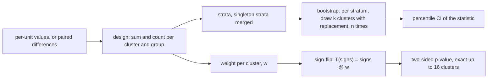

1. Design. Values are summed and counted into a matrix with one row per cluster and one
   column per group. The statistic for a vector of cluster weights (how many times each
   cluster was drawn) is the mean over groups of `(weights @ sums) / (weights @ counts)`.
   A group absent from a resample is skipped (NaN-mean). With one group this is the plain
   mean of the units.
2. Bootstrap. For each resample, within each stratum of `k` clusters, the weights are a
   multinomial draw of `k` from `k` equally likely clusters (drawing whole clusters with
   replacement). Resamples are computed in numpy batches of 500 to bound memory.
3. Percentile CI. `low` and `high` are the sorted resampled statistics at indices
   `int(n * alpha / 2)` and `int(n * (1 - alpha / 2)) - 1`.
4. Sign-flip test (paired only). Under the null hypothesis that the two candidates are
   exchangeable, each cluster's differences may flip sign together. The grouped mean is
   linear in the cluster signs, so `T(signs) = signs @ w` with
   `w_c = sum over groups g of sums[c, g] / (total count of g * number of groups)`. The
   two-sided p-value is the share of sign patterns with `|T| >= |observed|` (with a
   1e-12 relative tolerance). With `k <= 16` clusters every one of the `2^k` patterns is
   enumerated (`exact=True`); above that, `n` random patterns are drawn and
   `p = (1 + extreme) / (1 + n)`, which is never 0.

The sign-flip test stays valid with few clusters, unlike a bootstrap CI. Its smallest
attainable p-value with `k` clusters is `2 / 2^k` (the observed pattern and its mirror
image always count), so a comparison over 5 or fewer clusters can never be significant at
0.05 (`2 / 2^5 = 0.0625`), and one over 6 clusters is significant only when every
cluster's difference points the same way (`2 / 2^6 = 0.03125`).

### API

| Name | Signature | Returns |
|---|---|---|
| `cluster_bootstrap_ci` | `(values, *, groups=None, clusters=None, strata=None, n=2000, alpha=0.05, seed=0)` | `(statistic, low, high)`. `None` values are dropped. No values: `(nan, nan, nan)`. A single cluster: `(statistic, nan, nan)`, since one cluster has no estimable spread. |
| `paired_bootstrap` | `(a, b, *, groups=None, clusters=None, strata=None, n=10_000, alpha=0.05, seed=0)` | `PairedResult` for `mean(a - b)`. Pairs where either side is `None` are dropped. Different lengths raise `ValueError`. No pairs: all NaN and `n=0`. One cluster: `low` and `high` are NaN, `p_value` is 1. |
| `PairedResult` | frozen dataclass | `diff` (grouped: mean over groups of per-group differences), `low`, `high` (cluster bootstrap CI of `diff`), `p_value` (two-sided sign-flip), `n` (pairs used), `n_clusters`, `exact` (every pattern enumerated), `alpha`, and the property `significant` = `p_value < alpha` (and not NaN) |
| `quantile` | `(values, q)` | linear-interpolated quantile, numpy's default method; NaN for no values |
| `MIN_CLUSTERS` | `10` | below this many clusters a percentile bootstrap CI is noticeably too narrow; the report flags such comparisons |
| `bootstrap_ci` | re-exported from `metrics.py` | independent-unit percentile bootstrap |

Significance is decided by the sign-flip test, not by whether the CI excludes 0. With few
clusters the bootstrap CI can exclude 0 while the attainable p-values cannot go below
`2 / 2^k`. Both functions are deterministic for a given `seed` (`numpy.random.default_rng`);
`paired_bootstrap` uses the same generator for the bootstrap and for the Monte Carlo
sign flips.

### Worked example

Two candidates scored on 6 units that come from 3 pages (2 units per page); candidate A
has a lower value on every unit.

```python
from docingest.application.stats import cluster_bootstrap_ci, paired_bootstrap

a = [0.10, 0.12, 0.20, 0.22, 0.30, 0.31]
b = [0.15, 0.16, 0.25, 0.27, 0.33, 0.36]
pages = ["p1", "p1", "p2", "p2", "p3", "p3"]

r = paired_bootstrap(a, b, clusters=pages, n=2000, seed=0)
# r.diff about -0.045, r.low about -0.05, r.high about -0.04
# r.p_value == 0.25, r.n == 6, r.n_clusters == 3, r.exact is True
# r.significant is False: with 3 clusters the smallest p is 2/2^3 = 0.25

cluster_bootstrap_ci(a, clusters=pages, n=2000)  # (0.2083..., 0.11, 0.305)
cluster_bootstrap_ci([0.1, 0.2], clusters=["x", "x"])  # (0.15..., nan, nan): one cluster
```

The CI excludes 0 but the test cannot reject with 3 clusters, which is exactly the case
the report's `MIN_CLUSTERS` note warns about. With 20 clusters and the same consistent
difference, the test switches to Monte Carlo (`exact` is `False`); when none of the `n`
random patterns is as extreme as the observed one it reports `p = 1 / (1 + n)`, the
smallest value it can return.

### Maintaining the statistics

- Keep every function deterministic for a seed; reports must be reproducible.
- Units, groups, clusters and strata are aligned lists; `_check_aligned` enforces equal
  lengths. When a suite changes how it forms clusters or strata, bump that suite's
  `SCORING_VERSION` so existing runs are re-scored.
- The exact enumeration builds a `2^k` by `k` matrix; `_EXACT_MAX_CLUSTERS = 16` keeps it
  at 65,536 rows. Raising it grows memory and time exponentially.
- `tests/unit/test_stats.py` and `tests/unit/test_bench_fixes.py` cover the paired test,
  groups, clusters, strata collapse and the false-positive rate of a clustered null;
  extend them with any change.

## Adding or changing a use case

To add a new use case (for example a re-indexing or export service):

1. Create `src/docingest/application/<name>.py` with a module docstring that starts with
   "Use case:".
2. Import only from `..domain`, `..ports` and other application modules. If you need a
   capability that no port offers, add a `Protocol` to `docingest.ports` first (see
   [ports/README.md](../ports/README.md)) and an adapter that implements it (see
   [adapters/README.md](../adapters/README.md)).
3. Take every port as a keyword-only constructor argument and accept a
   `log: Callable[[str], None] = print` for progress, like the existing services.
4. Raise domain errors (`DocingestError` subclasses) for expected failures. Let the
   caller decide whether a batch continues; catch per item only where the use case is
   itself a batch (as `CrawlService` does per record).
5. Expose the service as a `cached_property` on `bootstrap.Container`, and add a thin
   command in `entrypoints/cli.py` that parses arguments, calls the service and prints
   (see [entrypoints/README.md](../entrypoints/README.md)).
6. Write unit tests in `tests/unit/` with the fakes from `tests/fakes.py` (see
   [tests/README.md](../../../tests/README.md)).
7. Run `uv run lint-imports`, `uv run ruff check src tests` and `uv run pytest -q`, or
   `./scripts/check.sh`, which runs every gate CI runs (ruff check and format, import
   contracts, pyright, pytest with coverage).

When changing `IngestService`:

- If ingestion output changes for the same input and adapters, change
  `PIPELINE_VERSION`, `[project] version` in `pyproject.toml` and the lock (a test
  checks they match). See
  [Versioning](#versioning-pipeline_version).
- Keep the cache key minimal: add to `config_hash` only what changes the output of that
  kind. Anything added there re-processes documents when it changes.
- Keep `retitle_markdown` consistent with `domain.text.render_markdown`: the metadata
  refresh relies on the title line being exactly `# <title>` at the start of the file.

When changing `benchmark.py`:

- New telemetry keys must be optional when read (`r.get(...)`): old runs keep their
  telemetry, and `throughput` already treats records without the retry ladder as lower
  bounds.
- Anything that changes transcription belongs in the suite fingerprint or the candidate
  spec, which the manifest checks. Anything that changes scoring belongs in the suite's
  `scoring_version`.

See also [CONTRIBUTING.md](../../../CONTRIBUTING.md).

## Tests

| Module | Tests |
|---|---|
| `ingest.py` | `tests/unit/test_ingest_service.py`, `tests/unit/test_core_fixes.py`, `tests/unit/test_services.py`, `tests/integration/test_pipeline_real_adapters.py` |
| `crawl.py` | `tests/unit/test_services.py`, `tests/unit/test_arxiv.py`, `tests/unit/test_arxiv_fixes.py` |
| `ask.py` | `tests/unit/test_services.py` |
| `benchmark.py` | `tests/unit/test_benchmark.py`, `tests/unit/test_bench_fixes.py` |
| `metrics.py` | `tests/unit/test_metrics.py`, `tests/unit/test_bench_fixes.py` |
| `stats.py` | `tests/unit/test_stats.py`, `tests/unit/test_bench_fixes.py` |

```bash
uv run pytest -q tests/unit        # fast: fakes and tiny generated files, no model, no network
uv run lint-imports                # layer contracts
```

## Related documentation

- [Main README](../../../README.md): installation and quick start
- [Package overview](../README.md)
- [Architecture](../../../docs/architecture.md) and the ADRs:
  [0001 hexagonal architecture](../../../docs/adr/0001-hexagonal-architecture.md),
  [0002 per-page routing and content-addressed cache](../../../docs/adr/0002-per-page-routing-and-content-addressed-cache.md),
  [0003 LaTeX first for arXiv](../../../docs/adr/0003-latex-first-for-arxiv.md)
- [Domain](../domain/README.md), [Ports](../ports/README.md),
  [Adapters](../adapters/README.md), [OCR adapters](../adapters/ocr/README.md),
  [Converters](../adapters/converters/README.md), [Entrypoints](../entrypoints/README.md)
- [Configuration](../../../config/README.md), [Scripts](../../../scripts/README.md),
  [Tests](../../../tests/README.md)
- [OCR benchmark methodology and results](../../../docs/benchmark.md)
