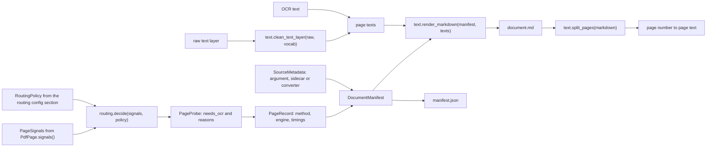
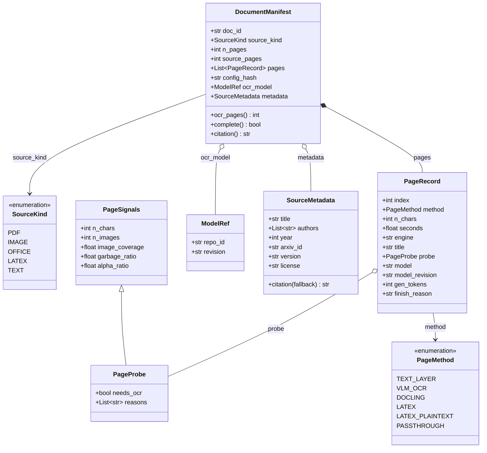
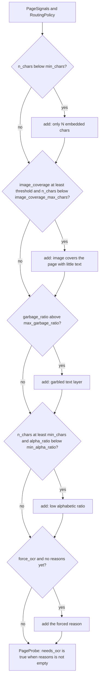
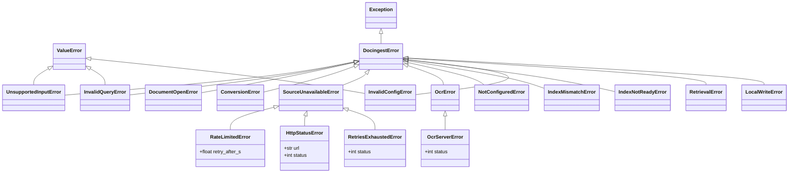

# `docingest.domain`

The domain layer holds the canonical representation of an ingested document, the OCR routing policy, the pure text functions, the page-aware chunker and the error hierarchy. It performs no I/O and knows no adapter. Every other layer depends on it; it depends only on the Python standard library and pydantic.

The import-linter contract "Domain is pure: no I/O or framework libraries" in `pyproject.toml` enforces this: `docingest.domain` may not import pypdfium2, PIL, numpy, mlx, mlx_vlm, paperqa, docling, pypandoc, huggingface_hub, httpx, urllib, typer, rich or jiwer.

Related reading: [package map](../README.md), [ports](../ports/README.md), [application](../application/README.md), [ADR 0002: per-page routing and content-addressed cache](../../../docs/adr/0002-per-page-routing-and-content-addressed-cache.md).

## Contents

- [Modules](#modules)
- [How domain objects flow through an ingestion](#how-domain-objects-flow-through-an-ingestion)
- [models.py](#modelspy)
- [routing.py](#routingpy)
- [text.py](#textpy)
- [chunking.py](#chunkingpy)
- [errors.py](#errorspy)
- [Changing the domain safely](#changing-the-domain-safely)

## Modules

| Module | Contains | Used by |
|---|---|---|
| `models.py` | `SourceKind`, `PageMethod`, `PageSignals`, `PageProbe`, `ModelRef`, `SourceMetadata`, `PageRecord`, `DocumentManifest` (pydantic models and `StrEnum`s) | every layer |
| `routing.py` | `RoutingPolicy` (thresholds, the `[routing]` config section) and `decide()` | `IngestService` for every PDF page, `config.AppConfig.routing` |
| `text.py` | `HYPHEN_MARK`, `garbage_ratio`, `alpha_ratio`, `text_vocabulary`, `clean_text_layer`, `render_markdown`, `split_pages` | PDF adapter (signals), `IngestService` (clean-up, rendering), synthetic benchmark suite (clean reference text), PaperQA2 adapter and hook, `eval-ocr` command (splitting) |
| `chunking.py` | `Chunk`, `chunk_pages`, `CHUNKER_VERSION`, `CHUNK_CHARS`, `OVERLAP` | `ports` (`Chunk` is re-exported there); the chunk index and `AskService` use it through those |
| `errors.py` | `DocingestError` and its subclasses | adapters raise them, application and entrypoints handle them |

## How domain objects flow through an ingestion

The diagram follows one PDF page and one document through the domain types and functions. Image frames and converter segments skip the routing part and go straight to `PageRecord`.



## models.py

`models.py` defines the canonical intermediate representation. Whatever the input, the pipeline emits the same two artifacts: `document.md` (normalized Markdown with page markers) and `manifest.json` (a serialized `DocumentManifest`). Downstream consumers only ever see these.



The diagram shows the main fields only. The tables below list every field; `X | None` fields default to `None` unless stated.

### `SourceKind`

A `StrEnum` naming the kind of input. The type detector decides it; the kind selects the handler and is part of the cache key.

| Member | Value | Typical inputs | Handled by |
|---|---|---|---|
| `PDF` | `"pdf"` | `.pdf` files (detected by the `%PDF-` header) | `PdfReader`, the routing policy and `OcrEngine`, page by page |
| `IMAGE` | `"image"` | PNG, JPEG, TIFF (multi-frame), GIF, WebP, BMP | `ImageSource`, then `OcrEngine` for every frame |
| `OFFICE` | `"office"` | `.docx`, `.pptx`, `.xlsx`, `.html`, `.htm`, `.xhtml` | the `office` converter |
| `LATEX` | `"latex"` | `.tex`, `.ltx`, tar archives, arXiv `.tar.gz` and single gzipped `.tex` | the `latex` converter |
| `TEXT` | `"text"` | `.md`, `.markdown`, `.txt` | the `text` converter |

The exact detection rules (magic bytes first, suffix as fallback) are described in [adapters/README.md](../adapters/README.md).

### `PageMethod`

A `StrEnum` naming how the text of one page or segment was produced. It is stored in `PageRecord.method` and written into the page marker of `document.md`.

| Member | Value | Produced by | Input kinds |
|---|---|---|---|
| `TEXT_LAYER` | `"text_layer"` | `IngestService`, when `decide()` finds the embedded text usable; the text is the cleaned text layer | PDF |
| `VLM_OCR` | `"vlm_ocr"` | `IngestService` through `OcrEngine.transcribe()` | PDF pages that need OCR, every image frame |
| `DOCLING` | `"docling"` | `DoclingConverter` | OFFICE |
| `LATEX` | `"latex"` | `PandocLatexConverter`, when pandoc succeeds (one segment per section) | LATEX |
| `LATEX_PLAINTEXT` | `"latex_plaintext"` | `PandocLatexConverter`, when it falls back to pylatexenc plain text | LATEX |
| `PASSTHROUGH` | `"passthrough"` | `PassthroughConverter` (file content as one segment) | TEXT |

### `PageSignals`

Raw measurements of one PDF page, produced by a `PdfReader` adapter (`PdfPage.signals()`). They are the only input of the routing policy.

| Field | Type | Default | Meaning |
|---|---|---|---|
| `n_chars` | `int` | `0` | Number of non-whitespace characters in the embedded text layer. |
| `n_images` | `int` | `0` | Number of image objects on the page. |
| `image_coverage` | `float` | `0.0` | Fraction of the page area covered by image objects, from 0 to 1. |
| `garbage_ratio` | `float` | `0.0` | Share of characters that indicate a broken text layer, computed with `text.garbage_ratio`. |
| `alpha_ratio` | `float` | `0.0` | Share of letters among non-space characters, computed with `text.alpha_ratio`. |

### `PageProbe`

`PageProbe` extends `PageSignals` with the routing decision taken on them. It is created only by `routing.decide()` and is stored in `PageRecord.probe` for every PDF page, whichever way it was routed.

| Field | Type | Default | Meaning |
|---|---|---|---|
| (all `PageSignals` fields) | | | copied from the measured signals |
| `needs_ocr` | `bool` | `False` | `True` when at least one reason was recorded. |
| `reasons` | `list[str]` | `[]` | Human-readable reasons, one per rule that fired (see [routing.py](#routingpy)). |

### `ModelRef`

A pinned model: `repo_id: str` (for example a Hugging Face repository id) and `revision: str` (a commit of that repository). Both are required. `OcrEngine.model` is a `ModelRef`, and it is copied into `PageRecord.model` / `model_revision` and `DocumentManifest.ocr_model`. `config.OcrConfig` refuses a non-default `repo_id` without a `revision`, so the model that produced an OCR page is always identifiable.

### `SourceMetadata`

Bibliographic metadata. Every field is optional.

| Field | Type | Default | Meaning |
|---|---|---|---|
| `title` | `str \| None` | `None` | Document title. When set, it becomes the manifest title. |
| `authors` | `list[str]` | `[]` | Author names, in order. |
| `year` | `int \| None` | `None` | Publication year. |
| `abstract` | `str \| None` | `None` | Abstract text. |
| `doi` | `str \| None` | `None` | DOI. |
| `arxiv_id` | `str \| None` | `None` | arXiv id without version, for example `"1706.03762"`. |
| `version` | `str \| None` | `None` | arXiv version, for example `"v7"`. |
| `url` | `str \| None` | `None` | Landing page URL. |
| `license` | `str \| None` | `None` | License URL or identifier. |
| `categories` | `list[str]` | `[]` | Subject categories, for example arXiv categories. |

Where it comes from: the `metadata` argument of `IngestService.ingest`, a `<file>.meta.json` sidecar next to the input (written by `CrawlService` for every crawled file), or the converter (the pandoc LaTeX converter extracts title, authors and abstract).

`citation(fallback: str) -> str` builds the short citation used in QA answers:

1. The last whitespace-separated word of the first author, followed by ` et al.` when there is more than one author.
2. `(year)` when `year` is set.
3. `title`, or `fallback` when there is no title.
4. `arXiv:<arxiv_id><version>` when `arxiv_id` is set.

The parts that exist are joined with `". "`:

| Metadata | `citation(...)` |
|---|---|
| authors `["Ashish Vaswani", "Noam Shazeer"]`, year 2017, title `"Attention Is All You Need"`, arxiv_id `"1706.03762"`, version `"v7"` | `Vaswani et al. (2017). Attention Is All You Need. arXiv:1706.03762v7` |
| authors `["Ada Lovelace"]`, no title, fallback `"notes.md"` | `Lovelace. notes.md` |
| nothing, fallback `"paper.pdf"` | `paper.pdf` |

### `PageRecord`

Provenance of one page (PDF), frame (image) or segment (converter).

| Field | Type | Default | Set for | Meaning |
|---|---|---|---|---|
| `index` | `int` | required | all | 0-based position. The page marker in `document.md` uses `index + 1`. |
| `method` | `PageMethod` | required | all | How the text was produced. |
| `n_chars` | `int` | required | all | Length of the page text as written to `document.md`. For text-layer pages this is measured after clean-up. |
| `seconds` | `float` | required | all | Time spent on this page. For text-layer pages, the time to read the page's signals (rounded to 3 decimals; clean-up runs later for the whole document). For OCR pages, `OcrResult.seconds` rounded to 2 decimals. For converter segments, the conversion time divided equally over the kept segments. |
| `engine` | `str \| None` | `None` | all | What produced the text: `PdfReader.fingerprint` for text-layer pages (for example `"pypdfium2 5.13.0"`), `OcrEngine.fingerprint` for OCR pages, `Conversion.engine` for segments (for example `"pandoc 3.8"`). |
| `title` | `str \| None` | `None` | converter segments | Section or segment title (`Segment.title`). |
| `probe` | `PageProbe \| None` | `None` | PDF pages | Signals and routing decision. `None` for image frames and converter segments. |
| `model` | `str \| None` | `None` | OCR pages | `OcrEngine.model.repo_id`. |
| `model_revision` | `str \| None` | `None` | OCR pages | `OcrEngine.model.revision`. |
| `gen_tokens` | `int \| None` | `None` | OCR pages | Tokens generated for the attempt whose text was kept. |
| `finish_reason` | `str \| None` | `None` | OCR pages | Why generation stopped, for example `"stop"` or `"length"` (a truncation). |

### `DocumentManifest`

The provenance record of one ingestion run, serialized as `manifest.json`.

| Field | Type | Default | Meaning |
|---|---|---|---|
| `doc_id` | `str` | required | SHA-256 of the raw input bytes, 64 lowercase hex characters (content-addressed). |
| `source_path` | `str` | required | Absolute path of the input at ingestion time. |
| `source_name` | `str` | required | File name of the input. |
| `source_kind` | `SourceKind` | required | Detected kind. |
| `mime` | `str` | required | MIME type returned by the detector. |
| `size_bytes` | `int` | required | Input size in bytes. |
| `n_pages` | `int` | required | Pages, frames or segments processed in this run. |
| `source_pages` | `int` | required | Pages, frames or segments in the source. |
| `max_pages` | `int \| None` | `None` | The `max_pages` run option, recorded for provenance. |
| `ocr_all` | `bool` | `False` | The `ocr_all` run option. Only ever `True` for PDFs. |
| `pages` | `list[PageRecord]` | required | One record per processed page, in order. |
| `pipeline_version` | `str` | required | `application.ingest.PIPELINE_VERSION` at ingestion time. |
| `config_hash` | `str` | required | Cache key of this run (see the invariants below). |
| `ocr_model` | `ModelRef \| None` | `None` | The OCR engine's model, set only when at least one page used OCR. |
| `title` | `str \| None` | `None` | Document title. |
| `metadata` | `SourceMetadata \| None` | `None` | Bibliographic metadata, when known. |
| `created_at` | `str` | now | UTC timestamp in ISO 8601 with seconds precision, set when the manifest is created. |
| `total_seconds` | `float` | `0.0` | Processing wall time, rounded to 2 decimals. |

Derived members:

| Member | Returns |
|---|---|
| `ocr_pages` (property) | Number of pages whose `method` is `VLM_OCR`. |
| `complete` (property) | `n_pages == source_pages`. `False` means a partial run (`max_pages` below the source length). |
| `citation()` | `metadata.citation(title or source_name)` when metadata exists, else `"<title> (<source_name>)"` when there is a title, else `source_name`. |

#### Invariants

`IngestService` maintains these when it builds a manifest, and stores rely on them:

1. `doc_id` depends only on the bytes. The same file under another name or path has the same `doc_id`. The filesystem store names directories after `doc_id[:16]`.
2. `len(pages) == n_pages` and `pages[i].index == i`.
3. `n_pages <= source_pages`. A result is complete exactly when they are equal.
4. `config_hash` is the first 12 hex characters of the SHA-256 of a JSON list `[PIPELINE_VERSION, source_kind value, ocr_all, *parts]`, where `parts` depends on the kind:
   - PDF: the routing policy as JSON, `PdfReader.fingerprint`, `OcrEngine.fingerprint`;
   - IMAGE: `ImageSource.fingerprint`, `OcrEngine.fingerprint`;
   - OFFICE, LATEX, TEXT: the fingerprint of that kind's converter.

   It is computed by `IngestService.config_hash()`; the domain only stores it.
5. `ocr_model` is set if and only if some page has `method == VLM_OCR`.
6. `title` is always set by `IngestService`: `metadata.title`, else the document's own title (PDF `Title` info or the converter's title), else the file name without its last suffix (`Path.stem`).
7. A store treats a result as canonical only when it is complete and `ocr_all` is `False` (and it was not produced by a degraded fallback). Everything else is a variant that never replaces a canonical result.
8. After creation a manifest changes only in one way: when a cached result is served with new metadata, `IngestService` replaces `metadata` and `title` (with `model_copy`) and saves it again in place.

#### Example `manifest.json`

A two-page PDF whose first page has a usable text layer and whose second page is a scan. Values are illustrative; the OCR `engine` string is the full engine fingerprint and is shortened here.

```json
{
  "doc_id": "9f2c000000000000000000000000000000000000000000000000000000000000",
  "source_path": "/abs/path/paper.pdf",
  "source_name": "paper.pdf",
  "source_kind": "pdf",
  "mime": "application/pdf",
  "size_bytes": 482113,
  "n_pages": 2,
  "source_pages": 2,
  "max_pages": null,
  "ocr_all": false,
  "pages": [
    {
      "index": 0,
      "method": "text_layer",
      "n_chars": 2688,
      "seconds": 0.012,
      "engine": "pypdfium2 5.13.0",
      "title": null,
      "probe": {
        "n_chars": 2710,
        "n_images": 0,
        "image_coverage": 0.0,
        "garbage_ratio": 0.0,
        "alpha_ratio": 0.83,
        "needs_ocr": false,
        "reasons": []
      },
      "model": null,
      "model_revision": null,
      "gen_tokens": null,
      "finish_reason": null
    },
    {
      "index": 1,
      "method": "vlm_ocr",
      "n_chars": 1934,
      "seconds": 41.3,
      "engine": "mlx-vlm {...}",
      "title": null,
      "probe": {
        "n_chars": 0,
        "n_images": 1,
        "image_coverage": 1.0,
        "garbage_ratio": 0.0,
        "alpha_ratio": 0.0,
        "needs_ocr": true,
        "reasons": [
          "only 0 embedded chars (<50)",
          "image covers 100% of page with little text"
        ]
      },
      "model": "mlx-community/Qwen3-VL-4B-Instruct-4bit",
      "model_revision": "2fd8dacbdb8f1e54b8c005f081ec5bf79c56376b",
      "gen_tokens": 602,
      "finish_reason": "stop"
    }
  ],
  "pipeline_version": "0.3.1",
  "config_hash": "1a2b3c4d5e6f",
  "ocr_model": {
    "repo_id": "mlx-community/Qwen3-VL-4B-Instruct-4bit",
    "revision": "2fd8dacbdb8f1e54b8c005f081ec5bf79c56376b"
  },
  "title": "paper",
  "metadata": null,
  "created_at": "2026-09-25T19:57:51+00:00",
  "total_seconds": 41.4
}
```

Note that `probe.n_chars` counts non-whitespace characters of the raw text layer, while the record's `n_chars` is the length of the cleaned page text.

## routing.py

`routing.py` decides, for each PDF page, whether the embedded text layer can be used or the page must be rendered and sent to OCR. The decision is a pure function of the measured `PageSignals` and a `RoutingPolicy`.

### `RoutingPolicy`

A pydantic model; its values come from the `[routing]` section of `config/pipeline.toml` (`AppConfig.routing`). The defaults follow published pipelines (Marker, olmOCR).

| Field | Type | Default | Meaning |
|---|---|---|---|
| `min_chars` | `int` | `50` | A page with fewer embedded non-whitespace characters is treated as scanned. |
| `image_coverage` | `float` | `0.6` | Image-coverage threshold for the "large image with little text" rule. |
| `image_coverage_max_chars` | `int` | `400` | "Little text" for that rule: fewer characters than this. |
| `max_garbage_ratio` | `float` | `0.10` | Above this share of broken glyphs the text layer is considered garbled. |
| `min_alpha_ratio` | `float` | `0.5` | Below this share of letters the text layer is considered suspicious (olmOCR heuristic). |

`RoutingPolicy` forbids unknown fields (`extra="forbid"`), like the other config sections: a misspelled key in `[routing]` is a validation error, never a silently ignored threshold.

### `decide(signals, policy, *, force_ocr=False) -> PageProbe`

Every rule is evaluated; each one that fires adds a reason. `needs_ocr` is `True` when there is at least one reason.

| # | Rule fires when | Reason recorded |
|---|---|---|
| 1 | `n_chars < min_chars` | `only <n_chars> embedded chars (<<min_chars>)` |
| 2 | `image_coverage >= policy.image_coverage` and `n_chars < image_coverage_max_chars` | `image covers <coverage as %> of page with little text` |
| 3 | `garbage_ratio > max_garbage_ratio` | `garbled text layer (<garbage_ratio as %> bad glyphs)` |
| 4 | `n_chars >= min_chars` and `alpha_ratio < min_alpha_ratio` | `low alphabetic ratio (<alpha_ratio as %>)` |
| 5 | `force_ocr` is `True` and no other rule fired | `forced (--ocr-all)` |

The diagram shows the order in which `decide` evaluates the rules for one page. No rule short-circuits the others: each one that fires appends its reason, and the forced reason is added only when the list is still empty.



Properties to rely on:

- Reasons accumulate: a blank scanned page typically records both rule 1 and rule 2.
- Rule 4 applies only when rule 1 does not, so a nearly empty page is never also flagged for its letter ratio.
- With `force_ocr=True` the page always needs OCR. The `forced (--ocr-all)` reason is added only when no rule fired, so a page that would have gone to OCR anyway keeps its real reasons.
- `decide` is deterministic and has no side effects. It returns a new `PageProbe` with the signals copied in.
- The policy is part of the cache key of PDF inputs only (its JSON is in `config_hash`). Changing a threshold re-processes PDFs on the next run and leaves images and converter inputs cached.

Examples (these are the cases in `tests/unit/test_routing_policy.py`, run with the default policy):

| Signals | `needs_ocr` | `reasons` |
|---|---|---|
| `n_chars=3000, alpha_ratio=0.8` | `False` | none |
| `n_chars=0, n_images=1, image_coverage=1.0` | `True` | `only 0 embedded chars (<50)`, `image covers 100% of page with little text` |
| `n_chars=120, image_coverage=0.9, alpha_ratio=0.8` | `True` | `image covers 90% of page with little text` |
| `n_chars=2000, image_coverage=0.9, alpha_ratio=0.8` | `False` | none (enough text despite the image) |
| `n_chars=900, garbage_ratio=0.4, alpha_ratio=0.8` | `True` | `garbled text layer (40% bad glyphs)` |
| `n_chars=900, alpha_ratio=0.2` | `True` | `low alphabetic ratio (20%)` |

```python
from docingest.domain.models import PageSignals
from docingest.domain.routing import RoutingPolicy, decide

probe = decide(PageSignals(n_chars=900, alpha_ratio=0.2), RoutingPolicy())
print(probe.needs_ocr, probe.reasons)  # True ['low alphabetic ratio (20%)']

lenient = RoutingPolicy(min_chars=0, min_alpha_ratio=0)
print(decide(PageSignals(n_chars=0), lenient).needs_ocr)  # False
```

## text.py

Pure string functions: quality signals for a PDF text layer, its clean-up, and the Markdown format of `document.md`.

| Name | Signature | Purpose |
|---|---|---|
| `HYPHEN_MARK` | `"\x02"` | The character pdfium puts in place of a line-end hyphen when it joins the two lines. |
| `garbage_ratio` | `(text: str) -> float` | Share of characters that indicate a broken text layer. |
| `alpha_ratio` | `(text: str) -> float` | Share of letters among non-space characters. |
| `text_vocabulary` | `(*texts: str) -> set[str]` | Lower-cased word set used to decide de-hyphenation. |
| `clean_text_layer` | `(text: str, vocab: set[str] \| None = None) -> str` | Normalize a PDF text layer. |
| `render_markdown` | `(manifest: DocumentManifest, texts: list[str]) -> str` | Build `document.md` from a manifest and its page texts. |
| `split_pages` | `(markdown: str) -> dict[int, str]` | Inverse of `render_markdown`: page number to page text. |

### Quality signals

- `garbage_ratio(text)`: whitespace is removed first. The "bad" count is the number of U+FFFD replacement characters, plus control characters below U+0020 other than `HYPHEN_MARK`, plus private-use characters (U+E000 to U+F8FF), plus the total length of every `(cid:N)` sequence (unmapped glyphs). The result is bad / non-whitespace length, or `0.0` for empty text.
- `alpha_ratio(text)`: characters for which `str.isalpha()` is true, divided by the non-whitespace length, or `0.0` for empty text. olmOCR flags text below 0.5 as a bad text layer.

A new `PdfReader` adapter should compute `PageSignals.garbage_ratio` and `alpha_ratio` with these functions so that the routing thresholds keep their meaning.

### `clean_text_layer(text, vocab=None)`

Applied to every text-layer page, in this order:

1. Line endings `\r\n` and `\r` become `\n`.
2. If `vocab` is `None`, the vocabulary of `text` itself is used.
3. Every `word<HYPHEN_MARK>word` is joined into one word when the joined word (lower-cased) is in the vocabulary, otherwise it becomes `word-word`. Keeping the hyphen never loses information.
4. Any remaining `HYPHEN_MARK` becomes `-`.
5. A `-` followed by a line break between two word characters is kept and the line break is removed: identifiers and number ranges such as `2019-2020` or `Qwen-2.5-VL-7B` stay intact.
6. Control characters U+0000 to U+0008, U+000B, U+000C and U+000E to U+001F are removed (tab and newline are kept).
7. Spaces and tabs at the end of a line are removed.
8. Three or more consecutive newlines become two.
9. Leading and trailing whitespace is stripped.

`IngestService` builds the vocabulary once per document, from the raw text of every text-layer page plus the OCR text of every OCR page, before cleaning any page. A word hyphenated on page 3 is therefore joined if it appears unbroken anywhere in the document.

| Input | Vocabulary contains | Output |
|---|---|---|
| `transduc\x02tion` | `transduction` | `transduction` |
| `transduc\x02tion` | (empty set) | `transduc-tion` |
| `sequence\x02aligned` | no `sequencealigned` | `sequence-aligned` |
| `2019-\r\n2020` | any | `2019-2020` |

### Markdown format: `render_markdown` and `split_pages`

`render_markdown(manifest, texts)` writes an optional title line and then one block per page record:

```text
# <manifest.title>

<!-- page 1 | method=text_layer -->
<text of page 1>

<!-- page 2 | method=vlm_ocr -->
<text of page 2>
```

- The `# title` line is written only when `manifest.title` is set. A blank line follows it.
- Page numbers are `PageRecord.index + 1`; `method` is the `PageMethod` value.
- `texts` must have exactly one entry per `manifest.pages` element, otherwise `ValueError` (the pairing uses `zip(..., strict=True)`).
- The output has no leading whitespace and ends with exactly one newline.
- Page text is written as is, without escaping.

`split_pages(markdown)` finds lines that consist exactly of `<!-- page <N> | method=<word> -->` and returns `{N: text}`, with each page's text stripped. Anything before the first marker (the title) is dropped. Marker-like text inside a line is not a marker, but a page whose text contains a whole line in exactly that format would be split there.

```python
from docingest.domain.text import split_pages

md = (
    "# T\n\n<!-- page 1 | method=text_layer -->\nhello <!-- page 9 --> world\n\n"
    "<!-- page 2 | method=vlm_ocr -->\nsecond\n"
)
print(split_pages(md))  # {1: 'hello <!-- page 9 --> world', 2: 'second'}
```

`split_pages` is used by the PaperQA2 adapter and hook (to give PaperQA2 page-aware text, so citations point at page ranges) and by the `eval-ocr` command.

## chunking.py

`chunk_pages` cuts a document into the chunks that `docingest ask` gives to PaperQA2: the same text and the same names as PaperQA2's `chunk_pdf` on the pages of `document.md` (the one difference: for a document without pages `chunk_pdf` raises, `chunk_pages` returns no chunks). It is a pure function so that code that may not import `paperqa` (the application layer, a chunk index) cuts papers exactly like `ask` does. A test (`tests/integration/test_chunking_parity.py`) compares the two on documents and on random pages.

| Name | Meaning |
|---|---|
| `Chunk` | Frozen dataclass: `doc_id`, `name` (`"<doc_id[:16]> pages a-b"`, as cited), `text`, `first_page`, `last_page`, `is_reference` (default `False`; the caller sets it from the section titles, the chunker does not know them) and `start`, the offset of `text` in the page texts joined by `"\n\n"` (`"".join(t + "\n\n" for t in pages.values())`; the chunk ends at `start + len(text)`). `name` is not unique inside a paper (several chunks can be `pages 4-4`); `(doc_id, start)` is. |
| `chunk_pages(doc_id, pages, *, chunk_chars, overlap)` | `pages` is the `{page number: text}` of `split_pages`. Every page text is followed by `"\n\n"` so words do not fuse across pages, a chunk is cut every `chunk_chars` characters and the next one starts `overlap` characters earlier. A chunk names the first and last page it touches, always as a range (`pages 3-3` for one page). No pages give no chunks; `overlap` must be smaller than `chunk_chars`. Both settings are required: the callers pass `[qa] chunk_chars` and `overlap`, whose defaults are `CHUNK_CHARS` (900) and `OVERLAP` (100) from this module, so the number lives in one place. |
| `CHUNKER_VERSION` | Bump it when the algorithm changes, so an index built with the old one is not reused. |

```python
from docingest.domain.chunking import chunk_pages

chunks = chunk_pages("ab" * 32, {1: "x" * 500, 2: "y" * 500}, chunk_chars=900, overlap=100)
print([(c.name, c.start, len(c.text)) for c in chunks])
# [('abababababababab pages 1-2', 0, 900), ('abababababababab pages 2-2', 800, 204)]
```

## errors.py

Domain errors describe expected, reportable failures. Adapters translate library exceptions into them (`raise ConversionError(...) from e`), so the application and the CLI never need to know which library failed.

The diagram includes the subclasses that adapters define on top of the domain classes; those live in the adapter modules named in the second table.



### Domain errors (`domain/errors.py`)

| Error | Bases | Meaning | Raised by (examples) | Handled by |
|---|---|---|---|---|
| `DocingestError` | `Exception` | Base class for expected, reportable failures. | (not raised directly) | `CrawlService.run` turns one raised by `search()` into a report entry instead of a traceback. |
| `UnsupportedInputError` | `DocingestError`, `ValueError` | The input type is not recognized. | `MagicBytesDetector.detect` (unknown type, corrupt gzip, gzipped PDF, gzipped PostScript or HTML); `IngestService` when no converter is configured for the detected kind. | The CLI records the file as failed and continues. |
| `InvalidQueryError` | `DocingestError`, `ValueError` | A crawler query that cannot be sent (empty, or an `ids:` list without ids). | `ArxivCrawler.search` (through `query_params` / `parse_ids`), before any request. | `CrawlService.run` ends the crawl with a report; `docingest crawl` exits with status 1, no traceback. |
| `DocumentOpenError` | `DocingestError` | The document exists but cannot be opened (corrupt, encrypted, truncated). | `PdfiumReader.open`, `PillowImageSource.frames`, the benchmark suites for missing or unreadable sources. | The PaperQA2 hook converts it to PaperQA2's `ImpossibleParsingError`. |
| `ConversionError` | `DocingestError` | A converter could not produce text. | `DoclingConverter` (missing `office` extra, Docling failure); `PandocLatexConverter` and `latex_source` (archive cannot be unpacked, no `.tex` file, size limits, pandoc failed with no usable fallback). | The CLI records the file as failed. |
| `SourceUnavailableError` | `DocingestError` | A remote source has no downloadable content for a record. | `ArxivCrawler` (API error, malformed XML, no usable format); the olmOCR-bench dataset download. | `CrawlService` records the record as failed and moves on. |
| `RateLimitedError` | `SourceUnavailableError` | The source asked for a pause (HTTP 429 or `Retry-After`) that the crawler will not sit out. `retry_after_s: float \| None` is the pause still owed, if the server named one. | `PoliteClient` in `adapters/sources/http.py`. | `CrawlService` stops the crawl: the pause concerns every later request to the same source. Remaining records are reported as not attempted. |
| `OcrError` | `DocingestError` | The OCR engine could not transcribe a page. | `OpenAICompatibleOcr` (as `OcrServerError`). | The CLI records the file as failed; `BenchmarkRunner` records the sample as an error and continues. |
| `NotConfiguredError` | `DocingestError` | A port was used whose `[adapters]` entry is `"none"`: no implementation was chosen. Also an index selected without an embedder. | `NoEmbedder`, `NoIndex`, `NoReranker` (`adapters/retrieval/none.py`); `Container`. | `docingest index` and `docingest ask` with an index print the message and exit with 1. |
| `IndexMismatchError` | `DocingestError` | A chunk index holds vectors of another embedder than the configured one. | `IndexService`, `AskService`. | `docingest index build`, `ingest --index` and `docingest ask` print the message and exit with 1. |
| `IndexNotReadyError` | `DocingestError` | The chunk index cannot answer yet: empty, nothing committed, or no returned chunk belongs to the corpus. The message names `docingest index build`. | `AskService`. | `docingest ask` prints the message and exits with 1. |
| `InvalidConfigError` | `DocingestError`, `ValueError` | A configuration table holds a value that cannot be used; the message names the table and key. | `index_config`; `Container` when an adapter cannot be built from its table. | `docingest ask` with an index prints the message and exits with 1. |
| `RetrievalError` | `DocingestError` | A retrieval step returned something unusable: a reranker that scores another number of chunks, or an index that returns no hit. | `AskService`. | `docingest ask` prints the message and exits with 1. |

`RateLimitedError` is part of the `SourceCrawler` contract: a crawler raises it instead of waiting out a long pause.

### Adapter-level subclasses

| Error | Base | Defined in | Extra attributes |
|---|---|---|---|
| `OcrServerError` | `OcrError` | `adapters/ocr/openai_compat.py` | `status: int \| None`, the HTTP status when the server answered |
| `HttpStatusError` | `SourceUnavailableError` | `adapters/sources/http.py` | `url: str`, `status: int`: a final status the caller did not accept, such as 404 |
| `RetriesExhaustedError` | `SourceUnavailableError` | `adapters/sources/http.py` | `status: int \| None`: every attempt failed transiently |
| `LocalWriteError` | `DocingestError` | `adapters/sources/http.py` | none; raised when a download cannot be written locally (disk full, permissions), and never retried |

Two related exceptions are not `DocingestError`s: `RunMismatchError(ValueError)` in `application/benchmark.py` (a benchmark run directory was started with a different suite or candidate definition) and the `RuntimeError` that `AskService.ask` raises when there are no ingested documents.

Catching errors: `except DocingestError` catches every expected failure. Unexpected exceptions (an `OSError`, a pydantic `ValidationError` from a malformed sidecar) are not subclasses, which is why the `ingest` CLI command catches every exception per input so that one bad file does not stop a batch.

## Changing the domain safely

The domain is small and everything depends on it, so changes ripple outward. Check the relevant item before editing.

| Change | Also required |
|---|---|
| New `SourceKind` | Detect it in the type detector (`adapters/detection/magic.py`); add a converter slot to `AdapterSelection` in `config.py` and to `REGISTRY` and `_LazyConverters._PORT` in `bootstrap.py` (the cache key of a non-PDF, non-image kind is its converter's fingerprint). |
| New `PageMethod` | The value must consist of word characters only (letters, digits, underscore): `split_pages` recognizes markers with `method=(\w+)`. |
| New `DocumentManifest` or `PageRecord` field | Give it a default. Stores load manifests with `model_validate_json`; the filesystem store treats a manifest that fails validation as a cache miss and `corpus()` skips it with a warning, so a required field would make every stored result a miss. |
| New `RoutingPolicy` field | Give it a default and use it in `decide()`. No cache work is needed: the policy JSON is part of the PDF cache key, so PDFs are re-processed automatically (and only PDFs). Add a key to `[routing]` in `config/pipeline.toml` if it should be tunable there. |
| Different logic in `decide`, `clean_text_layer` or `render_markdown` | Bump `PIPELINE_VERSION` in `application/ingest.py`. Code changes are not part of any adapter fingerprint, so without the bump cached results produced by the old logic would still be served. |
| New error type | Subclass the closest existing error so that existing handlers keep working. Put adapter-specific errors in the adapter module, as `OcrServerError` does. |

Tests for this package: `tests/unit/test_domain_models.py`, `tests/unit/test_routing_policy.py`, `tests/unit/test_text.py`, `tests/unit/test_chunking.py`. See [tests/README.md](../../../tests/README.md) and [CONTRIBUTING.md](../../../CONTRIBUTING.md).
