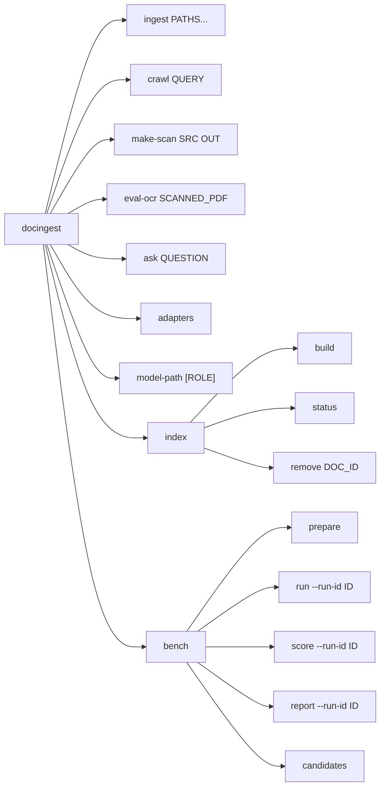
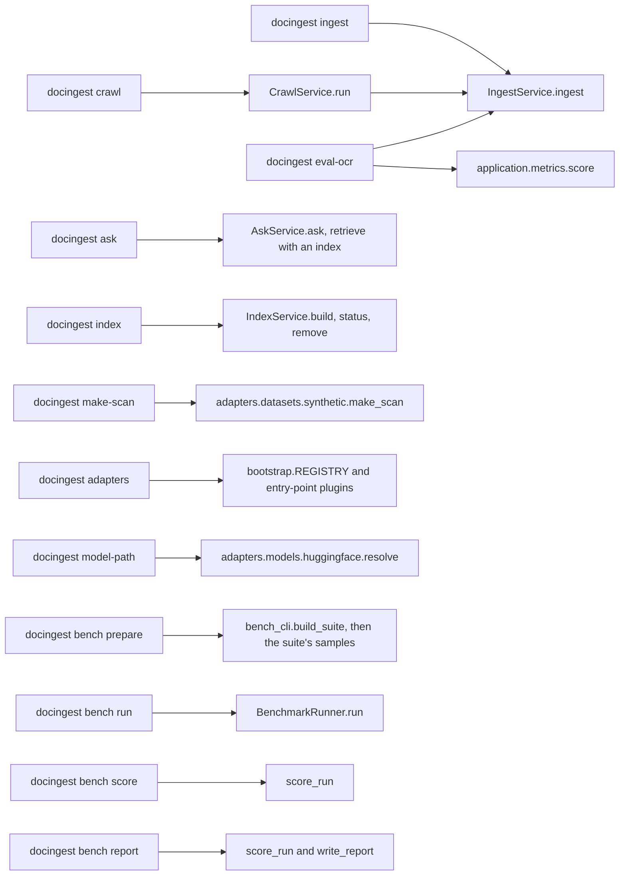
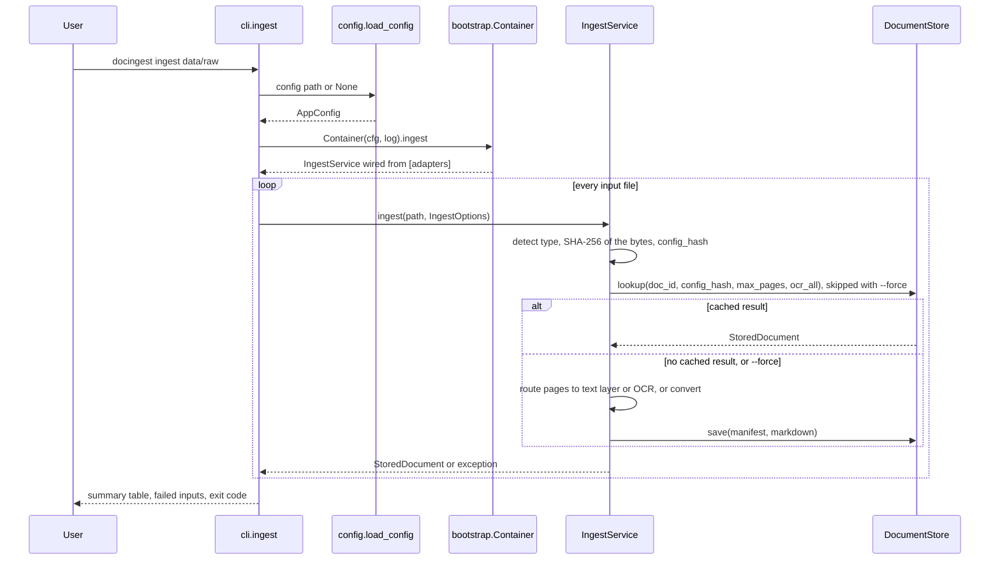
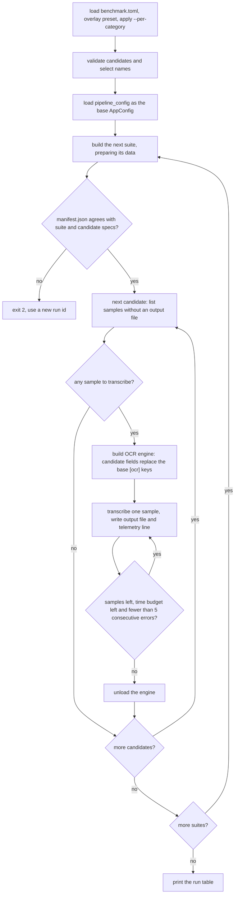
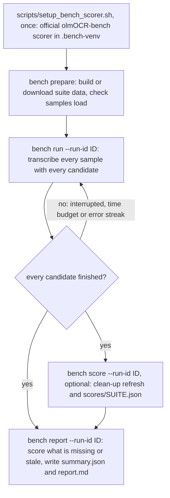
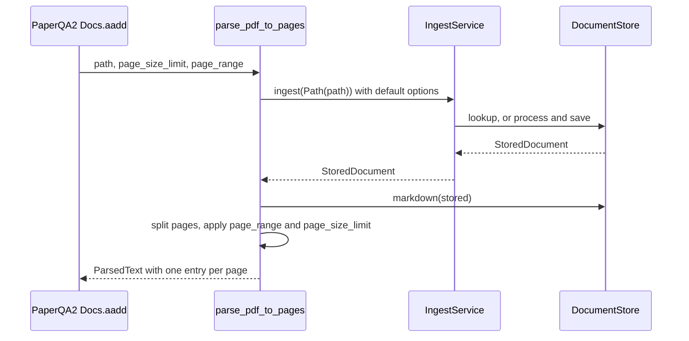

# `docingest.entrypoints`: command line and PaperQA2 hook

This package holds the **driving adapters**: the code that turns a user action into a call to an application use case. It is the outermost layer of the hexagonal architecture (see [../../../docs/architecture.md](../../../docs/architecture.md)). Commands stay thin. They parse arguments, load a configuration, ask the composition root (`docingest.bootstrap.Container`) for a wired use case, call it, and print the result. Logic that is not about the command line belongs in [../application/README.md](../application/README.md) or in an adapter.

| File | What it contains |
|---|---|
| `cli.py` | The Typer application `app`, installed as the `docingest` console script (`[project.scripts] docingest = "docingest.entrypoints.cli:app"` in `pyproject.toml`). Commands: `ingest`, `crawl`, `make-scan`, `eval-ocr`, `ask`, `adapters`, `model-path`. Mounts `bench` and `index`. |
| `bench_cli.py` | The Typer sub-application `bench_app`, mounted as `docingest bench`. It is also the benchmark's composition root: it reads `config/benchmark.toml`, builds the suite adapters and builds each candidate's OCR engine through `bootstrap.build("ocr", ...)`. |
| `index_cli.py` | The Typer sub-application `index_app`, mounted as `docingest index`: `build`, `status`, `remove`. It builds `Container.index_service` and prints its reports; an expected failure is a one-line message and exit code 1. |
| `paperqa_hook.py` | `parse_pdf_to_pages`, a drop-in for PaperQA2's `settings.parsing.parse_pdf`. |
| `__init__.py` | Package marker. |

Contents:

- [Running the CLI](#running-the-cli)
- [Command tree](#command-tree)
- [How a command runs](#how-a-command-runs)
- [Conventions shared by all commands](#conventions-shared-by-all-commands)
- [Command reference](#command-reference): [ingest](#docingest-ingest), [crawl](#docingest-crawl), [make-scan](#docingest-make-scan), [eval-ocr](#docingest-eval-ocr), [ask](#docingest-ask), [adapters](#docingest-adapters), [model-path](#docingest-model-path), [index](#docingest-index), [bench](#docingest-bench)
- [Benchmark workflow](#benchmark-workflow)
- [PaperQA2 `parse_pdf` hook](#paperqa2-parse_pdf-hook)
- [Adding or changing a command](#adding-or-changing-a-command)

## Running the CLI

The package is installed into the project virtual environment by `uv sync`. Run commands from the **package folder** (`packages/docingest`), because relative paths in the configuration files (`data/normalized`, `data/raw`, `data/bench/...`) resolve against the working directory.

```bash
uv sync --locked --all-extras     # once; extras: mlx (in-process OCR on Apple Silicon), qa (PaperQA2), office (Docling)
uv run docingest --help           # or .venv/bin/docingest --help
```

There is no `python -m docingest` entry point; use the `docingest` script.

Some commands need an optional extra:

| Needs | Extra | Commands |
|---|---|---|
| `mlx-vlm` for the default OCR adapter (`[adapters] ocr = "mlx-vlm"`) | `mlx` | `ingest`, `crawl`, `eval-ocr` when a page needs OCR; `bench run` for `mlx-vlm` candidates |
| PaperQA2 | `qa` | `ask`, the PaperQA2 hook |
| Docling | `office` | `ingest` of DOCX, PPTX, XLSX or HTML files |

## Command tree

Every command and sub-command, with its positional arguments and, for `bench`, the required `--run-id` option.



Every top-level command except `make-scan` and `bench` reads `config/pipeline.toml` (or the file given with `--config`); `make-scan` reads no configuration. The `bench` sub-commands read `config/benchmark.toml`, which in turn names a pipeline configuration for the OCR adapters. Both files are described in [../../../config/README.md](../../../config/README.md).

This diagram shows which use case or adapter function each command calls. `bench candidates` only reads and validates the benchmark file, so it is not shown.



## How a command runs

The pipeline commands share one path: load the configuration, build a `Container`, take a use case from it (`ingest`, `crawl` or `ask`). The `Container` builds adapters from the names selected in `[adapters]` (see `bootstrap.REGISTRY`) only when the use case that needs them is first used: `crawl --no-ingest` never builds the ingestion service or the OCR engine, `ask` builds only the store and the QA adapter (and, with an index, the embedder, index and reranker when the question is asked), a converter is built only when a document of its kind appears, and the OCR model itself loads on the first page that needs OCR. The sequence below is `docingest ingest`.



## Conventions shared by all commands

**`--config` / `-c` on pipeline commands.** `ingest`, `crawl`, `eval-ocr`, `ask`, `adapters` and `model-path` accept `--config PATH` (a pipeline TOML file). Typer checks that `PATH` is an existing file (`exists=True, dir_okay=False`), so a mistyped path fails with exit code 2 and "does not exist" instead of silently using the defaults. Without `--config`, `config/pipeline.toml` of the source checkout is used; if that file is absent, the built-in defaults of `AppConfig` apply. The chosen file is not merged with `pipeline.toml`: keys it omits take the built-in defaults. Details: [../../../config/README.md](../../../config/README.md#selecting-and-overriding-a-configuration).

**`--config` / `-c` on `bench` commands.** Every `bench` sub-command accepts `--config PATH` for a benchmark TOML file. The default is `config/benchmark.toml` of the checkout, resolved from the package location (the help text prints the absolute path). Typer checks it like the pipeline `--config` (`exists=True, dir_okay=False`): a missing file, given or default, fails with exit code 2 and "does not exist".

**Boolean flags** come in pairs, for example `--force / --no-force`. The default is shown in the tables below.

**Output.** Progress lines are printed as plain text; summaries are `rich` tables. Model output is printed without markup interpretation, so text with `[brackets]` is shown as is.

**Exit codes.**

| Code | Meaning |
|---|---|
| 0 | Success. |
| 1 | The command ran but something failed: `ingest` or `crawl` with at least one failed input (for `crawl`, also a failed search or a query that cannot be sent), or an uncaught exception (for example a missing benchmark run, an empty corpus for `ask`, a configuration validation error). Uncaught exceptions print a traceback. |
| 2 | Usage error reported by Typer/Click: missing argument, value out of range, `--config` path that does not exist, or a `typer.BadParameter` raised by the command (unknown suite, candidate, preset or role, invalid run id, page-count mismatch in `eval-ocr`). `bench run` also exits with 2 when the run directory was started with a different suite or candidate definition. |

## Command reference

The option tables below are taken from `docingest <command> --help`. "Default" is the value used when the option is omitted.

### `docingest ingest`

```
docingest ingest [OPTIONS] PATHS...
```

Detect type, route each page (text layer / OCR / converter); write Markdown + manifest.

| Argument | Type | Required | Description |
|---|---|---|---|
| `PATHS...` | path, one or more | yes | Files or directories. |

| Option | Type | Default | Description |
|---|---|---|---|
| `--config`, `-c` | file | `config/pipeline.toml` | Pipeline configuration. |
| `--force / --no-force` | flag | `--no-force` | Ignore cache. |
| `--ocr-all / --no-ocr-all` | flag | `--no-ocr-all` | OCR every PDF page, even born-digital. |
| `--max-pages` | integer, at least 1 | none (all pages) | Only first N pages. |
| `--index` | flag | off | After the batch, add the papers this run stored to the chunk index (`IndexService.update`). Needs `[adapters] index` and `embedder`. |

**What it does.**

1. Expands the inputs (`cli.iter_inputs`). A directory is walked recursively; its files are taken in sorted order and names starting with `.` are skipped. Explicit files are taken as given. Sidecar files ending in `.meta.json` or `.truth.json` are never treated as documents.
2. Builds one `IngestService` for the configuration and calls `IngestService.ingest(path, IngestOptions(force, ocr_all, max_pages))` for each input. One failing input does not stop the batch: the exception is recorded and the next file is processed.
3. For each input, the service detects the type, computes the document id (SHA-256 of the bytes) and a `config_hash` of every setting that can change this kind of output, and returns a cached result when one matches. Otherwise it routes PDF pages to the text layer or to OCR, sends images to OCR, and sends LaTeX, office and text files to their converter. A `<file>.meta.json` sidecar next to an input (written by `crawl`) supplies bibliographic metadata and the title; when only the sidecar changed, the cached result's manifest and title are updated without re-processing.
4. Prints `ok -> <directory>/document.md` or `failed: <error>` after each input, then an "Ingestion summary" table (document, kind, pages, page methods, seconds, first 12 characters of `doc_id`; pages are shown as `n/total` for a partial result) and, if any input failed, a "Failed inputs" table.

**Option behaviour.**

- `--force` skips the cache lookup and re-processes even when a cached result exists.
- `--index` is checked before any input is processed: without a real `index` and `embedder` in `[adapters]` it is a usage error (exit 2), and an index built for another embedder stops the command (exit 1). After the summary, the stored papers (not the rest of the corpus) are embedded if new or changed and committed, each as the version the corpus serves (a `--max-pages` or `--ocr-all` run beside a complete canonical result does not replace it in the index); the line `index: added N, updated M, unchanged K; embedded C chunks in S s` reports it. If that step fails (the embedding server is down), the papers stay stored, the message says `run docingest index build` to catch up, and the exit code is 1.
- `--ocr-all` applies only to PDFs (other kinds ignore it). Every page is sent to OCR; a page that no routing rule would have sent to OCR gets the reason `forced (--ocr-all)`. The result is stored as a variant, never as the canonical result.
- `--max-pages N` limits PDF pages, image frames or converter segments to the first N. A partial result is stored as a variant. A complete canonical result already in the store satisfies a `--max-pages` request.

**Outputs** (under `output_dir` of the configuration, `data/normalized` by default; see [../adapters/README.md](../adapters/README.md) for the store):

| Path | Written when |
|---|---|
| `<output_dir>/<sha256[:16]>/document.md` and `manifest.json` | Complete result (every page or segment), without `--ocr-all` and without a converter fallback: the canonical result. |
| `<output_dir>/_variants/<sha256[:16]>-<config_hash>-p<N or all>/` | `--max-pages` produced a partial result, or `--ocr-all`. |
| `<output_dir>/_degraded/<sha256[:16]>-<config_hash>-p<N or all>/` | A converter fell back after a timeout or crash. Never used as a cache hit, so the next run retries. |
| `<output_dir>/index.json` | Catalog of canonical documents, updated on every canonical save. |

`document.md` starts with `# <title>` and has one `<!-- page N | method=... -->` marker per page or segment. The methods are `text_layer`, `vlm_ocr`, `docling`, `latex`, `latex_plaintext` and `passthrough`.

**Exit behaviour.** 0 when every input succeeded (also when there were no inputs). 1 when at least one input failed; the summary of the successful ones is still printed. 2 for usage errors such as `--max-pages 0` or a missing `--config` file.

**Examples.**

```bash
uv run docingest ingest data/raw                                        # every file under data/raw
uv run docingest ingest data/raw/attention_1706.03762.pdf --max-pages 2 # quick look at two pages
uv run docingest ingest data/raw/shannon1948_bstj_scanned.pdf --force   # re-process despite the cache
uv run docingest ingest data/raw --config config/examples/remote-ocr.toml
```

### `docingest crawl`

```
docingest crawl [OPTIONS] QUERY
```

Search arXiv, download LaTeX sources (PDF fallback) with metadata, then ingest them.

| Argument | Type | Required | Description |
|---|---|---|---|
| `QUERY` | text | yes | arXiv query, e.g. `"cat:cs.CL AND ti:retrieval"`. A query of the form `ids:1706.03762,2409.13740` fetches those ids. |

| Option | Type | Default | Description |
|---|---|---|---|
| `--limit` | integer, at least 1 | `5` | Max records. Also caps an `ids:` list. |
| `--config`, `-c` | file | `config/pipeline.toml` | Pipeline configuration. |
| `--no-ingest / --no-no-ingest` | flag | `--no-no-ingest` (ingest) | Only download. |
| `--max-pages` | integer, at least 1 | none | Only first N pages (passed to ingestion). |
| `--index` | flag | off | Add the papers this crawl ingested to the chunk index, as for `ingest --index`. An error with `--no-ingest`. |

**What it does.**

1. `CrawlService.run` asks the crawler adapter (`[adapters] crawler`, `arxiv` by default) for up to `--limit` records.
2. For each record it downloads the source into `<raw_dir>/arxiv/` (`raw_dir` defaults to `data/raw`), preferring the formats in `[arxiv] prefer` (LaTeX first, PDF fallback, by default), and writes the record's metadata to a `<file>.meta.json` sidecar. A later plain `docingest ingest` of that file reads the sidecar.
3. Unless `--no-ingest` is given, each downloaded file is ingested with its metadata. With `--no-ingest` the ingestion service (and the OCR model) is never built.
4. Prints the ingestion summary, then `fetched N, ingested M`. If the source asked the crawler to back off (rate limit), the crawl stops, prints `crawl stopped early: ...` and lists the remaining records as not attempted. A failed search is reported the same way (`crawl stopped early: search failed: ...`). One failing record does not stop the others.

With `--index`, the papers that were ingested (also when the crawl stopped early) are then added to the index and the line `index: added N, ...` is printed.

Request pacing, retries, the contact address in the User-Agent and license lookup are configured in `[arxiv]` ([../../../config/README.md](../../../config/README.md#arxiv)).

**Exit behaviour.** 0 when every record was fetched (and ingested). 1 when the search failed (including a query that cannot be sent, such as an empty one or `ids:` without ids, reported as `InvalidQueryError` without a traceback) or any record failed; the "Failed inputs" table lists them. 2 for usage errors.

**Examples.**

```bash
uv run docingest crawl 'cat:cs.CL AND ti:retrieval' --limit 10   # search, download, ingest
uv run docingest crawl 'ids:1706.03762,2409.13740'               # specific papers
uv run docingest crawl 'au:Shannon' --no-ingest                   # download only
```

### `docingest make-scan`

```
docingest make-scan [OPTIONS] SRC OUT
```

Rasterize + degrade born-digital pages into an image-only 'scanned' PDF.

| Argument | Type | Required | Description |
|---|---|---|---|
| `SRC` | path | yes | Born-digital PDF with a usable text layer. |
| `OUT` | path | yes | Image-only PDF to write. Parent directories are created. |

| Option | Type | Default | Description |
|---|---|---|---|
| `--pages` | text | `0` | 0-based, comma separated. |
| `--dpi` | integer | `150` | Render resolution. |

**What it does.** Calls `adapters.datasets.synthetic.make_scan(SRC, OUT, pages, dpi=dpi)`. Each selected page is rendered, converted to greyscale and degraded deterministically (small rotation, blur, noise, lower contrast; seed 0 plus the page's position). The pages are saved as a JPEG-compressed, image-only PDF without timestamps, so the same inputs give identical bytes. The cleaned text layer of each page is written as ground truth to `OUT` with its suffix replaced by `.truth.json` (keys `source`, `source_sha256`, `pages`, `dpi`, `seed`, `scan_sha256`, `text`). This command does not read a configuration file.

**Exit behaviour.** 0 on success, printing both output paths. 1 when a page index is out of range, a page has fewer than 50 non-whitespace characters of text layer (no usable ground truth), or `--pages` contains something that is not an integer. 2 for missing arguments.

**Example.**

```bash
uv run docingest make-scan data/raw/attention_1706.03762.pdf data/samples/attention_scanned.pdf --pages 2,3
# writes data/samples/attention_scanned.pdf and data/samples/attention_scanned.truth.json
```

### `docingest eval-ocr`

```
docingest eval-ocr [OPTIONS] SCANNED_PDF
```

Ingest a simulated scan and score OCR against its ground-truth text layer.

| Argument | Type | Required | Description |
|---|---|---|---|
| `SCANNED_PDF` | path | yes | A PDF written by `make-scan`, with its `.truth.json` next to it. |

| Option | Type | Default | Description |
|---|---|---|---|
| `--config`, `-c` | file | `config/pipeline.toml` | Pipeline configuration (selects the OCR model). |
| `--force / --no-force` | flag | `--no-force` | Ignore cache. |

**What it does.**

1. Reads `SCANNED_PDF` with its suffix replaced by `.truth.json`.
2. Ingests `SCANNED_PDF` with the configured pipeline (cached unless `--force`). The pages are image-only, so the routing policy sends them to OCR.
3. Checks that the ground truth has as many pages as the ingested document.
4. Scores every page with `application.metrics.score(reference, page_text)` and prints a table titled with the `[ocr] repo_id`: page, method, CER, WER, word F1, char3 F1, sec/page.
5. Writes `ocr_eval.json` into the stored document's directory, with `model`, `revision`, `scan_sha256` (the document id) and the per-page scores.

**Exit behaviour.** 0 on success. 2 when the page counts differ (`typer.BadParameter`). 1 when the `.truth.json` file is missing or ingestion fails.

**Example.**

```bash
uv run docingest eval-ocr data/samples/attention_scanned.pdf
uv run docingest eval-ocr data/samples/attention_scanned.pdf --config config/examples/remote-ocr.toml --force
```

For comparing several OCR models on many pages, use `docingest bench` instead.

### `docingest ask`

```
docingest ask [OPTIONS] QUESTION
```

Answer a question with PaperQA2 over the normalized corpus (needs the 'qa' extra).

| Argument | Type | Required | Description |
|---|---|---|---|
| `QUESTION` | text | yes | The question. Quote it in the shell. |

| Option | Type | Default | Description |
|---|---|---|---|
| `--config`, `-c` | file | `config/pipeline.toml` | Pipeline configuration (`output_dir`, `[qa]` and, with an index, `[adapters]`, `[index]`, `[embedder]`, `[reranker]`). |
| `--no-index` | flag | off | Use PaperQA2's own retrieval even when a chunk index is configured. |
| `--bm25` | `english`, `always` or `never` | the `[index] bm25` setting | When the index adds keyword matching (BM25) to the dense search, for this question. An error (exit 2) without a configured index or with `--no-index`. |

**What it does.** `AskService.ask` reads the corpus from the store: for every document id it takes the canonical result, or else the largest partial or degraded one, and prints a `warning:` line for each document that has no complete result or has an unreadable manifest. It then hands the documents to the question-answering adapter (`[adapters] qa`, `paperqa` by default), which chunks each document page by page, embeds the chunks and asks the LLM configured in `[qa]`. The formatted answer with citations is printed. Nothing is ingested by this command.

**With an index.** When `[adapters] index` is not `none` (and no `--no-index`), the service embeds the question once, searches the chunk index for `[index] candidates` hits, reranks them with `[adapters] reranker` (a stable sort by score; with `none` the first stage's order is kept) and hands the first `[index] contexts` chunks to the answerer, which summarizes exactly those and writes the cited answer. The corpus Markdown is not read; only the manifests of the cited papers go to the answerer. Before searching it checks that the index belongs to the configured embedder and holds committed documents: otherwise it prints `error: ...` naming `docingest index build` and exits with 1. Warnings (documents missing from the index, uncommitted changes, chunks of papers that left the corpus) go through the same `warning:` lines.

With the default `[qa]` settings the LLM is the pinned `[ocr]` model served locally at `http://127.0.0.1:8080/v1` by `scripts/serve_llm.sh` (see [../../../scripts/README.md](../../../scripts/README.md)); start it first. `config/examples/ollama-qa.toml` uses Ollama models instead. The environment variables `DOCINGEST_LLM` and `DOCINGEST_EMBEDDING` override the LLM and embedding (see [../../../config/README.md](../../../config/README.md#environment-variables)).

**Exit behaviour.** 0 on success. 1 when there are no ingested documents (``no ingested documents; run `docingest ingest` first``), when the `qa` extra is not installed, or when the LLM or embedding call fails; with an index, 1 also for an expected retrieval failure (a `DocingestError`: an index of another embedder, an empty or uncommitted index, an index without an embedder, an invalid `[index]`, `[embedder]` or `[reranker]` table, a reranker that scores the wrong number of chunks, a model server that does not answer), printed as `error: ...` without a traceback. Any other exception, including one raised while PaperQA2 answers, shows its traceback as on the plain path. 2 for usage errors.

**Examples.**

```bash
./scripts/serve_llm.sh &
uv run docingest ask "What are the main failure modes of retrieval-augmented generation?"
uv run --all-extras docingest ask "What is multi-head attention?" --config config/examples/ollama-qa.toml
uv run docingest ask "What limits T1 in transmons?" --config config/examples/lab-server.toml  # from the chunk index
uv run docingest ask "What limits T1 in transmons?" --config config/examples/lab-server.toml --no-index
uv run docingest ask "coherencia transmon" --config config/examples/lab-server.toml --bm25 never
```

### `docingest adapters`

```
docingest adapters [OPTIONS]
```

List the adapters available for each port and which one is selected.

| Option | Type | Default | Description |
|---|---|---|---|
| `--config`, `-c` | file | `config/pipeline.toml` | Pipeline configuration whose `[adapters]` table is shown. |

**What it does.** Prints a "Ports and adapters" table with one row per port in `bootstrap.REGISTRY` (`detector`, `pdf`, `ocr`, `images`, `office`, `latex`, `text`, `store`, `qa`, `crawler`):

- **selected**: the name in `[adapters]`. A built-in name is shown as is. A name that is neither built-in nor an installed plugin is shown as `NAME (unknown)`. A selected plugin is imported to check it and shown as `NAME (plugin)`, or `NAME (broken: <error>)` if its import fails.
- **available**: built-in names plus installed entry-point plugins of the group `docingest.<port>`. Plugins are listed without being imported and are marked `(plugin)`; a plugin whose name clashes with a built-in is marked `(plugin, shadowed by the built-in)`.

Output with the repository configuration and no plugins installed (table borders omitted):

```
port      selected     available
detector  magic        magic
pdf       pdfium       pdfium
ocr       mlx-vlm      mlx-vlm, openai-compatible
images    pillow       pillow
office    docling      docling
latex     pandoc       pandoc
text      passthrough  passthrough
store     filesystem   filesystem
qa        paperqa      paperqa
crawler   arxiv        arxiv
```

**Exit behaviour.** 0, also when a plugin is broken or a name is unknown (the table shows it). 2 for a missing `--config` file. 1 for a configuration that fails validation.

### `docingest model-path`

```
docingest model-path [OPTIONS] [ROLE]
```

Print the local snapshot path of a pinned model (used by scripts/serve_llm.sh).

| Argument | Type | Required | Default | Description |
|---|---|---|---|---|
| `ROLE` | text | no | `llm` | `llm`, `embedding` or `ocr`. |

| Option | Type | Default | Description |
|---|---|---|---|
| `--config`, `-c` | file | `config/pipeline.toml` | Pipeline configuration. |

**What it does.** Resolves a pinned Hugging Face snapshot with `adapters.models.huggingface.resolve(repo_id, revision)` and prints its local path on stdout. Resolution is offline-first: the local Hugging Face cache is tried first, and the snapshot is **downloaded** if it is not there.

| Role | Repository | Revision |
|---|---|---|
| `ocr` | `[ocr] repo_id` | `[ocr] revision` |
| `llm` | `[ocr] repo_id` | `[qa] llm_revision`, else `[ocr] revision` |
| `embedding` | `[qa] embedding_repo_id` | `[qa] embedding_revision` |

The `llm` role always resolves the `[ocr]` repository; `[qa] llm` does not change it. `scripts/serve_llm.sh` serves the `llm` path. With `[adapters] ocr = "openai-compatible"` against `mlx_vlm.server`, the `ocr` path is the value to put in `[ocr] served_model`.

**Exit behaviour.** 0 on success. 2 for an unknown role (`role must be one of llm, embedding, ocr`) or a missing `--config` file. 1 when the download fails.

**Examples.**

```bash
uv run docingest model-path              # llm
uv run docingest model-path embedding
uv run docingest model-path ocr --config config/examples/remote-ocr.toml   # value for [ocr] served_model
```

### `docingest index`

```
docingest index [OPTIONS] COMMAND [ARGS]...
```

The persistent chunk index: every chunk of the corpus embedded once and kept on disk. It needs `[adapters] embedder` and `index` set to real adapters (the `docingest-index` package provides `openai-compatible` and `local`); with the default `none` adapters each command stops with ``[adapters] index is "none"``.

| Command | What it does |
|---|---|
| `build [--no-prune]` | `IndexService.build`: chunks every stored document like `ask` does, embeds the new and changed ones, removes the ones that left the corpus (kept with `--no-prune`) and commits. Unchanged documents cost no request. |
| `status` | `IndexService.status`: the index and embedder fingerprints, whether the configured embedder is the one the index holds, documents and chunks stored and searchable, the commit time, and what a build would add, update, prune and embed. Changes nothing. |
| `remove DOC_ID` | `IndexService.remove`: forgets one document and commits. `DOC_ID` is the full id or a unique prefix of at least 8 characters. |

All three accept `--config` / `-c`. **Exit behaviour.** 0 on success; 1 for an expected failure (no index or embedder selected, an index of another embedder, no ingested documents, an unknown or ambiguous document id); 2 for usage errors.

```bash
uv run docingest index build
uv run docingest index status
uv run docingest index remove 3fa9c2d1
```

### `docingest bench`

```
docingest bench [OPTIONS] COMMAND [ARGS]...
```

Reproducible OCR benchmark: candidates x suites (config/benchmark.toml).

Run without a sub-command it prints its help and exits with code 2. The candidates (model, profile and generation settings), the two suites (`synthetic` and `olmocr-bench`), the presets and the scoring options are declared in `config/benchmark.toml` ([../../../config/README.md](../../../config/README.md#configbenchmarktoml)). Results and their interpretation are in [../../../docs/benchmark.md](../../../docs/benchmark.md). The benchmark compares candidates; it does not choose one.

Options shared by several sub-commands:

| Option | Type | Default | Description | Used by |
|---|---|---|---|---|
| `--config`, `-c` | path | `<repo>/config/benchmark.toml` | Benchmark configuration. | all |
| `--run-id` | text | required | Results go to `<runs_dir>/<run-id>/`. Must match `[A-Za-z0-9][A-Za-z0-9._-]*`. | `run`, `score`, `report` |
| `--suite` | text | `all` | `synthetic`, `olmocr-bench` or `all`. A comma-separated list of suite names is also accepted. | `prepare`, `run`, `score` |
| `--preset` | text | none | Overlay the `presets.<name>` table, e.g. `smoke`. | `prepare`, `run` |
| `--per-category` | integer, at least 0 | none (use the config) | olmOCR-bench PDFs per category (0 = all). Applied after the preset. | `prepare`, `run` |

#### `docingest bench prepare`

```
docingest bench prepare [--suite S] [--preset P] [--per-category N] [--config PATH]
```

Download / build suite data and check that samples load.

For each selected suite it builds the suite adapter with its data prepared:

- `synthetic`: opens the configured source PDFs, extracts reference text and lists the samples (every selected page at every degradation level). Nothing is written. Pages with fewer than `min_ref_chars` reference characters, and page indices out of range, are reported as `skipped`.
- `olmocr-bench`: builds `<data_dir>/olmocr-bench/<subset-id>/` from the pinned dataset revision: filtered test files, the seeded sample of PDFs per category and `subset.json`. Files already in the Hugging Face cache are not downloaded again, and a complete subset directory is reused.

It then prints, per suite, the number of samples by category, the first 12 characters of the suite fingerprint, skipped pages, and the size at which the first sample renders.

Exit: 0 on success; 2 for an unknown suite, a preset that does not exist or a suite that is not configured; 1 when a source PDF is missing, a setting fails validation (for example an unknown level or category) or a download fails.

```bash
uv run docingest bench prepare
uv run docingest bench prepare --suite olmocr-bench --per-category 6
uv run docingest bench prepare --preset smoke
```

#### `docingest bench run`

```
docingest bench run --run-id ID [OPTIONS]
```

Transcribe every suite sample with every candidate (resumable: rerun to continue).

| Option | Type | Default | Description |
|---|---|---|---|
| `--run-id` | text | required | Results go to `<runs_dir>/<run-id>/`. |
| `--suite` | text | `all` | Suites to run. |
| `--candidates` | text | preset's list, else `all` | Comma-separated names or `all`. |
| `--preset` | text | none | Overlay `presets.<name>`. |
| `--per-category` | integer, at least 0 | none | olmOCR-bench PDFs per category (0 = all). |
| `--time-budget` | float, at least 0 | none | Max seconds per candidate per suite. |
| `--retry-errors / --no-retry-errors` | flag | `--no-retry-errors` | Re-run samples that failed. |
| `--config`, `-c` | path | `<repo>/config/benchmark.toml` | Benchmark configuration. |

What it does, in order:

1. Loads the benchmark configuration, overlays the preset and applies `--per-category`.
2. Validates every `[[candidates]]` entry and selects the candidates: `--candidates`, else the preset's `candidates` list, else all of them. An unknown name is an error.
3. Loads the pipeline configuration named by `pipeline_config` as the base for the OCR adapters.
4. For each suite, builds it (preparing data as `bench prepare` does) and records it in `<run>/manifest.json`: suite fingerprint and settings, candidate specs, library versions, machine. A run directory that already holds this suite with another fingerprint, or a candidate of the same name with another spec, is refused (exit 2); use a new run id.
5. For each candidate, one model at a time: skips samples whose output file already exists (unless `--retry-errors` and the sample's latest attempt failed); if nothing is left it moves on without building an engine. Otherwise it builds the OCR engine, transcribes each remaining sample, writes the output file and appends one telemetry line, and unloads the engine when the candidate is done. A failed transcription is written as an empty output and recorded with its error. Five consecutive failures stop the candidate and delete those five outputs so a rerun retries them. `--time-budget` stops the candidate when its wall time is used up.
6. Prints a table per run: suite, candidate, done, skipped, errors, left, seconds, stopped.

A stopped candidate does not change the exit code. Rerun the same command to continue. Exit: 0 when the command completes (also with stopped candidates or failed samples); 2 for an unknown candidate, suite or preset, an invalid run id, an invalid candidate entry, or a run directory started with another suite or candidate definition; 1 when suite data or the `pipeline_config` file is missing, a setting fails validation, or a download fails.



```bash
uv run docingest bench run --run-id full
uv run docingest bench run --preset smoke --run-id smoke
uv run docingest bench run --run-id full --suite synthetic --candidates qwen3-vl-2b,glm-ocr
uv run docingest bench run --run-id full --retry-errors
```

#### `docingest bench score`

```
docingest bench score --run-id ID [--suite S] [--candidates C] [--config PATH]
```

Score a run's outputs (olmOCR-bench: the official scorer) into scores/<suite>.json.

| Option | Type | Default | Description |
|---|---|---|---|
| `--run-id` | text | required | Run to score. |
| `--suite` | text | `all` | Suites to score; `all` means every suite recorded in the run's manifest. |
| `--candidates` | text | all | Comma-separated. |
| `--config`, `-c` | path | `<repo>/config/benchmark.toml` | Benchmark configuration. |

For each suite it rebuilds the suite exactly as the run defined it (settings from `manifest.json`; scorer paths and `[scoring]` options from the current configuration; an olmOCR-bench subset missing from `data_dir` is prepared again), then:

1. Re-applies each finished candidate's current profile clean-up to its stored outputs. Originals are backed up once under `raw_outputs/`, rewrites are listed in `postprocess_log.json`, and the telemetry's character counts are kept in sync. A candidate whose telemetry has fewer records than the suite has samples (still being transcribed, or stopped early) is left alone.
2. Scores the candidates and merges the result into `scores/<suite>.json`. The synthetic suite computes CER, WER, word F1 and char-3-gram F1 against the text layer. The olmOCR-bench suite runs the official scorer (`olmocr.bench.benchmark`) from the scorer virtual environment made by `scripts/setup_bench_scorer.sh`, and keeps its log in `scores/olmocr-bench/<candidate>.log`.
3. Prints a table per suite: candidate, primary metric (mean and confidence interval), outputs (`n_outputs/n_samples`), issues.

A missing scorer, a scorer failure or timeout, and incomplete outputs are recorded as issues in the score, not as an exit code. Exit: 0 on success; 1 when the run does not exist (no `manifest.json`), a suite's data changed since the run, or its data cannot be prepared; 2 for a suite that is not in the run or an invalid run id.

```bash
uv run docingest bench score --run-id full
uv run docingest bench score --run-id full --suite synthetic --candidates qwen3-vl-4b
```

#### `docingest bench report`

```
docingest bench report --run-id ID [OPTIONS]
```

Write <run>/summary.json and <run>/report.md (scores new, changed, incomplete or failed candidates first, and scores made under older scoring rules).

| Option | Type | Default | Description |
|---|---|---|---|
| `--run-id` | text | required | Run to report. |
| `--rescore / --no-rescore` | flag | `--no-rescore` | Score again even if scores exist. |
| `--resamples` | integer, at least 100 | `10000` | Paired bootstrap resamples. |
| `--seed` | integer | `0` | Seed of the paired bootstrap. |
| `--config`, `-c` | path | `<repo>/config/benchmark.toml` | Benchmark configuration. |

For every suite in the run it re-applies the current clean-up (as `score` does), then scores the candidates that need it: all of them with `--rescore`; otherwise those without a score, with a stale score (telemetry changed since scoring, errors, incomplete, no primary metric, an older scoring version of the suite, or other scoring options such as an edited `[scoring.synthetic] report_separately`) or whose outputs the clean-up just changed. It then writes:

- `<run>/summary.json`: the manifest, per-suite scores without per-unit data, the order by primary metric, paired comparisons (cluster bootstrap and sign-flip test with `--resamples` and `--seed`) against the first candidate in that order, and throughput statistics from the telemetry.
- `<run>/report.md`: the same as Markdown tables.

It prints the score table of every suite and the paths of the two files. Exit: 0 on success; 1 when the run does not exist, a suite's data changed since the run, or its data cannot be prepared; 2 for an invalid run id or `--resamples` below 100.

```bash
uv run docingest bench report --run-id full
uv run docingest bench report --run-id full --rescore --resamples 2000
```

#### `docingest bench candidates`

```
docingest bench candidates [--config PATH]
```

List the configured candidates: a table with name, model (`repo_id`), the first 10 characters of the revision, profile and OCR adapter. It does not load any model. Exit 0 on success; 2 when a candidate entry is invalid or two candidates share a name; 1 when the configuration file is missing or fails validation.

```bash
uv run docingest bench candidates
uv run docingest bench candidates --config config/benchmark.toml   # explicit path, same as the default
```

## Benchmark workflow

The `bench` sub-commands are meant to be used in this order. `run` is resumable, and `score` is optional because `report` scores whatever needs it.



A run directory `<runs_dir>/<run-id>/` (`data/bench/runs/<run-id>/` by default) contains:

| Path | Content |
|---|---|
| `manifest.json` | Suite fingerprints and settings, candidate specs, library versions, machine, and any changes recorded mid-run. |
| `synthetic/<candidate>/<sample-id>.md` | Synthetic suite outputs. Sample ids are `<pdf stem>_p<NNN>_<level>`. |
| `olmocr-bench/<candidate>/<pdf path without .pdf>_pg1_repeat1.md` | olmOCR-bench outputs, in the layout the official scorer expects. At scoring time the suite also copies the test `.jsonl` files there and links `pdfs`. |
| `telemetry/<suite>/<candidate>.jsonl` | One JSON line per transcribed sample (a resumed or retried sample appends a new line): timing, tokens, finish reason, the engine's retry attempts, peak memory, characters, error. |
| `model_raw/<suite>/<candidate>/<sample-id>.txt` | The model's raw output, when the profile clean-up changed it. |
| `raw_outputs/`, `postprocess_log.json` | Backups and log of outputs rewritten by a later clean-up refresh. |
| `scores/<suite>.json`, `scores/olmocr-bench/<candidate>.log` | Scores per candidate; the official scorer's log. |
| `summary.json`, `report.md` | Written by `bench report`. |

The use case behind these commands is documented in [../application/README.md](../application/README.md); the suite adapters in [../adapters/README.md](../adapters/README.md); the `BenchmarkSuite` port in [../ports/README.md](../ports/README.md).

## PaperQA2 `parse_pdf` hook

`docingest ask` answers over a corpus that was ingested beforehand. The hook is the other integration: it lets PaperQA2's own `Docs.aadd("paper.pdf")` parse PDFs through docingest, so every page goes through the text-layer or OCR router and the content-addressed cache.

```python
def parse_pdf_to_pages(
    path: str | os.PathLike,
    page_size_limit: int | None = None,
    page_range: int | tuple[int, int] | None = None,
    **kwargs,
) -> paperqa.types.ParsedText
```

Behaviour:

1. **One service per process.** The first call builds an `IngestService` from `load_config()` with logging turned off, and caches it (`functools.cache`), so the OCR model stays loaded across calls. The hook has no configuration parameter: it always uses `config/pipeline.toml` of the checkout (or the built-in defaults if that file is absent), and its `output_dir` is resolved against the process's working directory.
2. **Ingestion.** `service.ingest(Path(path))` with default options: a cached result is returned without re-processing; otherwise the document is processed and saved to the store like `docingest ingest` would.
3. **Errors.** A PDF that cannot be opened (`DocumentOpenError`, e.g. corrupt or encrypted) raises PaperQA2's `ImpossibleParsingError`, which PaperQA2 treats as "skip, do not retry".
4. **Pages.** The stored Markdown is split at its page markers. `page_range` selects one 1-based page (an `int`) or an inclusive range (a tuple). If a selected page is longer than `page_size_limit` characters, `ImpossibleParsingError` is raised, as PaperQA2's own readers do.
5. **Result.** `ParsedText(content={"1": text + "\n", "2": ...}, metadata=ParsedMetadata(parsing_libraries=["docingest (<methods>)"], total_parsed_text_length=...))`. The trailing newline keeps a page break when PaperQA2 concatenates pages. `<methods>` lists the page methods used, for example `text_layer, vlm_ocr`.
6. Extra keyword arguments from PaperQA2 are accepted and ignored.



Usage (requires the `qa` extra). The example reuses the PaperQA2 settings that `docingest ask` builds from `[qa]`; with the default `[qa]`, start `scripts/serve_llm.sh` first. Any other PaperQA2 `Settings` object works the same way.

```python
import asyncio

from paperqa import Docs

from docingest.adapters.qa.paperqa import local_settings
from docingest.config import load_config
from docingest.entrypoints.paperqa_hook import parse_pdf_to_pages


async def main() -> None:
    settings = local_settings(load_config())  # LLM and embedding from [qa]
    settings.parsing.parse_pdf = parse_pdf_to_pages
    docs = Docs()
    await docs.aadd("data/raw/attention_1706.03762.pdf", settings=settings)
    session = await docs.aquery("What is multi-head attention?", settings=settings)
    print(session.formatted_answer)


asyncio.run(main())
```

PaperQA2's `parse_pdf` field also accepts the fully qualified name as a string, `"docingest.entrypoints.paperqa_hook.parse_pdf_to_pages"`.

## Adding or changing a command

1. **Put the logic in the right layer.** A command parses input and prints output. Work that is not about the terminal goes into a use case in `application/` (tested with fakes) or into an adapter behind a port. The import-linter contracts in `pyproject.toml` allow `entrypoints` to import every inner layer; nothing inside the package may import `entrypoints`.
2. **Add the function** to `cli.py` with `@app.command()` (or `@bench_app.command()` in `bench_cli.py` for a benchmark sub-command). Typer derives the command name from the function name, lower-cased with underscores turned into hyphens (`model_path` becomes `model-path`); pass a name when they should differ, as `@app.command("make-scan")` does for the function `make_scan_cmd`. The docstring is the help text, and it is also shown next to the command in `docingest --help`.
3. **Declare arguments and options** with `typing.Annotated` and `typer.Argument` / `typer.Option`, like the existing commands. In `cli.py`, reuse `ConfigOpt` for `--config` so that a missing file stays a usage error. `bench_cli.py` has its own `ConfigOpt` (a benchmark file, defaulting to `DEFAULT_BENCH_CONFIG`, also with `exists=True`) plus `RunIdOpt`, `SuiteOpt`, `PresetOpt` and `PerCategoryOpt`.
4. **Get wired objects from the container.** `_container(config)` returns a `Container` for the loaded configuration; use its `ingest`, `crawl` or `ask` properties, or `adapter("<port>")`. Do not construct concrete adapters in a command; `bootstrap` owns that. Import heavy modules inside the function, as `make-scan` and `model-path` do, so `docingest --help` stays fast.
5. **Report failures consistently.** Raise `typer.BadParameter` for invalid user input (exit 2) and `typer.Exit(1)` after printing a summary of failed items. Print user-controlled strings through `rich.markup.escape`, as the existing commands do.
6. **Test it** with `typer.testing.CliRunner` (see `tests/integration/test_cli.py` and [../../../tests/README.md](../../../tests/README.md)) and document it in this file.

A minimal command that fits these rules:

```python
@app.command()
def pages(path: Path, config: ConfigOpt = None) -> None:
    """Ingest PATH and print how many pages or segments were stored."""
    stored = _container(config).ingest.ingest(path)
    console.print(f"{stored.manifest.n_pages} pages -> {escape(stored.location)}")
```

```python
from typer.testing import CliRunner

from docingest.entrypoints.cli import app


def test_adapters_command_lists_ports():
    result = CliRunner().invoke(app, ["adapters"])
    assert result.exit_code == 0
```

See also: [../README.md](../README.md) (package overview), [../../../CONTRIBUTING.md](../../../CONTRIBUTING.md) (workflow and checks), [../../../README.md](../../../README.md).
