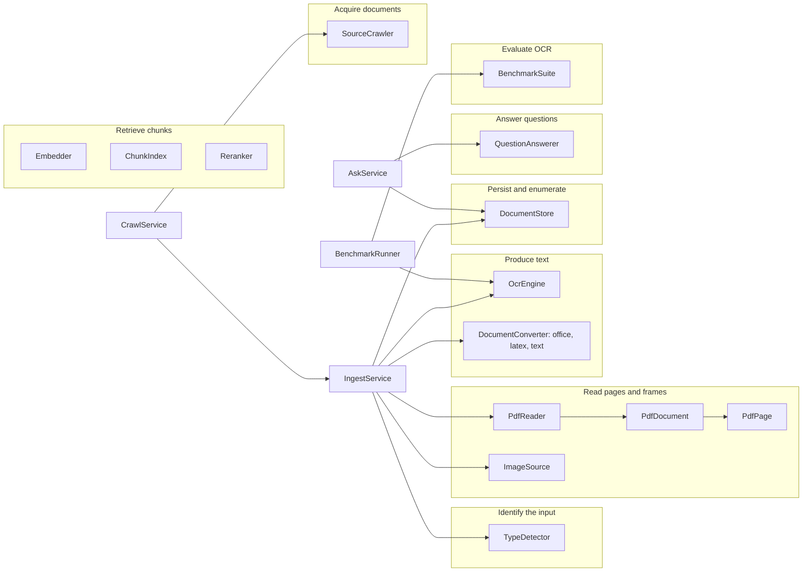
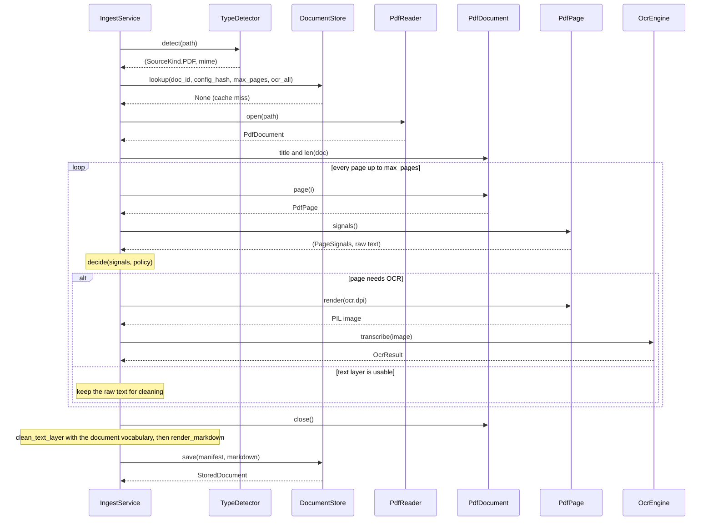
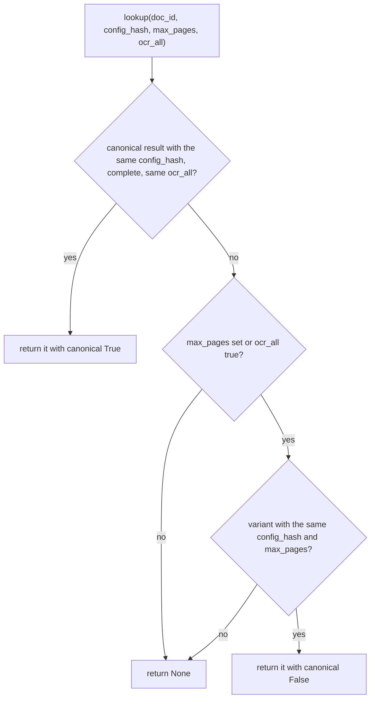

# `docingest.ports`

Ports are the interfaces the application layer depends on. Adapters implement them. Every port is a `typing.Protocol` decorated with `@runtime_checkable`, so typing is structural: an adapter never imports or subclasses anything from this package, and any object with the right members plugs in.

- `isinstance(obj, SomePort)` works for every port, but it only checks that the members exist, not their signatures. Pyright (`uv run pyright`) checks signatures only where an object is statically typed as the port. The `bootstrap` factories return `Any`, so built-in adapters are not checked that way (the benchmark suites are, through the `BenchmarkSuite` return type of `build_suite()` in `entrypoints/bench_cli.py`). To get the check for your adapter, assign an instance to a variable annotated with the port, for example `engine: OcrEngine = MyOcr(...)`.
- Ports import only `docingest.domain`, each other, the standard library and, as the one third-party type, `PIL.Image.Image` for images ([ADR 0001](../../../docs/adr/0001-hexagonal-architecture.md)). The import-linter contract "Application depends on ports, not on concrete libraries" forbids them to import concrete libraries such as pypdfium2, mlx, paperqa, docling or pypandoc.
- Everything is re-exported from the package: `from docingest.ports import OcrEngine, OcrResult, DocumentStore, ...`.

Related reading: [package map](../README.md), [domain types](../domain/README.md), [application services](../application/README.md), [adapters](../adapters/README.md), [OCR adapters](../adapters/ocr/README.md), [converters](../adapters/converters/README.md).

## Contents

- [Ports grouped by concern](#ports-grouped-by-concern)
- [Summary](#summary)
- [Fingerprints and the cache key](#fingerprints-and-the-cache-key)
- Port reference: [TypeDetector](#typedetector), [PdfReader, PdfDocument, PdfPage](#pdfreader-pdfdocument-pdfpage), [OcrEngine](#ocrengine), [ImageSource](#imagesource), [DocumentConverter](#documentconverter), [DocumentStore](#documentstore), [SourceCrawler](#sourcecrawler), [QuestionAnswerer](#questionanswerer), [Embedder](#embedder), [ChunkIndex](#chunkindex), [Reranker](#reranker), [BenchmarkSuite](#benchmarksuite)
- [Implementing a new adapter](#implementing-a-new-adapter)
- [Registering an adapter](#registering-an-adapter)
- [Testing an adapter](#testing-an-adapter)
- [Adding a new port](#adding-a-new-port)

## Ports grouped by concern

The diagram groups the Protocols by what they do and shows which application service uses each one.



## Summary

| Protocol | Module | `[adapters]` slot | Built-in adapters (name: class) | Used by | Has `fingerprint` |
|---|---|---|---|---|---|
| `TypeDetector` | `detection.py` | `detector` | `magic`: `MagicBytesDetector` | `IngestService` | no |
| `PdfReader` (with `PdfDocument`, `PdfPage`) | `pdf.py` | `pdf` | `pdfium`: `PdfiumReader` | `IngestService` | yes |
| `OcrEngine` | `ocr.py` | `ocr` | `mlx-vlm`: `MlxVlmOcr`, `openai-compatible`: `OpenAICompatibleOcr` | `IngestService`, `BenchmarkRunner` | yes |
| `ImageSource` | `images.py` | `images` | `pillow`: `PillowImageSource` | `IngestService` | yes |
| `DocumentConverter` | `converters.py` | `office`, `latex`, `text` | `docling`: `DoclingConverter`, `pandoc`: `PandocLatexConverter`, `passthrough`: `PassthroughConverter` | `IngestService` | yes |
| `DocumentStore` | `store.py` | `store` | `filesystem`: `FilesystemStore` | `IngestService`, `AskService` | no |
| `SourceCrawler` | `sources.py` | `crawler` | `arxiv`: `ArxivCrawler` | `CrawlService` | no |
| `QuestionAnswerer` | `qa.py` | `qa` | `paperqa`: `PaperQAAnswerer` | `AskService` | no |
| `Embedder` | `embedding.py` | `embedder` | `none`: `NoEmbedder` | none yet | yes |
| `ChunkIndex` | `index.py` | `index` | `none`: `NoIndex` | none yet | yes |
| `Reranker` | `reranking.py` | `reranker` | `none`: `NoReranker` | none yet | no |
| `BenchmarkSuite` | `benchmark.py` | none: built by `entrypoints/bench_cli.py` | `SyntheticSuite` (`synthetic`), `OlmOcrBenchSuite` (`olmocr-bench`) | `BenchmarkRunner`, `score_run` | yes |

`uv run docingest adapters` prints, for the current configuration, every `[adapters]` slot with its selected adapter and the names available for it (built-ins and installed plugins). Benchmark suites are not listed there.

Value types defined next to the Protocols (all dataclasses):

| Type | Module | Frozen | Crosses |
|---|---|---|---|
| `Segment`, `Conversion` | `converters.py` | yes | `DocumentConverter.convert` result |
| `OcrResult` | `ocr.py` | yes | `OcrEngine.transcribe` result |
| `StoredDocument` | `store.py` | yes | `DocumentStore` results, `QuestionAnswerer.ask` input |
| `SourceRecord`, `FetchedSource` | `sources.py` | yes | `SourceCrawler` results |
| `Chunk` | `domain/chunking.py`, re-exported by `ports` | yes | `ChunkIndex`, `Reranker`, `QuestionAnswerer.ask` |
| `Hit` | `index.py` | yes | `ChunkIndex.search` result |
| `IndexStats` | `index.py` | yes | `ChunkIndex.stats` result |
| `Sample`, `CandidateSpec`, `Estimate` | `benchmark.py` | yes | benchmark samples, candidates, estimates |
| `SuiteScore` | `benchmark.py` | no | `BenchmarkSuite.score` result |

Reference fakes for every port except `BenchmarkSuite` live in `tests/fakes.py` (`FakeDetector`, `FakePdfReader` with `FakePdfDocument` and `FakePage`, `FakeOcr`, `FakeImages`, `FakeConverter`, `InMemoryStore`, `FakeCrawler`, `FakeQA`, `FakeEmbedder`, `FakeIndex`, `FakeReranker`). They are complete, behaviour-level implementations, not mocks, and they are the shortest working example of each contract. A minimal benchmark suite, `MemSuite`, is in `tests/unit/test_benchmark.py`.

## Fingerprints and the cache key

Seven ports declare `fingerprint: str`. For the ingestion ports it identifies everything that can change the output: implementation name and version plus output-relevant settings. `IngestService.config_hash(kind, ocr_all=...)` hashes it into the cache key, so swapping an adapter or changing one of its settings re-processes exactly the affected documents.

| Input kind | Parts of the cache key |
|---|---|
| PDF | `PIPELINE_VERSION`, kind, `ocr_all`, routing policy JSON, `PdfReader.fingerprint`, `OcrEngine.fingerprint` |
| IMAGE | `PIPELINE_VERSION`, kind, `ocr_all` (always `False`), `ImageSource.fingerprint`, `OcrEngine.fingerprint` |
| OFFICE, LATEX, TEXT | `PIPELINE_VERSION`, kind, `ocr_all` (always `False`), the fingerprint of that kind's `DocumentConverter` |

- `TypeDetector` has no fingerprint: its only output that can change a document is the detected kind, which is in the key (the MIME type is recorded in the manifest but changes no text).
- `ImageSource` has one because decoding decides what the OCR engine sees: another image library, or another version of it, re-processes image inputs (and only those).
- `DocumentStore`, `SourceCrawler`, `QuestionAnswerer` and `Reranker` never change what an ingestion produces, so they have none.
- `Embedder.fingerprint` and `ChunkIndex.fingerprint` are not part of the ingestion cache key either: they identify a chunk index, which is only valid for the embedder and chunker settings it was built with.
- `BenchmarkSuite.fingerprint` is unrelated to the ingestion cache: it identifies a suite's data in a benchmark run directory.

Rules for a fingerprint:

1. Include every setting that can change the text: library version, model and revision, prompt, generation settings, rendering resolution, adapter revision.
2. Leave out settings that cannot change the text. `OpenAICompatibleOcr` excludes its timeout, retries and API key.
3. Keep it stable: the same settings give the same string, and using the adapter never changes it (the OCR contract tests check both).
4. It is read on every ingestion of its kind, before the cache lookup. Make it cheap or compute it once (`PandocLatexConverter` runs `pandoc --version` once, through a `cached_property`).
5. When an adapter's own code changes its output while library versions stay the same, change the fingerprint by hand. `PandocLatexConverter` has a `REVISION` constant for this and `PassthroughConverter` uses `"passthrough 1"`. The OCR engines take this from the profile: its `code_version` is in their fingerprints and is bumped when its `postprocess` or `valid` code changes (see [adapters/ocr/README.md](../adapters/ocr/README.md#fingerprints-and-caching)).

Built-in fingerprints, for orientation:

| Adapter | Fingerprint |
|---|---|
| `PdfiumReader` | `pypdfium2 <version>` |
| `PillowImageSource` | `pillow <version>` |
| `MlxVlmOcr` | `mlx-vlm ` followed by sorted JSON of the mlx-vlm version, model, profile name and `code_version`, prompt, max_side, chat kwargs, prompt order, retry ladder, validation flag, dpi, max_tokens, temperature, repetition_penalty |
| `OpenAICompatibleOcr` | `openai-compatible ` followed by sorted JSON of base_url, served_model, model and revision, the same profile fields, dpi and generation settings |
| `DoclingConverter` | `docling <version>` (or `docling missing`) |
| `PandocLatexConverter` | `pandoc-latex r<REVISION> \| pandoc <version> \| <pandoc arguments> \| split_level=<n> \| pylatexenc <version>` (the last part is `no fallback` when the fallback is disabled) |
| `PassthroughConverter` | `passthrough 1` |

## Port reference

### TypeDetector

Module `detection.py`. Identifies what kind of input a file is.

```python
@runtime_checkable
class TypeDetector(Protocol):
    def detect(self, path: Path) -> tuple[SourceKind, str]:
        """Return (kind, mime). Raise ``UnsupportedInputError`` when unknown."""
```

Contract:

- Return the `SourceKind` and a MIME type string. The kind selects the handler (PDF pages, image frames or one of the three converter slots) and is part of the cache key. The MIME string is stored in `DocumentManifest.mime`.
- Raise `UnsupportedInputError` for anything it cannot classify, and for recognised payloads that are not supported (the built-in rejects a gzipped PDF and gzipped PostScript or HTML).
- It is called on every `ingest()`, before hashing and before the cache lookup, so it must be cheap. `MagicBytesDetector` reads the first 1024 bytes of the file (and, for gzip, the first 1024 decompressed bytes).
- Its answer must match what the handlers accept: a file classified as `LATEX` must be something the `latex` converter can unpack.

Implementations: `adapters/detection/magic.py` `MagicBytesDetector` (magic bytes first, file suffix as fallback). Test fake: `FakeDetector` (suffix only).

### PdfReader, PdfDocument, PdfPage

Module `pdf.py`. Reads PDF pages: measurements for routing, the embedded text, and rasterization for OCR.

```python
@runtime_checkable
class PdfPage(Protocol):
    def signals(self) -> tuple[PageSignals, str]:
        """Measurements for the OCR routing policy, plus the raw embedded text."""

    def render(self, dpi: int) -> Image: ...


@runtime_checkable
class PdfDocument(Protocol):
    title: str | None

    def __len__(self) -> int: ...

    def page(self, index: int) -> PdfPage: ...

    def close(self) -> None: ...


@runtime_checkable
class PdfReader(Protocol):
    fingerprint: str

    def open(self, path: Path) -> PdfDocument:
        """Raise ``DocumentOpenError`` for corrupt / encrypted / truncated files."""
```

This is how `IngestService` drives the three objects for one PDF, including the OCR engine for pages that need it:



Contract:

- `PdfReader.open(path)` returns an open document or raises `DocumentOpenError` for corrupt, encrypted or truncated files.
- `PdfReader.fingerprint` identifies the reader and its version (`pypdfium2 5.13.0` for the built-in with that library version). It is part of the PDF cache key and is recorded as `PageRecord.engine` for text-layer pages.
- `PdfDocument.title` is the document's own title or `None`. It becomes the manifest title when no metadata title is available. The built-in reads `Title` from the document information and maps an empty value to `None`.
- `len(document)` is the number of pages. It becomes `DocumentManifest.source_pages`.
- `page(index)` takes a 0-based index. `IngestService` asks for pages `0` to `min(len(document), max_pages) - 1` in order.
- `close()` releases resources. `IngestService` calls it in a `finally` block, so it runs even when a page fails.
- `PdfPage.signals()` is called once for every processed page. It returns `PageSignals` and the raw embedded text:
  - `n_chars`: non-whitespace characters of the text layer.
  - `n_images` and `image_coverage`: image objects and the fraction of the page they cover, from 0 to 1.
  - `garbage_ratio` and `alpha_ratio`: compute them with `docingest.domain.text.garbage_ratio` and `alpha_ratio`, so the routing thresholds keep their meaning.
  - Return the text uncleaned: `IngestService` cleans it with the whole document's vocabulary. A line-end hyphen may be marked with `domain.text.HYPHEN_MARK` (U+0002), as pdfium does.
- `PdfPage.render(dpi)` rasterizes the page at `dpi` dots per inch and returns a PIL image. It is called only for pages routed to OCR, with `OcrEngine.dpi`.

Implementations: `adapters/pdf/pdfium.py` `PdfiumReader`, `PdfiumDocument`, `PdfiumPage`. Test fakes: `FakePdfReader`, `FakePdfDocument`, `FakePage` (plus the `digital()` and `scanned()` page builders).

### OcrEngine

Module `ocr.py`. Transcribes one page image to Markdown.

```python
@dataclass(frozen=True)
class OcrResult:
    text: str
    seconds: float  # wall time of every attempt, prefill included
    gen_tokens: int
    finish_reason: str | None
    peak_memory_gb: float | None = None
    attempts: int = 1
    first_finish_reason: str | None = None  # the first attempt's; defaults to finish_reason
    total_gen_tokens: int | None = None  # over every attempt; defaults to gen_tokens
    gen_seconds: float | None = None  # decode time of every attempt (None: not measured)
    raw_text: str | None = None  # the model's output before clean-up, for audits


@runtime_checkable
class OcrEngine(Protocol):
    fingerprint: str  # model + revision + prompt/profile + generation settings
    model: ModelRef
    dpi: int  # rasterization resolution the engine wants for PDF pages

    def transcribe(self, image: Image) -> OcrResult: ...
```

`OcrResult` fields:

| Field | Meaning | Where it goes |
|---|---|---|
| `text` | Final Markdown for the page, after the engine's clean-up. | `document.md`, `PageRecord.n_chars` |
| `seconds` | Wall time of every attempt, prefill included. | `PageRecord.seconds` (rounded), benchmark telemetry |
| `gen_tokens` | Tokens generated by the attempt whose text was kept. | `PageRecord.gen_tokens`, telemetry |
| `finish_reason` | Why that attempt stopped. `"length"` means it hit `max_tokens`, usually a repetition loop. | `PageRecord.finish_reason`, telemetry |
| `peak_memory_gb` | Peak memory of the transcription, when measurable. | telemetry |
| `attempts` | Number of generation attempts (engines with a retry ladder). | telemetry |
| `first_finish_reason` | The first attempt's finish reason. When `attempts == 1` it defaults to `finish_reason`. | telemetry |
| `total_gen_tokens` | Tokens over every attempt. When `attempts == 1` it defaults to `gen_tokens`. | telemetry |
| `gen_seconds` | Decode time over every attempt, or `None` when it cannot be measured (over HTTP). | telemetry |
| `raw_text` | The model's output before clean-up. | the benchmark saves it under `model_raw/` when it differs from `text` |

Contract. `tests/contract/test_ocr_contract.py` runs these checks against the fake, the OpenAI-compatible adapter (against a local stub server) and, opt-in, the mlx-vlm adapter:

- `isinstance(engine, OcrEngine)` holds; `model` is a `ModelRef` with a non-empty `revision`; `dpi` is a positive `int`; `fingerprint` is a non-empty `str`.
- `transcribe(image)` returns an `OcrResult` with `text` a `str`, `seconds >= 0`, `gen_tokens` an `int >= 0` and `finish_reason` either `None` or a `str`.
- Any PIL image mode is accepted (the tests use `L` and `RGBA`). Both built-ins normalize the image first with `fit_image` from `adapters/ocr/mlx_vlm.py`: EXIF orientation applied, transparency composited on white, converted to RGB, longest side limited to the profile's `max_side`.
- `fingerprint` does not change when the engine is used, and two engines built with the same settings have the same fingerprint.

Further obligations that the application relies on:

- Construction must be cheap. `Container.ingest` builds the OCR engine even for runs that never OCR a page, so load weights lazily. `MlxVlmOcr` loads the model on the first `transcribe()`.
- Raise `OcrError` (or a subclass) when a page cannot be transcribed. `OpenAICompatibleOcr` raises `OcrServerError`.
- An engine that retries reports the whole ladder in `attempts`, `first_finish_reason`, `total_gen_tokens` and `gen_seconds`. Otherwise a benchmark would hide truncations that a retry fixed.
- `model` is recorded in every OCR page (`PageRecord.model`, `model_revision`) and in `DocumentManifest.ocr_model`. `dpi` is the resolution at which `IngestService` renders PDF pages for this engine.
- Optional: an `unload()` method. `BenchmarkRunner` calls it, when present, after each candidate to free model weights before the next one loads. `MlxVlmOcr` implements it.

Implementations: `adapters/ocr/mlx_vlm.py` `MlxVlmOcr` (in-process on Apple Silicon, `mlx` extra) and `adapters/ocr/openai_compat.py` `OpenAICompatibleOcr` (any OpenAI-compatible `chat/completions` endpoint over HTTP). Both take an `OcrProfile` (prompt, image size, clean-up, retry ladder) from `adapters/ocr/profiles.py`; see [adapters/ocr/README.md](../adapters/ocr/README.md). Test fake: `FakeOcr`.

### ImageSource

Module `images.py`. Loads the frames of an image file.

```python
@runtime_checkable
class ImageSource(Protocol):
    fingerprint: str  # name + version: part of the cache key of image inputs

    def frames(self, path: Path) -> list[Image]:
        """Raise ``DocumentOpenError`` for unreadable images."""
```

Contract:

- Return one image per frame; a multi-page TIFF gives several. Each frame becomes one `VLM_OCR` page in the manifest, and the number of frames becomes `source_pages`. `max_pages` truncates the list after it is loaded.
- Raise `DocumentOpenError` for unreadable images.
- Returned images must stay usable after the call. `PillowImageSource` copies every frame before the file is closed.
- `fingerprint` names the implementation and the version of its image library (`pillow <version>`). The cache key of an image hashes it with the OCR engine's fingerprint, so a change in how images are decoded re-processes image inputs.

Implementations: `adapters/images/pillow.py` `PillowImageSource`. Test fake: `FakeImages`.

### DocumentConverter

Module `converters.py`. Converts a whole document (office, LaTeX, text) into Markdown segments. One Protocol serves three `[adapters]` slots; `bootstrap._LazyConverters` maps `SourceKind.OFFICE` to `office`, `LATEX` to `latex` and `TEXT` to `text`.

```python
@dataclass(frozen=True)
class Segment:
    """One logical unit of a converted document (a section, a slide, the whole file)."""

    text: str
    title: str | None = None


@dataclass(frozen=True)
class Conversion:
    segments: list[Segment]
    method: PageMethod
    engine: str  # e.g. "pandoc 3.8", "docling 2.130"
    title: str | None = None
    metadata: SourceMetadata | None = None
    warnings: list[str] = field(default_factory=list)
    degraded: bool = False


@runtime_checkable
class DocumentConverter(Protocol):
    fingerprint: str

    def convert(self, path: Path) -> Conversion:
        """Raise ``ConversionError`` when the document cannot be converted."""
```

How `IngestService` uses a `Conversion`:

| `Conversion` member | Becomes |
|---|---|
| `segments[i].text` | the text of page `i + 1` in `document.md`, written as is; `PageRecord.n_chars` is its length |
| `segments[i].title` | `PageRecord.title` |
| `len(segments)` | `source_pages` (before `max_pages` truncation) |
| `method` | `PageRecord.method` of every segment |
| `engine` | `PageRecord.engine` of every segment |
| `title` | the manifest title when there is no metadata title |
| `metadata` | the manifest metadata when neither the `metadata` argument nor a sidecar provided one |
| `warnings` | logged as `warning: ...` lines; not stored in the manifest |
| `degraded` | passed to `DocumentStore.save(..., degraded=True)` |

Contract:

- Raise `ConversionError` when the document cannot be converted.
- Return segments in reading order. Formats without natural sections return one segment (Docling and passthrough do).
- Choose a `PageMethod` that describes how the text was produced. A new method needs a new enum member in `domain/models.py` whose value contains only word characters.
- Set `degraded=True` only when a fallback ran because of the environment (a timeout, a crash, a missing tool) and not because of the input. The store then keeps the result but never serves it from the cache, so the next run retries the real conversion.
- `engine` is a human-readable label and may differ between conversions (the LaTeX fallback reports `pylatexenc <version>`). `fingerprint` must be the same for every conversion made with the same settings.
- Import heavy optional dependencies inside `convert()` and raise `ConversionError` with an install hint when they are missing, as `DoclingConverter` does for the `office` extra.

Implementations (details in [adapters/converters/README.md](../adapters/converters/README.md)):

| Class | Module | Slot | `method` |
|---|---|---|---|
| `DoclingConverter` | `adapters/converters/docling.py` | `office` | `DOCLING` |
| `PandocLatexConverter` | `adapters/converters/pandoc_latex.py` (helpers in `latex_source.py`) | `latex` | `LATEX`, or `LATEX_PLAINTEXT` for the pylatexenc fallback |
| `PassthroughConverter` | `adapters/converters/plaintext.py` | `text` | `PASSTHROUGH` |

Test fake: `FakeConverter`.

### DocumentStore

Module `store.py`. Persists normalized documents, content-addressed, and enumerates the corpus.

```python
@dataclass(frozen=True)
class StoredDocument:
    manifest: DocumentManifest
    location: str  # adapter-specific address (a directory, a URI, a key)
    canonical: bool  # complete default run (True) or a partial / forced-OCR / degraded variant


@runtime_checkable
class DocumentStore(Protocol):
    def lookup(
        self, doc_id: str, config_hash: str, *, max_pages: int | None, ocr_all: bool
    ) -> StoredDocument | None:
        """A cached result valid for these run options, if any. Never a degraded one."""

    def save(
        self, manifest: DocumentManifest, markdown: str, *, degraded: bool = False
    ) -> StoredDocument:
        """Persist a result; saving the same run again replaces it in place."""

    def markdown(self, doc: StoredDocument) -> str: ...

    def corpus(self) -> tuple[list[StoredDocument], list[str]]:
        """One entry per document (canonical, else most complete variant) + warnings."""
```

How `lookup` decides:



Contract. `tests/contract/test_store_contract.py` runs the same tests against `InMemoryStore` (the reference implementation in `tests/fakes.py`) and `FilesystemStore`; they cover these rules except the `ocr_all` case, which both implementations handle as described:

- After `save(manifest, markdown)`, `lookup` with the same `doc_id`, `config_hash` and options returns the saved manifest, and `markdown()` returns exactly the saved text.
- A different `config_hash` is a miss.
- `save` returns `canonical=True` exactly when the manifest is complete, `ocr_all` is `False` and `degraded` is `False`. Everything else is a variant.
- A partial run never replaces a complete one. A complete canonical result also answers `lookup` calls with any `max_pages` for the same `config_hash` and `ocr_all`.
- A variant is returned only for the same `max_pages` (and the same `config_hash`, which already encodes `ocr_all`).
- Saving the same run again replaces it in place, at the same `location`. `IngestService` relies on this to refresh metadata on a cached result.
- A degraded result is kept (its Markdown is readable and it appears in `corpus()` with a warning) but it is never canonical, never replaces a stored result and is never returned by `lookup`.
- `corpus()` returns one entry per `doc_id`: the canonical result if there is one, otherwise the variant or degraded result with the most pages, plus a warning for every document that has no canonical result (only a partial, `ocr_all` or degraded one).

`location` is opaque to the application. The CLI does assume it is a directory: it prints `<location>/document.md`, and `eval-ocr` writes `ocr_eval.json` into it.

Implementations: `adapters/store/filesystem.py` `FilesystemStore` (content-addressed directories under `output_dir`, atomic writes, an unreadable manifest counts as a cache miss, `index.json` catalog of canonical documents). Test fake: `InMemoryStore`.

### SourceCrawler

Module `sources.py`. Discovers and fetches documents from a remote source.

```python
@dataclass(frozen=True)
class SourceRecord:
    key: str  # source-specific id, e.g. "1706.03762v7"
    metadata: SourceMetadata


@dataclass(frozen=True)
class FetchedSource:
    path: Path  # downloaded file (LaTeX archive, .tex, or PDF fallback)
    record: SourceRecord
    format: str  # "latex-archive" | "latex" | "pdf"


@runtime_checkable
class SourceCrawler(Protocol):
    def search(self, query: str, limit: int) -> list[SourceRecord]:
        """Raise a ``DocingestError`` (e.g. ``InvalidQueryError``, ``SourceUnavailableError``)
        for expected failures: ``CrawlService`` reports those instead of raising."""
        ...

    def fetch(self, record: SourceRecord, dest_dir: Path) -> FetchedSource:
        """Download the best available format; raise ``SourceUnavailableError`` if none."""
```

Contract, as `CrawlService.run` uses it:

- `search(query, limit)` returns at most `limit` records, in the order they should be fetched. `CrawlService` does not truncate the list. The query syntax is the source's own (for arXiv, its query language or `ids:<id>,<id>`).
- A `DocingestError` raised by `search` becomes a report entry (`report.failures` and `report.stopped`) instead of a traceback. Other exceptions propagate, so an adapter raises `InvalidQueryError` for a query it cannot send (the arXiv adapter does for an empty query and for `ids:` without ids) and `SourceUnavailableError` when the source fails.
- `fetch(record, dest_dir)` downloads the best available format into `dest_dir`, creating it if needed, and returns a `FetchedSource` whose `path` is the file. `CrawlService` passes `<raw_dir>/arxiv`.
- Raise `SourceUnavailableError` when a record has nothing downloadable. Any exception from one record's fetch or ingestion is recorded in `report.failures` and the crawl continues.
- Raise `RateLimitedError` when the source asks for a pause that the crawler will not wait out. `CrawlService` then stops and reports the remaining records as not attempted.
- `FetchedSource.record` may be an enriched copy of the input record (`ArxivCrawler` adds the license from OAI-PMH). `CrawlService` writes its `metadata` to `<path>.meta.json` and passes it to ingestion. If that metadata has no license but the existing sidecar has one, the earlier license is kept.
- `format` is informational (it is logged). The type detector decides how the file is ingested, so the downloaded file must be something the detector and converters accept.
- Politeness (request spacing, retries, `Retry-After`) is the crawler's responsibility. `ArxivCrawler` routes every request through one `PoliteClient` (`adapters/sources/http.py`).

Implementations: `adapters/sources/arxiv.py` `ArxivCrawler`, which returns `ArxivFetch`, a `FetchedSource` subclass with download provenance (`url`, `etag`, `size_bytes`, `seconds`, `reused`). Test fake: `FakeCrawler`.

### QuestionAnswerer

Module `qa.py`. Answers questions over the normalized corpus.

```python
@runtime_checkable
class QuestionAnswerer(Protocol):
    async def ask(
        self,
        question: str,
        documents: list[tuple[StoredDocument, str]],  # (document, its Markdown)
        warn: Callable[[str], None],
        contexts: list[Chunk] | None = None,
    ) -> str: ...
```

Contract:

- `ask` is a coroutine; `AskService.ask` awaits it.
- `documents` holds every entry of `DocumentStore.corpus()` with its Markdown, in the `document.md` format (use `domain.text.split_pages` for page-aware chunks). It can include partial or degraded results; check `manifest.complete`. `AskService` raises `RuntimeError` before calling `ask` when the corpus is empty, so the list is never empty.
- `warn` is for non-fatal messages. The CLI prints them as warnings.
- `contexts` (default `None`) are chunks already retrieved, best first. When given, the adapter answers from exactly those chunks and retrieves nothing else; it needs from `documents` only the manifests of the papers the chunks come from (for the citations), so the Markdown may be empty and the list may hold just those papers. A context whose paper is not in `documents` is an error, and so is an empty list (it would be answered as "no papers"; the caller decides what no evidence means). Without `contexts` the adapter chunks `documents` and retrieves for itself, as before.
- Return the answer text ready for display. `PaperQAAnswerer` returns PaperQA2's formatted answer, with citations built from `DocumentManifest.citation()`.
- Question answering never affects ingestion output, so this port has no fingerprint.

Implementations: `adapters/qa/paperqa.py` `PaperQAAnswerer` (`qa` extra). Test fake: `FakeQA`.

### Embedder

Module `embedding.py`. Turns text into vectors for the chunk index. `Vector` is `list[float]`: the port stays free of numpy, and an adapter converts at its edge.

```python
@runtime_checkable
class Embedder(Protocol):
    fingerprint: str  # what changes document vectors; other vectors are not comparable
    query_instruction: str  # "" when the model takes none

    def embed_documents(self, texts: Sequence[str]) -> list[Vector]: ...

    def embed_query(self, text: str) -> Vector: ...
```

Contract:

- `embed_documents` returns one vector per text, in order, all of one dimension, and an empty list for no texts. The vector of a text does not depend on the other texts in the call, up to the numerical noise of batched inference.
- `embed_query` returns a vector comparable with the document vectors. A model that wants an instruction in front of questions adds it here and never in `embed_documents`.
- `fingerprint` names everything that changes the vectors of documents: model, revision, dimensions, dtype and any document-side prefix or normalization. An index built with another fingerprint is not reused, so nothing else belongs in it: the query instruction changes only query vectors and would force a re-embedding of the corpus for nothing. It is exposed apart, as `query_instruction`, so an index can record it without keying on it.

Implementations: `adapters/retrieval/none.py` `NoEmbedder` (the default, fails when used). Test fake: `FakeEmbedder`.

### ChunkIndex

Module `index.py`. A persistent index of chunks and the first-stage search over it. `Hit` (frozen) is a `Chunk` and its `score` (larger is better, comparable only inside one result list).

```python
@runtime_checkable
class ChunkIndex(Protocol):
    fingerprint: str  # embedder + chunker settings + format: an index of another one is not reused
    embedder_fingerprint: str  # of the embedder whose vectors it holds

    def keys(self) -> dict[str, str]: ...

    def upsert(
        self, doc_id: str, key: str, chunks: Sequence[Chunk], vectors: Sequence[Vector]
    ) -> None: ...

    def remove(self, doc_id: str) -> None: ...

    def commit(self) -> None: ...

    def stats(self) -> IndexStats: ...

    def search(self, question: str, vector: Vector, k: int) -> list[Hit]: ...
```

Contract:

- Documents are identified by `doc_id`. `keys()` returns `{doc_id: key}` for everything indexed. The `key` is chosen by the caller, for example a hash of the text the chunks were cut from: a caller skips a document whose key has not changed, so a changed document is re-embedded and an unchanged one is not.
- `upsert` replaces everything indexed for `doc_id` with `chunks` and their `vectors` (one vector per chunk, otherwise `ValueError`); `remove` forgets a document and ignores unknown ids. Chunks must come back from `search` unchanged in every field.
- After `commit`, `search` reflects exactly what `keys()` reports: every `upsert` and `remove` since the last commit, and also documents an earlier process stored but never committed (an adapter that writes at `upsert` time can be interrupted before the call). Until then `search` answers from the last committed state, and `keys()` already reflects the changes. An adapter that keeps a search layer apart from its stored chunks (a dense matrix, a keyword index) rebuilds it in `commit`, once per batch instead of once per document. A service that changes the index must call it.
- `embedder_fingerprint` is the `Embedder.fingerprint` the index holds vectors of. A caller that would add vectors from another embedder compares the two first and refuses (`IndexService` does), because vectors of different models are not comparable.
- `stats()` returns an `IndexStats`: documents and chunks as `keys()` reports them, documents and chunks `search` answers from (the last commit), the time of the last commit (`None` before the first), and `pending`: true when `keys()` differs in any way from what `search` answers from (a document added, removed or stored again under another key since the last commit, also by an earlier process). Counts alone cannot tell, because an update keeps them equal.
- `search` returns at most `k` hits, best first. `vector` is the embedded question (`Embedder.embed_query`); `question` is its text, for adapters that also match keywords. What the first stage does beyond that (for example fusing a keyword search) is the adapter's business and its settings.
- Chunks come from `domain.chunking.chunk_pages`, so they are the chunks `docingest ask` would give PaperQA2.

Implementations: `adapters/retrieval/none.py` `NoIndex` (the default, fails when used). Test fake: `FakeIndex`.

### Reranker

Module `reranking.py`. Scores candidate chunks against a question, usually with a cross-encoder that reads both.

```python
@runtime_checkable
class Reranker(Protocol):
    def rerank(self, question: str, chunks: Sequence[Chunk]) -> list[float]: ...
```

Contract: one score per chunk, in the order given, larger meaning more relevant, and an empty list for no chunks. The adapter does not sort: the caller orders by score and keeps the first-stage order for ties. Scores are comparable only within one call.

Implementations: `adapters/retrieval/none.py` `NoReranker` (the default, fails when used). Test fake: `FakeReranker`.

### BenchmarkSuite

Module `benchmark.py`. An OCR benchmark suite (samples, references, scoring) and the candidates it compares. The suite owns its file layout, because official scorers expect exact file names (olmOCR-bench wants `<pdf>_pg1_repeat1.md`); the runner never invents output paths.

```python
@runtime_checkable
class BenchmarkSuite(Protocol):
    """A suite may also expose ``scoring_version: int`` (recorded in its scores) and
    ``scoring_options: dict`` (JSON-able scoring-time settings, e.g. [scoring.synthetic],
    stamped on its scores). Changing either makes saved scores stale for ``bench report``."""

    name: str
    fingerprint: str  # data + rendering + scoring settings; changes invalidate a run

    def samples(self) -> list[Sample]: ...

    def output_path(self, run_dir: Path, candidate: str, sample: Sample) -> Path: ...

    def score(self, run_dir: Path, candidates: list[str]) -> dict[str, SuiteScore]:
        """Score each candidate's outputs found under ``run_dir``."""
```

`Sample` (frozen): one page to transcribe.

| Field | Type | Meaning |
|---|---|---|
| `id` | `str` | Unique within the suite and stable across runs. |
| `category` | `str` | Breakdown key, for example a degradation level or an olmOCR-bench test file. |
| `load_image` | `Callable[[], Image]` | Produces the page image on demand; suites hold hundreds of pages. Excluded from `repr` and equality. |
| `reference` | `str \| None` | Ground-truth text, when the suite scores against one. |
| `extra` | `Mapping[str, Any]` | Suite-specific data. |

`CandidateSpec` (frozen): one OCR configuration under test. `None` fields fall back to the profile's defaults, exactly as in `[ocr]`.

| Field | Default | Meaning |
|---|---|---|
| `name` | required | Directory name and scorer id. Must match `^[A-Za-z0-9][A-Za-z0-9._-]*$` and must not be `pdfs`, otherwise `ValueError`. |
| `repo_id` | required | Model repository. |
| `revision` | required | Commit of `repo_id`. |
| `profile` | `"markdown"` | OCR profile name. |
| `ocr` | `"mlx-vlm"` | OCR adapter name, as in `[adapters] ocr`. |
| `max_side`, `max_tokens`, `dpi`, `prompt` | `None` | Overrides of the profile and `[ocr]` values. |
| `temperature` | `0.0` | Sampling temperature. |
| `repetition_penalty` | `None` | Override of the profile's value. |

`to_dict()` returns the spec as a dict; it is stored in the run manifest.

`Estimate` (frozen): `mean`, `low`, `high` (a bootstrap confidence interval, `None` when not computed) and `n`, the number of scored units. `mean` is `None` when nothing was scored.

`SuiteScore` (mutable): scores of one candidate on one suite.

| Field | Meaning |
|---|---|
| `primary` | Headline metric name, for example `"cer"` or `"pass_rate"`. |
| `higher_is_better` | Direction of the primary metric. |
| `metrics` | Overall `Estimate` per metric. |
| `by_category` | Category, then metric, to `Estimate`. |
| `units` | Per scored unit (a page, a test), metric values, for paired tests. |
| `unit_groups` | Unit to group. When set, the headline is the mean of group means. |
| `unit_clusters` | Unit to cluster of correlated units that are resampled together. |
| `cluster_strata` | Cluster to the stratum it is resampled within. |
| `n_outputs`, `n_samples` | Outputs found and samples in the suite. |
| `errors` | Problems met while scoring. |
| `details` | Suite-specific extras. |
| `scoring_version` | The suite's scoring rules that produced this score. |
| `stamp` | Set by `score_run`: the telemetry that was scored and the suite's `scoring_options`, so a report can tell a stale score from a current one. |

`to_dict()` and `SuiteScore.from_dict(d)` convert to and from the JSON stored in `scores/<suite>.json`.

Contract, as `BenchmarkRunner` and `score_run` in `application/benchmark.py` use it:

- `name` is stable. The runner uses it in `telemetry/<suite>/<candidate>.jsonl`, `model_raw/<suite>/<candidate>/` and `scores/<suite>.json`, and both built-in suites use it as the first directory of their output paths.
- `fingerprint` identifies what the models see and what they are scored against. The runner records it in the run's `manifest.json` and raises `RunMismatchError` when the run directory already holds this suite with a different fingerprint; `score_run` refuses to score a changed suite. The built-in suites keep scoring rules out of the fingerprint and bump `scoring_version` instead, so a finished run is re-scored and never re-transcribed. Scoring-time settings that are not rules (such as `[scoring.synthetic]`) go in the optional `scoring_options` dict, which `score_run` stamps on every score; a change re-scores the same way.
- `samples()` returns samples with unique ids (the runner raises `ValueError` on duplicates) that are stable across runs. Produce images lazily through `load_image`.
- `output_path(run_dir, candidate, sample)` is where the runner writes the transcription. It must be unique per candidate and sample and lie under `run_dir`. The runner creates parent directories and writes atomically. An existing file means the sample is done, which is how an interrupted run resumes. A failed transcription is written as an empty file so that it scores as a miss.
- `score(run_dir, candidates)` reads the outputs and returns a `SuiteScore` per candidate. `score_run` stamps each score and merges it into `scores/<suite>.json`.

Suites are not chosen through `[adapters]`. `entrypoints/bench_cli.py` builds them in `build_suite()` from `config/benchmark.toml` (suite names in `SUITES`: `synthetic`, `olmocr-bench`). A new suite therefore also needs, in that module, its name in `SUITES`, an entry in `SCORING_VERSIONS`, a settings model in `SuitesConfig` (read by `BenchConfig.suite_settings`) and a branch in `build_suite()`; see [entrypoints/README.md](../entrypoints/README.md). Candidates, on the other hand, are OCR engines built with `bootstrap.build("ocr", cfg)` from a copy of the pipeline configuration, so any registered OCR adapter name, including a plugin, can be benchmarked through `CandidateSpec.ocr`. Results are in [docs/benchmark.md](../../../docs/benchmark.md).

Implementations: `adapters/datasets/synthetic.py` `SyntheticSuite` and `adapters/datasets/olmocr_bench.py` `OlmOcrBenchSuite`. Minimal example: `MemSuite` in `tests/unit/test_benchmark.py`.

## Implementing a new adapter

1. Pick the port and its `[adapters]` slot from the [summary](#summary).
2. Create a module. A built-in adapter goes in the matching subpackage, for example `src/docingest/adapters/ocr/<name>.py`. A plugin lives in its own package.
3. Import only `docingest.domain`, `docingest.ports`, `docingest.config` (for your settings) and your own libraries. Adapter subpackages must not import each other (import-linter independence contract); `adapters/models` (the Hugging Face resolver) is the shared exception.
4. Implement the members exactly as the Protocol declares them. No base class is needed. Check `isinstance(obj, Port)`, and for the signatures assign an instance to a variable annotated with the port and run pyright (see the note at the top of this page).
5. Translate library exceptions into domain errors (`raise ConversionError(...) from e`), naming the input file in the message.
6. For `PdfReader`, `OcrEngine`, `ImageSource` and `DocumentConverter`, define `fingerprint` following the [rules above](#fingerprints-and-the-cache-key).
7. Keep construction cheap and import heavy dependencies lazily: a factory runs when a service first needs the adapter, and `Container.ingest` builds the OCR engine even when no page needs OCR.
8. Register it (next section), select it in `[adapters]` and check it with `uv run docingest adapters`.
9. Test it (see [Testing an adapter](#testing-an-adapter)).

### Example: an OCR engine

An `OcrEngine` that delegates to any function from a PIL image to text. `image_size_ocr` stands in for a call into a real OCR library.

```python
# my_pkg/ocr.py
import time
from collections.abc import Callable

from PIL.Image import Image

from docingest.config import AppConfig
from docingest.domain.errors import OcrError
from docingest.domain.models import ModelRef
from docingest.ports import OcrEngine, OcrResult


def image_size_ocr(image: Image) -> str:
    """Stand-in for a real OCR call: replace with your library."""
    return f"{image.width}x{image.height} pixels"


class FunctionOcr:
    def __init__(self, fn: Callable[[Image], str], *, name: str, revision: str, dpi: int = 150):
        self._fn = fn
        self.model = ModelRef(repo_id=name, revision=revision)
        self.dpi = dpi
        # Everything that can change the text, nothing else.
        self.fingerprint = f"function-ocr {name}@{revision} dpi={dpi}"

    def transcribe(self, image: Image) -> OcrResult:
        t0 = time.perf_counter()
        try:
            text = self._fn(image.convert("RGB"))
        except Exception as e:
            raise OcrError(f"{self.model.repo_id} failed: {e}") from e
        return OcrResult(
            text=text, seconds=time.perf_counter() - t0, gen_tokens=0, finish_reason="stop"
        )


def factory(cfg: AppConfig) -> FunctionOcr:
    """Entry-point factory: (AppConfig) -> adapter. Settings come from a [function_ocr] table."""
    settings = (cfg.model_extra or {}).get("function_ocr", {})
    return FunctionOcr(
        image_size_ocr,
        name=settings.get("name", "local/function-ocr"),
        revision=settings.get("revision", "1"),
        dpi=cfg.ocr.dpi,
    )


assert isinstance(factory(AppConfig()), OcrEngine)
```

Use it directly, without registering anything:

```python
from docingest.bootstrap import Container
from docingest.config import load_config
from my_pkg.ocr import factory

cfg = load_config()
container = Container(cfg, overrides={"ocr": factory(cfg)})
```

### Example: a document converter

A replacement for the `text` slot that emits one segment per top-level Markdown heading instead of one segment per file:

```python
import re
from pathlib import Path

from docingest.domain.errors import ConversionError
from docingest.domain.models import PageMethod
from docingest.ports import Conversion, DocumentConverter, Segment

_H1 = re.compile(r"^# +(.+)$", re.MULTILINE)


class MarkdownSections:
    """A `text` converter that emits one segment per top-level heading."""

    fingerprint = "markdown-sections 1"  # bump the number whenever the output changes

    def convert(self, path: Path) -> Conversion:
        try:
            text = path.read_text(errors="replace")
        except OSError as e:
            raise ConversionError(f"cannot read {path.name}: {e}") from e
        starts = sorted({0, *(m.start() for m in _H1.finditer(text))})
        segments = []
        for start, stop in zip(starts, [*starts[1:], len(text)], strict=True):
            chunk = text[start:stop].strip()
            if chunk:
                heading = _H1.match(chunk)
                segments.append(Segment(chunk, title=heading.group(1) if heading else None))
        return Conversion(
            segments=segments or [Segment("")],
            method=PageMethod.PASSTHROUGH,
            engine="markdown-sections",
        )


assert isinstance(MarkdownSections(), DocumentConverter)
```

Each heading becomes a `PageRecord` with that heading as its `title`, and because the fingerprint differs from `passthrough 1`, Markdown files ingested with the default converter are processed again.

## Registering an adapter

There are two ways to make an adapter selectable by name in `[adapters]`.

Built-in (inside this repository): add a factory to `src/docingest/bootstrap.py` that imports the adapter inside the function, and add it to `REGISTRY`. The snippet assumes the OCR example above was saved as `src/docingest/adapters/ocr/function_ocr.py`:

```python
def _function_ocr(cfg: AppConfig):
    from .adapters.ocr.function_ocr import factory

    return factory(cfg)


REGISTRY: dict[str, dict[str, Factory]] = {
    # ...
    "ocr": {"mlx-vlm": _mlx_vlm, "openai-compatible": _openai_ocr, "function-ocr": _function_ocr},
    # ...
}
```

Plugin (in another package, without touching this repository): declare an entry point in the group `docingest.<port>` whose object is a factory `(AppConfig) -> adapter`:

```toml
# the plugin's pyproject.toml
[project.entry-points."docingest.ocr"]
function-ocr = "my_pkg.ocr:factory"
```

Then select it, and give it settings in its own top-level table (unknown top-level tables are kept in `AppConfig.model_extra`):

```toml
# config/pipeline.toml
[adapters]
ocr = "function-ocr"

[function_ocr]
name = "local/function-ocr"
revision = "1"
```

Resolution rules (`bootstrap.factory`):

- A built-in name wins over a plugin with the same name.
- `uv run docingest adapters` and `bootstrap.available(port)` list plugins by name without importing them.
- Only the selected plugin is imported. If its import fails, the original exception is raised with a note naming the plugin and its entry point; other ports and built-ins keep working.
- An unknown name raises `ValueError` listing the available names.

## Testing an adapter

- Contract suites exist for five ports. Add your adapter to the parametrized fixture and it must pass the same tests as the built-ins:
  - `OcrEngine`: the `make_engine` fixture in `tests/contract/test_ocr_contract.py`.
  - `DocumentStore`: the `store` fixture in `tests/contract/test_store_contract.py`.
  - `Embedder`, `ChunkIndex` and `Reranker`: the fixtures `make_embedder` (a factory taking `query_instruction`), `index` and `reranker` in `tests/contract/test_retrieval_contract.py`. A plugin overrides them in its own test module and imports the contract tests (see `tests/README.md`, "Plugin tests reusing the contracts").
- For the other ports, write unit tests for the adapter and, where it touches real files or services, integration tests in `tests/integration/` (existing examples: `test_magic_detector.py`, `test_pdfium_reader.py`, `test_pandoc_latex.py`, `test_openai_ocr.py`). The fakes in `tests/fakes.py` show the expected behaviour of each port.
- Use the `model` and `network` pytest markers for tests that load multi-GB models or reach remote services; they run only with `DOCINGEST_MODEL_TESTS=1` or `DOCINGEST_NETWORK_TESTS=1`.
- Run `./scripts/check.sh` before opening a pull request: ruff, the import-linter contracts, pyright and pytest with coverage.

See [tests/README.md](../../../tests/README.md) and [CONTRIBUTING.md](../../../CONTRIBUTING.md).

## Adding a new port

A new port is needed only for a new kind of dependency, not for another implementation of an existing one.

1. Define the Protocol in `ports/<concern>.py` with `@runtime_checkable`, plus frozen dataclasses for the values it exchanges. Import only `docingest.domain` (and `PIL.Image.Image` if it handles images).
2. Export the new names from `ports/__init__.py` and add them to `__all__`.
3. Take the port as a keyword-only constructor argument of the application service that needs it. The application layer never imports adapters.
4. Add a field with the default adapter name to `AdapterSelection` in `config.py` (the model rejects unknown keys), a factory and a `REGISTRY` entry in `bootstrap.py`, and pass `self.adapter("<port>")` where `Container` builds the service. `tests/unit/test_bootstrap.py` checks that every port's default adapter is registered.
5. If the port changes what an ingestion produces, give it a `fingerprint` and include it in `IngestService.config_hash`.
6. Add a fake to `tests/fakes.py` and, if several implementations are expected, a contract test in `tests/contract/`.
7. Document it here and in [config/README.md](../../../config/README.md).
