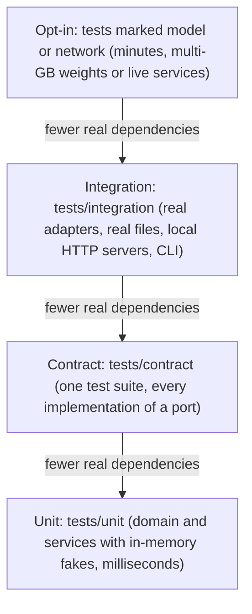
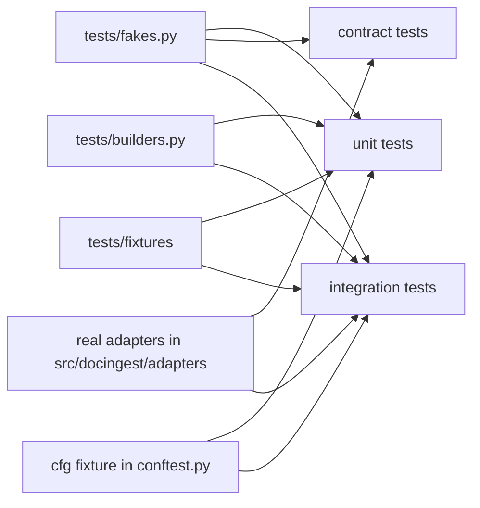
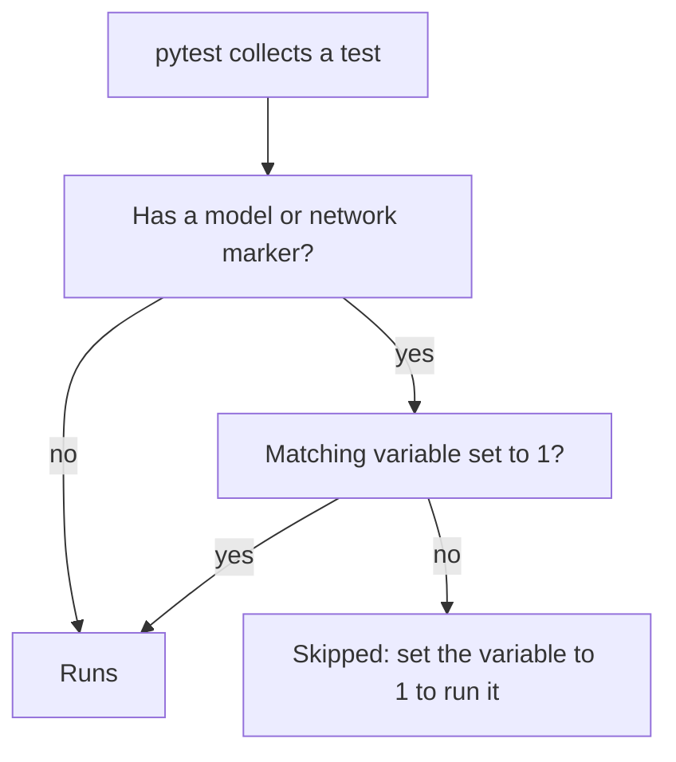
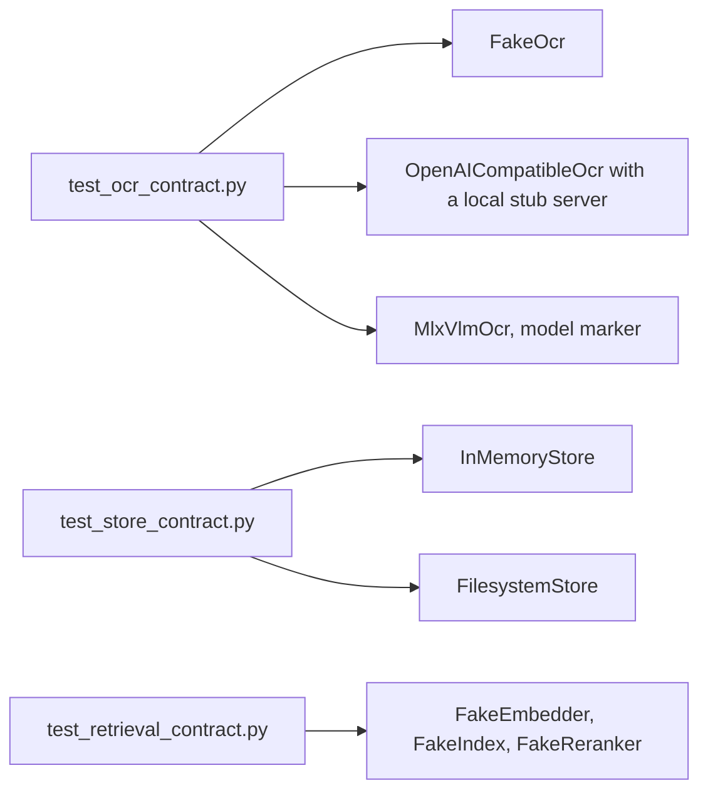

# tests/

The pytest suite for `docingest`. It is organised by how much of the real world a test touches: unit tests run the domain and the application services against in-memory fakes, contract tests run the same behavioural checks against every implementation of a port, and integration tests run real adapters against real files and local HTTP servers. Tests that need multi-GB models or live remote services are opt-in.

For the architecture being tested (ports, adapters, services, composition root) see [docs/architecture.md](../docs/architecture.md) and [src/docingest/README.md](../src/docingest/README.md). For the port Protocols the fakes implement see [src/docingest/ports/README.md](../src/docingest/ports/README.md).

## Running the tests

| Command | What runs |
|---|---|
| `uv run pytest` | The default suite: everything except tests marked `model` or `network` (those are skipped with a reason) |
| `uv run pytest tests/unit` | Unit tests only (fastest) |
| `uv run pytest tests/contract` | Contract tests only |
| `uv run pytest tests/integration` | Integration tests only |
| `uv run pytest -m "not slow"` | Deselects the `slow` tests |
| `uv run pytest --cov` | The default suite with coverage; fails below the threshold (see [Coverage](#coverage)) |
| `./scripts/check.sh` | Every quality gate, including `pytest --cov` (see [scripts/README.md](../scripts/README.md#checksh)) |
| `DOCINGEST_NETWORK_TESTS=1 uv run pytest -m network` | Only the live-network tests |
| `DOCINGEST_MODEL_TESTS=1 uv run pytest -m model` | Only the model tests (Apple Silicon, `mlx` extra installed) |
| `DOCINGEST_LATEX_SAMPLES=/path/to/sources uv run pytest tests/integration/test_pandoc_latex.py -k real_arxiv_sources` | The optional real arXiv LaTeX sources |

`pyproject.toml` sets `testpaths = ["tests"]` and `addopts = ["--strict-markers", "-ra"]`: `-ra` ends the run with a short summary of every test that did not pass, including each skip and its reason, and `--strict-markers` turns an unregistered marker into an error.

## Layout

```text
tests/
├── conftest.py      opt-in marker gating, sys.path setup, the cfg fixture
├── fakes.py         in-memory fakes for the ports (behaviour, not mocks)
├── builders.py      tiny document builders: minimal PDFs and image PDFs
├── unit/            domain rules and application services with fakes
├── contract/        one behavioural test suite per port, run against fakes and real adapters
├── integration/     real adapters, real files, local HTTP servers, the CLI
└── fixtures/        recorded or hand-made inputs
    ├── arxiv/       trimmed arXiv API (Atom) and OAI-PMH responses
    ├── bench/       an olmOCR-bench subset layout and a recorded scorer output
    └── latex/       a multi-file LaTeX paper with known traps, and a malformed .tex file
```

A local checkout may also contain an empty `tests/e2e/` directory. Git does not track empty directories, and pytest collects nothing from it.

There is no `__init__.py` in `tests/` or its subdirectories. Pytest therefore imports each test module by its file name, so **every test file name must be unique across the whole `tests/` tree**. `conftest.py` puts `tests/` on `sys.path`, which is why tests import helpers as `from fakes import ...` and `from builders import ...`. Pytest also puts the directory of each collected test module on `sys.path`, so a test module can import helpers from another module in the same directory: `test_arxiv_fixes.py` imports `FakeTransport`, `FakeClock` and friends from `test_arxiv`, and `test_bench_fixes.py` imports `MemSuite`, `EchoOcr`, `runner` and `spec` from `test_benchmark`.

## Test layers

The diagram orders the layers by how much of the real world a test touches, from the opt-in tests at the top (real model weights, live services) to the unit tests at the bottom (nothing but Python objects in memory). Unit tests are the large majority of the suite. Of the three directories, `tests/contract` is the smallest, because each contract test is written once and runs once per implementation. The opt-in tests are not a directory: they are individual tests or parameters inside `tests/contract` and `tests/integration` that carry a `model` or `network` marker.



| Layer | Directory | Uses | Proves |
|---|---|---|---|
| Unit | `tests/unit` | `fakes.py`, fake transports and clocks defined in the test module, stub modules, `tests/fixtures/arxiv`, and `builders.py` in `test_bench_fixes.py` | Domain rules (routing, text clean-up, metadata), application services (ingest, ask, crawl, benchmark runner, statistics), composition-root wiring |
| Contract | `tests/contract` | `fakes.py` and the real adapters, parametrized | A fake and a real adapter behave the same way through the port, so unit tests built on the fake stay meaningful |
| Integration | `tests/integration` | Real adapters, `builders.py`, `tests/fixtures`, local `ThreadingHTTPServer` stand-ins, `typer.testing.CliRunner` | Adapters against real libraries (pypdfium2, Pillow, pandoc, pylatexenc, urllib), and the CLI end to end (with a fake OCR engine wherever OCR would run) |
| Opt-in | Marked tests inside contract and integration | Real model weights, arxiv.org, Hugging Face | The in-process MLX engine, the live arXiv API, the olmOCR-bench dataset download |

This diagram shows which shared helpers each layer draws on.



## Test modules

### unit/

| Module | Covers |
|---|---|
| `test_arxiv.py` | `ArxivCrawler` against a fake transport and a fake clock: feed parsing, id normalisation, query parameters, retries, source format detection. No network, no real sleeping |
| `test_arxiv_fixes.py` | Regression tests for the arXiv crawler, same fakes |
| `test_bench_fixes.py` | Benchmark regressions: clustered statistics, the OCR retry ladder in telemetry, page furniture and LaTeX / `` normalisation, stale saved scores. The MLX adapter runs against stub modules, never a model |
| `test_benchmark.py` | `BenchmarkRunner`, score persistence and report aggregation on an in-memory suite (`MemSuite`) |
| `test_bootstrap.py` | `REGISTRY` defaults, unknown adapter names, `Container` overrides, entry-point plugins including broken ones, the `none` retrieval adapters and the `[index]`, `[embedder]` and `[reranker]` tables reaching a plugin |
| `test_chunking.py` | `domain.chunking.chunk_pages`: chunk names and page ranges, overlap, page breaks, invalid settings |
| `test_core_fixes.py` | Regressions: config loading, the pipeline version against `pyproject.toml` and `uv.lock`, QA LLM parameters, metadata refresh and degraded results through the real `FilesystemStore` |
| `test_domain_models.py` | `SourceMetadata` citation formatting |
| `test_ingest_service.py` | `IngestService` with fakes for every port: per-page routing, the cache and its invalidation, partial and forced-OCR variants, images, converters, metadata sidecars, degraded conversions, domain errors |
| `test_latex_fixes.py` | Regressions of the LaTeX adapter (`latex_source`, `pandoc_latex`) |
| `test_latex_source.py` | Pure LaTeX-source helpers and the pandoc adapter's Markdown helpers |
| `test_metrics.py` | `application.metrics`: normalisation (Markdown, hyphenation), capping of runaway output, `char3_f1`, `bootstrap_ci` |
| `test_ocr_profiles.py` | OCR profile clean-up code pinned against each profile's `code_version` (an edit fails until it is re-pinned, with a bump if results can change), and `code_version` in both engine fingerprints |
| `test_routing_policy.py` | `domain.routing.decide`, configurable `RoutingPolicy` thresholds, unknown `[routing]` keys rejected |
| `test_services.py` | `AskService` and `CrawlService` with fakes |
| `test_stats.py` | `application.stats`: paired bootstrap, `quantile`, `bootstrap_ci` |
| `test_text.py` | `domain.text`: garbled-text detection, de-hyphenation, page splitting |

### contract/

| Module | Implementations under test |
|---|---|
| `test_ocr_contract.py` | `FakeOcr`, `OpenAICompatibleOcr` against a local stub `/v1/chat/completions` server, `MlxVlmOcr` with a pinned Qwen3-VL-2B 4-bit model (`model` marker) |
| `test_retrieval_contract.py` | `FakeEmbedder`, `FakeIndex` and `FakeReranker` (from `fakes.py`): the `Embedder`, `ChunkIndex` and `Reranker` contracts |
| `test_store_contract.py` | `InMemoryStore` (from `fakes.py`) and `FilesystemStore` |

### integration/

| Module | Covers |
|---|---|
| `test_arxiv_network.py` | `ArxivCrawler` over real HTTP against a local stand-in server (redirects, gzip, retries with `Retry-After`); one live arXiv test (`network`) |
| `test_bench_datasets.py` | The synthetic and olmOCR-bench suite adapters, scorer output parsing, and the `docingest bench` sub-app end to end with a fake OCR engine; one dataset download test (`network`) |
| `test_cli.py` | `docingest ingest` batch behaviour, option validation, the `adapters` command, a missing `--config` file (pipeline and `bench` commands), a `crawl` query that cannot be sent, a broken plugin |
| `test_chunking_parity.py` | `chunk_pages` gives the same chunks as PaperQA2's `chunk_pdf` on the repository's own documents, an ingested LaTeX paper and random pages (hypothesis); skipped when `paperqa` is not installed |
| `test_filesystem_store.py` | `FilesystemStore` file permissions, no leftover temp files, a corrupt cached manifest treated as a cache miss |
| `test_magic_detector.py` | `MagicBytesDetector` on real files |
| `test_openai_ocr.py` | `OpenAICompatibleOcr` against a scripted local OpenAI-compatible server: request shape, retries, the `finish_reason="length"` ladder, authentication |
| `test_pandoc_latex.py` | `PandocLatexConverter` with the real pandoc (pypandoc-binary) and pylatexenc on `tests/fixtures/latex`; optional real arXiv sources (`slow`) |
| `test_paperqa_adapter.py` | PaperQA2 token windows (needs the embedder in the local Hugging Face cache); answering from given `contexts` (only those chunks, an empty list refused, the temperature on every request) and from the corpus, with litellm's mock reply and PaperQA2's keyword embedder, so no server or download. Skipped when `paperqa` is not installed |
| `test_pdfium_reader.py` | `PdfiumReader` page signals and routing on generated PDFs, corrupt PDFs |
| `test_pipeline_real_adapters.py` | `Container` with the real detector, pdfium, Pillow and filesystem adapters and a fake OCR engine |
| `test_scripts.py` | `scripts/serve_llm.sh` run with a stub `uv` on `PATH`: which variable chooses the served model. Skipped without `bash` |
| `test_synthetic_and_images.py` | Deterministic `make_scan`, `fit_image`, OCR profile post-processing |

### fixtures/

| Path | Content | Used by |
|---|---|---|
| `arxiv/api_query.xml` | A trimmed arXiv API (Atom) search response | `test_arxiv.py`, `test_arxiv_fixes.py`, `test_arxiv_network.py` |
| `arxiv/api_error.xml` | A trimmed arXiv API error response | `test_arxiv.py` |
| `arxiv/oai_2409.13740.xml` | A trimmed OAI-PMH record (license lookup) | `test_arxiv.py`, `test_arxiv_fixes.py`, `test_arxiv_network.py` |
| `bench/olmocr_subset/` | `subset.json` (dataset `repo_id`, `revision`, `categories`, `per_category`, `seed`, and SHA-256 checksums of the JSONL files and of the selected PDFs) and one `.jsonl` test file per category; the PDFs themselves are not included | `test_bench_datasets.py` |
| `bench/scorer_stdout.txt` | Recorded output of the official olmOCR-bench scorer | `test_bench_datasets.py` (`parse_scorer_stdout`) |
| `latex/paper/` | A multi-file paper with the traps seen in arXiv sources: a latin-1 include, a file that includes itself, a local `.sty` whose layout macro makes pandoc loop, a natbib `.bbl`, a commented-out include, verbatim code | `test_pandoc_latex.py` |
| `latex/malformed.tex` | Unclosed group and `itemize`, for the fallback path | `test_pandoc_latex.py` |

## Shared helpers

### conftest.py

| Item | What it does |
|---|---|
| `sys.path.insert(0, ...)` | Puts `tests/` on the import path so `fakes` and `builders` import as top-level modules |
| `OPT_IN` and `pytest_collection_modifyitems` | Adds a skip marker to every test marked `model` or `network` unless the matching environment variable is exactly `1` |
| `cfg` fixture | `AppConfig(output_dir=str(tmp_path / "out"), raw_dir=str(tmp_path / "raw"))`: a default configuration whose outputs go to the test's temporary directory |

### fakes.py

The module docstring states the rule: the fakes are real implementations of the port contracts, not mocks. Tests assert on behaviour and results, not on which methods were called; the only bookkeeping is a few counters, flags and lists (`calls`, `opened`, `closed`, `seen`). `InMemoryStore` and `FakeOcr` run through the same contract tests as the real adapters.

| Fake | Port | Behaviour | Knobs and inspection |
|---|---|---|---|
| `FakeOcr(text="ocr text", model="fake/ocr")` | `OcrEngine` | Returns `OcrResult(text, seconds=0.01, gen_tokens=3, finish_reason="stop")` for any image | `calls`; `model` is `ModelRef(repo_id=model, revision="0" * 40)`; `dpi = 72`; `fingerprint` includes `model` and `text`, so two fakes with different settings produce different cache keys |
| `FakePdfReader(docs)` | `PdfReader` | `docs` maps a file **name** to a list of pages; `open(path)` looks up `path.name` and raises `DocumentOpenError` for unknown names | `opened` lists the documents it returned; `fingerprint = "fake-pdf 1"` |
| `FakePdfDocument(pages, title=None)` | `PdfDocument` | `len()`, `page(i)`, `close()` | `closed` |
| `FakePage(signals_, text)` | `PdfPage` | `signals()` returns the given `PageSignals` and text; `render()` returns a 10x10 white image | |
| `digital(text)` | helper | A `FakePage` whose `n_chars` is the number of non-whitespace characters of `text` and `alpha_ratio=0.9`. It routes to the text layer only when `text` has at least 50 such characters (the default `RoutingPolicy.min_chars`) | |
| `scanned()` | helper | A `FakePage` with no text and one full-page image (`n_chars=0`, `n_images=1`, `image_coverage=1.0`); always routes to OCR | |
| `FakeDetector()` | `TypeDetector` | Kind from the suffix only: `.pdf`, `.png`, `.docx`, `.tex`, `.md`; anything else raises `UnsupportedInputError` | `KINDS` |
| `FakeImages(n_frames=1, fingerprint="fake-images 1")` | `ImageSource` | Returns `n_frames` white 10x10 images for any path | `fingerprint` (part of the image cache key) |
| `FakeConverter(segments, method=PageMethod.LATEX, **kw)` | `DocumentConverter` | Returns `Conversion(segments=segments, method=method, engine="fake", **kw)`; pass `title`, `metadata`, `warnings` or `degraded` through `kw` | `calls`; `fingerprint` includes the method |
| `InMemoryStore()` | `DocumentStore` | Reference implementation of the store contract: canonical results, variants (partial or forced-OCR runs) and degraded fallbacks kept apart; locations are `mem://...` strings | `canonical`, `variants`, `degraded` dictionaries |
| `FakeCrawler(records, payload=..., fail_keys=set())` | `SourceCrawler` | `search()` returns the first `limit` records; `fetch()` writes `<key>.tex` with `payload` into `dest_dir` and returns format `"latex"`; keys in `fail_keys` raise `DocumentOpenError` | |
| `record(key, title="A paper")` | helper | A `SourceRecord` with `SourceMetadata(title=title, arxiv_id=key, year=2024)` | |
| `FakeEmbedder(dims=16, fingerprint=..., query_instruction="")` | `Embedder` | A hashed bag of words (`crc32` of each word modulo `dims`): texts that share words get close vectors; the same text always gives the same vector | `calls` counts `embed_documents` calls |
| `FakeIndex(fingerprint=...)` | `ChunkIndex` | Reference implementation of the index contract: documents kept in memory, exact cosine search, ties in insertion order; `upsert` and `remove` are staged and only `commit()` makes them visible to `search` | `keys()` shows staged changes |
| `FakeReranker()` | `Reranker` | Scores a chunk by the share of the question's words it contains | |
| `FakeQA()` | `QuestionAnswerer` | Async `ask()` returns `f"answer to {question!r} from {len(documents)} docs"` | `seen` holds the source names of the documents it received, `contexts` the chunks it was given |

There is no shared fake for `BenchmarkSuite`. `tests/unit/test_benchmark.py` defines `MemSuite` (samples whose reference is their id, scored by exact match), `TaggedSuite` (images tagged with their sample id) and `EchoOcr` (a `FakeOcr` subclass that returns that id, can fail every Nth call and counts `unload()` calls), plus the `spec()` and `runner()` helpers for `BenchmarkRunner`. A new unit test in `tests/unit/` can import them with `from test_benchmark import ...`, as `test_bench_fixes.py` does.

### builders.py

Dependency-light builders for real input files. Every builder writes to the path you pass (use `tmp_path`) and returns it.

| Builder | Produces |
|---|---|
| `LONG` | A sentence repeated three times, long enough to pass the text-layer thresholds |
| `pdf(path, content, resources=b"", extra=(), page_box=b"/MediaBox [0 0 612 792]")` | A minimal one-page PDF written byte by byte, with Helvetica as `/F1`; `content` is the page content stream, `extra` adds objects numbered from 6 |
| `text_pdf(path, *lines)` | A born-digital one-page PDF with the given text lines (routes to the text layer when the text is long enough) |
| `image_pdf(path)` | A one-page PDF whose only content is a 1275x1650 image with text drawn in pixels, saved at 150 dpi (routes to OCR) |
| `blank_pdf(path, pages)` | A PDF with `pages` empty pages, made with pypdfium2 |

## Markers and opt-in environment variables

Markers are registered in `[tool.pytest.ini_options]` of `pyproject.toml`. The gating is in `tests/conftest.py`.

| Marker or variable | Meaning | Enable with | Tests today |
|---|---|---|---|
| `model` | Loads multi-GB OCR weights | `DOCINGEST_MODEL_TESTS=1` | The `mlx-vlm` parameter of `test_ocr_contract.py`. It needs Apple Silicon with the `mlx` extra, and downloads the pinned model from Hugging Face if it is not cached |
| `network` | Talks to remote services (arXiv, Hugging Face) | `DOCINGEST_NETWORK_TESTS=1` | `test_live_arxiv_search_and_fetch` (a few requests, spaced as arXiv's terms require) and `test_prepare_subset_downloads_a_seeded_nested_sample` (olmOCR-bench download) |
| `slow` | Takes more than a few seconds | Runs by default; deselect with `-m "not slow"` | `test_real_arxiv_sources` in `test_pandoc_latex.py` |
| `DOCINGEST_LATEX_SAMPLES` | Folder of raw arXiv source downloads (`https://arxiv.org/src/<id>`), which cannot be redistributed and so are not in the repository | Point it at a folder containing `1706.03762.src`, `2409.13740.src`, `2303.08774.src` and `math_0211159.src` | Each missing file skips its own parameter of `test_real_arxiv_sources` |

The value must be exactly `1`: `DOCINGEST_MODEL_TESTS=true` does not enable the tests.

The gating as a flow:



Other conditional skips, independent of the variables above: tests that need pandoc skip when `PandocLatexConverter().pandoc_version` is `None` (no runnable pandoc binary; pypandoc-binary normally bundles one); a few pandoc tests need POSIX (a shell-script stand-in for pandoc, file permissions) or a non-root user; `test_paperqa_adapter.py` uses `pytest.importorskip("paperqa")`.

`DOCINGEST_TEST_OCR_KEY` appears in `test_openai_ocr.py`, but the tests set and remove it themselves with `monkeypatch`; you never set it. In the same way, the `qa_env` fixture of `test_core_fixes.py` removes `DOCINGEST_LLM`, `DOCINGEST_LLM_SERVE_MODEL` and `OPENAI_API_KEY` for its tests, and `test_scripts.py` runs `scripts/serve_llm.sh` without the `DOCINGEST_LLM*` variables or `PORT` of your shell, so values in your shell do not change their results.

### Adding an opt-in marker

1. Register it in `markers` under `[tool.pytest.ini_options]` in `pyproject.toml` (required by `--strict-markers`).
2. If it should be skipped by default, add `"<marker>": "DOCINGEST_<NAME>_TESTS"` to `OPT_IN` in `tests/conftest.py`.
3. Document it in the table above.

## Coverage

| Setting (`pyproject.toml`) | Value |
|---|---|
| `[tool.coverage.run] source` | `["docingest"]` |
| `[tool.coverage.run] branch` | `true` (branch coverage) |
| `[tool.coverage.report] fail_under` | `85` |
| `[tool.coverage.report] show_missing`, `skip_covered` | `true`, `true` |
| `[tool.coverage.report] exclude_also` | Regular expressions for `if TYPE_CHECKING:`, `raise NotImplementedError` and a literal `...` (Protocol method bodies) |

Coverage is measured only when pytest runs with `--cov` (`scripts/check.sh` and both CI jobs do). pytest-cov reads `fail_under` from this configuration, so the run fails when total coverage is below 85%. Model and network tests are skipped in CI, so the threshold has to hold without them: code reached only by an opt-in test still needs a default test.

## Continuous integration

`.github/workflows/ci.yml` (at the repository root) runs two jobs on every push and pull request, from this package's folder:

| Job | Installed | Test command | Consequence for tests |
|---|---|---|---|
| `linux` (ubuntu-latest) | Core and dev dependencies, no extras | `uv run --frozen pytest -q --cov` | Tests must pass without `mlx-vlm`, `paper-qa` or `docling`. Import optional libraries lazily or use `pytest.importorskip` |
| `macos` (macos-latest) | All extras | `uv run --frozen pytest -q --cov` | Optional adapters are importable; model and network tests are still skipped |

Ruff (lint and format) also runs over `tests/`, with `PLR0913`, `PT018` and `E501` ignored there (`[tool.ruff.lint.per-file-ignores]`).

## Writing tests

### Conventions

- **Fakes over mocks.** Build services from `fakes.py` and assert on results (the manifest, the stored Markdown, the counters), not on call sequences.
- **No network and no model in the default suite.** When an adapter talks HTTP, start a local server on `127.0.0.1` port 0 inside the test (see `stub_server()` in `test_ocr_contract.py` and `FakeOpenAIServer` in `test_openai_ocr.py`), or inject a fake transport and clock (see `FakeTransport` and `FakeClock` in `test_arxiv.py`). Anything that needs the real service gets the `network` or `model` marker.
- **Temporary files only.** Write inputs and outputs under `tmp_path`; use the `cfg` fixture when a test needs an `AppConfig`, so the store writes into the temporary directory.
- **Name tests after the behaviour**, for example `test_partial_run_never_replaces_complete` or `test_swapping_the_ocr_adapter_invalidates_the_cache`.
- **Regression tests** for a reviewed bug go into the matching `*_fixes.py` module, and the test name says what the old code got wrong.
- **Unique file names** across `tests/` (see [Layout](#layout)).

### Testing an application service

Services take their ports as keyword arguments, so a unit test builds one from fakes. This example runs as is when placed in `tests/unit/`:

```python
from fakes import FakeDetector, FakeImages, FakeOcr, FakePdfReader, InMemoryStore, digital, scanned

from docingest.application.ingest import IngestOptions, IngestService
from docingest.domain.models import PageMethod
from docingest.domain.routing import RoutingPolicy

TEXT = "Attention is all you need. " * 10


def test_scanned_page_is_transcribed_once_and_then_cached(tmp_path):
    src = tmp_path / "scan.pdf"
    src.write_bytes(b"any bytes")  # hashed for the doc id; FakePdfReader looks pages up by name
    svc = IngestService(
        detector=FakeDetector(),
        pdf=FakePdfReader({"scan.pdf": [digital(TEXT), scanned()]}),
        ocr=FakeOcr(text="# Page 2"),
        images=FakeImages(),
        converters={},
        store=InMemoryStore(),
        policy=RoutingPolicy(),
        log=lambda _: None,
    )

    doc = svc.ingest(src)

    assert [p.method for p in doc.manifest.pages] == [PageMethod.TEXT_LAYER, PageMethod.VLM_OCR]
    assert "# Page 2" in svc.store.markdown(doc)
    svc.ingest(src)  # second run is served from the cache
    assert svc.ocr.calls == 1
    svc.ingest(src, IngestOptions(force=True))
    assert svc.ocr.calls == 2
```

For documents that go through a converter (LaTeX, office, text), pass `converters={SourceKind.LATEX: FakeConverter([Segment("Intro text", title="Introduction")])}` and give the input a matching suffix (`.tex`). `AskService` and `CrawlService` follow the same pattern; see `tests/unit/test_services.py`.

### Testing through the composition root

To exercise the real adapters with only the OCR engine replaced, give `Container` an override. This runs the real magic-byte detector, pdfium reader and filesystem store:

```python
from builders import LONG, text_pdf
from fakes import FakeOcr

from docingest.bootstrap import Container
from docingest.domain.models import PageMethod


def test_born_digital_pdf_uses_the_text_layer(cfg, tmp_path):
    svc = Container(cfg, log=lambda _: None, overrides={"ocr": FakeOcr("# OCR page")}).ingest
    doc = svc.ingest(text_pdf(tmp_path / "d.pdf", LONG))
    assert doc.manifest.pages[0].method == PageMethod.TEXT_LAYER
```

`overrides` accepts any port name used by `Container.adapter()` (`"detector"`, `"pdf"`, `"ocr"`, `"images"`, `"office"`, `"latex"`, `"text"`, `"store"`, `"qa"`, `"crawler"`). To select a fake by adapter name instead, as the configuration would, patch the registry:

```python
from fakes import FakeOcr

from docingest import bootstrap
from docingest.bootstrap import Container


def test_select_a_fake_adapter_by_name(monkeypatch, cfg):
    monkeypatch.setitem(bootstrap.REGISTRY["ocr"], "fake", lambda c: FakeOcr(model="reg/fake"))
    cfg.adapters.ocr = "fake"
    assert Container(cfg, log=lambda _: None).adapter("ocr").model.repo_id == "reg/fake"
```

Entry-point plugins are tested by patching `docingest.bootstrap.entry_points`; see `test_entry_point_plugins_are_discovered` in `tests/unit/test_bootstrap.py`.

### Adding an adapter to an existing contract

Every new implementation of a port that already has a contract module must pass it. The contract fixtures are parametrized, so adding an implementation means adding one parameter.



**A new `DocumentStore`**: add a parameter to the `store` fixture in `tests/contract/test_store_contract.py`. `MyStore` below stands for your adapter:

```python
@pytest.fixture(params=["memory", "filesystem", "mystore"])
def store(request, tmp_path):
    if request.param == "memory":
        return InMemoryStore()
    if request.param == "mystore":
        return MyStore(tmp_path / "mystore")
    return FilesystemStore(tmp_path / "out")
```

**A new `OcrEngine`**: add a parameter to the `make_engine` fixture in `tests/contract/test_ocr_contract.py`. The fixture yields a zero-argument factory, because `test_fingerprint_is_stable` builds a second engine with identical settings and compares fingerprints.

1. If the engine talks HTTP, run it against a local stub like `stub_server()` in the same module.
2. If it loads model weights, wrap the parameter as `pytest.param("my-ocr", marks=pytest.mark.model)` so it stays opt-in.
3. If it holds large resources, give it an `unload()` method. The `engine` fixture is module-scoped and calls `unload()` in its teardown, when pytest is done with that parameter, before the next implementation's engine is built.

The contract then checks that the engine satisfies `OcrEngine` at runtime (`isinstance`), exposes a `ModelRef` with a revision, a positive integer `dpi` and a non-empty `fingerprint`, returns a well-formed `OcrResult`, accepts `L` and `RGBA` images, and keeps its fingerprint stable across calls and across instances with the same settings.

Also add an integration module in `tests/integration/` for the behaviour specific to the adapter (error mapping, retries, parsing of real files), as `test_openai_ocr.py` and `test_pdfium_reader.py` do.

### Writing a contract for a port that has none yet

`OcrEngine`, `DocumentStore` and the three retrieval ports (`test_retrieval_contract.py`) have contract modules today. A new one follows the same shape: one parametrized fixture that yields every implementation, and tests that use only the port's methods. This complete example for `DocumentConverter`, placed at `tests/contract/test_converter_contract.py`, runs against the current code:

```python
"""DocumentConverter contract: every converter implementation must pass the same tests."""

import pytest
from fakes import FakeConverter

from docingest.adapters.converters.plaintext import PassthroughConverter
from docingest.domain.models import PageMethod
from docingest.ports import Conversion, DocumentConverter, Segment


@pytest.fixture(params=["fake", "passthrough"])
def converter(request) -> DocumentConverter:
    if request.param == "fake":
        return FakeConverter([Segment("Hello")], method=PageMethod.PASSTHROUGH)
    return PassthroughConverter()


def test_satisfies_the_port(converter):
    assert isinstance(converter, DocumentConverter)
    assert isinstance(converter.fingerprint, str) and converter.fingerprint


def test_convert_returns_segments(converter, tmp_path):
    src = tmp_path / "note.md"
    src.write_text("Hello")
    conv = converter.convert(src)
    assert isinstance(conv, Conversion)
    assert conv.segments and all(isinstance(s, Segment) for s in conv.segments)
    assert isinstance(conv.method, PageMethod) and conv.engine
```

`isinstance` works against the ports because every port Protocol is decorated with `@runtime_checkable`. It checks that the attributes and methods exist, not their signatures, so keep behavioural assertions in the contract as well.

### Testing a CLI command

Use `typer.testing.CliRunner` with `docingest.entrypoints.cli.app`, and pass a temporary `--config` so outputs stay in `tmp_path`:

```python
import json

from builders import LONG
from typer.testing import CliRunner

from docingest.entrypoints.cli import app


def test_ingest_a_markdown_file(tmp_path):
    raw = tmp_path / "raw"
    raw.mkdir()
    (raw / "note.md").write_text("# Note\n" + LONG)
    cfg_path = tmp_path / "cfg.toml"
    cfg_path.write_text(f'output_dir = "{tmp_path / "out"}"\n')

    result = CliRunner().invoke(app, ["ingest", str(raw), "--config", str(cfg_path)])

    assert result.exit_code == 0, result.output
    index = json.loads((tmp_path / "out" / "index.json").read_text())
    assert [v["source_name"] for v in index.values()] == ["note.md"]
```

For the `bench` sub-app, `test_bench_cli_run_resume_report` in `tests/integration/test_bench_datasets.py` shows how to write a temporary `benchmark.toml` and register a fake OCR adapter so `bench run` and `bench report` run without a model.

### Testing a benchmark suite or candidate

A benchmark suite is any object with `name`, `fingerprint`, `samples()`, `output_path()` and `score()` (the `BenchmarkSuite` port). Build a small in-memory suite like `MemSuite` in `tests/unit/test_benchmark.py`, assert `isinstance(suite, BenchmarkSuite)`, and drive `BenchmarkRunner` with a factory that returns a `FakeOcr` subclass per `CandidateSpec`. Suite adapters that read real data (`SyntheticSuite`, `OlmOcrBenchSuite`) are tested in `tests/integration/test_bench_datasets.py` with `tests/fixtures/bench`.

### Checklist before pushing

1. `uv run pytest` passes and every new skip has a reason you expect.
2. New code is covered by a default (not opt-in) test, or the 85% threshold may fail in CI.
3. `./scripts/check.sh` passes: lint, format, import contracts, types and tests.
