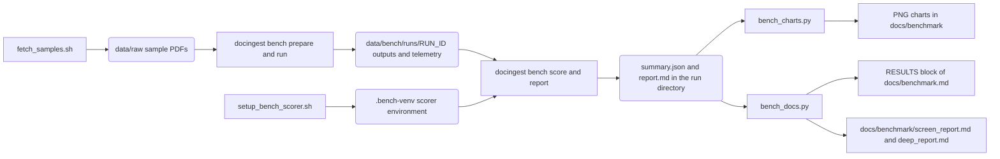
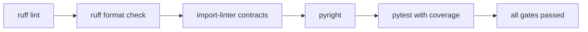
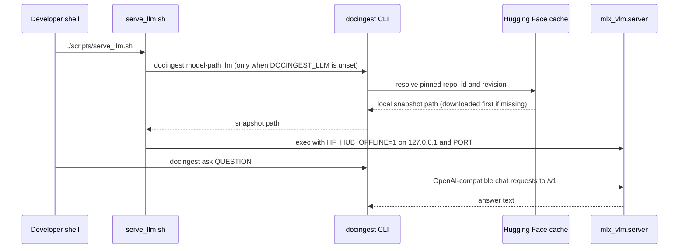

# scripts/

Helper scripts for development, sample data, the local QA server and the OCR benchmark documentation. None of them are part of the `docingest` package: the package and its CLI live in [`src/docingest/`](../src/docingest/README.md), and these scripts either call that CLI, call standard tools (uv, curl, shasum, ruff, import-linter, pyright, pytest, Playwright), or post-process benchmark results.

All shell scripts start with `cd "$(dirname "$0")/.."`, so they can be run from any directory and always operate on the repository root. `bench_docs.py` resolves the repository root from its own location in the same way. `bench_charts.py` takes its input and output directories as arguments, relative to the current directory.

## Overview

| Script | Purpose | Network | Writes |
|---|---|---|---|
| [`check.sh`](#checksh) | Runs every quality gate: ruff lint, ruff format check, import-linter contracts, pyright, pytest with coverage | Only if uv has to install missing packages | `.coverage`, `.pytest_cache/`, `.ruff_cache/`, `.import_linter_cache/` |
| [`fetch_samples.sh`](#fetch_samplessh) | Downloads the demo corpus and verifies its SHA-256 checksums | Yes: arxiv.org, archive.org | `data/raw/*.pdf`, `data/samples/paperqa2_arxiv.html` |
| [`serve_llm.sh`](#serve_llmsh) | Starts a local OpenAI-compatible LLM server (mlx-vlm) for `docingest ask` | Only if the pinned model is not in the Hugging Face cache, or uv has to install missing extras | Hugging Face cache and `.venv`, only when something is missing |
| [`setup_bench_scorer.sh`](#setup_bench_scorersh) | Builds an isolated environment for the official olmOCR-bench scorer | Yes: PyPI and the Playwright browser download | `.bench-venv/` (or `$DOCINGEST_BENCH_VENV`) |
| [`bench_charts.py`](#bench_chartspy) | Draws charts from a benchmark run's `summary.json` | No | PNG files (PDF files with `--paper`) in the output directory |
| [`bench_docs.py`](#bench_docspy) | Regenerates the results section of `docs/benchmark.md` and copies the run reports next to it | No | `docs/benchmark.md` (between markers), `docs/benchmark/screen_report.md`, `docs/benchmark/deep_report.md` |

Support files used by the scripts:

| File | Used by | Content |
|---|---|---|
| `samples.sha256` | `fetch_samples.sh` | SHA-256 checksums of the four PDFs in `data/raw/`, in `shasum -c` format |
| `bench_scorer_requirements.txt` | `setup_bench_scorer.sh` | The pinned runtime import closure of `olmocr.bench` (installed with `--no-deps`) |

## How the scripts fit together

The benchmark scripts sit before and after the `docingest bench` commands. The diagram shows which script or command produces each file and which one reads it.



The synthetic benchmark suite reads three of the PDFs that `fetch_samples.sh` downloads (see `[[suites.synthetic.documents]]` in `config/benchmark.toml`), which is why `fetch_samples.sh` appears at the start of the chain. The olmOCR-bench suite downloads its own data during `docingest bench prepare`.

---

## check.sh

Runs all quality gates in one command. It is the command to run before opening a pull request.

**Usage**

```bash
./scripts/check.sh
```

The script takes no arguments. Environment variables are passed through to pytest, so opt-in test classes can be enabled for a local run:

```bash
DOCINGEST_NETWORK_TESTS=1 ./scripts/check.sh
```

**What it runs, in order** (`set -euo pipefail`: the first failing gate stops the script)

| Step | Command | What it checks |
|---|---|---|
| 1 | `uv run --frozen ruff check src tests` | Lint rules selected in `[tool.ruff.lint]` of `pyproject.toml` |
| 2 | `uv run --frozen ruff format --check src tests` | Formatting (line length 100); does not rewrite files |
| 3 | `uv run --frozen lint-imports` | The five import-linter contracts in `pyproject.toml`: hexagonal layer order, adapters independent of each other, a domain free of I/O and framework libraries, application and ports free of concrete libraries, and only `bootstrap` and `entrypoints` importing concrete adapters |
| 4 | `uv run --frozen pyright` | Static types for `src/` (`typeCheckingMode = "standard"`) |
| 5 | `uv run --frozen pytest --cov --cov-report=term-missing:skip-covered -q` | The test suite with branch coverage of `docingest`; fails under 85% (`fail_under` in `[tool.coverage.report]`) |

The gate order as a flow:



**Requirements**: `uv` on `PATH`. `--frozen` makes uv use `uv.lock` as it is, without re-resolving it.

**Side effects**: `uv run` installs any package from the lock file that is missing in `.venv` before running the command. The tools write their usual caches and the coverage data file (see the overview table). No source file is modified.

**Relation to CI**: `.github/workflows/ci.yml` runs the same gates split over two jobs. The Linux job (core and dev dependencies, no extras) runs ruff, the format check, import-linter and `pytest -q --cov`. The macOS job (all extras) runs pyright and `pytest -q --cov`. Tests marked `model` or `network` stay skipped in both jobs. See [tests/README.md](../tests/README.md) for the markers.

**Not covered**: `scripts/` itself is not linted by `check.sh`. When you change a Python script here, run `uv run ruff check scripts` and `uv run ruff format --check scripts` by hand (both pass on the current scripts).

---

## fetch_samples.sh

Downloads the demo corpus used by the quick start and by the synthetic benchmark suite, then verifies the PDFs against pinned checksums so every run starts from byte-identical inputs.

**Usage**

```bash
./scripts/fetch_samples.sh
```

**Files it downloads**

| Local file | Source | Checksum verified |
|---|---|---|
| `data/raw/attention_1706.03762.pdf` | `https://arxiv.org/pdf/1706.03762v7` | Yes |
| `data/raw/paperqa2_2409.13740.pdf` | `https://arxiv.org/pdf/2409.13740v2` | Yes |
| `data/raw/olmocr_2502.18443.pdf` | `https://arxiv.org/pdf/2502.18443v3` | Yes |
| `data/raw/shannon1948_bstj_scanned.pdf` | `https://archive.org/download/bstj27-4-623/bstj27-4-623.pdf` (a scanned, image-only PDF) | Yes |
| `data/samples/paperqa2_arxiv.html` | `https://arxiv.org/html/2409.13740v2` | No |

**Behaviour**

1. Creates `data/raw/` if it does not exist. `data/samples/` must already exist; it is tracked in git through `data/samples/.gitkeep`.
2. Downloads each file with `curl -fsSL`, skipping any file that is already present. Re-running the script therefore downloads only what is missing.
3. Runs `shasum -a 256 -c ../../scripts/samples.sha256` inside `data/raw/`. A mismatch makes the script exit with a non-zero status.

**Requirements**: `curl` and `shasum` on `PATH`, and network access to arxiv.org and archive.org.

**Side effects**: writes only the five files listed above. All of them are gitignored (`data/raw/`, `data/samples/*.pdf`, `data/samples/*.html`). arXiv e-prints may not be redistributed without permission, so these files must not be committed.

**Who uses the files**

- The quick start of the [main README](../README.md): `uv run docingest ingest data/raw` for the PDFs, and `uv run docingest ingest data/samples/paperqa2_arxiv.html` as the HTML example (converted by Docling, which needs the `office` extra).
- The synthetic suite of the benchmark: `config/benchmark.toml` lists pages of the three arXiv PDFs in `[[suites.synthetic.documents]]`.
- Nothing in `src/` or `tests/` reads these files; the test suite builds its own inputs (see [tests/README.md](../tests/README.md)).

**Troubleshooting**: because existing files are skipped, an interrupted download can leave a truncated file that then fails the checksum on every run. Remove that one file from `data/raw/` and run the script again.

---

## serve_llm.sh

Starts `mlx_vlm.server`, an OpenAI-compatible HTTP server, for the pinned local LLM that `docingest ask` (PaperQA2) uses by default. By default it serves the model pinned in the `[ocr]` section of `config/pipeline.toml` (a Qwen3-VL snapshot in the shipped configuration), the same snapshot the OCR engine uses, so nothing is pulled from a moving `main` branch.

**Usage**

```bash
./scripts/serve_llm.sh &          # background; stop it later with: kill %1
uv run docingest ask "What are the main failure modes of retrieval-augmented generation?"
```

The script ends with `exec`, so the server replaces the shell process. Run in the foreground, it stops with Ctrl-C. Run with `&`, stop it with `kill %1` (or `kill <PID>`) from the same shell.

**Environment variables**

| Variable | Default | Effect |
|---|---|---|
| `DOCINGEST_LLM` | output of `uv run --all-extras docingest model-path llm` | Value passed to `--model` of `mlx_vlm.server` (a local snapshot path or a model id) |
| `PORT` | `8080` | Port of the server. The host is always `127.0.0.1` |

The script also exports `HF_HUB_OFFLINE=1` before starting the server, so the server loads the model from the local Hugging Face cache and does not contact Hugging Face.

**How the model path is resolved**

`docingest model-path llm` runs without `--config`, so it reads `config/pipeline.toml`. It takes the `[ocr]` `repo_id`, and the `[qa]` `llm_revision` if set, otherwise the `[ocr]` `revision`. It returns the local snapshot path from the Hugging Face cache (the standard `huggingface_hub` location, which `HF_HOME` or `HF_HUB_CACHE` can move). If that revision is not cached yet, it downloads the whole model snapshot. This happens before `HF_HUB_OFFLINE=1` is exported.

**How `docingest ask` reaches the server**

When `[qa]` sets no `llm` and `DOCINGEST_LLM` is unset in the shell running `docingest ask`, the PaperQA2 adapter sends requests to `openai/<snapshot path>` at `http://127.0.0.1:8080/v1` (`DEFAULT_LLM_BASE` in `src/docingest/config.py`), or at `[qa] llm_base` when that is set. If you change `PORT`, set `[qa] llm_base` to match. See [config/README.md](../config/README.md) for the `[qa]` keys.



**Requirements**: Apple Silicon with the `mlx` extra, which provides `mlx_vlm`. The script uses `uv run --all-extras`, so uv installs every optional extra (`mlx`, `qa`, `office`) into `.venv` if any is missing.

**Caution**: the PaperQA2 adapter also reads `DOCINGEST_LLM`, but there it is a litellm model name that overrides `[qa] llm`. If you set `DOCINGEST_LLM` to a snapshot path for this script, set it only for the server command (for example `DOCINGEST_LLM=/path ./scripts/serve_llm.sh`) and not in the shell that runs `docingest ask`.

---

## setup_bench_scorer.sh

Creates the isolated Python environment that `docingest bench score` and `docingest bench report` use to run the official olmOCR-bench scorer. The scorer lives in the `olmocr` package, whose own dependencies (torch, vllm, boto3 and others) are neither needed by the scorer nor wanted in the project environment.

**Usage**

```bash
./scripts/setup_bench_scorer.sh
```

The script is idempotent: running it again reuses the existing environment.

**Steps**

1. Creates a Python 3.12 virtual environment with `uv venv --allow-existing` at `$DOCINGEST_BENCH_VENV`, or at `.bench-venv/` in the repository root when that variable is unset.
2. Installs `olmocr==0.4.27` with `--no-deps`.
3. Installs the pinned import closure from `scripts/bench_scorer_requirements.txt`, also with `--no-deps`.
4. Installs Playwright's headless Chromium shell into `<venv>/pw`. The math tests render equations with KaTeX in this browser. The script's own comment estimates about 200 MB on the first run.
5. Creates `<venv>/home`, used as `HOME` for the scorer so its equation cache stays inside the environment directory.
6. Smoke check: imports `olmocr.bench.benchmark` and renders one KaTeX equation. On success it prints `olmOCR-bench scorer ready` and the path of the scorer's Python interpreter.

**Requirements**: `uv` on `PATH`, network access to PyPI and to the Playwright browser download.

**Side effects**: the environment, the browser and the scorer's cache are all written inside the environment directory; `.bench-venv/` is gitignored, and deleting that directory removes all of it. uv additionally keeps the downloaded packages in its global cache (`uv cache dir` prints the location).

**How the bench CLI finds the scorer**

| Setting in `[suites.olmocr-bench]` of `config/benchmark.toml` | Default | Environment override |
|---|---|---|
| `scorer_python` | `.bench-venv/bin/python` | `DOCINGEST_BENCH_SCORER_PYTHON` |
| `playwright_browsers` | `.bench-venv/pw` | `DOCINGEST_BENCH_PLAYWRIGHT_BROWSERS` |
| `scorer_home` | `.bench-venv/home` | `DOCINGEST_BENCH_SCORER_HOME` |

The CLI does not read `DOCINGEST_BENCH_VENV`. If you build the environment somewhere else, point the three settings (or their environment overrides) at it.

**Changing the scorer version**: `bench_scorer_requirements.txt` pins the exact closure verified with `olmocr==0.4.27`. A new `olmocr` version needs the closure re-checked, because both installs use `--no-deps` and nothing resolves missing packages.

---

## bench_charts.py

Draws the benchmark charts from the `summary.json` of one run.

**Usage**

```bash
uv run python scripts/bench_charts.py data/bench/runs/screen docs/benchmark
uv run python scripts/bench_charts.py <run_dir> <out_dir> --paper
```

Two positional arguments are required: the run directory and the output directory (created if missing). Any further argument is read as a flag, and only `--paper` has an effect. The script prints the path of every file it writes.

**Input**: `<run_dir>/summary.json`, written by `docingest bench report`.

**Output**: one file per chart. A chart whose suite is absent from the summary is skipped.

| File | Needs suite | Shows |
|---|---|---|
| `quality_vs_speed.png` | `olmocr-bench` | Pass rate (%) against median seconds per page on a log axis, one point per candidate, with its 95% confidence interval as a vertical bar and a direct label |
| `olmocr_categories.png` | `olmocr-bench` | Heat map of pass rate per category; rows follow the suite ranking |
| `synthetic_cer.png` | `synthetic` | Character error rate per candidate at each degradation level (`clean`, `light`, `heavy`) |

**`--paper` mode** writes print-style `.pdf` files instead of `.png`: monochrome, Computer Modern type (`cmr10`), families told apart by marker shape, no titles, and display names from `DISPLAY` in `bench_docs.py` instead of candidate ids. Use it for figures that go into papers or printed documents.

**Requirements**: matplotlib, which is in the `dev` dependency group and therefore installed by a default `uv sync`. The script does not import `docingest`. With `--paper` it imports `bench_docs` from the same folder (for `DISPLAY`), which leaves a `scripts/__pycache__/` directory behind; `__pycache__/` is gitignored.

**When you add a benchmark candidate or category**

- `family()` groups candidates by name prefix: `qwen3-vl` gives `Qwen3-VL`, `qwen3.5` gives `Qwen3.5`, anything else is `OCR-specialized`. A new family needs an entry in `FAMILY` and `MARKER` (and in the paper palette in `use_paper_style()`).
- `CATEGORIES` and `CATEGORY_LABEL` list the seven olmOCR-bench categories in display order.
- The x-axis label of the quality-vs-speed chart names the machine of the published runs (`M4 Pro 24 GB`); it is a fixed string, not read from the run.

---

## bench_docs.py

Regenerates the results section of [docs/benchmark.md](../docs/benchmark.md) from the benchmark run data, so no number in that section is typed by hand. The generated text compares candidates; it never picks a model.

**Usage**

```bash
uv run python scripts/bench_docs.py
```

No arguments. Use `uv run`: some sections import `docingest.application.benchmark` (`load_scores`, `compare`).

**Inputs** (fixed paths under the repository root; `runs_dir` from `config/benchmark.toml` is not consulted)

| Path | Required | Used for |
|---|---|---|
| `data/bench/runs/screen/summary.json` | For every part except the deep-sample table; when present it must contain both the `olmocr-bench` and `synthetic` suites | Machine line, screening olmOCR-bench table, category table, synthetic table, comparisons |
| `data/bench/runs/deep/summary.json` | Optional | Deep-sample table, and the deep-sample comparisons (paired tests, per-category spread, screening to deep) |
| `data/bench/runs/<run>/scores/<suite>.json` | `screen/scores/synthetic.json` whenever the screening summary exists; the others when a comparison needs them | Per-unit scores for medians, paired tests and subsets |
| `data/bench/runs/screen/olmocr-bench/<candidate>/**/*.md` | Optional | Count of outputs with no page text in the same-weights comparison |
| `data/bench/runs/screen/report.md`, `data/bench/runs/deep/report.md` | Optional | Copied verbatim into `docs/benchmark/` |

**Outputs**

1. Replaces everything between `<!-- RESULTS -->` and `<!-- /RESULTS -->` in `docs/benchmark.md`. Text outside the markers (the introduction and the Methodology section) is left untouched. If the start marker is missing, the script exits with an error and writes nothing. If only the end marker is missing, everything after the start marker is replaced, including the Methodology section, so keep both markers.
2. Copies each existing `data/bench/runs/<run>/report.md` to `docs/benchmark/<run>_report.md` for the runs `screen` and `deep`.
3. Prints the path of `docs/benchmark.md`.

**What the generated block contains**

- The machine and mlx / mlx-vlm versions of the screening run, links to the copied reports and to the failure analyses, and the chart images written by `bench_charts.py`.
- olmOCR-bench tables for the screening and deep runs: pass rate with 95% CI, the scorer's own interval, the paired comparison against the top mean, median seconds per page, peak memory, empty and truncated output rates.
- Pass rate per category, and the synthetic-suite table (CER with CI, median CER, word-F1, CER per degradation level, speed, memory), plus pages reported separately.
- A Comparisons list built by `observations()`: paired tests against the top mean with a Holm correction, screening versus deep, per-category spread, speed and memory, where the two suites order candidates differently, and candidates that share weights but differ in how the adapter runs them (`VARIANTS`).

**Constants to maintain**

| Name | Meaning |
|---|---|
| `CATS` | The seven olmOCR-bench categories and their labels, in table order |
| `DISPLAY` | Candidate id to display name, used by `bench_charts.py --paper` |
| `VARIANTS` | Pairs of candidates with the same weights and a sentence describing the difference |
| `OLMOCR_KEYS` | Front-matter keys that count as an output with no page text |

The run ids `screen` and `deep` are fixed in the script, and the table headings state 6 and 12 PDFs per category, which match `[presets.screen]` and `[presets.deep]` in `config/benchmark.toml`. If you change those presets or use other run ids, update the script as well.

**Typical sequence after a benchmark run**

```bash
uv run docingest bench report --run-id screen
uv run docingest bench report --run-id deep
uv run python scripts/bench_charts.py data/bench/runs/screen docs/benchmark
uv run python scripts/bench_docs.py
```

---

## Adding a script

Conventions followed by the existing scripts:

1. Shell scripts start with `#!/usr/bin/env bash`, `set -euo pipefail` and `cd "$(dirname "$0")/.."`, carry a comment explaining purpose and usage, and are executable (`chmod +x`).
2. Python scripts open with a docstring that shows the exact `uv run python scripts/<name>.py ...` command lines. Scripts that read or write fixed repository paths resolve them from `Path(__file__).resolve().parents[1]` rather than from the current directory, as `bench_docs.py` does.
3. Run tools through `uv run` so the locked environment is used.
4. Keep generated benchmark text neutral: comparisons only, no recommendation of a model.
5. Lint new Python scripts with `uv run ruff check scripts` and `uv run ruff format --check scripts`, since `check.sh` covers only `src` and `tests`.
6. Add a row to the overview table above and a section describing usage, inputs, outputs, side effects and requirements.
