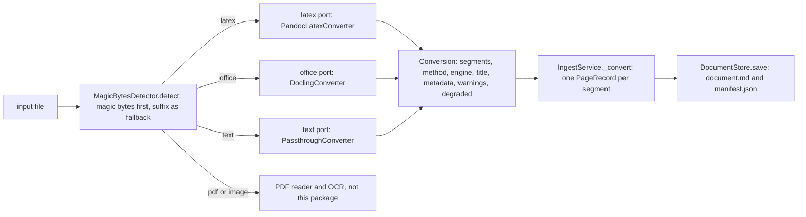
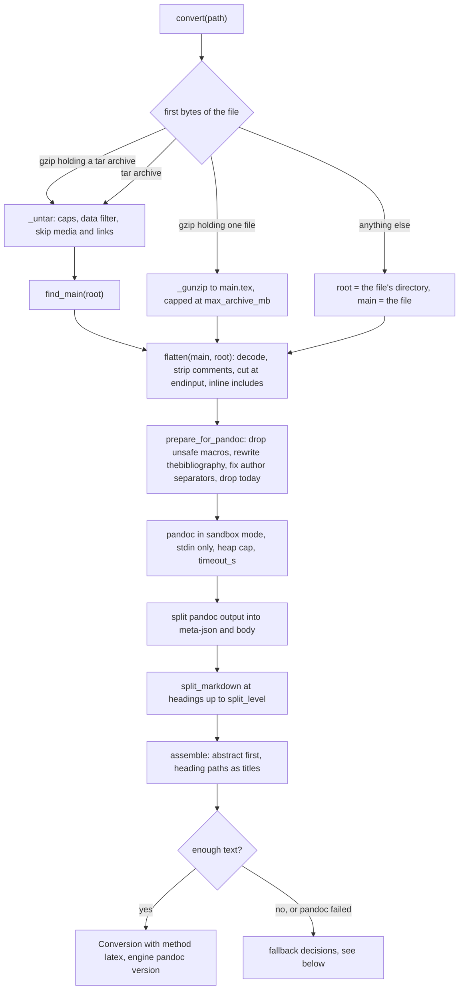
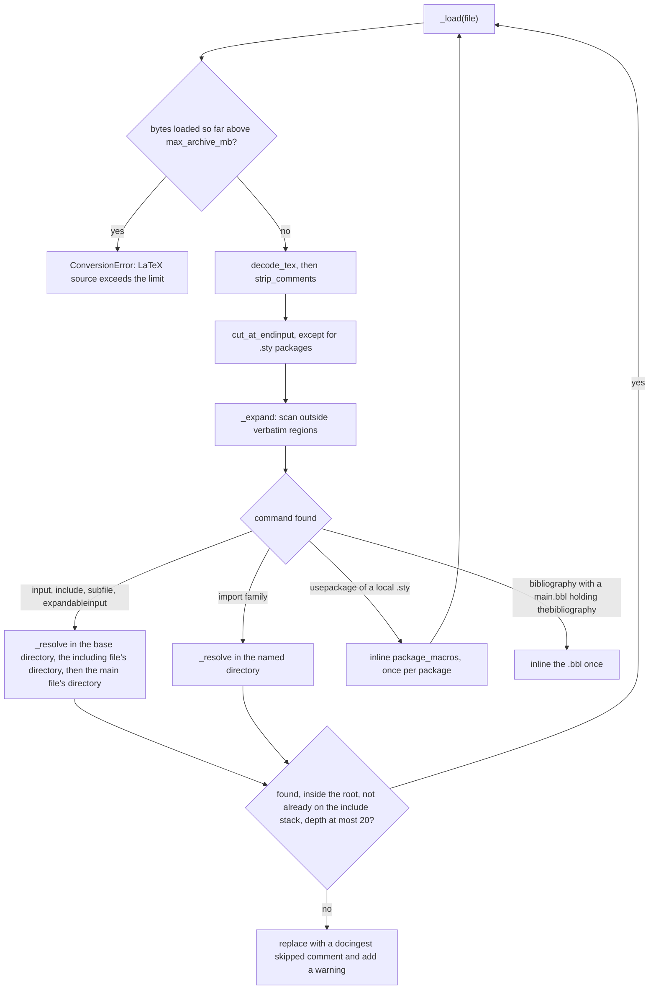
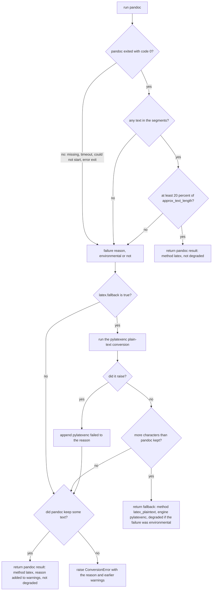

# Document converters (`docingest.adapters.converters`)

This package holds the implementations of the `DocumentConverter` port: the code that turns a whole document that is not a PDF or an image (a LaTeX source, an office or HTML file, a Markdown or text file) into a list of Markdown segments. PDFs and images do not come here; they go through the PDF reader and the OCR engines (see [../ocr/README.md](../ocr/README.md)).

| File | Contents | Port (`[adapters]` key) | Adapter name |
| --- | --- | --- | --- |
| [`pandoc_latex.py`](pandoc_latex.py) | `PandocLatexConverter`: LaTeX to Markdown with a sandboxed pandoc, a pylatexenc plain-text fallback, section splitting and metadata extraction | `latex` | `pandoc` |
| [`latex_source.py`](latex_source.py) | Pure helpers used by `PandocLatexConverter`: safe archive unpacking, main-file detection, decoding, comment stripping, flattening of includes, macro hygiene, brace matching, section splitting. No pandoc and no pylatexenc in this module | (helpers) | (helpers) |
| [`docling.py`](docling.py) | `DoclingConverter`: DOCX, PPTX, XLSX and HTML through Docling (`office` extra) | `office` | `docling` |
| [`plaintext.py`](plaintext.py) | `PassthroughConverter`: Markdown and plain text, unchanged | `text` | `passthrough` |

Related documentation: the port definitions are in [../../ports/README.md](../../ports/README.md), the adapter catalogue in [../README.md](../README.md), the ingestion use case in [../../application/README.md](../../application/README.md), configuration in [../../../../config/README.md](../../../../config/README.md), and the decision to prefer LaTeX sources for arXiv papers in [ADR 0003](../../../../docs/adr/0003-latex-first-for-arxiv.md).

## Contents

- [How a document reaches a converter](#how-a-document-reaches-a-converter)
- [The port: Conversion and Segment](#the-port-conversion-and-segment)
- [What ingestion does with a Conversion](#what-ingestion-does-with-a-conversion)
- [LaTeX: PandocLatexConverter](#latex-pandoclatexconverter)
  - [Accepted inputs and the conversion path](#accepted-inputs-and-the-conversion-path)
  - [Step 1: safe unpacking](#step-1-safe-unpacking)
  - [Step 2: main-file detection](#step-2-main-file-detection)
  - [Step 3: decoding and comments](#step-3-decoding-and-comments)
  - [Step 4: flattening](#step-4-flattening)
  - [Step 5: source rewrites before pandoc](#step-5-source-rewrites-before-pandoc)
  - [Step 6: sandboxed pandoc](#step-6-sandboxed-pandoc)
  - [Step 7: section splitting](#step-7-section-splitting)
  - [Fallback decisions and the degraded flag](#fallback-decisions-and-the-degraded-flag)
  - [The pylatexenc plain-text fallback](#the-pylatexenc-plain-text-fallback)
  - [Brace handling and linear-time scanning](#brace-handling-and-linear-time-scanning)
  - [Configuration: the latex section](#configuration-the-latex-section)
  - [Warnings and errors](#warnings-and-errors)
- [Office and HTML: DoclingConverter](#office-and-html-doclingconverter)
- [Markdown and text: PassthroughConverter](#markdown-and-text-passthroughconverter)
- [Using a converter directly](#using-a-converter-directly)
- [Adding or changing a converter](#adding-or-changing-a-converter)
- [Tests](#tests)

## How a document reaches a converter

The type detector decides the `SourceKind` of each input. For the three kinds handled here, the container looks up the configured adapter name for that kind's port and builds the converter only when the first document of that kind shows up (`_LazyConverters` in [`bootstrap.py`](../../bootstrap.py)). The diagram shows that path and what comes out of it.



Routing by kind (detection rules live in `adapters/detection/magic.py`):

| `SourceKind` | Detected when | `[adapters]` key | Default adapter | `PageMethod` values produced |
| --- | --- | --- | --- | --- |
| `latex` | suffix `.tex` or `.ltx`, or the bytes are a tar archive (any file name), or a gzip stream holding a tar archive or a single `.tex` file | `latex` | `pandoc` | `latex`, or `latex_plaintext` after the fallback |
| `office` | suffix `.docx`, `.pptx`, `.xlsx`, `.html`, `.htm` or `.xhtml` | `office` | `docling` | `docling` |
| `text` | suffix `.md`, `.markdown` or `.txt` | `text` | `passthrough` | `passthrough` |

A gzip stream that holds a PDF, PostScript or HTML is rejected by the detector with `UnsupportedInputError`, as is any file whose type is not recognised.

## The port: Conversion and Segment

The port is defined in [`ports/converters.py`](../../ports/converters.py). `DocumentConverter` is a `typing.Protocol` with two members:

| Member | Meaning |
| --- | --- |
| `fingerprint: str` | Name, version and settings of the converter. It is the only adapter-specific part of the cache key of `latex`, `office` and `text` documents, so it must change whenever the output can change. |
| `convert(path: Path) -> Conversion` | Convert one file. Must raise `ConversionError` (from `domain/errors.py`) when the document cannot be converted. |

`Segment` (frozen dataclass): one logical unit of a converted document, such as a section, a slide or the whole file.

| Field | Type | Meaning |
| --- | --- | --- |
| `text` | `str` | Markdown of the segment, including its own heading line when it has one. |
| `title` | `str \| None` (default `None`) | Heading path of the segment, for example `"Method > Complexity"`. `None` for untitled content. |

`Conversion` (frozen dataclass): the result of one `convert()` call.

| Field | Type | Default | Meaning |
| --- | --- | --- | --- |
| `segments` | `list[Segment]` | required | The document, in order. |
| `method` | `PageMethod` | required | How the text was produced: `latex`, `latex_plaintext`, `docling` or `passthrough`. |
| `engine` | `str` | required | Tool and version that produced the text, for example `"pandoc 3.9"`, `"pylatexenc 2.11"`, `"docling 2.130.0"`, `"passthrough"`. |
| `title` | `str \| None` | `None` | Document title found by the converter. |
| `metadata` | `SourceMetadata \| None` | `None` | Bibliographic metadata found by the converter (title, authors, abstract). |
| `warnings` | `list[str]` | `[]` | Human-readable notes about anything skipped, ignored or degraded. |
| `degraded` | `bool` | `False` | `True` when a fallback ran because of the environment (a timeout, a crash, a missing tool) rather than the document. Such a result must not be cached as the canonical conversion. |

## What ingestion does with a Conversion

`IngestService._convert()` in `application/ingest.py` consumes the `Conversion`:

1. Every warning is logged as `  warning: <text>`.
2. With `--max-pages N`, only the first `N` segments are kept. The manifest still records the total in `source_pages`.
3. Each kept segment becomes one `PageRecord` with the conversion's `method` and `engine`, the segment's `title`, `n_chars = len(text)`, and `seconds` = conversion time divided by the number of kept segments.
4. The manifest title is the first one available of: the title in external metadata (a `<file>.meta.json` sidecar or the arXiv crawler), the conversion's `title`, the file stem. External metadata also takes precedence over the conversion's `metadata`.
5. `document.md` is written as `# <title>` followed by one `<!-- page N | method=<method> -->` marker and the segment text per segment.
6. If `degraded` is true, the service logs a warning and the store writes the result under `<output_dir>/_degraded/`, where the cache lookup never reads. The next run tries the converter again.

The cache key of a converted document is a hash of `PIPELINE_VERSION` (in `application/ingest.py`), the source kind, the `ocr_all` flag (always false for these kinds) and the converter's `fingerprint`.

## LaTeX: PandocLatexConverter

`PandocLatexConverter(cfg: LatexConfig | None = None)` converts LaTeX sources, typically arXiv e-prints, into one segment per section. The main module is [`pandoc_latex.py`](pandoc_latex.py); all file-system and text handling that happens before pandoc runs is in [`latex_source.py`](latex_source.py).

pandoc is not trusted with the file system. The module docstring of `latex_source.py` lists why: pandoc resolves `\input` against its working directory, silently drops included files that are not UTF-8, hangs on a file that inputs itself or on a self-referential macro (conference style files do `\renewcommand{\small}{\@setfontsize\small...}`), and reads any path it is given (`\lstinputlisting{/etc/passwd}` ends up in the Markdown). The converter therefore unpacks archives itself, picks the main file, inlines every include in Python, and only then runs pandoc with `--sandbox` on one self-contained document.

### Accepted inputs and the conversion path

`unpack()` sniffs the first bytes, not the file name:

| Input | How it is recognised | What `unpack()` returns |
| --- | --- | --- |
| A `.tex` file | neither gzip nor tar | root = the file's own directory, main = the file. Nothing is copied |
| A tar archive | a valid first tar header (ustar, or pre-POSIX v7 with a correct checksum) | the extracted tree, main to be detected |
| A gzipped tar archive (arXiv source archives) | gzip magic `1f 8b` and a valid tar header in the first decompressed block | the extracted tree, main to be detected |
| A single gzipped `.tex` (old arXiv e-prints) | gzip magic without a tar header inside | `main.tex` in the work directory |

Everything is extracted into a fresh `tempfile.TemporaryDirectory(prefix="docingest-latex-")`, which is deleted when `convert()` returns. The diagram shows the whole path of one LaTeX conversion.



### Step 1: safe unpacking

`unpack(path, dest, max_bytes=...)` and `_untar()` bound every resource an archive could exhaust:

| Guard | Limit | Behaviour |
| --- | --- | --- |
| Total unpacked size | `max_archive_mb` from `[latex]` (default 200 MB) | Summed from the tar headers while they are read, before anything is extracted. Exceeding it raises `ConversionError("<name> unpacks to more than 200 MB (max_archive_mb)")`. A single gzipped `.tex` is decompressed in 1 MiB chunks and stopped at the same limit. |
| Number of members | `MAX_MEMBERS = 20_000` | More raises `ConversionError("<name> has more than 20000 files")`. |
| Size of one member's headers | `MAX_TAR_HEADER = 1 MiB` | `_CappedReader` wraps the stream and refuses any read larger than the remaining room before it decompresses or allocates, so a pax or GNU long-name header bomb (a few hundred KB of gzip that expand into a huge header) is refused instead of loaded into memory. |
| Member types | regular files only | Links, devices and directories are never extracted. |
| Member names | tarfile's `data` filter | Each member is checked with `tarfile.data_filter()` first. A member the filter refuses (for example a `..` path that would land outside the extraction directory) is skipped with a warning. Extraction itself also uses `filter="data"`, which strips the leading `/` of an absolute name, so such a member lands inside the extraction directory. |
| Media and binaries | `_MEDIA_SUFFIXES` | Files with these suffixes are not extracted, because they are never needed for text: images (`.png`, `.jpg`, `.jpeg`, `.gif`, `.bmp`, `.tif`, `.tiff`, `.webp`, `.svg`, `.ai`, `.psd`), `.eps`, `.ps`, `.pdf`, video (`.mp4`, `.mov`, `.avi`), nested archives (`.zip`, `.gz`, `.tgz`, `.tar`, `.bz2`, `.xz`, `.7z`), data and model files (`.npy`, `.npz`, `.pkl`, `.pt`, `.pth`, `.ckpt`, `.h5`, `.hdf5`, `.bin`, `.mat`) and office files (`.xlsx`, `.docx`, `.pptx`). |
| Memory | `MemoryError` | Turned into `ConversionError("cannot unpack <name>: out of memory")`. |
| Corrupt input | tar, gzip, zlib, EOF and OS errors | Turned into `ConversionError("cannot unpack <name>: ...")` or `ConversionError("corrupt gzip file <name>: ...")`. |

### Step 2: main-file detection

For archives, `find_main(root)` picks the file to compile, the way arXiv does. It considers files with the suffix `.tex` or `.ltx` whose relative path has no component starting with `.` or `__MACOSX` (no hidden file, no file inside a hidden directory or a `__MACOSX` folder), and decides in this order:

1. **README hint.** `00README.json` with a `sources` entry whose `usage` is `"toplevel"` (its `filename` is used), or a legacy `00README.XXX` file with a line `<file> toplevelfile`. The hinted file must exist inside the root.
2. **Candidate pool.** Files with `\documentclass` (or `\documentstyle`) and `\begin{document}`, excluding the `standalone` and `subfiles` classes. If there are none: the same files including those classes. If still none: any file with `\documentclass`. If still none: every `.tex` file. A pool of one is the answer.
3. **Conventional name.** Among the pool, a file named `main`, `ms`, `paper` or `article` (the shallowest one, ties broken in that order).
4. **Not included by another file.** Files that no other file pulls in with `\input`, `\include`, `\subfile` or `\import`.
5. **Largest file.** If several remain, the largest one wins and the warning `several main-file candidates; picked the largest (<name>) over <others>` is added.

No `.tex` file at all raises `ConversionError("no .tex file in the LaTeX source")`.

### Step 3: decoding and comments

Every file is read through `decode_tex(data)`, which never fails:

- A UTF-8 byte-order mark is dropped.
- Valid UTF-8 is decoded as UTF-8.
- A file with some real UTF-8 but a few stray bytes that are not UTF-8 (a pasted latin-1 no-break space, for example) keeps its UTF-8 characters, and only the stray bytes are read as cp1252 (or latin-1 for the five bytes cp1252 leaves undefined). The error handler is registered as `docingest-legacy`.
- A file without a single multi-byte UTF-8 sequence is a legacy file: cp1252, or latin-1 if it uses a byte cp1252 leaves undefined.
- Newlines are normalised to `\n`.

`strip_comments(text)` then removes `%` comments like TeX does:

- A line that holds only a comment disappears entirely.
- A trailing comment is removed but its `%` is kept, so TeX's "no space at the end of this line" meaning survives.
- `\%` is text. A `%` inside a verbatim-like environment (`verbatim`, `Verbatim`, `BVerbatim`, `LVerbatim`, `lstlisting`, `minted`, `comment`, with or without `*` where applicable), inside a `\verb`-like argument (`\verb`, `\lstinline`, `\Verb`, `\mintinline`, url's `\path`), or inside the argument of `\url{...}` or the URL argument of `\href{...}{...}` is text too.

### Step 4: flattening

`flatten(main, boundary, max_chars=..., max_depth=20)` returns a `Flattened(text, files, warnings)`: the whole document as one string, the list of inlined files relative to the root, and the warnings. The boundary is the root returned by `unpack()`: nothing outside it is ever read, whatever a path or a symlink says.

Each file goes through `_load()` (size accounting, `decode_tex`, `strip_comments`, `cut_at_endinput`) and then `_expand()`, which rewrites include commands outside verbatim regions only. The diagram follows one file.



Commands that are inlined:

| Command | Resolution | Notes |
| --- | --- | --- |
| `\input{x}`, `\input x`, `\subfile{x}`, `\expandableinput{x}` | Relative to the current base directory, then the including file's directory, then the main file's directory. `x.tex` is tried first, then `x` | Braced or bare argument. |
| `\include{x}` | As above, always `x.tex` | Surrounded by blank lines, because `\include` always starts a new page and therefore a new paragraph. |
| `\import{dir}{file}`, `\inputfrom`, `\includefrom` | `file` inside `dir` relative to the main file's directory | `dir` becomes the base directory for includes inside the imported file. The `\include...` variants get the paragraph break too. |
| `\subimport{dir}{file}`, `\subinputfrom`, `\subincludefrom` | `file` inside `dir` relative to the current base directory | Same base-directory and paragraph-break rules as the non-`sub` forms. |
| `\usepackage{a,b}` and `\RequirePackage{...}` | Each name as `name.sty` in the same three directories | A package found in the source tree is replaced by its notation macros (`package_macros()`, see step 5) and loaded once. Packages not found (system packages such as `amsmath`) stay in a `\usepackage` line, with the original options. |
| `\bibliography{...}` | `<main>.bbl` next to the main file | Inlined once, and only if it contains `thebibliography` (a biblatex `.bbl` is left alone). |

An included file that contains `\begin{document}` (a `\subfile`, a standalone figure) contributes only its body.

An include that cannot be inlined is replaced by the comment `%docingest: skipped (<reason>)`, and the warning `skipped <command> (<reason>)` is added:

| Reason | Cause |
| --- | --- |
| `unresolvable` | Empty name, or a name containing `#` or `\` (a macro argument). |
| `missing` | No such file in any searched directory. |
| `outside the source tree` | The resolved path is outside the boundary. |
| `recursive include` | The file is already on the include stack. |
| `nesting deeper than 20` | More than `MAX_DEPTH = 20` nested includes. |

The running total of bytes loaded (main file, includes, packages and the `.bbl`) is compared with `max_archive_mb`. Exceeding it raises `ConversionError("LaTeX source exceeds 200 MB (max_archive_mb)")`. A file that cannot be read (permissions, disk errors) surfaces from `convert()` as `ConversionError("cannot read LaTeX source <name>: ...")`.

#### `cut_at_endinput`

`cut_at_endinput(text, main=False)` returns the text as far as TeX reads it: up to the end of the line that holds the first `\endinput` TeX executes. The rest of that line is kept, everything after it is dropped, and the `\endinput` command itself is removed (pandoc would otherwise stop reading the whole flattened document there). An `\endinput` counts only when:

- it is at brace depth 0 (not inside a macro body such as `\newcommand{\stop}{\endinput}`),
- it is outside verbatim and `filecontents` environments and `\verb`-like arguments,
- it is not closed by a `\fi` on the same line within 200 characters (an include guard such as `\ifx\loaded\undefined\else\endinput\fi`),
- it is not the operand of `\let`, `\futurelet`, `\ifx`, `\noexpand`, `\string`, `\meaning` or `\show`,
- and, in the main file, it comes after the last `\end{document}` (LaTeX has to reach `\end{document}` first).

Local `.sty` packages are loaded without this cut.

### Step 5: source rewrites before pandoc

`prepare_for_pandoc(text)` makes pandoc's output complete and its run bounded:

| Rewrite | Why |
| --- | --- |
| `drop_unsafe_macros()` removes top-level `\newcommand`, `\renewcommand`, `\providecommand`, `\DeclareRobustCommand`, `\DeclareMathOperator` and `\def` / `\gdef` / `\edef` / `\xdef` definitions that are self-referential (the body uses the macro's own name) or that redefine a structural command | pandoc expands a self-referential macro forever. A redefinition of a structural command (`section`, `title`, `author`, `caption`, `cite`, `begin`, `input` and the rest of `STRUCTURAL`) hides headings, titles or authors from pandoc. The warning `ignored N self-referential/structural macro(s): \a, \b` lists what was dropped. |
| `rewrite_bibliography()` turns each `thebibliography` environment into `\section*{References}` and an `enumerate` whose items start with `\cite{<key>}` | pandoc prints the widest-label argument as text, drops `\newblock {\em ...}` groups (the venue) and emits no heading. The citation key at the start of each item lets `[@key]` in the text be matched to its reference. Helper macros in natbib's preamble are kept, `\url`, `\doi`, `\href` and `\urlprefix` overrides are not. |
| `\And` and `\AND` become `\and` | NeurIPS and ICLR styles separate authors with them, pandoc only knows `\and`. |
| `\today` is removed | A sandboxed pandoc prints 1970-01-01. |

`package_macros(sty)`, used when a local `.sty` is inlined, keeps only notation: definitions that are not `\renewcommand`, whose name and text contain no `@`, that are not structural and not self-referential, plus `\newtheorem` declarations. Layout machinery is exactly what hangs pandoc.

### Step 6: sandboxed pandoc

`PandocLatexConverter._pandoc()` runs:

```text
<pandoc> +RTS -M2g -RTS -f latex -t <MARKDOWN> --wrap=none --reference-location=block --sandbox -s --template=<work>/docingest-template.md
```

with the prepared LaTeX on standard input (UTF-8), the temporary work directory as the working directory, and `subprocess.run(..., timeout=cfg.timeout_s)`, which kills pandoc when the timeout expires.

| Argument | Purpose |
| --- | --- |
| `+RTS -M2g -RTS` | Caps pandoc's Haskell heap at 2 GB, as pandoc's manual advises for untrusted input. Exhausting it ends pandoc with exit code 251. |
| `-f latex` | Read LaTeX. |
| `-t <MARKDOWN>` | pandoc `markdown` with these extensions disabled: `raw_html`, `raw_attribute`, `raw_tex`, `native_divs`, `native_spans`, `fenced_divs`, `bracketed_spans`, `header_attributes`, `link_attributes`, `inline_code_attributes`, `grid_tables`, `multiline_tables`, `simple_tables`, `implicit_figures`, `smart`. The output keeps `$math$`, `$$display math$$`, pipe tables and `[@citation]` keys, without raw HTML or TeX and without attribute syntax. (GitHub-flavoured Markdown would drop the citations.) |
| `--wrap=none` | No hard line wrapping. |
| `--reference-location=block` | Footnotes stay next to their paragraph, so they land in the same segment. |
| `--sandbox` | pandoc's reader and writer cannot open files: pandoc reads only standard input and the template named on the command line, so `\input`, `\lstinputlisting` and the like have nothing to read. All includes were inlined in step 4. |
| `-s` and `--template=...` | The template is `$meta-json$`, a marker line `@@docingest-body@@`, then `$body$`. The converter splits the output at the marker: the part before it is pandoc's metadata as JSON, the part after it is the Markdown body. |

Which pandoc binary runs (`pandoc_path` property):

1. `[latex] pandoc_path`, when set.
2. Otherwise the binary bundled by `pypandoc-binary` (`pypandoc.get_pandoc_path()`), a project dependency pinned by `uv.lock`.
3. Otherwise `pandoc` on `PATH`.

`pandoc_version` runs `<pandoc> --version` once per converter instance and parses the version number. It is `None` when no binary works.

Metadata comes from the JSON part (`markdown_metadata()`): `title` (flattened to one line), `abstract`, and author names picked from pandoc's `author` field by `author_names()`. That heuristic reads each author entry line by line and stops at the first line that looks like a contact (it contains `@`, a backtick or `http`, or starts with `$` or `^`) or, from the second line on, like an affiliation (it names an organisation such as a university, institute, laboratory or company). In the lines it keeps, inline math (such as `$^{1}$`) separates names, footnote references, affiliation markers and digits are removed, and the text is split on commas, semicolons, `&` and `and`. It keeps the pieces of at most 6 words and 60 characters that start with a capital letter and contain no `:`, and removes duplicates. pandoc's `[WARNING]` lines on standard error are summarised into one warning: `pandoc: N warning(s), e.g. <up to three kinds>`.

### Step 7: section splitting

`split_markdown(md, max_level)` cuts pandoc's Markdown at ATX headings (`#` to `######`) whose level is at most `split_level` (values below 1 behave as 1). As in pandoc's own reader, a `#` line is a heading only at the start of the document or after a blank line, and never inside a code fence. Counting `$$` per line is deliberately avoided: pandoc writes adjacent inline maths such as `$3$$\times 10^{-4}$` with a single `$$`, and display math cannot contain a blank line, so the blank-line rule alone keeps `#` lines inside math from being taken for headings.

`assemble(parts, abstract)` then builds the segments:

- If the metadata has an abstract, the first segment is `# Abstract` followed by the abstract, titled `Abstract`.
- Each segment's `title` is the path of headings leading to it, joined with ` > ` (for example `Method > Complexity`).
- A heading with no text of its own before the next heading (typically a section that opens directly with a subsection) is not emitted alone: its heading line is prepended to the next segment, whose title is that segment's own heading path (for example `Experiments > Setup`). A heading-only part at the very end becomes a segment of its own.
- Content before the first heading becomes an untitled segment when it is not empty.

`split_level` in terms of LaTeX commands, as pandoc numbers headings: `\section` is level 1, `\subsection` 2, `\subsubsection` 3. pandoc shifts the levels so that the highest division present is level 1: when the document has `\chapter`, chapters are level 1 and everything below shifts by one; when it has `\part`, parts are level 1, chapters level 2, and sections level 3 (with or without chapters). The default `split_level = 2` therefore gives one segment per section and subsection of an article.

```python
from docingest.adapters.converters.pandoc_latex import assemble, split_markdown

parts = split_markdown("# Model\n\n## Attention\n\nText A.\n\n## Output\n\nText B.\n", 2)
segments = assemble(parts, abstract="We do X.")
assert [s.title for s in segments] == ["Abstract", "Model > Attention", "Model > Output"]
assert segments[1].text == "# Model\n\n## Attention\n\nText A."
```

### Fallback decisions and the degraded flag

After pandoc runs, `_convert_latex()` decides what to return. pandoc's output is accepted when it has text and at least `MIN_TEXT_RATIO = 0.2` (20 percent) of the characters `approx_text_length()` estimates for the source. That estimate takes the document body, drops `tikzpicture`, `pgfpicture`, `axis`, `filecontents` and `comment` environments and `\iffalse ... \fi` blocks, removes control words and special characters, and counts what is left.

Every failure has a reason and a flag saying whether it is **environmental** (the machine, so a later run may succeed) or about the document (the same input fails the same way every time):

| Failure reason | Environmental |
| --- | --- |
| `pandoc not found` (no configured, bundled or `PATH` binary) | yes |
| `pandoc timed out after <timeout_s>s` | yes |
| `pandoc could not run: <error>` (the binary could not be started) | yes |
| `pandoc exited with code <n>: <stderr>` with `n` from 1 to 99 (pandoc's own errors, for example 64 for a parse error or 91 for a macro loop) | no |
| `pandoc exited with code <n>: <stderr>` with a negative `n` (killed by a signal, such as the out-of-memory killer) or `n` of 100 and above (such as 251, heap exhausted under the cap) | yes |
| `pandoc produced no text` | no |
| `pandoc kept <n> chars of ~<expected> in the source` (below 20 percent) | no |

The decision tree:



Consequences:

- `degraded` is `True` only when the fallback result is returned and the failure was environmental. A timeout on a busy machine, a killed pandoc or a missing binary therefore never becomes the cached conversion of a paper; the result is stored under `_degraded/` and the next run tries pandoc again.
- A fallback caused by the document itself (a parse error, too little text) is deterministic and is cached normally.
- With `fallback = false`, pandoc's result is still returned when it kept some text (too little text only adds the reason to the warnings). Any other failure raises `ConversionError`, for example `main.tex: pandoc exited with code 64: ...`.
- A document with no text at all (for example only comments) raises `ConversionError` with `pandoc produced no text`.

### The pylatexenc plain-text fallback

`_plaintext()` converts the same prepared LaTeX with pylatexenc's `LatexNodes2Text` (`math_mode="verbatim"`, so math stays as LaTeX source) and returns plain text split into the same kind of segments:

1. The title and authors are taken from the first `\title{...}` and `\author{...}` arguments, with `\thanks{...}` footnotes removed. Authors are split at `\and` and filtered with the same `author_names()` heuristic.
2. The body is the text between `\begin{document}` and the last `\end{document}`. An `abstract` environment is taken out of it and becomes the `Abstract` segment and the metadata abstract.
3. `split_sections(body, split_level)` cuts the LaTeX at `\part`, `\chapter`, `\section`, `\subsection` and `\subsubsection` (starred forms and optional short titles included) whose level is at most `split_level`. The levels follow pandoc for documents without `\part`: `\section` is 1, `\subsection` 2 and `\subsubsection` 3, or 2, 3 and 4 when the body has a `\chapter` (chapters are then level 1). `\part` is always level 1 here, and sections are not shifted below it as pandoc does. A title whose closing brace is not found within 20,000 characters is not cut. Each segment gets a `#` heading line and a heading-path title through `assemble()`.
4. Each fragment is first rewritten by `_plain_friendly()` so that the plain text stays readable: verbatim constructs are normalised to the two forms pylatexenc reads verbatim (`comment` and `filecontents` bodies are dropped), `\href{url}{text}` becomes `text (url)`, `\url{...}` becomes the URL, `\iffalse ... \fi` blocks, `\maketitle` and `\tableofcontents` are removed, citations become `[@key1; @key2]` and references (`\ref`, `\eqref`, `\autoref`, `\cref`, ...) become `[label]`.
5. The pylatexenc context is the default one plus rules that keep the arguments of `\texttt`, `\textsf`, `\textup`, `\textmd`, `\mbox` and `\verb` and the body of `verbatim`, which the defaults drop (model, dataset and code names would otherwise vanish).
6. If pylatexenc raises on a fragment, `_crude_text()` keeps the words of that fragment (control words and braces removed) and the warning `pylatexenc failed on N fragment(s); kept their bare text` is added.

The fallback's `engine` is `pylatexenc <version>` and its `method` is `latex_plaintext`. Its warnings are the ones collected before pandoc ran (steps 1 to 5), then the pandoc failure as `<reason>; used the pylatexenc plain-text fallback`, then the fragment note of item 6 if any.

### Brace handling and linear-time scanning

arXiv sources are often unbalanced or huge, so every scan in `latex_source.py` is linear in the input size:

| Helper | What it does |
| --- | --- |
| `match_brace(text, i, limit=MAX_MACRO_BODY)` | Index just past the `}` that closes the `{` at `text[i]`, where `\` escapes the next character. Gives up and returns `None` after `MAX_MACRO_BODY = 20_000` characters, since a longer "definition" is an unbalanced brace rather than a macro. Used for `\title`, `\author` and `\thanks` arguments in the fallback. |
| `brace_pairs(text)` | The same matching for every `{` in one linear pass, as a dict from opening index to closing index. Used, with the same 20,000-character limit, to read macro definition bodies (`macro_definitions()`) and section titles (`split_sections()`). Scanning a window per candidate went quadratic on unbalanced sources. |
| `regions(text, begin, end)` and `sub_regions(...)` | The pairs the lazy regex `begin.*?end` would find, in linear time. Once an end pattern is missing after one begin, later begins with the same end pattern are skipped instead of rescanning the rest of the text. Used for `thebibliography`, `abstract`, `\iffalse ... \fi` and the environments dropped by `approx_text_length()`. |
| `verbatim_parts(text)` | The verbatim regions in order, as `Verbatim(start, end, body, env)`: verbatim-like environments (an unclosed one runs to the end of the text, as in TeX), `filecontents`, and `\verb`-like arguments, which must close on their own line within 1,000 characters. |
| `cut_at_endinput()` | Tracks brace depth token by token (skipping escaped characters) to decide which `\endinput` is executed. |

### Configuration: the latex section

`[latex]` keys, defined by `LatexConfig` in [`config.py`](../../config.py) (unknown keys are rejected):

| Key | Default | In the fingerprint | Meaning |
| --- | --- | --- | --- |
| `timeout_s` | `120` | no | pandoc wall-clock limit per document, in seconds. |
| `max_archive_mb` | `200` | no | Limit on the unpacked archive size and on the total bytes of LaTeX files loaded while flattening. |
| `split_level` | `2` | yes | Deepest heading level that starts a new segment. |
| `pandoc_path` | `None` | only through the version it reports | Path of a pandoc binary to use instead of the bundled one, for example a native arm64 build. |
| `fallback` | `true` | yes (with the pylatexenc version, or `no fallback`) | Use the pylatexenc plain-text fallback when pandoc fails, times out or keeps too little text. |

The fingerprint has the form:

```text
pandoc-latex r2 | pandoc <version or unavailable> | <pandoc arguments> | split_level=2 | pylatexenc <version>
```

`<pandoc arguments>` is `PANDOC_ARGS` joined with spaces (without the heap cap and the template option), and the last part is `no fallback` when `fallback = false`. `REVISION = 2` at the top of `pandoc_latex.py` must be bumped whenever this adapter's output changes for the same pandoc and pylatexenc versions, so that cached LaTeX conversions are invalidated. The `engine` recorded per page is `pandoc <version>` (or `pandoc unknown`) for a pandoc result.

### Warnings and errors

Warnings, in the order they are collected (all end up in `Conversion.warnings` and in the ingest log):

| Warning | Source |
| --- | --- |
| `skipped unsafe archive member '<name>': <reason>` | step 1 |
| `several main-file candidates; picked the largest (<file>) over <others>` | step 2 |
| `skipped <command> (<reason>)` | step 4 |
| `ignored N self-referential/structural macro(s): <names>` | step 5 |
| `<reason>; used the pylatexenc plain-text fallback` | fallback returned |
| `<reason>` (for example `pandoc kept 120 chars of ~4000 in the source`) | short pandoc output kept |
| `pandoc: N warning(s), e.g. <kinds>` | pandoc result returned |
| `pylatexenc failed on N fragment(s); kept their bare text` | fallback returned |

Errors are raised as `ConversionError` (a `DocingestError`). The `ingest` command reports each failed input in a `Failed inputs` table, continues with the next input and exits with status 1 at the end.

| Error message | Cause |
| --- | --- |
| `corrupt gzip file <name>: ...` | Unreadable gzip stream |
| `<name> unpacks to more than <N> MB (max_archive_mb)` | Archive or single gzipped file too large |
| `<name> has more than 20000 files` | Too many archive members |
| `cannot unpack <name>: refusing to read ... of tar headers at once ...` | Header bomb |
| `cannot unpack <name>: ...` | Corrupt tar, out of memory, or an OS error during extraction |
| `no .tex file in the LaTeX source` | Archive without LaTeX files |
| `LaTeX source exceeds <N> MB (max_archive_mb)` | Flattened sources too large |
| `cannot read LaTeX source <name>: ...` | A file in the source tree cannot be read |
| `<name>: <reason> (<warnings>)` | No usable text from pandoc or the fallback. The parenthesised part appears only when warnings were collected |

## Office and HTML: DoclingConverter

`DoclingConverter` converts DOCX, PPTX, XLSX and HTML files with Docling. It needs the `office` extra:

```bash
uv sync --extra office
```

Behaviour:

- Docling is imported inside `convert()`. If it is not installed, `convert()` raises `ConversionError("Office/HTML inputs need the 'office' extra: uv sync --extra office")`.
- The file is converted with `docling.document_converter.DocumentConverter().convert(str(path)).document.export_to_markdown()`.
- Any exception from Docling becomes `ConversionError("docling failed on <name>: <error>")`.
- The whole document is returned as a single untitled `Segment`, with `method = docling`. No title, metadata or warnings are set, and the result is never degraded.
- `fingerprint` and `engine` are both `docling <installed version>` (`docling missing` when the package is absent), so upgrading Docling invalidates cached office conversions.

## Markdown and text: PassthroughConverter

`PassthroughConverter` handles `.md`, `.markdown` and `.txt` files:

- It reads the file with `path.read_text(errors="replace")`: Python's default text encoding for the platform (no explicit encoding is passed), with undecodable bytes replaced by U+FFFD.
- The text is returned unchanged as a single untitled `Segment`, with `method = passthrough` and `engine = "passthrough"`.
- A read error is not translated into `ConversionError`: it propagates as `OSError`, and the `ingest` command reports it in the `Failed inputs` table like any other failure.
- `fingerprint` is `"passthrough 1"`. Bump the number if the output ever changes.

## Using a converter directly

Converters are plain objects and can be used without the container, for example in a notebook or a test. This converts the LaTeX test fixture (pandoc runs in a temporary directory that is removed afterwards):

```python
from pathlib import Path

from docingest.adapters.converters.pandoc_latex import PandocLatexConverter
from docingest.config import LatexConfig

conv = PandocLatexConverter(LatexConfig(split_level=2)).convert(
    Path("tests/fixtures/latex/paper/main.tex")
)
print(conv.method, conv.engine, conv.degraded)   # latex pandoc <version> False
print(conv.title)                                # Sparse Attention for Tiny Transformers
print(conv.warnings)                             # ['skipped \\input{sections/setup} (recursive include)']
for segment in conv.segments:
    print(segment.title, len(segment.text))      # Abstract, Introduction, Method, Method > Complexity, ...
```

The helpers in `latex_source.py` are pure functions over paths and strings and can be used on their own:

```python
from pathlib import Path

from docingest.adapters.converters.latex_source import (
    cut_at_endinput, decode_tex, find_main, flatten, prepare_for_pandoc,
)

assert decode_tex(b"caf\xe9 \xe2\x80\x94 ok") == "café — ok"     # UTF-8 plus one latin-1 byte
assert cut_at_endinput("keep\n\\endinput rest of line\ndropped\n") == "keep\n rest of line\n"

root = Path("tests/fixtures/latex/paper").resolve()
main, notes = find_main(root)
flat = flatten(main, root, max_chars=200 * 2**20)
latex, more_notes = prepare_for_pandoc(flat.text)
print(flat.files, flat.warnings + more_notes)
```

## Adding or changing a converter

### A different converter for an existing kind

1. Write a class with a `fingerprint` string and a `convert(path) -> Conversion` method in a new module of this package. It must raise `ConversionError` for inputs it cannot convert, choose an existing `PageMethod` (or add one to `domain/models.py`), and set `degraded=True` only when a fallback ran because of the environment. Keep imports to `docingest.ports`, `docingest.domain`, `docingest.config` and this package: the import-linter contracts in `pyproject.toml` keep adapter packages independent of each other.

   This example splits Markdown files at headings instead of passing them through:

   ```python
   from pathlib import Path

   from docingest.adapters.converters.pandoc_latex import assemble, split_markdown
   from docingest.domain.errors import ConversionError
   from docingest.domain.models import PageMethod
   from docingest.ports import Conversion


   class MarkdownSectionsConverter:
       """Markdown or plain text, one segment per heading up to ``split_level``."""

       def __init__(self, split_level: int = 2):
           self.split_level = split_level
           # Bump the "1" whenever the output changes for the same input.
           self.fingerprint = f"markdown-sections 1 split_level={split_level}"

       def convert(self, path: Path) -> Conversion:
           try:
               text = path.read_text(encoding="utf-8", errors="replace")
           except OSError as e:
               raise ConversionError(f"cannot read {path.name}: {e}") from e
           segments = assemble(split_markdown(text, self.split_level))
           if not segments:
               raise ConversionError(f"{path.name}: no text")
           return Conversion(
               segments=segments, method=PageMethod.PASSTHROUGH, engine=self.fingerprint
           )
   ```

2. Register a factory `(AppConfig) -> converter` under the kind's port in `REGISTRY` in [`bootstrap.py`](../../bootstrap.py), importing the module inside the factory:

   ```python
   def _markdown_sections(cfg: AppConfig):
       from .adapters.converters.markdown_sections import MarkdownSectionsConverter

       return MarkdownSectionsConverter()

   REGISTRY: dict[str, dict[str, Factory]] = {
       # ... other ports unchanged ...
       "text": {"passthrough": _passthrough, "markdown-sections": _markdown_sections},
   }
   ```

   From a separate package, publish the factory as an entry point in the group `docingest.office`, `docingest.latex` or `docingest.text` instead. Built-in names win a name clash.

3. Select it in `[adapters]` (`text = "markdown-sections"`) and check with `uv run docingest adapters`.
4. Test it against the port shape (`isinstance(converter, DocumentConverter)`), and through `Container(cfg, overrides=...)` or `tests/fakes.py:FakeConverter` for the ingestion side.

### A new kind of input

A converter alone is not enough when the input type is new. The kind also needs a `SourceKind` member in `domain/models.py`, detection in `adapters/detection/magic.py`, an entry in `_LazyConverters._PORT` and a `REGISTRY` port in `bootstrap.py`, and a field in `AdapterSelection` in `config.py` (which rejects unknown keys).

### Changing the LaTeX converter

- Put file-system and text handling in `latex_source.py` as pure functions, and keep pandoc and pylatexenc calls in `pandoc_latex.py`.
- Keep every scan linear: use `brace_pairs`, `regions`, `sub_regions` and `verbatim_parts` instead of lazy `.*?` regexes over the whole document.
- Never let pandoc read files: inline in `flatten()` and keep `--sandbox`.
- Bump `REVISION` in `pandoc_latex.py` when the output changes for the same pandoc and pylatexenc versions.
- Add a failing case to the tests before fixing it. The fixture paper in `tests/fixtures/latex/paper/` packs the known traps (a latin-1 include, a self-including file, a local `.sty` whose layout macro makes pandoc loop, a natbib `.bbl`, a commented-out include and verbatim code).

## Tests

| Test file | What it covers |
| --- | --- |
| `tests/unit/test_latex_source.py` | Decoding, comments, macro hygiene, bibliography rewrite, flattening (resolution, latin-1, cycles, boundary, depth, verbatim, `\subfile`, `\import`, packages, `.bbl`, size cap), `find_main`, `unpack` (media, gzip, traversal, bombs), `approx_text_length`, `split_sections`, `split_markdown`, `assemble`, author names and metadata |
| `tests/unit/test_latex_fixes.py` | `\endinput` rules, tar header bombs, adjacent inline math, `%` in inline verbatim, `verbatim_parts`, linear-time scanning, fallback text for monospace and verbatim, stray-byte decoding, brace matching |
| `tests/integration/test_pandoc_latex.py` | The real pandoc and pylatexenc: the fixture paper as `.tex`, tar and tar.gz, a single gzipped `.tex`, no reads outside the source, self-referential macros, timeouts, short output, the degraded flag for each exit code, pylatexenc crashes, malformed LaTeX, a missing pandoc, `split_level = 1`, ingestion through the container. Real arXiv sources run when `DOCINGEST_LATEX_SAMPLES` points at a folder of downloads |

```bash
uv run pytest tests/unit/test_latex_source.py tests/unit/test_latex_fixes.py tests/integration/test_pandoc_latex.py
```

See [../../../../tests/README.md](../../../../tests/README.md) for the test layout and [../../../../CONTRIBUTING.md](../../../../CONTRIBUTING.md) for the full set of quality gates.
