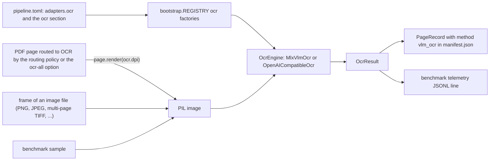
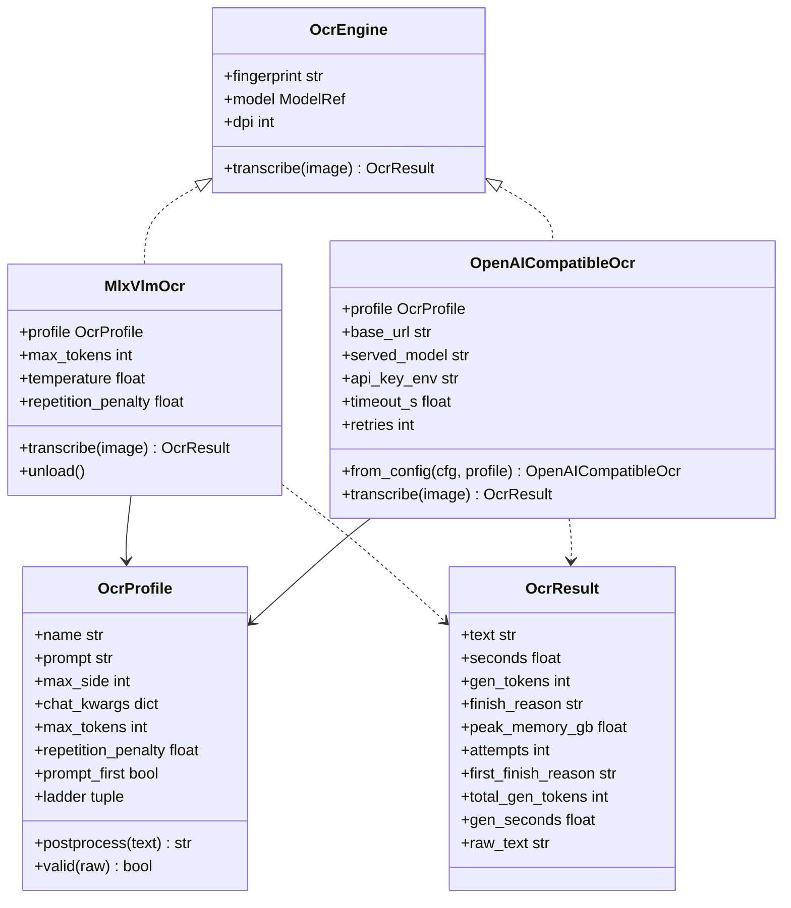
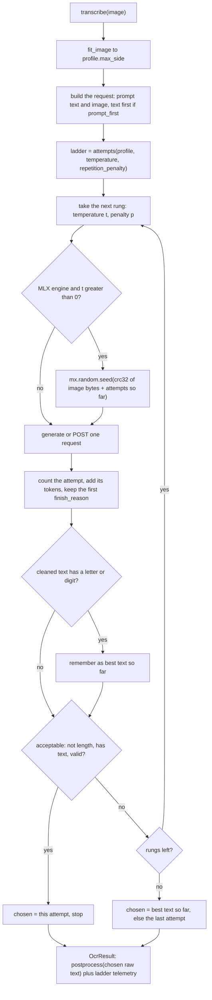
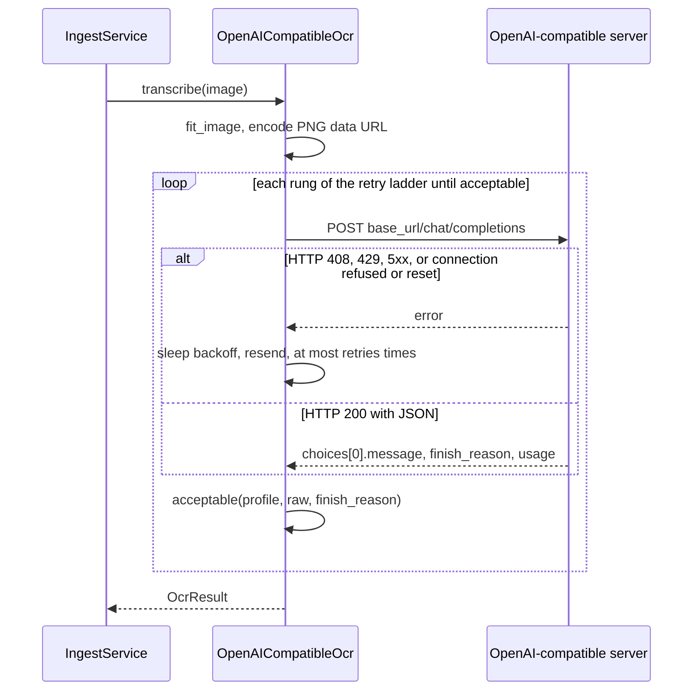

# OCR adapters (`docingest.adapters.ocr`)

This package holds the implementations of the `OcrEngine` port: the code that turns one page image into Markdown with a vision-language model (VLM). There are two engines and one shared module of per-model settings:

| File | Contents | Adapter name in `[adapters] ocr` |
| --- | --- | --- |
| [`profiles.py`](profiles.py) | `OcrProfile`, the built-in `PROFILES`, `profile_for()`, the retry ladder `attempts()` and the acceptance test `acceptable()` | (shared, not an adapter) |
| [`mlx_vlm.py`](mlx_vlm.py) | `MlxVlmOcr`: runs the model in-process on Apple Silicon through mlx-vlm. Also `fit_image()`, used by both engines | `mlx-vlm` (default) |
| [`openai_compat.py`](openai_compat.py) | `OpenAICompatibleOcr`: sends each page to any OpenAI-compatible `/chat/completions` endpoint over plain HTTP (the standard library's `urllib`) | `openai-compatible` |

Both engines read the same profile, fit the image the same way, walk the same retry ladder and apply the same clean-up. A given model therefore gets the same prompt, input size and post-processing whichever runtime serves it, and only the runtime changes when you switch adapters.

Related documentation: the port definitions are in [../../ports/README.md](../../ports/README.md), the adapter catalogue in [../README.md](../README.md), configuration in [../../../../config/README.md](../../../../config/README.md), and the benchmark that compares OCR models in [../../../../docs/benchmark.md](../../../../docs/benchmark.md).

## Contents

- [Where OCR sits in the pipeline](#where-ocr-sits-in-the-pipeline)
- [The port contract](#the-port-contract)
- [Selecting and configuring an engine](#selecting-and-configuring-an-engine)
- [Profiles](#profiles)
- [The retry ladder and acceptance](#the-retry-ladder-and-acceptance)
- [OcrResult telemetry](#ocrresult-telemetry)
- [Image fitting](#image-fitting)
- [The in-process MLX engine](#the-in-process-mlx-engine)
- [The OpenAI-compatible HTTP engine](#the-openai-compatible-http-engine)
- [Pointing at a remote OpenAI-compatible server](#pointing-at-a-remote-openai-compatible-server)
- [Fingerprints and caching](#fingerprints-and-caching)
- [Adding a model, a profile or an engine](#adding-a-model-a-profile-or-an-engine)
- [Tests](#tests)

## Where OCR sits in the pipeline

The OCR engine is called in two places: by `IngestService` for PDF pages that the routing policy sends to OCR and for every frame of an image file, and by the benchmark runner for every sample of every candidate. The diagram shows those call sites and how the engine is chosen.



What happens with the result:

- `IngestService._ocr_record()` (in `application/ingest.py`) stores `len(text)`, `seconds`, `gen_tokens`, `finish_reason`, the engine's `fingerprint` (as `engine`) and the model's `repo_id` / `revision` in a `PageRecord` with `method = vlm_ocr`. The text becomes that page's section of `document.md`.
- The benchmark runner (`application/benchmark.py`) writes `text` to the suite's output file for the sample, and one JSON line per sample to `telemetry/<suite>/<candidate>.jsonl` inside the run directory with the telemetry fields (`seconds`, `gen_tokens`, `finish_reason`, `attempts`, `first_finish_reason`, `total_gen_tokens`, `gen_seconds`, `peak_memory_gb`) plus the character count, the wall time and any error. When `raw_text` differs from `text` (clean-up changed it), the raw output also goes to `model_raw/<suite>/<candidate>/<sample>.txt`. After a candidate finishes, or stops, the runner calls the engine's optional `unload()` method.

Which PDF pages go to OCR is decided by the pure routing policy in `domain/routing.py`, not by this package. See [../../domain/README.md](../../domain/README.md) and [../../application/README.md](../../application/README.md).

## The port contract

The port is defined in [`ports/ocr.py`](../../ports/ocr.py). It is a `typing.Protocol`, so an engine never imports or subclasses it; any object with this shape plugs in:

| Member | Type | Meaning |
| --- | --- | --- |
| `fingerprint` | `str` | Everything that can change the output text: model, revision, profile settings, generation settings. It feeds the cache key (see [Fingerprints and caching](#fingerprints-and-caching)). |
| `model` | `ModelRef` | `repo_id` and `revision` (a pinned Hugging Face commit), recorded in manifests. |
| `dpi` | `int` | Resolution at which `IngestService` rasterizes PDF pages for this engine. |
| `transcribe(image)` | `(PIL.Image.Image) -> OcrResult` | Transcribe one page image. |

`unload()` is not part of the port. The benchmark calls it when an engine has it (`MlxVlmOcr` does) to free model weights before loading the next candidate.

The class relationships inside this package:



## Selecting and configuring an engine

The engine is chosen by name in `[adapters]` and configured by the `[ocr]` section of `config/pipeline.toml` (or of the file passed with `--config`). The factories `_mlx_vlm()` and `_openai_ocr()` in [`bootstrap.py`](../../bootstrap.py) build the profile with `profile_for(cfg.ocr.profile, cfg.ocr.prompt, cfg.ocr.max_side)` and pass it to the engine.

```toml
[adapters]
ocr = "mlx-vlm"            # or "openai-compatible"
```

`[ocr]` keys, defined by `OcrConfig` in [`config.py`](../../config.py) (unknown keys are rejected):

| Key | Default | Used by | Meaning |
| --- | --- | --- | --- |
| `repo_id` | `"mlx-community/Qwen3-VL-4B-Instruct-4bit"` | both | Hugging Face repository of the model. For `openai-compatible` it only labels the output. |
| `revision` | filled in only for the default `repo_id`, otherwise required | both | Commit sha of `repo_id`. Loading fails with `[ocr] revision is required for ...` when it is missing for any other repository. Change `repo_id` and `revision` together. |
| `profile` | `"markdown"` | both | Name of a built-in profile (see [Profiles](#profiles)). |
| `prompt` | `None` | both | Replaces the profile's prompt. |
| `max_side` | `None` | both | Replaces the profile's `max_side` (longest image side in pixels). |
| `dpi` | `150` | both | PDF rasterization resolution, exposed as `engine.dpi`. |
| `max_tokens` | `None` | both | `None` means the profile's `max_tokens`. |
| `temperature` | `0.0` | both | Temperature of the first attempt of the default ladder. Ignored during generation by profiles that define their own `ladder`. |
| `repetition_penalty` | `None` | both | `None` means the profile's `repetition_penalty`. Same ladder caveat as `temperature`. |
| `base_url` | `"http://127.0.0.1:8080/v1"` | `openai-compatible` | Endpoint root. Must start with `http://` or `https://`, a trailing slash is removed. Requests go to `{base_url}/chat/completions`. |
| `served_model` | `None` | `openai-compatible` | The model id the server expects in the request body. `None` means `repo_id`. |
| `api_key_env` | `None` | `openai-compatible` | Name of an environment variable that holds a bearer token. Never the key itself. |
| `timeout_s` | `600.0` | `openai-compatible` | Per-request HTTP timeout in seconds. A timed-out request is not retried. |
| `retries` | `3` | `openai-compatible` | Transport retries on HTTP 408, 429, 5xx and connection errors. |

Precedence for generation settings: an explicit `[ocr]` value wins, otherwise the profile's model-card default applies. The benchmark uses the same rule: a `[[candidates]]` entry in `config/benchmark.toml` is turned into an `OcrConfig` by `engine_factory()` in `entrypoints/bench_cli.py`, with `served_model` reset to `None` for every candidate.

Run `uv run docingest adapters` to see the selected OCR adapter and the available ones (built-ins plus installed plugins).

## Profiles

A profile captures how a model's authors run it: the prompt, the input size, the output clean-up and a few generation defaults. Profiles are defined in [`profiles.py`](profiles.py). The source comment there lists where the values come from: olmOCR's and GLM-OCR's official repositories and the Nanonets-OCR2 and PaddleOCR-VL model cards.

### `OcrProfile` fields

`OcrProfile` is a frozen dataclass:

| Field | Type | Default | Meaning |
| --- | --- | --- | --- |
| `name` | `str` | required | Profile name, also recorded in the engine fingerprint. |
| `prompt` | `str` | required | Text sent with the image. |
| `max_side` | `int` | required | Longest image side in pixels fed to the model. Larger images are downscaled by `fit_image()`. |
| `postprocess` | `Callable[[str], str]` | `_strip_common` | Clean-up applied to the raw model output. |
| `chat_kwargs` | `dict` | `{}` | Extra keyword arguments for the chat template (for example `enable_thinking`). |
| `max_tokens` | `int` | `4096` | Generation budget for one page. |
| `repetition_penalty` | `float \| None` | `1.05` | Default repetition penalty. |
| `prompt_first` | `bool` | `False` | Put the prompt text before the image in the user turn (the order olmOCR was trained with). Otherwise the image comes first. |
| `ladder` | `tuple[tuple[float, float \| None], ...] \| None` | `None` | The profile's own retry ladder of `(temperature, repetition_penalty)` pairs. `None` means the default ladder. |
| `valid` | `Callable[[str], bool] \| None` | `None` | Extra acceptance test on the raw output. A failing attempt is retried. |

### Built-in profiles

| Profile | Written for | Prompt | `max_side` | `postprocess` | `chat_kwargs` | `max_tokens` | `repetition_penalty` | `prompt_first` | `ladder` | `valid` |
| --- | --- | --- | --- | --- | --- | --- | --- | --- | --- | --- |
| `markdown` | general instruction-following VLMs (the code comment names Qwen3-VL and Qwen3.5) | `GENERIC_PROMPT` | 1600 | `_strip_common` | `{}` | 4096 | 1.05 | `False` | default | none |
| `olmocr` | olmOCR-2 | `OLMOCR_PROMPT` | 1288 | `_olmocr` | `{}` | 8000 | 1.05 | `True` | `OLMOCR_LADDER` | `_olmocr_valid` |
| `nanonets` | Nanonets-OCR2 | `NANONETS_PROMPT` | 1600 | `_nanonets` | `{}` | 8000 | 1.05 | `False` | default | none |
| `glm-ocr` | GLM-OCR | `"Text Recognition:"` | 1600 | `_strip_common` | `{"enable_thinking": True}` | 8192 | 1.1 | `False` | default | none |
| `paddleocr-vl` | PaddleOCR-VL | `"OCR:"` | 1600 | `_strip_common` | `{}` | 4096 | 1.05 | `False` | default | none |

The prompts:

- `GENERIC_PROMPT` asks for clean Markdown in reading order, with `#` headings, lists, Markdown tables and `$...$` LaTeX math, without page headers, footers or hyphenation, and without commentary.
- `OLMOCR_PROMPT` is olmOCR-2's training prompt (`build_no_anchoring_v4_yaml_prompt` in allenai/olmocr): natural reading order, LaTeX equations, HTML tables, figure placeholders, and a YAML front matter block with `primary_language`, `is_rotation_valid`, `rotation_correction`, `is_table` and `is_diagram`.
- `NANONETS_PROMPT` is the Nanonets-OCR2 model-card prompt: HTML tables, LaTeX equations, `` descriptions, and `<watermark>` / `<page_number>` tags.
- `glm-ocr` and `paddleocr-vl` use the short task prompts of their official pipelines. GLM-OCR needs `enable_thinking=True` in the chat template, otherwise mlx-vlm appends `/nothink` to the prompt.

### Clean-up functions

| Function | Used by | What it removes |
| --- | --- | --- |
| `_strip_common(text)` | every profile (directly or first) | `<think>...</think>` blocks, then, when the text opens with a code fence (optionally labelled `markdown`, `md`, `yaml`, `yml`, `json` or `text`), the opening fence line and a closing fence line. Each fence is removed independently, so an unclosed fence is handled. The result is stripped of surrounding whitespace. |
| `_olmocr(text)` | `olmocr` | `_strip_common`, then the leading front matter block: blank lines, lines made only of dashes (`---`, or a merged `------`) and olmOCR key lines (`primary_language:`, `is_rotation_valid:`, `rotation_correction:`, `is_table:`, `is_diagram:`, with `_` or space, case-insensitive, optionally written as a Markdown heading). |
| `_nanonets(text)` | `nanonets` | `_strip_common`, then whole `<page_number>`, `<watermark>`, `<header>` and `<footer>` blocks (tags and content), then the `<signature>` tags (content kept). |

Validation function:

| Function | Used by | Rule |
| --- | --- | --- |
| `_olmocr_valid(raw)` | `olmocr` | At least 3 of the first 8 lines of the raw output (after `_strip_common`) are olmOCR front matter key lines. olmOCR's own pipeline only accepts output that starts with its front matter, anything else is retried up the ladder. |

### `profile_for()`

```python
profile_for(name: str, prompt_override: str | None = None, max_side: int | None = None) -> OcrProfile
```

Returns a copy of `PROFILES[name]` with the prompt and `max_side` replaced when an override is given. The overrides use `or`, so an empty prompt or `max_side = 0` also falls back to the profile's value. An unknown name raises `ValueError: unknown OCR profile 'x'; choose from [...]`.

```python
from docingest.adapters.ocr.profiles import PROFILES, profile_for

p = profile_for("markdown", max_side=1024)
assert p.max_side == 1024 and p.max_tokens == 4096
assert PROFILES["nanonets"].postprocess("Text <page_number>3</page_number>") == "Text"
assert PROFILES["markdown"].postprocess("<think>hmm</think>```markdown\n# A\n```") == "# A"
```

## The retry ladder and acceptance

A VLM sometimes loops until it hits `max_tokens`, returns nothing readable, or (olmOCR) answers with its front matter only. Both engines therefore run each page through a short ladder of generation settings and stop at the first attempt that is acceptable.

### `attempts(profile, temperature, penalty)`

Returns the list of `(temperature, repetition_penalty)` pairs to try, in order:

- If the profile has a `ladder`, that ladder is used as is. The configured `temperature` and `repetition_penalty` are then not used for generation (they are still part of the fingerprint).
- Otherwise the default ladder is: greedy first, then a little sampling with a stronger repetition penalty (a `max_tokens` hit usually means a repetition loop):

  1. `(temperature, penalty)` from the engine settings
  2. `(0.2, max(penalty or 1.0, 1.15))`
  3. `(0.5, max(penalty or 1.0, 1.25))`

Resulting ladders with default settings (`temperature = 0.0`):

| Profile | Attempts |
| --- | --- |
| `markdown`, `nanonets`, `paddleocr-vl` | `(0.0, 1.05)`, `(0.2, 1.15)`, `(0.5, 1.25)` |
| `glm-ocr` | `(0.0, 1.1)`, `(0.2, 1.15)`, `(0.5, 1.25)` |
| `olmocr` (`OLMOCR_LADDER`, from olmOCR's `TEMPERATURE_BY_ATTEMPT`) | temperatures 0.1, 0.1, 0.2, 0.3, 0.5, 0.8, 0.9, 1.0, each with penalty 1.05 (8 attempts) |

A penalty of `None` or `0` is not sent to mlx-vlm. The HTTP engine also omits a penalty of exactly `1.0`, which means "off", so strict APIs that do not know the field are not sent it.

### `acceptable(profile, raw, finish_reason)`

An attempt is accepted, and the ladder stops, when all three hold:

1. `finish_reason` is not `"length"` (the output was not truncated at `max_tokens`).
2. `profile.postprocess(raw)` still contains at least one letter or digit.
3. `profile.valid` is `None`, or `profile.valid(raw)` is true.

### Best-text fallback

While walking the ladder, each engine remembers the latest attempt whose cleaned text contains a letter or digit. If an attempt is acceptable, it becomes the chosen attempt. If no attempt is acceptable, the chosen attempt is that latest attempt with text, or the very last attempt when none had any. The returned text is `profile.postprocess()` of the chosen attempt's raw output, and `gen_tokens`, `finish_reason` and `raw_text` describe the chosen attempt. The ladder as a whole is reported in the telemetry fields described below.

### Seeded sampling

`MlxVlmOcr` seeds every sampled attempt from the page itself: `seed = zlib.crc32(img.tobytes())` of the fitted image, and before an attempt with temperature above 0 it calls `mx.random.seed(seed + n)`, where `n` is the number of attempts already made. Greedy attempts (temperature 0) are not seeded. Re-running the same page with the same settings therefore reproduces a retried page's text instead of drawing a new sample. `OpenAICompatibleOcr` sends no seed, so reproducibility of sampled retries depends on the server.

### One page, end to end

The flowchart follows one call to `transcribe()` in either engine.



## OcrResult telemetry

`OcrResult` (in [`ports/ocr.py`](../../ports/ocr.py)) is a frozen dataclass. `gen_tokens` and `finish_reason` describe the chosen attempt. The ladder fields describe every attempt, so a benchmark still sees a truncation that a retry fixed and counts every generated token when computing throughput.

| Field | Meaning | `MlxVlmOcr` | `OpenAICompatibleOcr` |
| --- | --- | --- | --- |
| `text` | Cleaned transcription of the chosen attempt | `postprocess(chosen.text)` | `postprocess(content)` |
| `seconds` | Wall time of all attempts, prefill included | timer starts after model loading, image fitting and chat templating | timer starts after image fitting and PNG encoding |
| `gen_tokens` | Tokens generated by the chosen attempt | `generation_tokens` | `usage.completion_tokens`, 0 when absent |
| `finish_reason` | Finish reason of the chosen attempt (`"stop"`, `"length"`, ...) | from mlx-vlm | `choices[0].finish_reason` |
| `peak_memory_gb` | Peak memory while transcribing this page | mlx-vlm's `peak_memory` on the chosen result (the peak counter is reset with `mx.reset_peak_memory()` before the first attempt) | `None` |
| `attempts` | Number of generations run for this page | counted | counted |
| `first_finish_reason` | Finish reason of the first attempt | set | set |
| `total_gen_tokens` | Tokens generated over all attempts | summed | summed from `usage.completion_tokens` |
| `gen_seconds` | Decode time over all attempts | sum of `generation_tokens / generation_tps` per attempt, `None` if any attempt cannot be measured | `None` (not observable over HTTP) |
| `raw_text` | Model output of the chosen attempt before clean-up, for audits | set | set |

When `attempts == 1` and the ladder fields are left unset, `__post_init__` fills `first_finish_reason` from `finish_reason` and `total_gen_tokens` from `gen_tokens`. Single-attempt engines (such as `tests/fakes.py:FakeOcr`) can therefore return just the four required fields.

## Image fitting

`fit_image(img, max_side)` in [`mlx_vlm.py`](mlx_vlm.py) prepares every page for both engines:

1. `ImageOps.exif_transpose()` turns phone photos upright.
2. An image with transparency is composited onto a white background (a plain RGB conversion would turn transparent areas black).
3. The image is converted to RGB.
4. If the longest side exceeds `max_side`, the image is downscaled with Lanczos resampling so that the longest side equals `max_side`. Smaller images are never upscaled.

```python
from PIL import Image
from docingest.adapters.ocr.mlx_vlm import fit_image

out = fit_image(Image.new("RGBA", (3000, 2000), (0, 0, 0, 0)), 1024)
assert out.size == (1024, 683) and out.mode == "RGB" and out.getpixel((0, 0)) == (255, 255, 255)
```

The HTTP engine then encodes the fitted image as a lossless PNG data URL (`data:image/png;base64,...`), because JPEG artefacts hurt small glyphs.

## The in-process MLX engine

`MlxVlmOcr(model, profile, *, dpi=150, max_tokens=None, temperature=0.0, repetition_penalty=None)` runs the model in the current process with mlx-vlm. It needs Apple Silicon and the `mlx` extra (`uv sync --extra mlx`). The `mlx_vlm` and `mlx` packages are imported inside the methods, so importing the module (for example for `fit_image`) works without them.

Behaviour:

- **Lazy loading.** Construction is cheap. The first `transcribe()` calls `_ensure_loaded()`, which resolves the pinned snapshot with `adapters/models/huggingface.py:resolve()` (the local Hugging Face cache first, a download only when the revision is not cached), then `mlx_vlm.load(path)` and `mlx_vlm.utils.load_config(path)`. The loaded model is reused for every page of the run.
- **Prompt.** With `prompt_first`, the engine builds the message itself (`[{"type": "text"}, {"type": "image"}]`) and calls the processor's `apply_chat_template(..., tokenize=False, add_generation_prompt=True, **chat_kwargs)`. Otherwise it calls `mlx_vlm.apply_chat_template(processor, config, prompt, num_images=1, **chat_kwargs)`, which uses mlx-vlm's default order for the model type (image first for the Qwen-VL family).
- **Generation.** Each rung calls `mlx_vlm.generate(model, processor, prompt, image=[img], verbose=False, max_tokens=..., temperature=..., repetition_penalty=...)`. `repetition_penalty` is passed only when the rung's penalty is truthy.
- **Memory.** `mx.reset_peak_memory()` runs before each page, so `peak_memory_gb` is per page rather than the process-wide high-water mark.
- **`unload()`** drops the model, processor and config, runs `gc.collect()` and `mx.clear_cache()` (errors ignored). The benchmark uses it between candidates.
- **Defaults.** `max_tokens=None` means `profile.max_tokens`, `repetition_penalty=None` means `profile.repetition_penalty`.

To get the local snapshot path of the configured OCR model (it is downloaded first if it is not cached):

```bash
uv run docingest model-path ocr
```

## The OpenAI-compatible HTTP engine

`OpenAICompatibleOcr(model, profile, *, base_url, served_model=None, api_key_env=None, dpi=150, max_tokens=None, temperature=0.0, repetition_penalty=None, timeout_s=600.0, retries=3, backoff_s=1.0)` sends each page to `POST {base_url}/chat/completions`. vLLM, SGLang, LM Studio, Ollama (under `/v1`), `python -m mlx_vlm.server` and hosted APIs accept this request shape. The HTTP client is the standard library's `urllib` (no SDK dependency), and nothing from MLX is imported, so a Linux or CI machine without MLX can run OCR against a GPU server. `OpenAICompatibleOcr.from_config(cfg.ocr, profile)` is what the `openai-compatible` factory calls. `backoff_s` has no `[ocr]` key and keeps its default of 1.0 second when built from configuration.

### Request

One request per ladder rung, with this JSON body:

| Field | Value |
| --- | --- |
| `model` | `served_model`, or `repo_id` when unset |
| `messages` | one user message whose `content` is `[image_url part, text part]`, or `[text part, image_url part]` when `prompt_first` |
| `temperature` | the rung's temperature |
| `max_tokens` | `max_tokens` from `[ocr]`, else the profile's |
| `stream` | `false` |
| `repetition_penalty` | the rung's penalty, omitted when it is `None`, `0` or `1.0`. Not in the OpenAI spec: the source notes that vLLM, `mlx_vlm.server` and LM Studio honour it and most other servers ignore it |
| `chat_template_kwargs` | only when the profile has `chat_kwargs` (read by vLLM and SGLang) |
| top-level copies of `chat_kwargs` | only when the profile has `chat_kwargs`, for example `enable_thinking` (read by `mlx_vlm.server`) |

Headers are `Content-Type: application/json` and `Accept: application/json`, plus `Authorization: Bearer <key>` when `api_key_env` is set. The key is read from that environment variable when the request is made, never stored on the engine and never part of the fingerprint. If the variable is not set, `transcribe()` raises `OcrServerError` before anything is sent.

The reply must contain `choices[0].message`. The text is `message.content`. When the server answers with a list of content parts, their `text` fields are concatenated.

### Transport retries and errors

Transport retries happen inside each ladder rung and are independent of the ladder. The sequence diagram shows one page.



Every failure is raised as `OcrServerError`, a subclass of the domain's `OcrError` (and so of `DocingestError`). Its `status` attribute holds the HTTP status when the server answered, else `None`.

| Situation | Retried | Error message |
| --- | --- | --- |
| HTTP 408, 429 or any status of 500 and above | yes, up to `retries` times | `OCR server <url> answered HTTP <code>: <detail>` once the budget is spent |
| HTTP 401 or 403 | no | same, with ` (check [ocr] api_key_env)` after the code. The key never appears in the message |
| Any other HTTP error, including a 3xx redirect | no | `OCR server <url> answered HTTP <code>: <detail>` |
| Connection refused, reset, or another `OSError` / `http.client.HTTPException` | yes, up to `retries` times | `OCR server <url> unreachable after <n> attempt(s): <reason>` |
| Timeout after `timeout_s` | no (the generation may still be running server side, a resend would queue a duplicate) | `OCR server <url> timed out after <timeout_s>s` |
| Body is not JSON | no | `OCR server <url> answered non-JSON: ...` |
| JSON without `choices[0].message` | no | `OCR server reply has no choices[0].message: ...` |
| `api_key_env` names an unset variable | nothing is sent | `[ocr] api_key_env names '<VAR>', which is not set` |

The error `detail` is taken from an OpenAI-style `{"error": {"message": ...}}` or a FastAPI-style `{"detail": ...}` body when present, truncated to 300 characters.

Backoff before retry `k` (starting at 0) is `backoff_s * 2**k` seconds, raised to the server's `Retry-After` value when it is given in seconds, and capped at 60 seconds (`MAX_BACKOFF_S`).

Redirects are never followed: urllib would replay the `Authorization` header to the new location and turn the POST into a GET, so a 3xx reply is reported as an error instead.

A `base_url` that does not start with `http://` or `https://` raises `ValueError` when the engine is constructed.

## Pointing at a remote OpenAI-compatible server

[`config/examples/remote-ocr.toml`](../../../../config/examples/remote-ocr.toml) is a complete configuration that switches OCR to the HTTP engine (its two header comment lines are omitted here):

```toml
output_dir = "data/normalized"

[adapters]
ocr = "openai-compatible"

[ocr]
repo_id = "mlx-community/Qwen3-VL-8B-Instruct-4bit"   # recorded in manifests for provenance
revision = "defcdea7cc7a4b0858fea563cbbce171d328e457"
profile = "markdown"
base_url = "http://127.0.0.1:8080/v1"
# served_model = "Qwen/Qwen3-VL-8B-Instruct"   # the id the server expects, if different
# api_key_env = "OCR_API_KEY"                  # name of the env var holding a key, never the key
```

A file passed with `--config` replaces `config/pipeline.toml` entirely. Sections it leaves out (`[routing]`, `[latex]`, the other `[adapters]` entries, ...) take the built-in defaults from `config.py`, not the values in `pipeline.toml`.

Steps:

1. Start a server that serves a vision model on an OpenAI-compatible `/chat/completions` endpoint and accepts `image_url` content parts. On a Mac, `mlx_vlm.server` can serve the pinned snapshot, the same way `scripts/serve_llm.sh` serves the QA model:

   ```bash
   uv run --extra mlx python -m mlx_vlm.server \
     --model "$(uv run docingest model-path ocr --config config/examples/remote-ocr.toml)" \
     --host 127.0.0.1 --port 8080
   ```

2. Copy the example (for example to `config/remote-ocr.local.toml`) and edit it:
   - `base_url`: the server's root including `/v1`, for example `http://gpu-box:8000/v1`.
   - `served_model`: the model id the server expects. For `mlx_vlm.server` this is the local snapshot path printed by `docingest model-path ocr`. For vLLM or SGLang it is the name the model was served under.
   - `repo_id` and `revision`: set them to the weights the server actually runs. The server decides which weights answer. Here these two keys only label the output in manifests and in the fingerprint.
   - `profile`: the profile that matches the served model.
   - `api_key_env`: only for authenticated servers. Put the key in that environment variable, for example `export OCR_API_KEY=...`.
3. Check the wiring. The `ocr` row must show `openai-compatible` as selected:

   ```bash
   uv run docingest adapters --config config/remote-ocr.local.toml
   ```

4. Ingest as usual:

   ```bash
   uv run docingest ingest --config config/remote-ocr.local.toml path/to/scan.pdf
   ```

The same base configuration serves the benchmark: `pipeline_config` in `config/benchmark.toml` names the file whose `[ocr]` settings (such as `base_url`) every candidate starts from, and a candidate with `ocr = "openai-compatible"` uses the HTTP engine.

## Fingerprints and caching

The engine's `fingerprint` enters the cache key (`config_hash`) of every PDF and image document (`IngestService.config_hash()`), so a change of model or settings makes the next `ingest` re-run OCR instead of serving stale output. Transport settings cannot change the text and are left out.

| Engine | Fingerprint prefix | JSON keys included |
| --- | --- | --- |
| `MlxVlmOcr` | `mlx-vlm ` | `v` (installed mlx-vlm version), `model` (repo_id and revision), `profile`, `prompt`, `max_side`, `chat_kwargs`, `prompt_first`, `ladder`, `validated` (whether the profile has `valid`), `dpi`, `max_tokens`, `temperature`, `repetition_penalty` |
| `OpenAICompatibleOcr` | `openai-compatible ` | `base_url`, `served_model`, `model` (`repo_id@revision`), `profile`, `prompt`, `max_side`, `chat_kwargs`, `prompt_first`, `ladder`, `validated`, `dpi`, `max_tokens`, `temperature`, `repetition_penalty`. Not `timeout_s`, `retries` or `api_key_env` |

Two consequences to keep in mind:

- Moving an OCR server to another `base_url` or renaming `served_model` changes the fingerprint, so documents are OCRed again on the next run.
- The fingerprint records the profile's name, not the code of its `postprocess` or `valid` functions. Editing a clean-up function does not change the cache key by itself. To make the next `ingest` re-run OCR after such a change, bump `PIPELINE_VERSION` in `application/ingest.py` (it is part of every cache key, so this invalidates every cached document) or ingest with `--force`. For benchmark runs, `docingest bench score` and `docingest bench report` re-apply each candidate's current clean-up to its stored outputs (`refresh_outputs()` in `entrypoints/bench_cli.py`), keeping the originals under `raw_outputs/`.

## Adding a model, a profile or an engine

### A new model with an existing profile

No code change is needed.

1. Find the model's repository and a commit sha on Hugging Face.
2. For ingestion, set `repo_id`, `revision` and `profile` in `[ocr]`. For the benchmark, add a `[[candidates]]` entry to `config/benchmark.toml` with `name`, `repo_id`, `revision` and `profile`, plus any of the optional per-candidate keys `ocr`, `max_side`, `max_tokens`, `dpi`, `prompt`, `temperature` and `repetition_penalty`.
3. Check it. For the benchmark, `uv run docingest bench candidates` validates and lists the candidates. For the pipeline, `uv run docingest adapters` loads and validates the configuration (a `repo_id` without `revision` fails here), and `uv run docingest model-path ocr` prints the local snapshot path of the configured model, downloading it first when that revision is not cached.

### A new profile

1. In [`profiles.py`](profiles.py), add the prompt as a module constant when it is longer than a few words, and cite its source in a comment.
2. If the model's output needs specific clean-up, write a `_<name>(text: str) -> str` function that starts from `_strip_common(text)`. If some outputs must be rejected and retried, write a `_<name>_valid(raw: str) -> bool` function.
3. Add an entry to `PROFILES`:

   ```python
   "my-model": OcrProfile(
       "my-model",
       MY_MODEL_PROMPT,
       1600,                      # max_side from the model card
       _my_model,                 # or leave the default _strip_common
       max_tokens=8000,
       repetition_penalty=1.05,
       prompt_first=False,
       ladder=None,               # or a tuple of (temperature, penalty) pairs
       valid=None,                # or _my_model_valid
   ),
   ```

4. Select it with `profile = "my-model"` in `[ocr]` or in a benchmark candidate. Update the list of profile names in the `profile` comment of `config/pipeline.toml`.
5. Add tests next to the existing ones: clean-up cases in `tests/integration/test_synthetic_and_images.py` (`test_profiles_postprocess`) or `tests/unit/test_bench_fixes.py`, and a ladder test with the stubbed mlx-vlm used there (`_stub_mlx`) if the profile has its own `ladder` or `valid`.

### A new engine (another runtime)

1. Create a module in this package, for example `src/docingest/adapters/ocr/my_runtime.py`. Import only from `docingest.ports`, `docingest.domain`, `docingest.config` and this package: the import-linter contracts in `pyproject.toml` keep adapter packages independent of each other (`adapters.models` is the shared exception).
2. Implement the port and reuse the shared pieces (`fit_image`, `attempts`, `acceptable`, the profile's `postprocess`) so that the new runtime behaves like the other two. This skeleton satisfies the port; replace `_generate` with the real call:

   ```python
   from __future__ import annotations

   import json
   import time

   from PIL import Image

   from docingest.adapters.ocr.mlx_vlm import fit_image
   from docingest.adapters.ocr.profiles import OcrProfile, acceptable, attempts
   from docingest.domain.models import ModelRef
   from docingest.ports import OcrResult


   class MyRuntimeOcr:
       def __init__(self, model: ModelRef, profile: OcrProfile, *, dpi: int = 150,
                    temperature: float = 0.0, repetition_penalty: float | None = None):
           self.model = model
           self.profile = profile
           self.dpi = dpi
           self.temperature = temperature
           self.repetition_penalty = (
               profile.repetition_penalty if repetition_penalty is None else repetition_penalty
           )
           # Everything that can change the text, nothing secret.
           self.fingerprint = "my-runtime " + json.dumps(
               {
                   "model": f"{model.repo_id}@{model.revision}",
                   "profile": profile.name,
                   "prompt": profile.prompt,
                   "max_side": profile.max_side,
                   "max_tokens": profile.max_tokens,
                   "chat_kwargs": profile.chat_kwargs,
                   "prompt_first": profile.prompt_first,
                   "ladder": profile.ladder,
                   "validated": profile.valid is not None,
                   "dpi": dpi,
                   "temperature": temperature,
                   "repetition_penalty": self.repetition_penalty,
               },
               sort_keys=True,
           )

       def _generate(self, img: Image.Image, temperature: float, penalty: float | None):
           """Call the runtime; return (raw text, finish_reason, generated tokens)."""
           raise NotImplementedError

       def transcribe(self, image: Image.Image) -> OcrResult:
           img = fit_image(image, self.profile.max_side)
           t0 = time.perf_counter()
           finishes: list[str | None] = []
           total = 0
           best = last = None
           for temperature, penalty in attempts(
               self.profile, self.temperature, self.repetition_penalty
           ):
               raw, finish, tokens = last = self._generate(img, temperature, penalty)
               finishes.append(finish)
               total += tokens
               if any(c.isalnum() for c in self.profile.postprocess(raw)):
                   best = last
               if acceptable(self.profile, raw, finish):
                   best = last
                   break
           raw, finish, tokens = best or last
           return OcrResult(
               text=self.profile.postprocess(raw),
               seconds=time.perf_counter() - t0,
               gen_tokens=tokens,
               finish_reason=finish,
               attempts=len(finishes),
               first_finish_reason=finishes[0],
               total_gen_tokens=total,
               raw_text=raw,
           )
   ```

3. Register a factory `(AppConfig) -> engine`. Inside this repository, add a function next to `_mlx_vlm()` in [`bootstrap.py`](../../bootstrap.py) and an entry in `REGISTRY["ocr"]`, importing the module inside the factory so its dependencies load only when selected:

   ```python
   def _my_runtime(cfg: AppConfig):
       from .adapters.ocr.my_runtime import MyRuntimeOcr

       o = cfg.ocr
       assert o.revision is not None
       return MyRuntimeOcr(
           ModelRef(repo_id=o.repo_id, revision=o.revision),
           _ocr_profile(cfg),
           dpi=o.dpi,
           temperature=o.temperature,
           repetition_penalty=o.repetition_penalty,
       )

   REGISTRY: dict[str, dict[str, Factory]] = {
       # ... other ports unchanged ...
       "ocr": {"mlx-vlm": _mlx_vlm, "openai-compatible": _openai_ocr, "my-runtime": _my_runtime},
   }
   ```

   From a separate package, publish the factory as an entry point in the group `docingest.ocr` instead; `bootstrap.factory()` loads it by name. `[ocr]` rejects unknown keys, so a plugin that needs its own settings reads them from its own top-level section of the TOML file (`AppConfig` keeps unknown top-level sections in `model_extra`).

   ```toml
   [project.entry-points."docingest.ocr"]
   my-runtime = "my_package.ocr:make_engine"
   ```

4. Select it with `ocr = "my-runtime"` in `[adapters]`, or in a benchmark candidate.
5. Add the engine to the `make_engine` fixture parameters in `tests/contract/test_ocr_contract.py`, so it passes the same contract tests as the fake, the HTTP engine and the MLX engine. If it holds large weights, give it an `unload()` method.

## Tests

| Test file | What it covers |
| --- | --- |
| `tests/contract/test_ocr_contract.py` | The port contract, run against `FakeOcr`, `OpenAICompatibleOcr` (against a local stub server) and `MlxVlmOcr` (opt in with `DOCINGEST_MODEL_TESTS=1`, loads a small pinned model) |
| `tests/integration/test_openai_ocr.py` | The HTTP engine against a scripted local server: request shape, image size, `chat_kwargs`, retries and backoff, auth, the ladder, malformed replies, timeouts, redirects, fingerprint stability, swapping engines by configuration |
| `tests/unit/test_bench_fixes.py` | Ladder telemetry of both engines, seeded sampling, olmOCR text-first prompt and header-only retries, best-text fallback, olmOCR front matter clean-up |
| `tests/integration/test_synthetic_and_images.py` | `fit_image()` and the profile clean-up functions |

```bash
uv run pytest tests/contract/test_ocr_contract.py tests/integration/test_openai_ocr.py
DOCINGEST_MODEL_TESTS=1 uv run --extra mlx pytest tests/contract/test_ocr_contract.py   # also the real MLX model
```

See [../../../../tests/README.md](../../../../tests/README.md) for the test layout and [../../../../CONTRIBUTING.md](../../../../CONTRIBUTING.md) for the full set of quality gates.
